> **BỘ KHOA HỌC VÀ CÔNG NGHỆ**

**HỌC VIỆN CÔNG NGHỆ BƯU CHÍNH VIỄN THÔNG**

> **\-\-\-\-\-\-\--\*\*\*\-\-\-\-\-\-\--**
>
> 
>
> **BÁO CÁO BÀI TẬP LỚN**
>
> **Đề tài: Xây dựng hệ thống khai thác và dự đoán thị trường crypto từ sàn giao dịch Binance và đưa ra gợi ý đầu tư**
>
> **Giảng viên hướng dẫn:** Trần Quốc Khánh
>
> **Lớp học phần:** Hệ quản trị cơ sở dữ liệu
>
> **Nhóm thực hiện:** Nhóm 5
>
> **Thành viên nhóm:**

  ---------------------------------------------------------
  1      Bùi An Du                B23DCKH026
  ------ ------------------------ -------------------------
  2      Thiều Quang Mạnh         B23DCKH075

  3      Đinh Việt Dũng           B23DCKH031

  4      Nguyễn Vĩnh Tùng         B23DCKH130

  5      Ngô Văn Phương           B23DCKH092
  ---------------------------------------------------------

**PHÂN CÔNG CÔNG VIỆC**

  -----------------------------------------------------------------------------------------------------------------------------------------------------------------------------------------------------------------------------------------------------------------------------------------------
  **Họ và tên**      **Mã sinh viên**   **Nhiệm vụ**                                                                                                                                                                                                            **Phân chia điểm**   **Chữ ký**
  ------------------ ------------------ ----------------------------------------------------------------------------------------------------------------------------------------------------------------------------------------------------------------------- -------------------- ------------
  Bùi An Du          B23DCKH026         Phân tích yêu cầu, thiết kế kiến trúc và cơ sở dữ liệu của hệ thống; xây dựng module **thu thập, chuẩn hóa dữ liệu;** phân công công việc, tích hợp các module, kiểm thử tổng thể và tổng hợp báo cáo, demo sản phẩm.   10                   

  Thiều Quang Mạnh   B23DCKH075         Nghiên cứu và xây dựng module **Influence Weighting**; xác định các yếu tố ảnh hưởng, xây dựng công thức tính trọng số, chuẩn bị dữ liệu kiểm thử và viết nội dung báo cáo liên quan.                                   10                   

  Đinh Việt Dũng     B23DCKH031         Nghiên cứu và xây dựng module **Sentiment Score**; xử lý dữ liệu cảm xúc bằng Alpha Vantage, FinBERT và rule-based; tổng hợp điểm theo thời gian, kiểm thử và hoàn thiện phần báo cáo của module.                       10                   

  Nguyễn Vĩnh Tùng   B23DCKH130         Phối hợp xây dựng module **Influence Weighting**; triển khai worker xử lý dữ liệu qua Kafka/Redpanda, lưu kết quả vào Redis, cấu hình môi trường và kiểm tra hoạt động của module.                                      10                   

  Ngô Văn Phương     B23DCKH092         Nghiên cứu và xây dựng module **Proprietary Scoring**; chuẩn hóa dữ liệu đầu vào, tính điểm tổng hợp, phát hiện phân kỳ, thử nghiệm trên dữ liệu giá và hoàn thiện nội dung báo cáo.                                    10                   
  -----------------------------------------------------------------------------------------------------------------------------------------------------------------------------------------------------------------------------------------------------------------------------------------------

**MỤC LỤC**

[**1. PHẦN MỞ ĐẦU**](#phần-mở-đầu) **6**

> [1.1. Lý do chọn đề tài](#lý-do-chọn-đề-tài) 6
>
> [1.2. Mục tiêu đề tài](#mục-tiêu-đề-tài) 6
>
> [1.3. Phạm vi đề tài](#phạm-vi-đề-tài) 7
>
> [1.4. Phương pháp nghiên cứu](#phương-pháp-nghiên-cứu) 8

[**2. CƠ SỞ LÝ THUYẾT**](#cơ-sở-lý-thuyết) **8**

> [2.1. Thu thập và chuẩn hóa dữ liệu (Ingest)](#thu-thập-và-chuẩn-hóa-dữ-liệu-ingest) 8
>
> [2.1.1. Tổng quan về thu thập dữ liệu thô](#tổng-quan-về-thu-thập-dữ-liệu-thô) 8
>
> [2.1.2. Kiến trúc và các thành phần cốt lõi](#kiến-trúc-và-các-thành-phần-cốt-lõi) 9
>
> [2.1.3. Cơ chế hoạt động và vai trò trong pipeline](#cơ-chế-hoạt-động-và-vai-trò-trong-pipeline) 12
>
> [2.1.4. Ưu điểm và hạn chế](#ưu-điểm-và-hạn-chế) 16
>
> [2.1.5. Lý do lựa chọn](#lý-do-lựa-chọn) 17
>
> [2.2. Lọc spam và nhiễu (Spam/Noise Filter)](#lọc-spam-và-nhiễu-spamnoise-filter) 19
>
> [2.2.1. Tổng quan về lọc spam và nhiễu](#tổng-quan-về-lọc-spam-và-nhiễu) 19
>
> [2.2.2. Kiến trúc và các thành phần cốt lõi](#kiến-trúc-và-các-thành-phần-cốt-lõi-1) 20
>
> [2.2.3. Cơ chế hoạt động và vai trò trong pipeline](#cơ-chế-hoạt-động-và-vai-trò-trong-pipeline-1) 22
>
> [2.2.4. Ưu điểm và hạn chế](#ưu-điểm-và-hạn-chế-1) 28
>
> [2.2.5. Lý do lựa chọn](#lý-do-lựa-chọn-1) 29
>
> [2.3. Nhận diện thực thể và ánh xạ coin (NER & Mapping)](#nhận-diện-thực-thể-và-ánh-xạ-coin-ner-mapping) 30
>
> [2.3.1. Khái niệm](#_heading=) 30
>
> [2.3.2. Vai trò](#_heading=) 30
>
> [2.3.3. Kiến trúc và các thành phần cốt lõi](#_heading=) 31
>
> [2.3.4. Cơ chế hoạt động và vai trò trong pipeline](#_heading=) 34
>
> [Nguyên lý hoạt động](#_heading=) 34
>
> [Vị trí trong pipeline](#_heading=) 36
>
> [Khả năng tích hợp](#_heading=) 37
>
> [2.3.5. Ưu điểm và hạn chế](#_heading=) 37
>
> [Ưu điểm](#_heading=) 37
>
> [Hạn chế](#_heading=) 38
>
> [2.3.6. Lý do lựa chọn](#_heading=) 39
>
> [2.4. Phân tích cảm xúc và Sentiment Score](#phân-tích-cảm-xúc-và-sentiment-score) 40
>
> [2.4.1. Khái niệm và vai trò](#khái-niệm-và-vai-trò) 40
>
> [2.4.2. Mô hình phân loại cảm xúc](#mô-hình-phân-loại-cảm-xúc) 40
>
> [2.4.3. Cách tính Sentiment Score](#cách-tính-sentiment-score) 40
>
> [2.4.4. Tổng hợp cảm xúc theo thời gian](#tổng-hợp-cảm-xúc-theo-thời-gian) 41
>
> [2.5. Trọng số ảnh hưởng (Influence Weighting)](#trọng-số-ảnh-hưởng-influence-weighting) 42
>
> [2.5.1. Tổng quan về trọng số uy tín & Sơ Đồ Kiến Trúc](#tổng-quan-về-trọng-số-uy-tín-sơ-đồ-kiến-trúc) 42
>
> [2.5.2. Khung Chuẩn Hóa Trọng Số Ảnh Hưởng](#khung-chuẩn-hóa-trọng-số-ảnh-hưởng) 43
>
> [2.5.3. Tổng Hợp Cảm Xúc Xã Hội Gán Trọng Số Ảnh Hưởng](#tổng-hợp-cảm-xúc-xã-hội-gán-trọng-số-ảnh-hưởng) 52
>
> [2.5.4.Cấu Trúc Khởi Tạo Chỉ Số Đầu Ra Song Song](#cấu-trúc-khởi-tạo-chỉ-số-đầu-ra-song-song) 52
>
> [2.5.5. Động Cơ Tổng Hợp Tín Hiệu Xã Hội Theo Thời Gian](#động-cơ-tổng-hợp-tín-hiệu-xã-hội-theo-thời-gian) 55
>
> [2.5.6. Ưu Điểm Và Hạn Chế Của Phương Pháp](#ưu-điểm-và-hạn-chế-của-phương-pháp) 56
>
> [2.5.7.Lý Do Lựa Chọn Mô Hình Influence Weighting](#lý-do-lựa-chọn-mô-hình-influence-weighting) 58
>
> [2.6. Chấm điểm và phát hiện phân kỳ (Scoring)](#chấm-điểm-và-phát-hiện-phân-kỳ-scoring) 59
>
> [2.6.1. Tổng quan hệ thống và sơ đồ kiến trúc](#tổng-quan-hệ-thống-và-sơ-đồ-kiến-trúc) 59
>
> [2.6.2. Khung chuẩn hóa không gian nhân tố](#khung-chuẩn-hóa-không-gian-nhân-tố) 60
>
> [2.6.3. Xử lý dữ liệu mạng xã hội](#xử-lý-dữ-liệu-mạng-xã-hội) 63
>
> [2.6.4. Kiến trúc hai chỉ số song song](#kiến-trúc-hai-chỉ-số-song-song) 66
>
> [2.6.5. Động cơ phát hiện phân kỳ thống kê](#động-cơ-phát-hiện-phân-kỳ-thống-kê) 67
>
> [2.6.6. Luồng dữ liệu và hợp đồng đầu ra](#luồng-dữ-liệu-và-hợp-đồng-đầu-ra) 69

[**3. PHÂN TÍCH VÀ THIẾT KẾ HỆ THỐNG**](#phân-tích-và-thiết-kế-hệ-thống) **69**

> [3.1. Khảo sát yêu cầu](#khảo-sát-yêu-cầu) 70
>
> [3.1.1. Yêu cầu chức năng](#yêu-cầu-chức-năng) 70
>
> [3.1.2. Yêu cầu phi chức năng](#yêu-cầu-phi-chức-năng) 72
>
> [3.1.3. Đối tượng sử dụng](#đối-tượng-sử-dụng) 73
>
> [3.2. Phân tích hệ thống](#phân-tích-hệ-thống) 74
>
> [3.2.1. Sơ đồ nghiệp vụ và luồng dữ liệu tổng quan](#sơ-đồ-nghiệp-vụ-và-luồng-dữ-liệu-tổng-quan) 74
>
> [3.2.2. Biểu đồ Use Case](#biểu-đồ-use-case) 76
>
> [3.2.3. Đặc tả chi tiết Use Case](#đặc-tả-chi-tiết-use-case) 78
>
> [3.2.4. Biểu đồ Activity](#biểu-đồ-activity) 94
>
> [3.3. Thiết kế hệ thống](#thiết-kế-hệ-thống) 95
>
> [3.3.1. Kiến trúc hệ thống](#kiến-trúc-hệ-thống) 95
>
> [3.3.2. Thiết kế cơ sở dữ liệu](#thiết-kế-cơ-sở-dữ-liệu) 97
>
> [3.3.3. Thiết kế API](#thiết-kế-api) 100
>
> [3.3.4. Thiết kế module và package](#thiết-kế-module-và-package) 106
>
> [3.3.5. Thiết kế Web --- Luồng người dùng chính](#thiết-kế-web-luồng-người-dùng-chính) 108

[**4. XÂY DỰNG, TRIỂN KHAI VÀ THỬ NGHIỆM**](#xây-dựng-triển-khai-và-thử-nghiệm) **111**

> [4.1. Môi trường phát triển](#môi-trường-phát-triển) 111
>
> [4.1.1. Cấu hình phần cứng](#cấu-hình-phần-cứng) 111
>
> [4.1.2. Cấu hình phần mềm](#cấu-hình-phần-mềm) 111
>
> [4.1.3. Cài đặt và chạy hệ thống](#cài-đặt-và-chạy-hệ-thống) 113
>
> [4.2. Hiện thực hóa hệ thống](#hiện-thực-hóa-hệ-thống) 114
>
> [4.2.1. Cấu trúc mã nguồn](#cấu-trúc-mã-nguồn) 115
>
> [4.2.2. Giao diện người dùng (Web)](#giao-diện-người-dùng-web) 115
>
> [4.2.3. Các đoạn mã nguồn cốt lõi](#các-đoạn-mã-nguồn-cốt-lõi) 116
>
> [4.2.4. Xử lý logic nghiệp vụ theo từng module](#xử-lý-logic-nghiệp-vụ-theo-từng-module) 118
>
> [4.3. Kiểm thử](#kiểm-thử) 119
>
> [4.3.1. Chiến lược kiểm thử](#chiến-lược-kiểm-thử) 119
>
> [4.3.2. Kịch bản kiểm thử](#kịch-bản-kiểm-thử) 120
>
> [4.3.3. Kết quả kiểm thử tổng hợp](#kết-quả-kiểm-thử-tổng-hợp) 122
>
> [4.3.4. Các lỗi phát hiện và cách khắc phục](#các-lỗi-phát-hiện-và-cách-khắc-phục) 122
>
> [4.4. Đánh giá hệ thống](#đánh-giá-hệ-thống) 123
>
> [4.4.1. Ưu điểm](#ưu-điểm-1) 123
>
> [4.4.2. Hạn chế](#hạn-chế-1) 124
>
> [4.4.3. So sánh với mục tiêu ban đầu](#so-sánh-với-mục-tiêu-ban-đầu) 124

[**5. KẾT LUẬN VÀ HƯỚNG PHÁT TRIỂN**](#kết-luận-và-hướng-phát-triển) **126**

> [5.1. Tóm tắt công việc đã thực hiện](#tóm-tắt-công-việc-đã-thực-hiện) 126
>
> [5.2. Kết luận](#kết-luận) 128
>
> [5.2.1. Mức độ hoàn thành so với mục tiêu](#mức-độ-hoàn-thành-so-với-mục-tiêu) 128
>
> [5.2.2. Bài học kinh nghiệm](#bài-học-kinh-nghiệm) 129
>
> [5.2.3. Ý nghĩa thực tiễn](#ý-nghĩa-thực-tiễn) 130
>
> [5.3. Hướng phát triển](#hướng-phát-triển) 130

[**6. TÀI LIỆU THAM KHẢO VÀ PHỤ LỤC**](#tài-liệu-tham-khảo-và-phụ-lục) **132**

> [6.1. Tài liệu tham khảo](#tài-liệu-tham-khảo) 132
>
> [6.2. Phụ lục](#phụ-lục) 135
>
> [6.2.1. Phụ lục A - Hướng dẫn sử dụng](#phụ-lục-a---hướng-dẫn-sử-dụng) 135

# **1. PHẦN MỞ ĐẦU**

## **1.1. Lý do chọn đề tài**

Thị trường tiền mã hóa có tốc độ biến động cao và phản ứng rất nhanh trước tin tức, phát biểu của các nhân vật có ảnh hưởng cũng như tâm lý của cộng đồng trên mạng xã hội. Trong nhiều thời điểm, lượng thảo luận và sắc thái tích cực hoặc tiêu cực của người dùng thay đổi trước khi biến động giá thể hiện rõ trên biểu đồ. Vì vậy, dữ liệu xã hội có thể trở thành một nguồn thông tin bổ sung cho dữ liệu thị trường truyền thống.

Tuy nhiên, việc khai thác nguồn dữ liệu này không đơn giản. Nội dung đến từ nhiều nền tảng có cấu trúc khác nhau, chứa nhiều bài viết trùng lặp, quảng cáo, bot và các chiến dịch "shill" làm sai lệch kết quả. Một bài viết cũng có thể đề cập đồng thời nhiều đồng tiền mã hóa, sử dụng cashtag, tên viết tắt hoặc tiếng lóng. Nếu dữ liệu không được chuẩn hóa và làm sạch trước khi phân tích, điểm cảm xúc tổng hợp có thể tạo ra tín hiệu tăng hoặc giảm không phản ánh đúng tâm lý thực tế.

Từ yêu cầu đó, nhóm lựa chọn xây dựng một pipeline gồm sáu giai đoạn: thu thập dữ liệu, lọc spam và nhiễu, nhận diện thực thể và ánh xạ coin, phân tích cảm xúc, tính trọng số ảnh hưởng và chấm điểm tín hiệu. Cách tiếp cận theo module giúp từng thành viên có thể phát triển độc lập, đồng thời tạo điều kiện thay thế nguồn dữ liệu hoặc mô hình mà không phải viết lại toàn bộ hệ thống.

## **1.2. Mục tiêu đề tài**

Mục tiêu tổng quát của đề tài là xây dựng một hệ thống thử nghiệm có khả năng biến dữ liệu mạng xã hội và tin tức thành các đặc trưng định lượng, từ đó hỗ trợ đánh giá xu hướng ngắn hạn của một số đồng tiền mã hóa phổ biến. Hệ thống tập trung vào tính đúng đắn của luồng xử lý và khả năng mở rộng, chưa hướng tới giao dịch tự động trong môi trường thực tế.

  ---------------------------------------------------------------------------------------------------------------------------------------------------
  **STT**   **Mục tiêu cụ thể**                                                **Kết quả cần đạt**
  --------- ------------------------------------------------------------------ ----------------------------------------------------------------------
  1         Thu thập dữ liệu từ nhiều nguồn và đưa về một schema thống nhất.   Sinh raw event có event_id, nội dung, tác giả, metrics và timestamp.

  2         Giảm dữ liệu rác trước khi phân tích.                              Cascade heuristic, SimHash và FastText; lưu riêng PASS/DROP.

  3         Xác định đồng tiền được đề cập trong mỗi bài viết.                 Ánh xạ Top 10 coin; hỗ trợ một bài viết tạo nhiều mapped event.

  4         Tính điểm cảm xúc và tổng hợp theo thời gian.                      Sentiment score trong \[-1,1\], nhãn và aggregate 15m--1d.

  5         Bổ sung độ ảnh hưởng và tạo tín hiệu thử nghiệm.                   Influence score trong Redis và rule-based divergence/galaxy score.
  ---------------------------------------------------------------------------------------------------------------------------------------------------

## **1.3. Phạm vi đề tài**

Trong phạm vi của phiên bản hiện tại, hệ thống xử lý dữ liệu tiếng Anh từ Twitter/X, Reddit và các nguồn tin tài chính. Danh mục nhận diện được giới hạn ở mười đồng tiền BTC, ETH, SOL, BNB, XRP, ADA, DOGE, AVAX, DOT và LINK. Dữ liệu trung gian của các giai đoạn chính được lưu trong MongoDB; riêng module influence được thiết kế theo mô hình Kafka/Redpanda và Redis.

Các giai đoạn từ Ingest đến Sentiment đã có mã nguồn batch và data contract tương đối hoàn chỉnh. Module Influence đã có worker tiêu thụ Kafka và ghi Redis nhưng cần hạ tầng bên ngoài để chạy. Module Scoring mới dừng ở rule-based MVP với dữ liệu giả lập; phần ghép dữ liệu thật từ MongoDB và OHLCV chưa hoàn thiện.

Đề tài không thực hiện đặt lệnh mua bán tự động, không cam kết lợi nhuận và không xem tín hiệu sinh ra là khuyến nghị đầu tư. Hệ thống cũng chưa triển khai dashboard web, chưa đánh giá trên dữ liệu dài hạn và chưa đạt mức sẵn sàng vận hành production.

## **1.4. Phương pháp nghiên cứu**

Nhóm áp dụng phương pháp nghiên cứu kết hợp giữa khảo sát tài liệu, phân tích mã nguồn và xây dựng thử nghiệm theo từng module. Kiến trúc pipeline được tham khảo từ cách các nền tảng social intelligence xử lý dữ liệu, sau đó được đơn giản hóa để phù hợp với phạm vi bài tập lớn.

> 1\. Khảo sát bài toán, xác định sáu giai đoạn xử lý và định nghĩa data contract giữa các giai đoạn.
>
> 2\. Xây dựng từng module dưới dạng chương trình Python độc lập, ưu tiên khả năng chạy thử bằng CLI và dry-run.
>
> 3\. Sử dụng MongoDB để lưu dữ liệu trung gian, unique index để chống trùng và các file .env để tách thông tin cấu hình khỏi mã nguồn.
>
> 4\. Kiểm thử các hàm cốt lõi bằng dữ liệu mẫu, kiểm tra cú pháp toàn bộ mã nguồn và chạy unit test cho module sentiment.
>
> 5\. Đánh giá mức độ hoàn thành, chỉ ra phần đã triển khai, phần còn mô phỏng và các điểm cần tích hợp trong giai đoạn tiếp theo

# **2. CƠ SỞ LÝ THUYẾT**

## **2.1. Thu thập và chuẩn hóa dữ liệu (Ingest)**

### **2.1.1. Tổng quan về thu thập dữ liệu thô**

**Khái niệm**

Data Ingestion (thu thập dữ liệu thô) là giai đoạn đưa dữ liệu từ hệ thống bên ngoài --- API mạng xã hội, cổng tin tức, webhook hoặc kết quả scrape --- vào hệ thống xử lý nội bộ dưới dạng raw event: bản ghi có cấu trúc thống nhất, bất biến sau khi ghi, có thể lưu trữ lâu dài và tái xử lý.

Mỗi raw event đại diện cho một đơn vị nội dung (bài đăng, tin tức, thảo luận) kèm metadata tác giả, chỉ số tương tác và mốc thời gian theo chuẩn UTC. Đây là lớp dữ liệu gốc; mọi bước làm sạch, gán nhãn hay phân tích phía sau đều dựa trên raw event, không quay lại gọi trực tiếp API nguồn.

**Vai trò**

Data Ingestion giải quyết bài toán cốt lõi trong xử lý dữ liệu đa nguồn: nhiều định dạng đầu vào --- một schema đầu ra.

  --------------------------------------------------------------------------------------------------------
  **Vấn đề**                                        **Cách ingest giải quyết**
  ------------------------------------------------- ------------------------------------------------------
  Mỗi API trả JSON/schema khác nhau                 Chuẩn hóa qua lớp adapter về contract thống nhất

  Các module phía sau không nên phụ thuộc API gốc   Thu thập một lần; consumer đọc từ kho raw event

  Cần chạy lại pipeline khi đổi thuật toán          Raw log append-only, không sửa nội dung gốc

  Thu thập định kỳ gặp bản ghi trùng                Ghi idempotent theo khóa nguồn (source, external_id)
  --------------------------------------------------------------------------------------------------------

Trong bối cảnh phân tích thị trường tài chính, ingest không chỉ lưu văn bản mà còn bảo toàn context lan truyền --- lượt thích, chia sẻ, bình luận, quy mô người theo dõi --- vì các chỉ số này phản ánh mức độ chú ý và tốc độ lan truyền thông tin trên mạng xã hội (Rogers, 2003; Shiller, 2019).

### **2.1.2. Kiến trúc và các thành phần cốt lõi**

Kiến trúc logic của một hệ thống Data Ingestion đa nguồn thường gồm các vai trò sau (có thể triển khai trong một hoặc nhiều service):

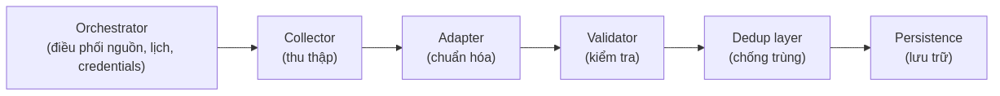

*Kiến trúc pipeline ingest --- chuỗi thành phần*

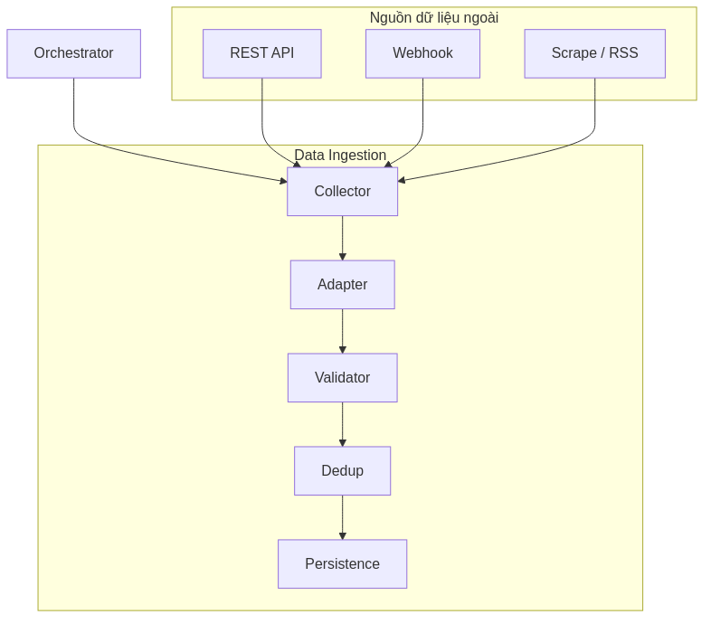

*Kiến trúc ingest --- nguồn ngoài và các lớp xử lý*

  -----------------------------------------------------------------------------------------------------------------------------------------------------------------
  **Thành phần**                      **Chức năng**
  ----------------------------------- -----------------------------------------------------------------------------------------------------------------------------
  Collector (bộ thu thập)             Kết nối từng nguồn dữ liệu (REST API, RSS, webhook, browser automation); lấy batch hoặc stream bản ghi thô.

  Adapter (bộ chuyển đổi)             Ánh xạ response nguồn sang schema nội bộ: mã sự kiện, loại nguồn, nội dung, tác giả, metrics, thời gian, metadata liên kết.

  Validator (bộ kiểm tra)             Loại bản ghi thiếu nội dung usable; chuẩn hóa thời gian về Unix UTC; làm sạch HTML/entity nếu là tin tức.

  Dedup layer (lớp chống trùng)       Trước khi ghi, kiểm tra khóa (source, external_id); bỏ qua bản ghi đã tồn tại.

  Persistence (lớp lưu trữ)           Ghi raw event vào document store hoặc message log; đánh index unique phục vụ dedup.

  Orchestrator (bộ điều phối)         Chọn nguồn cần thu, lập lịch (cron/daemon), quản lý secret, báo cáo tiến độ và lỗi.
  -----------------------------------------------------------------------------------------------------------------------------------------------------------------

**Schema raw event (contract logic):**

  ----------------------------------------------------------------------------------------------------------------
  **Trường**    **Mô tả**                                       **Vai trò downstream**
  ------------- ----------------------------------------------- --------------------------------------------------
  event_id      Mã định danh nội bộ (UUID)                      Truy vết xuyên suốt pipeline

  source        Loại nguồn (twitter, reddit, news, ...)         Phân nhánh xử lý theo đặc thù nguồn

  raw_text      Nội dung gốc                                    Nhận diện thực thể, phân tích cảm xúc

  author_id     Định danh tác giả hoặc publisher                Giới hạn tần suất, trọng số uy tín

  metrics       Tương tác và quy mô audience                    Lọc nhiễu, đo volume, trọng số ảnh hưởng

  timestamp     Thời điểm xuất bản (event time, UTC)            Gom cửa sổ thời gian, tương quan chuỗi thời gian

  ingested_at   Thời điểm hệ thống ghi nhận (processing time)   Đo độ trễ thu thập, giám sát vận hành

  external_id   Mã gốc từ nguồn                                 Khóa dedup

  link_meta     URL, tiêu đề, tag liên quan (tuỳ nguồn)         Ngữ cảnh tin tức, gợi ý map tài sản
  ----------------------------------------------------------------------------------------------------------------

### **2.1.3. Cơ chế hoạt động và vai trò trong pipeline**

**Nguyên lý hoạt động**

Quy trình xử lý điển hình (batch hoặc near-real-time):

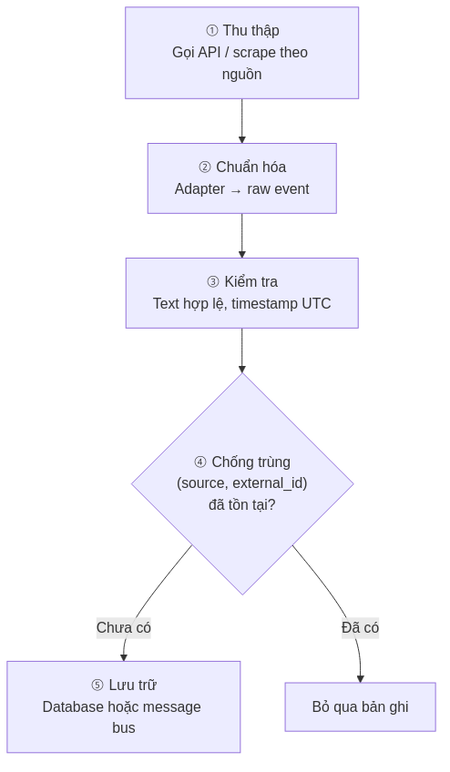

*Quy trình xử lý 5 bước*

Logic xử lý từng bản ghi thu được:

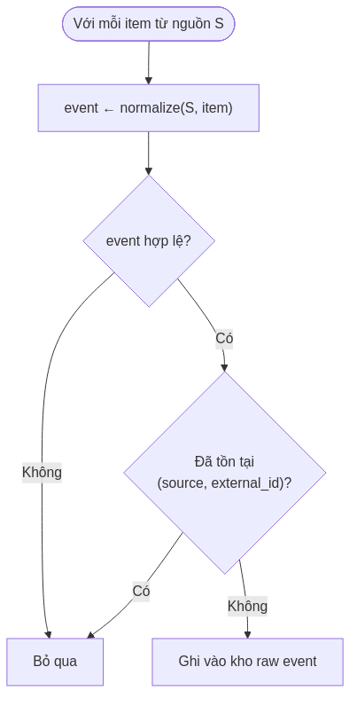

*Logic xử lý từng bản ghi*

**Hai mốc thời gian (Kleppmann, 2017):**

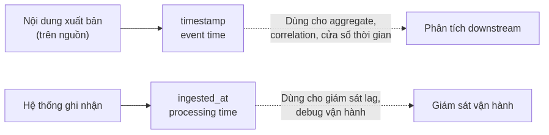

*Event time vs processing time*

- Event time (timestamp) --- lúc nội dung được đăng tải; dùng cho aggregate và phân tích chuỗi thời gian.

- Processing time (ingested_at) --- lúc hệ thống ingest ghi nhận; dùng giám sát lag, không thay thế event time khi tính cửa sổ phân tích.

**Vị trí trong Pipeline**

Data Ingestion đứng đầu nhánh dữ liệu phi cấu trúc / bán cấu trúc (social, news) trong pipeline phân tích:

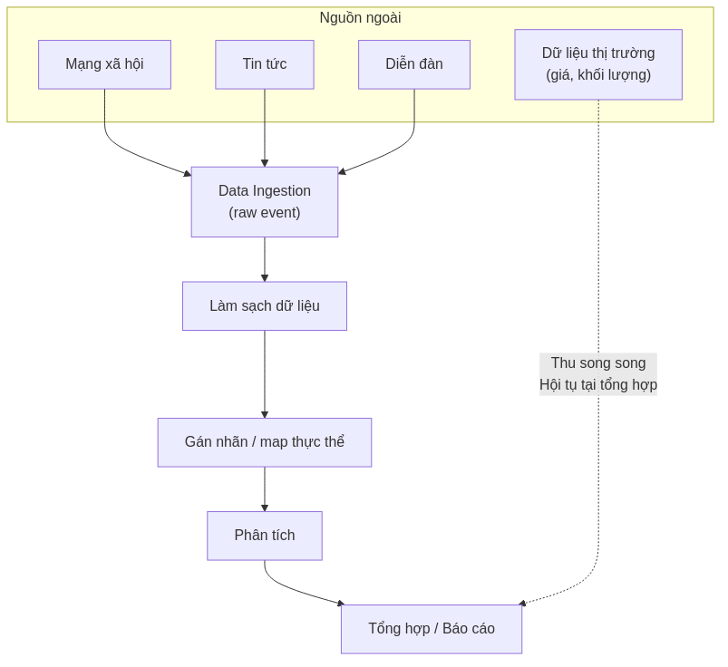

*Vị trí Data Ingestion trong pipeline*

Trong kiến trúc Lambda (Marz & Warren, 2015), cùng một luồng raw event phục vụ cả xử lý gần real-time và xử lý batch:

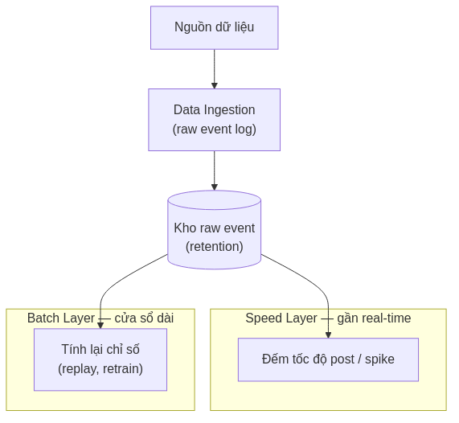

*Lambda Architecture --- Speed vs Batch*

**Khả năng tích hợp**

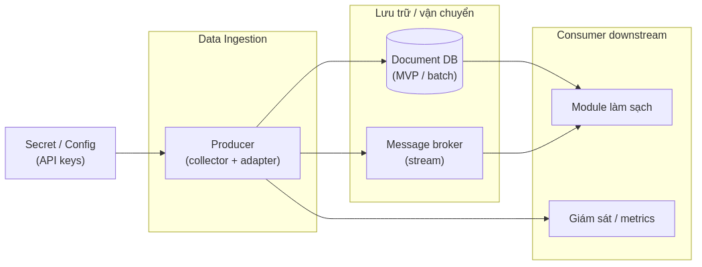

*Tích hợp Data Ingestion với hệ thống lân cận*

  --------------------------------------------------------------------------------------------------------------------------------------------------
  **Đối tượng tích hợp**                  **Vai trò**                                **Cách triển khai phổ biến**
  --------------------------------------- ------------------------------------------ ---------------------------------------------------------------
  Document database                       Lưu raw event giai đoạn MVP / batch        Insert có unique index trên (source, external_id)

  Message broker (Kafka, RabbitMQ, ...)   Stream event, decouple producer/consumer   JSON payload; partition key = {source}:{external_id}

  Module làm sạch dữ liệu                 Consumer đọc raw, xuất bản ghi đã lọc      Query DB hoặc subscribe topic downstream

  Secret / config store                   API key, endpoint                          Biến môi trường hoặc vault; không nhúng credential trong code

  Giám sát                                Theo dõi throughput, lỗi, lag              Metric số bản ghi/phút, tỷ lệ skip duplicate
  --------------------------------------------------------------------------------------------------------------------------------------------------

Nguyên tắc tách biệt trách nhiệm: module ingest chỉ biết API nguồn và contract đầu ra; module phía sau chỉ biết contract, không phụ thuộc SDK từng nền tảng (Gamma et al., 1994 --- Adapter pattern).

### **2.1.4. Ưu điểm và hạn chế**

**Ưu điểm**

  ---------------------------------------------------------------------------------------------------------
  **Đặc tính**            **Giải thích**
  ----------------------- ---------------------------------------------------------------------------------
  Schema thống nhất       Nhiều nguồn cùng một contract → giảm phụ thuộc chéo giữa các module

  Raw log bất biến        Không sửa bản ghi gốc → audit, replay khi đổi thuật toán (Fowler, 2003)

  Ghi idempotent          Dedup theo khóa nguồn → chạy lại job an toàn, không phình volume

  Mở rộng nguồn           Thêm collector + adapter mới; consumer downstream không đổi

  Linh hoạt lưu trữ MVP   Document store phù hợp schema field thay đổi theo nguồn

  Metadata phong phú      Text + engagement + thời gian → đủ input cho lọc nhiễu và phân tích có trọng số
  ---------------------------------------------------------------------------------------------------------

**Hạn chế**

  ---------------------------------------------------------------------------------------------------------------------------------------------------------------
  **Rào cản**                              **Ảnh hưởng**                                              **Hướng giảm thiểu**
  ---------------------------------------- ---------------------------------------------------------- -----------------------------------------------------------
  Thu thập batch thay vì stream liên tục   Độ trễ realtime cao hơn                                    Nâng cấp worker daemon + message broker

  Metrics không đồng nhất giữa nguồn       Tin tức thường thiếu engagement; diễn đàn thiếu follower   Ghi nhận gap trong schema; bổ sung field khi API cho phép

  Phụ thuộc API bên thứ ba                 Rate limit, thay đổi schema                                Retry/backoff; adapter tách biệt; fallback timestamp

  Chi phí lưu trữ                          Raw log tích lũy theo thời gian                            Chính sách archive/TTL ở môi trường production

  Đa ngôn ngữ                              Cần detect language nếu mở rộng locale                     Bổ sung bước detect sau ingest hoặc trong adapter

  Độ phức tạp vận hành                     Nhiều credential, nhiều nguồn                              Orchestrator tập trung; giám sát và alert
  ---------------------------------------------------------------------------------------------------------------------------------------------------------------

So với lưu trực tiếp file JSON thủ công: mô hình ingest có cấu trúc dedup và contract rõ ràng hơn, nhưng đòi hỏi hạ tầng lưu trữ và quản lý cấu hình phức tạp hơn.

### **2.1.5. Lý do lựa chọn**

Đối với pipeline phân tích dữ liệu social phục vụ dự báo hoặc đánh giá thị trường tài chính, mô hình Data Ingestion đa nguồn + Adapter + raw event bất biến + dedup được lựa chọn vì:

1.  Điều kiện cần cho chất lượng phân tích --- Các bước lọc nhiễu, phân tích cảm xúc và tổng hợp chỉ số cần đầu vào ổn định, đủ metadata; ingest tập trung hóa việc thu thập thay vì rải logic API khắp pipeline.

2.  Khả năng mở rộng nguồn --- Thị trường crypto có tín hiệu từ nhiều kênh (MXH, tin tức, cộng đồng); adapter pattern cho phép bổ sung nguồn mới mà không refactor consumer.

3.  Cân bằng MVP và scale --- Giai đoạn đầu có thể dùng document database và job định kỳ; logic chuẩn hóa tách khỏi transport nên có thể chuyển sang message broker khi tải tăng mà không đổi contract.

4.  Bảo toàn thông tin cho nghiên cứu --- Chỉ lưu văn bản bỏ mất feature engagement cần cho phát hiện bot và đo lan truyền (Baker & Wurgler, 2007; Boyd et al., 2010).

> So với phương án thay thế:

  -------------------------------------------------------------------------------------------------------------------------------
  **Phương án**                                 **Đánh giá**
  --------------------------------------------- ---------------------------------------------------------------------------------
  Gọi API trực tiếp tại từng module phân tích   Trùng request, dễ vượt rate limit, schema rải rác → không chọn

  Cơ sở dữ liệu quan hệ cứng ngay từ đầu        Khó biểu diễn field tuỳ nguồn → document store phù hợp hơn giai đoạn đầu

  Message broker ngay từ ngày đầu               Đúng hướng production nhưng tốn chi phí vận hành → lộ trình, không bắt buộc MVP

  ETL một lần (one-shot export)                 Không hỗ trợ cập nhật và replay → không đủ cho pipeline liên tục
  -------------------------------------------------------------------------------------------------------------------------------

Kết luận: Data Ingestion với chuẩn hóa đa nguồn, ghi idempotent và raw event bất biến là thành phần nền tảng phù hợp cho hệ thống phân tích dữ liệu social trong lĩnh vực tài chính --- độc lập với bất kỳ sản phẩm thương mại cụ thể nào, và có thể triển khai theo nhiều mức độ (batch → stream) tùy quy mô hệ thống.

## **2.2. Lọc spam và nhiễu (Spam/Noise Filter)**

### **2.2.1. Tổng quan về lọc spam và nhiễu**

**Khái niệm**

**Spam / Noise Filtering** (lọc spam và nhiễu) là giai đoạn **phân loại chất lượng** raw event: quyết định nội dung có phản ánh thảo luận organic hay thuộc bot hype, shill, copy-paste campaign --- rồi **PASS** (đưa vào pipeline phân tích) hoặc **DROP** (loại khỏi luồng chính).

Khác với sentiment analysis, bước này không gán cảm xúc hay map thực thể; output là **clean event** --- text đã chuẩn hóa kèm metadata lọc (is_spam: false, lý do qua từng lớp).

**Vai trò**

Spam filtering giải quyết bài toán **signal-to-noise** trong dữ liệu social công khai:

  -------------------------------------------------------------------------------------------------
  **Vấn đề**               **Hậu quả nếu bỏ qua**              **Cách lọc giải quyết**
  ------------------------ ----------------------------------- ------------------------------------
  Bot shill, pump group    Sentiment bias dương giả            Loại pattern spam trước aggregate

  Copy-paste coordinated   Social volume inflate ảo            Phát hiện near-duplicate (SimHash)

  Account spam liên tục    Velocity không phản ánh cộng đồng   Rate limit / cap theo author

  Engagement bất thường    Feature influence/spam sai          Engagement ratio heuristic
  -------------------------------------------------------------------------------------------------

Industry ước lượng phần lớn post công khai trên feed crypto là nhiễu (spam, bot, coordinated hype). Lọc trước NLP là điều kiện cần để chỉ số sentiment và volume downstream có ý nghĩa thống kê (Bollen et al., 2011 --- cần dữ liệu sạch để correlation giá--sentiment đáng tin).

**Mục tiêu:** giữ **organic buzz** (người dùng thật thảo luận) và loại **bot hype** (shill tự động, chiến dịch marketing lặp).

### **2.2.2. Kiến trúc và các thành phần cốt lõi**

Kiến trúc phổ biến là **cascade đa tầng** --- lọc rẻ trước, model nặng sau:

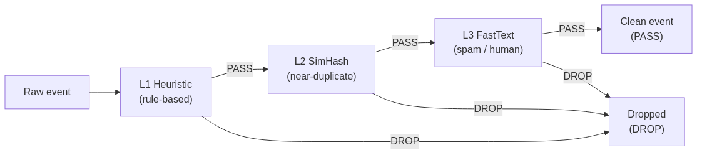

*Kiến trúc cascade 3 tầng L1 → L2 → L3*

  -------------------------------------------------------------------------------------------------------------------------------------------------------------
  **Thành phần**                     **Tầng**                       **Chức năng**
  ---------------------------------- ------------------------------ -------------------------------------------------------------------------------------------
  **Heuristic filter (L1)**          Rule-based                     Text rỗng, ngưỡng engagement, regex pump/spam, cap post/author --- latency \~0.1 ms/event

  **Near-duplicate detector (L2)**   SimHash / LSH                  Fingerprint nội dung; Hamming distance ≤ ngưỡng → coi trùng gần --- \~0.5 ms/event

  **ML classifier (L3)**             FastText / lightweight model   Binary spam/human trên text còn lại --- \~0.1--1 ms/event CPU

  **Cascade orchestrator**           Điều phối                      Chạy L1→L2→L3 tuần tự; DROP sớm; thống kê lý do loại

  **Output mapper**                  Schema                         PASS → clean event; DROP → dropped log (tuỳ chọn)
  -------------------------------------------------------------------------------------------------------------------------------------------------------------

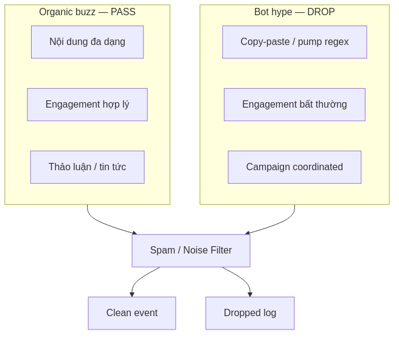

*Organic buzz vs Bot hype --- đặc điểm phân biệt*

  ----------------------------------------------------------------------------------------------------------------------
  **Đặc điểm**         **Organic buzz**                 **Bot hype / shill**
  -------------------- -------------------------------- ----------------------------------------------------------------
  Nội dung             Đa dạng, có ngữ cảnh             Copy-paste, công thức pump ("100x", "airdrop")

  Author               Phân bố nhiều account            Một account post liên tục hoặc hàng loạt account cùng nội dung

  Engagement           Tương quan hợp lý với follower   Ratio bất thường (quá thấp hoặc quá cao)

  Mục đích             Thảo luận, tin tức, quan điểm    Kêu gọi mua, referral, Telegram pump
  ----------------------------------------------------------------------------------------------------------------------

**Feature engineering thường dùng:**

  --------------------------------------------------------------------------------------------
  **Feature**                   **Công thức / cách đo**                   **Lớp sử dụng**
  ----------------------------- ----------------------------------------- --------------------
  Post frequency / author cap   Đếm event/author trong cửa sổ             L1

  Engagement ratio              (likes + shares + comments) / followers   L1

  Content similarity            SimHash + Hamming distance                L2

  Lexical patterns              Regex pump, link Telegram, "IDO"          L1

  Text embedding                FastText supervised spam/human            L3
  --------------------------------------------------------------------------------------------

**Contract output (logic):**

  -----------------------------------------------------------------------------------------------
  **Trường**           **PASS (clean event)**   **DROP (dropped event)**
  -------------------- ------------------------ -------------------------------------------------
  clean_text           Text chuẩn hóa           ---

  is_spam              false                    ---

  filter.stage         PASS                     L1 / L2 / L3

  filter.layers        Danh sách lớp đã qua     ---

  drop_reason          ---                      empty_text, pump_regex, duplicate, ml_spam, ...
  -----------------------------------------------------------------------------------------------

Nguồn **news** (tin tức biên tập) thường **bypass** L1/L3 nặng --- chỉ kiểm tra text rỗng; có thể bật lọc đầy đủ khi nghi ngờ syndication spam.

### **2.2.3. Cơ chế hoạt động và vai trò trong pipeline**

**Nguyên lý hoạt động**

Mỗi raw event đi qua L1 → L2 → L3 tuần tự; **DROP sớm** khi một lớp phát hiện nhiễu --- không gọi ML nếu đã bị loại ở heuristic hoặc SimHash.

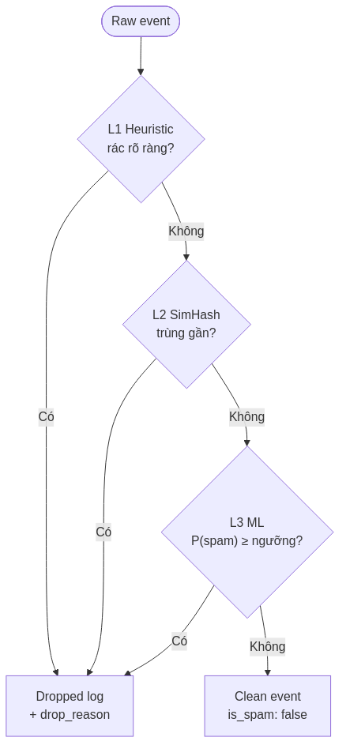

*Quy trình cascade PASS / DROP*

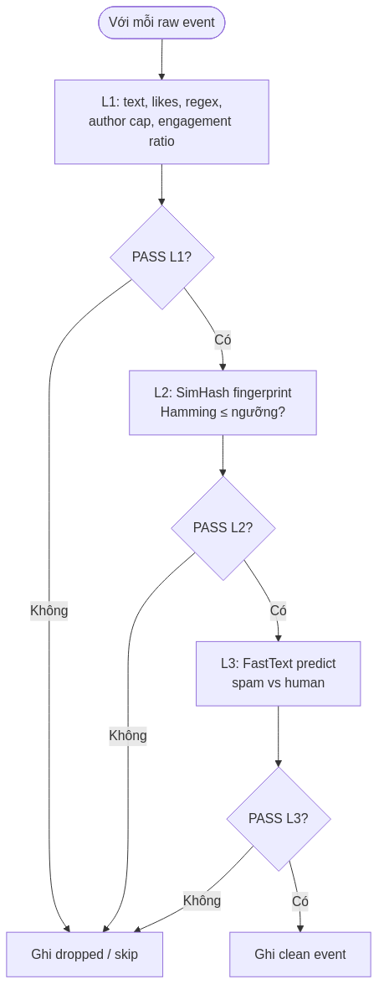

*Logic quyết định từng bản ghi*

**Nguyên tắc cascade:** mỗi tầng loại một lớp nhiễu; chỉ \~20% event còn lại sau L1/L2 mới gọi ML --- giảm chi phí CPU mà vẫn giữ recall (Nguyen et al., 2019 --- cascade classification trong production).

**SimHash (L2):** băm nội dung thành fingerprint cố định (Charikar, 2002); so sánh Hamming distance phát hiện copy-paste và coordinated campaign mà không cần so sánh chuỗi O(n²).

**FastText (L3):** embedding n-gram + linear classifier --- nhanh trên CPU, phù hợp hot path spam gate; không thay thế model sentiment lớn (FinBERT) ở bước phân tích cảm xúc (Bojanowski et al., 2017).

**Vị trí trong Pipeline**

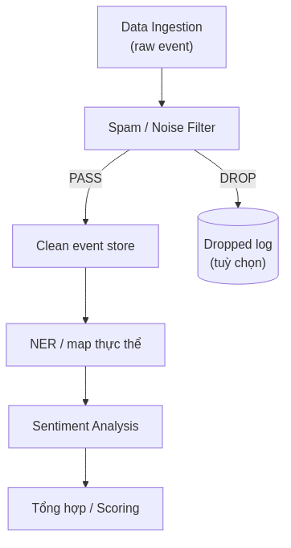

*Vị trí Spam Filter trong pipeline*

Spam filter đứng **ngay sau Data Ingestion**, **trước** NER và Sentiment:

- **Input:** raw event (text + metrics + author)

- **Output:** clean event hoặc dropped log

- **Không** sửa raw event gốc --- tạo bản ghi mới (event sourcing)

Trong kiến trúc **Lambda**, có thể tách hai mức lọc:

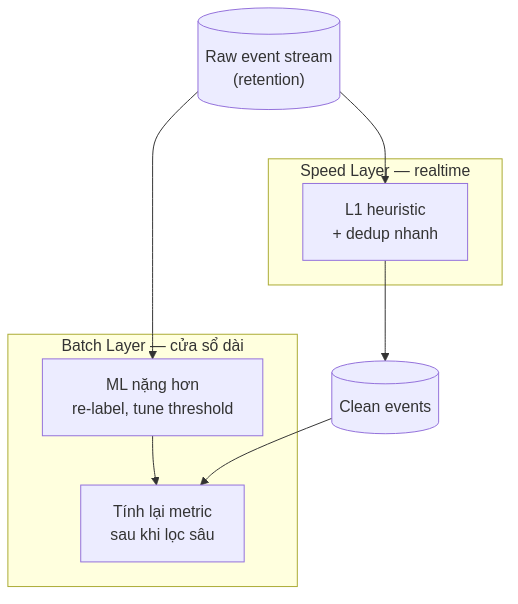

*Speed Layer vs Batch Layer --- lọc*

  ----------------------------------------------------------------------------------------------------
  **Tầng**             **Độ trễ**           **Vai trò lọc**
  -------------------- -------------------- ----------------------------------------------------------
  **Speed Layer**      Giây → phút          Heuristic realtime: dedup, rate limit, engagement floor

  **Batch Layer**      15 phút → ngày       ML nặng hơn trên retention --- điều chỉnh metric dài hạn
  ----------------------------------------------------------------------------------------------------

**Khả năng tích hợp**

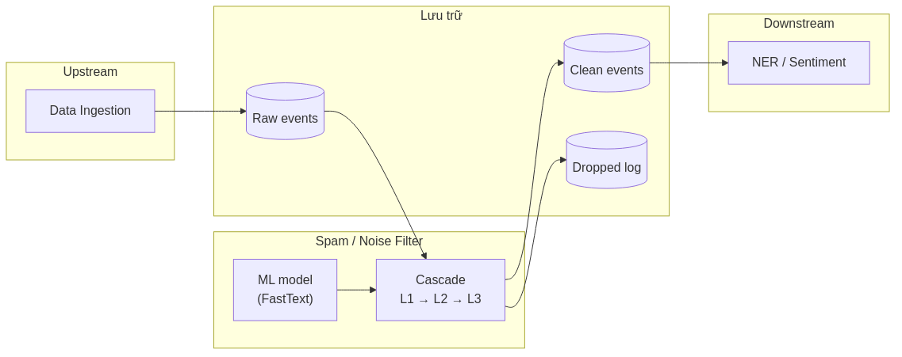

*Tích hợp Spam Filter*

  -----------------------------------------------------------------------------------------
  **Đối tượng**                        **Vai trò**
  ------------------------------------ ----------------------------------------------------
  **Upstream --- Data Ingestion**      Cung cấp raw event stream / collection

  **Downstream --- NER / Sentiment**   Chỉ đọc clean event

  **Document store / message bus**     Lưu clean_events; tuỳ chọn dropped_events để audit

  **ML model artifact**                File model FastText (hoặc ONNX) load tại startup

  **Giám sát**                         Metric PASS/DROP rate, phân bố lý do theo L1/L2/L3
  -----------------------------------------------------------------------------------------

### **2.2.4. Ưu điểm và hạn chế**

**Ưu điểm**

  -------------------------------------------------------------------------------------------------------
  **Đặc tính**                       **Giải thích**
  ---------------------------------- --------------------------------------------------------------------
  **Cascade tiết kiệm tài nguyên**   Rule + SimHash loại \~80% trước khi gọi ML

  **Giảm bias sentiment**            Loại pump/spam trước aggregate --- signal sạch hơn

  **Phát hiện coordinated shill**    SimHash bắt duplicate cross-account

  **CPU-friendly MVP**               FastText \~1 ms/tweet; không cần GPU ở bước lọc

  **Giải thích được (L1/L2)**        Lý do DROP rõ (pump_regex, duplicate) --- audit dễ

  **Tune được**                      Ngưỡng likes, author cap, ML threshold điều chỉnh precision/recall
  -------------------------------------------------------------------------------------------------------

**Hạn chế**

  -------------------------------------------------------------------------------------------------------------------
  **Rào cản**                   **Ảnh hưởng**                          **Hướng giảm thiểu**
  ----------------------------- -------------------------------------- ----------------------------------------------
  **False negative**            Spam tinh vi lọt → bias vẫn còn        Borderline zone → model lớn hơn (DistilBERT)

  **False positive**            Organic bị DROP → mất tín hiệu         Hạ ngưỡng ML; whitelist author tin cậy

  **Domain shift**              Model train Twitter, test Reddit kém   Fine-tune theo nguồn; feature L1 bù

  **News vs social**            Rule pump áp nhật nhầm headline        Bypass hoặc route riêng theo source

  **SimHash ngưỡng**            Quá chặt → DROP paraphrase hợp lệ      Tune Hamming distance

  **Không phát hiện sarcasm**   Không phải mục tiêu stage này          Để cho sentiment stage
  -------------------------------------------------------------------------------------------------------------------

So với **dùng FinBERT/DeBERTa cho spam:** model 400M+ params (\~50--200 ms/tweet CPU) quá nặng cho hot path lọc --- nên dành cho **sentiment** (Stage 4), không phải spam gate.

### **2.2.5. Lý do lựa chọn**

Đối với pipeline phân tích social tài chính, mô hình **Cascade L1 heuristic → L2 SimHash → L3 FastText** được lựa chọn vì:

- **Giải quyết signal-to-noise trước NLP** --- Sentiment và scoring chỉ có giá trị khi input không bị bot inflate (Baker & Wurgler, 2007).

- **Hiệu năng production** --- Hot path cần ms/event trên CPU; cascade đáp ứng throughput feed social (Bojanowski et al., 2017).

- **Phân tách trách nhiệm** --- Spam gate (binary) tách khỏi sentiment (regression/classification 3 lớp) --- tránh dùng một model cho hai bài toán.

- **Khả năng audit** --- L1/L2 cho lý do DROP deterministic; dropped log phục vụ đánh giá và tune.

- **So với phương án thay thế:**

  -----------------------------------------------------------------------------------------------
  **Phương án**                  **Đánh giá**
  ------------------------------ ----------------------------------------------------------------
  Chỉ heuristic, không ML        Nhanh nhưng miss spam tinh vi → **bổ sung L3**

  Chỉ ML lớn (BERT spam)         Chính xác hơn nhưng chậm, tốn GPU → **không phù hợp hot path**

  Lọc sau sentiment              Bias đã lọt vào aggregate → **sai thứ tự pipeline**

  Không lọc duplicate            Volume/sentiment inflate → **cần L2 SimHash**
  -----------------------------------------------------------------------------------------------

**Kết luận:** Spam / Noise Filtering cascade là thành phần bắt buộc giữa thu thập và phân tích --- đảm bảo downstream nhận **clean event** phản ánh organic buzz, có thể triển khai batch hoặc stream với cùng logic lớp.

## **2.3. Nhận diện thực thể và ánh xạ coin (NER & Mapping)**

### **2.3.1. Khái niệm**

**Entity Recognition & Coin Mapping** (nhận diện thực thể và gán mã coin) là giai đoạn phân tích ngôn ngữ tự nhiên nhằm xác định **post hoặc bài news liên quan đến tài sản crypto nào**, rồi gán mỗi mention về **coin_id** chuẩn trong registry nội bộ (ví dụ BTC, ETH).

Khác spam filter và sentiment, bước này trả lời câu hỏi *"nội dung này nói về coin nào?"* --- không đánh giá tích cực/tiêu cực. Một post có thể mention nhiều coin → **fan-out** thành nhiều **mapped event**, mỗi bản ghi gắn đúng một coin_id.

### **2.3.2. Vai trò**

NER mapping giải quyết bài toán **multi-entity attribution** trong domain crypto:

  --------------------------------------------------------------------------------------------------------------------
  **Vấn đề**                                   **Hậu quả nếu bỏ qua**       **Cách NER mapping giải quyết**
  -------------------------------------------- ---------------------------- ------------------------------------------
  Một post mention nhiều coin                  Sentiment gộp sai coin       Fan-out: 1 post → N mapped event

  Cashtag, alias đa dạng (\$BTC, Bitcoin, ₿)   Không map được entity        Registry + rule + (tuỳ chọn) LLM

  Ambiguity (SOL vs từ tiếng Anh)              False positive map coin      Context + validator / hybrid mode

  News gắn ticker metadata                     Bỏ sót coin từ headline      Metadata related_tickers, symbol

  Sentiment không có coin_id                   Không aggregate theo asset   Output bắt buộc có coin_id trước Stage 4
  --------------------------------------------------------------------------------------------------------------------

Trong pipeline phân tích social--market, sentiment và scoring **phải tính theo từng coin** --- NER là cầu nối giữa text tổng quát và time-series theo asset (Loughran & McDonald, 2011 --- NER trong tài liệu tài chính).

**Mục tiêu:** gán coin_id chính xác, có evidence và confidence, sẵn sàng cho sentiment per-coin.

### 

### 

### **2.3.3. Kiến trúc và các thành phần cốt lõi**

Kiến trúc điển hình kết hợp **knowledge base**, **rule engine** và **LLM validator** (tuỳ mode):

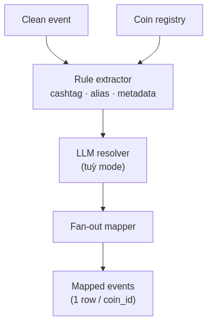

*Hình 2.3.1. Kiến trúc NER Mapping gồm Registry, Rule Extractor, LLM và Fan-out*

  ------------------------------------------------------------------------------------------------------------------------------
  **Thành phần**                     **Chức năng**
  ---------------------------------- -------------------------------------------------------------------------------------------
  **Coin registry (kho danh mục)**   Bảng tra cứu symbol, tên đầy đủ, alias, ticker sàn --- nguồn sự thật cho coin_id

  **Rule extractor**                 Cashtag \$BTC, regex symbol, alias từ dictionary, metadata news (ticker, related_symbols)

  **LLM resolver (tuỳ chọn)**        Xử lý text mơ hồ, ngữ cảnh phức tạp, multi-mention --- trả danh sách coin có căn cứ

  **Mode orchestrator**              Chọn hybrid / validator / full --- cân bằng chi phí API vs độ chính xác

  **Fan-out mapper**                 1 clean event × N mention → N mapped event; unique (parent_event_id, coin_id)

  **Metadata ghi nhận**              method, evidence, confidence, used_llm --- audit và tune
  ------------------------------------------------------------------------------------------------------------------------------

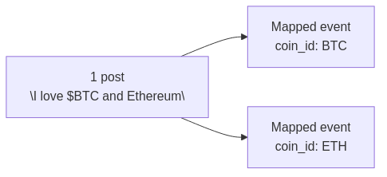

*Hình 2.3.2. Cơ chế fan-out một bài viết thành nhiều mapped event*

**Ba mode vận hành phổ biến:**

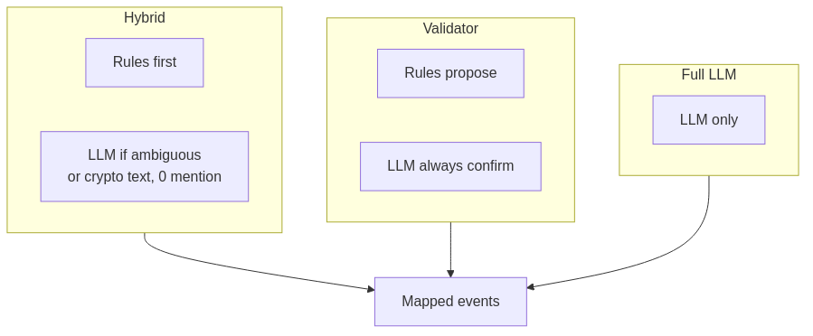

*Hình 2.3.3. So sánh ba chế độ Hybrid, Validator và Full LLM*

  --------------------------------------------------------------------------------------------------------------------------------------------
  **Mode**             **Luồng**                                                                  **Khi dùng**
  -------------------- -------------------------------------------------------------------------- --------------------------------------------
  **Hybrid**           Rules trước; LLM chỉ khi 0 mention + text crypto-related, hoặc ambiguous   MVP --- tiết kiệm token, đủ cho cashtag rõ

  **Validator**        Rules đề xuất; LLM luôn xác nhận/sửa                                       Batch review, cần accuracy cao hơn

  **Full LLM**         Chỉ LLM quyết định mention                                                 Text dài, ít cashtag, ngữ cảnh phức tạp
  --------------------------------------------------------------------------------------------------------------------------------------------

**Contract mapped event (logic):**

  ----------------------------------------------------------------------
  **Trường**                     **Mô tả**
  ------------------------------ ---------------------------------------
  mapped_id                      UUID bản ghi mapped

  parent_event_id                Liên kết clean event gốc

  coin_id                        Mã coin chuẩn (registry)

  clean_text                     Text kế thừa từ upstream

  ner.method                     cashtag, alias, metadata, llm, ...

  ner.evidence                   Chuỗi/substring chứng minh map

  ner.confidence                 Độ tin cậy 0--1

  ner.used_llm                   Có gọi LLM hay không
  ----------------------------------------------------------------------

**Thách thức domain crypto (so với NER general):**

  ----------------------------------------------------------------------------------------
  **Hiện tượng**          **Ví dụ**                           **Hướng xử lý**
  ----------------------- ----------------------------------- ----------------------------
  Cashtag vs từ thường    \$SOL vs "sol" (mặt trời)           Rule + context window

  Alias đa dạng           Bitcoin = BTC = ₿                   Registry alias list

  Competitor context      "ETH killer" có thể không nói ETH   LLM / disambiguation

  News ticker             BTC-USD trong metadata              Normalization symbol → BTC
  ----------------------------------------------------------------------------------------

### **2.3.4. Cơ chế hoạt động và vai trò trong pipeline**

#### **Nguyên lý hoạt động**

Mỗi clean event đi qua: **tra registry → extract mention → (tuỳ mode) LLM → fan-out**.

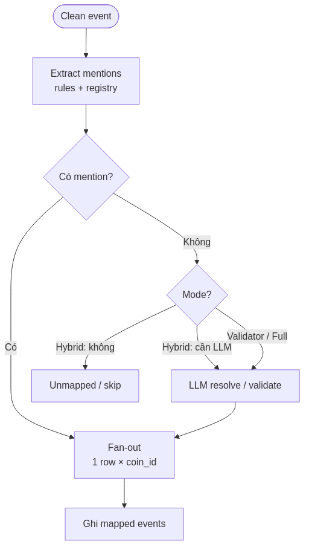

*Hình 2.3.4. Quy trình xử lý NER và ánh xạ coin*

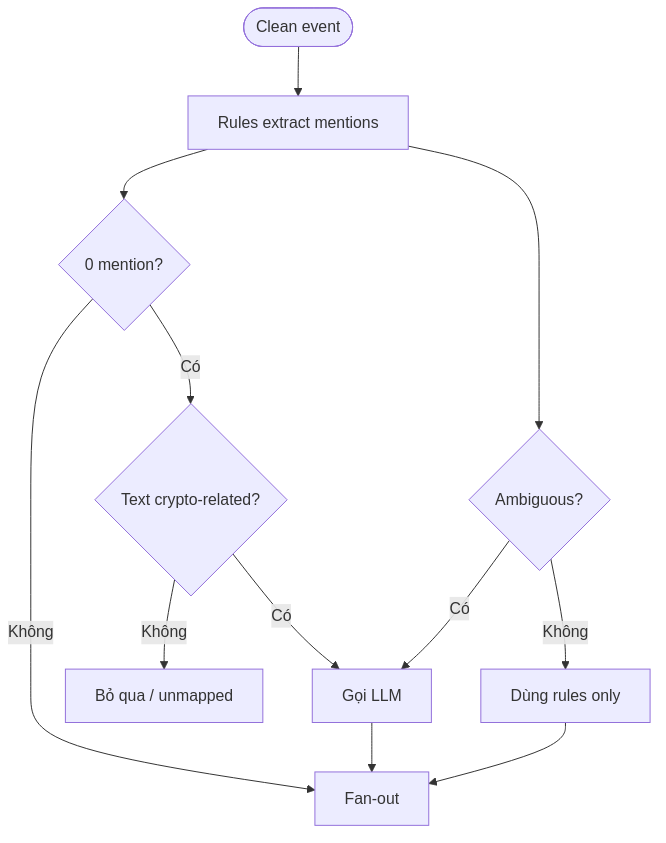

*Hình 2.3.5. Logic quyết định trong chế độ Hybrid*

**Nguyên tắc fan-out:**

> \"I love \$BTC and Ethereum updates\"\
> → { coin_id: BTC, clean_text, parent_event_id, ... }\
> → { coin_id: ETH, clean_text, parent_event_id, ... }

Mỗi mapped event **một** coin_id --- sentiment downstream aggregate đúng theo asset.

**Precision over recall:** map nhầm coin (false positive) gây sentiment/signal sai coin --- nghiêm trọng hơn bỏ sót mention hiếm. Registry giới hạn Top-N coin MVP là chiến lược kiểm soát precision (Finkel et al., 2005 --- NER evaluation).

#### **Vị trí trong pipeline**

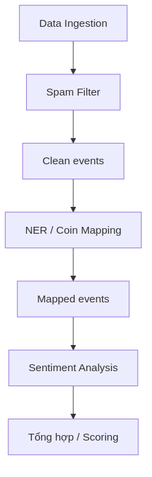

*Hình 2.3.6. Vị trí của NER Mapping trong pipeline tổng thể*

NER mapping đứng **sau Spam Filter**, **trước Sentiment Analysis**:

- **Input:** clean event (clean_text, metadata, source)

- **Output:** mapped event(s) --- 0, 1 hoặc N bản ghi

- Event **không map được** coin nào: có thể bỏ qua hoặc ghi unmapped --- không đi sentiment per-coin

#### **Khả năng tích hợp**

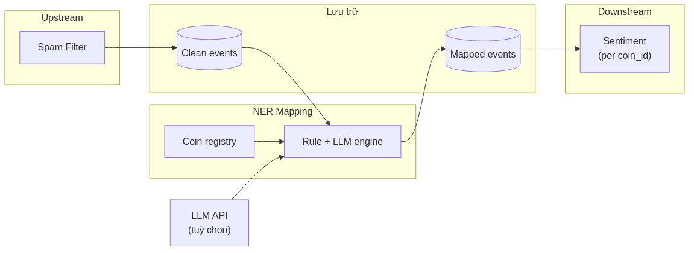

*Hình 2.3.7. Tích hợp module NER Mapping với các thành phần lân cận*

  ------------------------------------------------------------------------------------------
  **Đối tượng**                     **Vai trò**
  --------------------------------- --------------------------------------------------------
  **Upstream --- Spam Filter**      Cung cấp clean event

  **Coin registry**                 JSON / DB --- cập nhật alias khi thêm asset

  **LLM API (tuỳ chọn)**            OpenRouter / OpenAI-compatible --- disambiguation

  **Downstream --- Sentiment**      Đọc mapped event theo coin_id

  **Document store / bus**          mapped_events; index unique (parent_event_id, coin_id)
  ------------------------------------------------------------------------------------------

### **2.3.5. Ưu điểm và hạn chế**

#### **Ưu điểm**

  ---------------------------------------------------------------------------------------------
  **Đặc tính**                        **Giải thích**
  ----------------------------------- ---------------------------------------------------------
  **Fan-out đúng mô hình dữ liệu**    Sentiment/volume tính per-coin --- khớp time-series giá

  **Hybrid tiết kiệm chi phí**        Cashtag/alias xử lý bulk; LLM chỉ edge case

  **Registry kiểm soát vocabulary**   Không map sang coin ngoài phạm vi MVP

  **Audit trail**                     evidence, method, confidence --- debug map sai

  **Metadata news**                   Ticker từ headline bổ sung cho rule-based

  **Tách biệt NER vs sentiment**      Mỗi stage một bài toán --- dễ tune độc lập
  ---------------------------------------------------------------------------------------------

#### **Hạn chế**

  ---------------------------------------------------------------------------------------------------
  **Rào cản**              **Ảnh hưởng**                        **Hướng giảm thiểu**
  ------------------------ ------------------------------------ -------------------------------------
  **Ambiguity ngôn ngữ**   Map sai hoặc bỏ sót                  Validator mode; LLM context

  **Phụ thuộc LLM API**    Latency, cost, rate limit            Hybrid; cache; batch

  **Registry stale**       Coin mới / rebrand không có          Cập nhật registry định kỳ

  **Multi-language**       Alias tiếng Việt/Trung chưa có       Mở rộng registry; multilingual NER

  **0 mention**            Event không vào sentiment per-coin   Chấp nhận hoặc fallback macro topic

  **Contract address**     On-chain mention khó rule            Phase 2 --- address lookup
  ---------------------------------------------------------------------------------------------------

So với **chỉ regex cashtag:** nhanh và rẻ nhưng miss "Bitcoin" không có \$; hybrid + LLM bù gap mà vẫn kiểm soát cost.

So với **NER general-purpose (spaCy en_core_web_sm):** không hiểu \$BTC, crypto slang --- cần **domain registry + custom rules** (Honnibal & Montani, 2017 --- spaCy EntityRuler pattern).

### 

### 

### **2.3.6. Lý do lựa chọn**

Đối với pipeline phân tích social crypto, mô hình **Registry + Rule extraction + Hybrid LLM + Fan-out** được lựa chọn vì:

1.  **Điều kiện cầu cho sentiment per-coin** --- Không có coin_id, không aggregate đúng theo asset (Bollen et al., 2011).

2.  **Domain specificity** --- Crypto NER khác NLP general; registry + cashtag rule xử lý phần lớn social post với latency thấp.

3.  **Cân bằng cost/accuracy** --- Full LLM mọi post tốn token; hybrid gọi LLM khi rules không đủ --- phù hợp MVP và scale dần.

4.  **Fan-out là mô hình dữ liệu đúng** --- Multi-mention là norm trên Twitter/Reddit; một row một coin tránh double-count sentiment.

5.  **So với phương án thay thế:**

  ------------------------------------------------------------------------------------------------------------
  **Phương án**                           **Đánh giá**
  --------------------------------------- --------------------------------------------------------------------
  Keyword search đơn giản (BTC in text)   False positive cao ("BTC" trong URL, viết tắt khác) → **không đủ**

  Chỉ LLM, không registry                 Hallucination coin_id → **cần registry làm ground truth**

  Gán coin thủ công                       Không scale → **tự động hóa bắt buộc**

  NER sau sentiment                       Sentiment không biết coin → **sai thứ tự pipeline**

  Single-label (1 coin/post)              Mất multi-mention → **fan-out bắt buộc**
  ------------------------------------------------------------------------------------------------------------

**Kết luận:** NER và coin mapping với registry, rule engine, hybrid LLM và fan-out là thành phần then chốt giữa làm sạch dữ liệu và phân tích cảm xúc theo từng tài sản --- triển khai được batch hoặc stream với cùng contract mapped event.

## **2.4. Phân tích cảm xúc và Sentiment Score**

### **2.4.1. Khái niệm và vai trò**

Phân tích cảm xúc (sentiment analysis) là một bài toán của xử lý ngôn ngữ tự nhiên, dùng để xác định thái độ được thể hiện trong văn bản. Trong lĩnh vực tiền mã hóa, tin tức và bài đăng mạng xã hội thường phản ánh tâm lý lạc quan, trung lập hoặc lo ngại của cộng đồng. Hệ thống chuyển các biểu hiện này thành ba nhãn positive, neutral và negative, đồng thời biểu diễn bằng Sentiment Score trong khoảng \[-1, 1\]. Điểm gần 1 thể hiện xu hướng tích cực, điểm gần -1 thể hiện xu hướng tiêu cực, còn điểm gần 0 cho thấy cảm xúc trung tính hoặc chưa rõ ràng.

### **2.4.2. Mô hình phân loại cảm xúc**

Đầu vào của module là văn bản đã được làm sạch và đã xác định đồng tiền liên quan. Mô hình mặc định trong mã nguồn là FinBERT, một mô hình Transformer được huấn luyện cho ngôn ngữ tài chính. Transformer phân tích ngữ cảnh của cả câu, nhờ đó phù hợp hơn phương pháp chỉ đếm từ đơn. Sau khi suy luận, mô hình trả về ba xác suất Ppositive, Pneutral và Pnegative. Các tên nhãn khác nhau giữa các mô hình được chuẩn hóa về positive, neutral và negative; độ tin cậy được lấy bằng xác suất lớn nhất trong ba lớp.

### **2.4.3. Cách tính Sentiment Score**

Đối với kết quả từ mô hình NLP, Sentiment Score được tính bằng hiệu giữa xác suất tích cực và xác suất tiêu cực:

$S = P_{pos} - P_{\neg,S \in \lbrack - 1,1\rbrack}$

Khi xác suất trung tính lớn, hai xác suất còn lại thường nhỏ nên S tiến gần 0. Sau khi tính, điểm được giới hạn trong khoảng \[-1, 1\] và ánh xạ sang nhãn theo ngưỡng 0,15:

  ---------------------------------------------------------------------------------------
  **Khoảng điểm**        **Nhãn**               **Ý nghĩa**
  ---------------------- ---------------------- -----------------------------------------
  S ≥ 0,15               Positive               Nội dung có xu hướng tích cực.

  -0,15 \< S \< 0,15     Neutral                Cảm xúc chưa rõ ràng hoặc gần cân bằng.

  S ≤ -0,15              Negative               Nội dung có xu hướng tiêu cực.
  ---------------------------------------------------------------------------------------

Module sử dụng ba mức ưu tiên. Với tin tức Alpha Vantage, hệ thống dùng trực tiếp ticker_sentiment_score và lấy relevance_score làm độ tin cậy. Nếu không có điểm sẵn, văn bản được đưa qua FinBERT hoặc mô hình Transformer được cấu hình. Khi mô hình không thể tải hoặc suy luận thất bại, hệ thống chuyển sang phương pháp dự phòng dựa trên các từ khóa tiền mã hóa tích cực và tiêu cực.

Ở phương pháp dự phòng, gọi npos và nneg là số từ khóa tích cực và tiêu cực xuất hiện trong văn bản. Điểm cơ sở R, độ tin cậy C và điểm cuối cùng được tính như sau:

$R = n_{pos} - \frac{n_{\neg}}{n_{pos} + n_{\neg}}$

$C = min$

Việc nhân với C giúp tránh trường hợp văn bản chỉ có một từ khóa đơn lẻ nhưng lại nhận điểm quá cao. Nếu không tìm thấy từ khóa phù hợp, kết quả là S = 0 và nhãn neutral.

### **2.4.4. Tổng hợp cảm xúc theo thời gian**

Để phản ánh tâm lý chung thay vì một bài viết riêng lẻ, các Sentiment Score được gom theo coin_id và cửa sổ thời gian 15 phút, 30 phút, 1 giờ, 4 giờ hoặc 1 ngày. Hệ thống tính cả điểm trung bình và điểm có trọng số ảnh hưởng:

$S_{avg} = \frac{1}{N}\sum_{i = 1}^{N}S_{i}$

$w_{i} = 1 + log\left( 1 + F_{i} \right) + 0,1L_{i} + 0,3R_{i} + 0,2C_{i}$

$S_{weighted} = \frac{\sum_{i = 1}^{N}S_{i}w_{i}}{}$

Trong đó F~i~, L~i~, R~i~ và C~i~ lần lượt là số người theo dõi, lượt thích, lượt đăng lại và lượt trả lời của bài viết thứ i. Trọng số w~i~ giúp các bài viết có mức độ lan truyền cao đóng góp nhiều hơn, nhưng hàm logarit làm giảm sự lấn át của các tài khoản có lượng người theo dõi quá lớn. Kết quả tổng hợp gồm điểm trung bình, điểm có trọng số và số lượng bài viết positive, neutral, negative; đây là dữ liệu đầu vào cho các bước đánh giá xu hướng và dự đoán tín hiệu thị trường tiếp theo.

## **2.5. Trọng số ảnh hưởng (Influence Weighting)**

### **2.5.1. Tổng quan về trọng số uy tín & Sơ Đồ Kiến Trúc**

Module **Influence Weighting** là giai đoạn thứ năm trong pipeline phân tích dữ liệu crypto dựa trên dữ liệu xã hội và tin tức. Sau khi dữ liệu đã được làm sạch, gán coin và phân tích cảm xúc, hệ thống cần xác định mức độ ảnh hưởng của từng sự kiện thông tin trước khi đưa vào bộ tính điểm cuối cùng.

Trong bối cảnh thị trường crypto, không phải mọi bài viết đều có giá trị ngang nhau. Một tweet có 5 lượt thích từ tài khoản nhỏ không thể được xem tương đương với một bài đăng có hàng nghìn lượt retweet từ tài khoản có ảnh hưởng lớn. Tương tự, một bản tin từ nguồn uy tín có thể có tác động khác với một bình luận ngắn trên mạng xã hội. Vì vậy, hệ thống cần một cơ chế định lượng để biến các tín hiệu cảm xúc rời rạc thành tín hiệu xã hội có trọng số.

Module Influence Weighting hoạt động theo phương pháp định lượng phi huấn luyện trong phiên bản MVP. Hệ thống không yêu cầu mô hình học máy phức tạp ở bước này, mà sử dụng một công thức heuristic có thể giải thích được, bao gồm các yếu tố: độ tin cậy của nguồn, độ mới của bài viết, chất lượng dữ liệu, uy tín tác giả, mức độ tương tác, độ lan truyền bất thường và ảnh hưởng mạng lưới nếu có.

Mục tiêu thiết kế là giảm thiểu ảnh hưởng của đánh giá chủ quan bằng cách lượng hóa từng yếu tố thành các đại lượng số học, sau đó kết hợp chúng thành một chỉ số duy nhất gọi là:

- InfluenceWeight

Chỉ số này được dùng để tính:

- WeightedSentiment = SentimentScore × InfluenceWeight

Sơ đồ luồng xử lý dữ liệu:

> sentiment_events
>
> ↓
>
> Influence Weighting Engine
>
> ↓
>
> weighted_events
>
> ↓
>
> Influence Aggregation
>
> ↓
>
> influence_aggregates
>
> ↓
>
> Scoring Engine

Trong đó:

- **sentiment_events** là đầu ra từ giai đoạn Sentiment Analysis.

- **weighted_events** là dữ liệu chi tiết theo từng event sau khi đã tính trọng số ảnh hưởng.

- **influence_aggregates** là dữ liệu tổng hợp theo coin và khung thời gian, phục vụ trực tiếp cho Scoring Engine.

### **2.5.2. Khung Chuẩn Hóa Trọng Số Ảnh Hưởng**

Các tín hiệu xã hội thô như số follower, số like, số retweet hoặc số bình luận có quy mô rất khác nhau. Nếu đưa trực tiếp các giá trị này vào công thức, hệ thống dễ bị thiên lệch bởi các tài khoản cực lớn hoặc các bài viết có engagement bất thường. Vì vậy, trước khi kết hợp, các yếu tố đầu vào cần được biến đổi bằng logarit, hàm sigmoid, hệ số suy giảm thời gian và cơ chế chặn trần.

Công thức tổng quát của module Influence Weighting được biểu diễn như sau:

> InfluenceWeight =
>
> clip( SourceWeight
>
> × TimeDecay
>
> × QualityScore
>
> × (1 + CoreScale × (
>
> αAuthorAuthority
>
> \+ βEngagementStrength
>
> \+ γViralitySurprise
>
> \+ δNetworkInfluence
>
> )),
>
> 0,
>
> MaxInfluence
>
> )

Trong đó:

+----------------------+-----------------------------------------------------------+
| > **Thành phần**     | > **Ý nghĩa**                                             |
+----------------------+-----------------------------------------------------------+
| > SourceWeight       | Trọng số phản ánh độ tin cậy và vai trò của nguồn dữ liệu |
+----------------------+-----------------------------------------------------------+
| > TimeDecay          | Hệ số suy giảm ảnh hưởng theo thời gian                   |
+----------------------+-----------------------------------------------------------+
| > QualityScore       | Điểm chất lượng của event sau các bước xử lý trước        |
+----------------------+-----------------------------------------------------------+
| > AuthorAuthority    | Độ uy tín của tác giả hoặc nguồn phát                     |
+----------------------+-----------------------------------------------------------+
| > EngagementStrength | Cường độ tương tác thực tế của bài viết                   |
+----------------------+-----------------------------------------------------------+
| > ViralitySurprise   | Mức độ lan truyền bất thường so với kỳ vọng               |
+----------------------+-----------------------------------------------------------+
| > NetworkInfluence   | Ảnh hưởng mạng lưới của tác giả nếu có graph tương tác    |
+----------------------+-----------------------------------------------------------+
| > CoreScale          | Hệ số khuếch đại phần lõi của influence                   |
+----------------------+-----------------------------------------------------------+
| > MaxInfluence       | Ngưỡng chặn trên nhằm hạn chế outlier                     |
+----------------------+-----------------------------------------------------------+
| > α, β, γ, δ         | Trọng số tương đối của từng nhóm nhân tố                  |
+======================+===========================================================+

**Hệ Số Nguồn Dữ Liệu**

Biểu thức khái quát:

- SourceWeight = w_source

Trong đó **w_source** được xác định theo loại nguồn dữ liệu:

+-------------+--------------------+----------------------------------------------------------+
| **Nguồn**   | **Trọng số gợi ý** | > **Giải thích**                                         |
+-------------+--------------------+----------------------------------------------------------+
| News        | 1.20               | Tin tức thường có tính xác thực và tác động dài hơn      |
+-------------+--------------------+----------------------------------------------------------+
| Twitter / X | 1.00               | Phản ánh dòng thông tin nhanh, lan truyền mạnh           |
+-------------+--------------------+----------------------------------------------------------+
| Reddit      | 0.85               | Phản ánh thảo luận cộng đồng, tốc độ lan truyền chậm hơn |
+-------------+--------------------+----------------------------------------------------------+
| Unknown     | 1.00               | Giá trị trung lập nếu không xác định được nguồn          |
+=============+====================+==========================================================+

Mục đích sử dụng: **SourceWeight** cho phép hệ thống phân biệt mức độ quan trọng giữa các loại nguồn. Một bản tin từ nguồn chính thống không nên bị đánh đồng hoàn toàn với một bài đăng social ngắn. Ngược lại, Twitter/X tuy có nhiều nhiễu nhưng lại có tốc độ phản ứng thị trường rất nhanh, nên vẫn giữ trọng số trung tâm.

**Hàm Suy Giảm Thời Gian --- Time Decay**

Biểu thức toán học:

- TimeDecay = exp(-ln(2) × age_hours / half_life_hours)

Trong đó:

+-----------------+--------------------------------------------------------------+
| **Ký hiệu**     | > **Ý nghĩa**                                                |
+-----------------+--------------------------------------------------------------+
| age_hours       | Số giờ tính từ thời điểm event xuất hiện đến thời điểm xử lý |
+-----------------+--------------------------------------------------------------+
| half_life_hours | Khoảng thời gian để ảnh hưởng giảm còn một nửa               |
+=================+==============================================================+

Cấu hình gợi ý:

+---------------------------+-----------------------+
| > **Nguồn**               | > **Half-life**       |
+---------------------------+-----------------------+
| > Twitter / X             | > 12 giờ              |
+---------------------------+-----------------------+
| > Reddit                  | > 24 giờ              |
+---------------------------+-----------------------+
| > News                    | > 36 giờ              |
+===========================+=======================+

Mục đích sử dụng: Thị trường crypto vận động liên tục và phản ứng nhanh với thông tin mới. Vì vậy, các bài viết mới thường mang giá trị tín hiệu cao hơn bài viết cũ. Hàm suy giảm theo mũ giúp mô phỏng hiện tượng này: thông tin không biến mất ngay lập tức, nhưng ảnh hưởng của nó giảm dần theo thời gian.

Ví dụ, nếu half-life của Twitter là 12 giờ, một tweet mới có TimeDecay ≈ 1.0, sau 12 giờ còn khoảng 0.5, sau 24 giờ còn khoảng 0.25. Như vậy, hệ thống ưu tiên tín hiệu mới mà vẫn giữ lại ảnh hưởng yếu của tín hiệu cũ.

**Điểm Chất Lượng Dữ Liệu --- Quality Score**

Biểu thức toán học:

QualityScore =

> NERConfidence
>
> × SentimentConfidence
>
> × (1 - SpamProbability)
>
> × DuplicatePenalty

Trong đó:

+---------------------+---------------------------------------------------------------+
| **Thành phần**      | > **Ý nghĩa**                                                 |
+---------------------+---------------------------------------------------------------+
| NERConfidence       | Độ chắc chắn rằng event đã được gán đúng coin                 |
+---------------------+---------------------------------------------------------------+
| SentimentConfidence | Độ tin cậy của kết quả phân tích cảm xúc                      |
+---------------------+---------------------------------------------------------------+
| SpamProbability     | Xác suất event là spam hoặc nội dung chất lượng thấp          |
+---------------------+---------------------------------------------------------------+
| DuplicatePenalty    | Hệ số phạt nếu event bị nghi ngờ là duplicate hoặc copy-paste |
+=====================+===============================================================+

Mục đích sử dụng: **QualityScore** có nhiệm vụ giảm ảnh hưởng của các event không đáng tin cậy. Trong dữ liệu mạng xã hội, nhiễu có thể xuất hiện dưới nhiều dạng như spam, bot, nội dung lặp lại, cashtag bị lạm dụng hoặc sentiment không chắc chắn. Nếu những event này được tính ngang với event chất lượng cao, điểm tổng hợp sẽ bị lệch.

Ví dụ:

- NERConfidence = 0.90

- SentimentConfidence = 0.85

- SpamProbability = 0.20

- DuplicatePenalty = 0.80

- QualityScore = 0.90 × 0.85 × 0.80 × 0.80 = 0.4896

Khi đó, event vẫn được sử dụng nhưng ảnh hưởng bị giảm đáng kể.

**Uy Tín Tác Giả --- Author Authority**

Biểu thức toán học:

> AuthorAuthority =
>
> 0.45 × FollowerScore
>
> \+ 0.30 × AvgEngagementScore
>
> \+ 0.15 × VerifiedScore
>
> \+ 0.10 × AccountAgeScore

Trong đó:

+--------------------+-----------------------------------------+
| **Thành phần**     | > **Ý nghĩa**                           |
+--------------------+-----------------------------------------+
| FollowerScore      | Quy mô người theo dõi của tác giả       |
+--------------------+-----------------------------------------+
| AvgEngagementScore | Mức tương tác trung bình trong lịch sử  |
+--------------------+-----------------------------------------+
| VerifiedScore      | Tài khoản đã xác thực hay chưa          |
+--------------------+-----------------------------------------+
| AccountAgeScore    | Độ lâu đời của tài khoản                |
+====================+=========================================+

Vì số follower thường có phân phối lệch rất mạnh, hệ thống không sử dụng follower trực tiếp mà biến đổi bằng logarit hoặc sigmoid:

- FollowerScore = sigmoid(log(1 + followers))

Mục đích sử dụng: **AuthorAuthority** đo lường độ uy tín tương đối của tác giả. Một tài khoản có nhiều follower có thể có khả năng tiếp cận cao hơn, nhưng follower không đồng nghĩa hoàn toàn với influence. Vì vậy, cần kết hợp thêm engagement trung bình, trạng thái xác thực và tuổi tài khoản.

Ví dụ, một tài khoản có 1 triệu follower nhưng các bài viết gần đây ít tương tác có thể không ảnh hưởng mạnh bằng một tài khoản nhỏ hơn nhưng cộng đồng rất tích cực. Do đó, **AuthorAuthority** được thiết kế như một chỉ số tổng hợp thay vì chỉ dùng follower count.

**Cường Độ Tương Tác --- Engagement Strength**

Biểu thức toán học:

RawEngagement =

> 1.0 × likes
>
> \+ 2.0 × replies
>
> \+ 2.0 × comments
>
> \+ 3.0 × quotes
>
> \+ 4.0 × retweets
>
> \+ 1.5 × bookmarks
>
> \+ 0.001 × impressions

Sau đó:

- EngagementStrength = sigmoid(log(1 + RawEngagement))

Trong đó:

+-------------------+--------------+---------------------------------------------+
| > **Metric**      | **Trọng số** | **Giải thích**                              |
+-------------------+--------------+---------------------------------------------+
| > Like            | 1.0          | > Tương tác nhẹ                             |
+-------------------+--------------+---------------------------------------------+
| > Reply           | 2.0          | > Có phản hồi trực tiếp                     |
+-------------------+--------------+---------------------------------------------+
| > Comment         | 2.0          | > Có thảo luận                              |
+-------------------+--------------+---------------------------------------------+
| > Quote           | 3.0          | > Lan truyền kèm bình luận mới              |
+-------------------+--------------+---------------------------------------------+
| > Retweet / Share | 4.0          | > Lan truyền trực tiếp đến mạng lưới khác   |
+-------------------+--------------+---------------------------------------------+
| > Bookmark        | 1.5          | > Người dùng lưu lại, thể hiện mức quan tâm |
+-------------------+--------------+---------------------------------------------+
| > Impression      | 0.001        | > Lượng tiếp cận lớn nhưng nhiễu cao        |
+===================+==============+=============================================+

Mục đích sử dụng: **EngagementStrength** đo mức độ phản ứng thực tế của cộng đồng đối với event. Trong mạng xã hội, retweet hoặc share thường có ý nghĩa mạnh hơn like, vì chúng mở rộng phạm vi lan truyền. Quote cũng quan trọng vì người dùng không chỉ chia sẻ mà còn thêm quan điểm mới, làm tăng khả năng tạo thảo luận.

Việc áp dụng log và sigmoid giúp đưa engagement về thang ổn định, tránh việc một event có hàng triệu impression làm lệch toàn bộ điểm influence.

**Độ Lan Truyền Bất Thường --- Virality Surprise**

Biểu thức toán học:

- ViralitySurprise = sigmoid(log(1 + CurrentEngagement / ExpectedEngagement))

Trong đó:

+---------------------+---------------------------------------------------+
| **Ký hiệu**         | > **Ý nghĩa**                                     |
+---------------------+---------------------------------------------------+
| CurrentEngagement   | Mức engagement hiện tại của event                 |
+---------------------+---------------------------------------------------+
| ExpectedEngagement  | Mức engagement kỳ vọng của tác giả hoặc của nguồn |
+=====================+===================================================+

Mục đích sử dụng: **ViralitySurprise** đo xem event có đang lan truyền bất thường so với mức bình thường hay không. Đây là yếu tố quan trọng vì một tín hiệu mạnh không nhất thiết đến từ tài khoản lớn. Đôi khi một tài khoản nhỏ tạo ra bài viết có engagement vượt xa baseline của chính họ, cho thấy thông tin đang được cộng đồng chú ý bất thường.

Ví dụ:

  **Tình huống**                                                        **Diễn giải**
  --------------------------------------------------------------------- ----------------------------------
  Tài khoản lớn thường có 100,000 engagement, bài hiện tại có 120,000   Không quá bất thường
  Tài khoản nhỏ thường có 50 engagement, bài hiện tại có 5,000          Viral bất thường
  Một subreddit nhỏ đột nhiên có thảo luận tăng vọt                     Có thể là tín hiệu cộng đồng sớm

Yếu tố này giúp hệ thống nhận diện tín hiệu lan truyền mới, thay vì chỉ ưu tiên các tác giả vốn đã nổi tiếng.

**Ảnh Hưởng Mạng Lưới --- Network Influence**

Biểu thức khái quát:

- NetworkInfluence = PageRank(author_graph)

Trong đó, **author_graph** là đồ thị tương tác giữa các tác giả:

- Node = author

- Edge = retweet / reply / quote / mention

- Weight = số lần tương tác

Mục đích sử dụng: **NetworkInfluence** đo vị trí của tác giả trong mạng lưới thông tin. Một tác giả có thể không có follower quá lớn nhưng thường xuyên được các tài khoản quan trọng retweet hoặc trích dẫn. Trong trường hợp đó, graph-based influence có thể phản ánh tốt hơn follower count.

Trong phiên bản MVP, nếu chưa có dữ liệu graph, hệ thống đặt:

- NetworkInfluence = 0

Tuy nhiên, thành phần này vẫn được giữ trong công thức để hệ thống có khả năng mở rộng sang mô hình PageRank hoặc TwitterRank trong các phiên bản sau.

**Hàm Chặn Trần --- MaxInfluence Clip**

Biểu thức toán học:

- InfluenceWeight = min(MaxInfluence, max(0, InfluenceWeight))

Mục đích sử dụng: Dữ liệu social thường có phân phối đuôi dày. Một số bài viết có engagement rất lớn, trong khi phần lớn event có engagement thấp. Nếu không giới hạn điểm influence, một event đơn lẻ có thể chi phối toàn bộ social signal của một coin trong một khung thời gian.

Hàm **clip** được sử dụng để giữ cho điểm ảnh hưởng nằm trong khoảng kiểm soát:

- 0 ≤ InfluenceWeight ≤ MaxInfluence

Ví dụ, nếu MaxInfluence = 20, một event dù có engagement cực lớn cũng không thể có trọng số vượt quá 20. Điều này giúp hệ thống ổn định hơn khi aggregate dữ liệu.

### **2.5.3. Tổng Hợp Cảm Xúc Xã Hội Gán Trọng Số Ảnh Hưởng**

Sau khi tính được **InfluenceWeight**, hệ thống tiến hành tạo chỉ số cảm xúc có trọng số cho từng event.

Biểu thức toán học:

- WeightedSentiment_i = SentimentScore_i × InfluenceWeight_i

Trong đó:

+-----------------------+--------------------------------------------+
| > **Ký hiệu**         | **Ý nghĩa**                                |
+-----------------------+--------------------------------------------+
| > SentimentScore_i    | > Điểm sentiment của event i               |
+-----------------------+--------------------------------------------+
| > InfluenceWeight_i   | > Trọng số ảnh hưởng của event i           |
+-----------------------+--------------------------------------------+
| > WeightedSentiment_i | > Đóng góp sentiment sau khi xét ảnh hưởng |
+=======================+============================================+

Mục đích sử dụng: Công thức này giúp các event có ảnh hưởng lớn đóng góp nhiều hơn vào điểm sentiment tổng hợp. Một bài viết tích cực từ nguồn uy tín hoặc có độ lan truyền cao sẽ tạo ra **WeightedSentiment** lớn hơn một bài viết cùng sentiment nhưng ít ảnh hưởng.

Ví dụ:

+----------------------------+----------------------------+
| > Event A:                 | > Event B:                 |
| >                          | >                          |
| > SentimentScore = 0.80    | > SentimentScore = 0.80    |
| >                          | >                          |
| > InfluenceWeight = 1.20   | > InfluenceWeight = 8.00   |
| >                          | >                          |
| > WeightedSentiment = 0.96 | > WeightedSentiment = 6.40 |
+============================+============================+

Hai event có cùng sentiment, nhưng Event B tạo tác động lớn hơn do influence cao hơn.

### **2.5.4.Cấu Trúc Khởi Tạo Chỉ Số Đầu Ra Song Song**

Module Influence Weighting tạo ra hai lớp dữ liệu đầu ra độc lập nhưng liên kết với nhau:

- weighted_events

- influence_aggregates

**Weighted Events**

**weighted_events** là lớp dữ liệu chi tiết theo từng event. Mỗi bản ghi lưu lại toàn bộ kết quả tính toán influence của một event đầu vào.

Cấu trúc logic:

> {
>
> \"weighted_id\": \"9b1deb4d-3b7d-4bad-9bdd-2b0d7b3dcb6d\",
>
> \"sentiment_id\": \"sent_001\",
>
> \"mapped_id\": \"map_001\",
>
> \"event_id\": \"evt_001\",
>
> \"coin_id\": \"BTC\",
>
> \"source\": \"twitter\",
>
> \"author_id\": \"user_123\",
>
> \"timestamp\": 1716111000,
>
> \"sentiment_score\": 0.82,
>
> \"sentiment_label\": \"positive\",
>
> \"sentiment_confidence\": 0.93,
>
> \"influence_weight\": 5.98,
>
> \"weighted_sentiment\": 4.9036,
>
> \"influence\": {
>
> \"source_weight\": 1.0,
>
> \"time_decay\": 0.93,
>
> \"quality_score\": 0.91,
>
> \"author_authority\": 0.72,
>
> \"engagement_strength\": 0.88,
>
> \"virality_surprise\": 0.61,
>
> \"network_influence\": 0.0,
>
> \"raw_engagement\": 3820.0,
>
> \"influence_weight\": 5.98
>
> },
>
> \"weighted_at\": 1716111300
>
> }

Mục đích sử dụng: Lớp dữ liệu này phục vụ debug, audit, backtesting và kiểm tra từng event cụ thể. Khi social signal bất thường, nhóm phát triển có thể truy vết xem event nào tạo ra influence cao và yếu tố nào đóng góp vào điểm đó.

**Influence Aggregates**

**influence_aggregates** là lớp dữ liệu tổng hợp theo tài sản và khung thời gian. Đây là output chính phục vụ Step 6.

Biểu thức toán học:

- InfluenceWeightedSentiment_c,t =

- Σ(SentimentScore_i × InfluenceWeight_i) / Σ(InfluenceWeight_i)

với mọi event i thuộc cùng coin_id = c và cùng window thời gian t.

Các đại lượng tổng hợp:

- SocialVolume_c,t = count(events_c,t)

- TotalInfluence_c,t = Σ InfluenceWeight_i

- AverageInfluence_c,t = TotalInfluence_c,t / SocialVolume_c,t

- MaxInfluence_c,t = max(InfluenceWeight_i)

Cấu trúc logic:

> {
>
> \"coin_id\": \"BTC\",
>
> \"timeframe\": \"1h\",
>
> \"window_start\": \"2026-06-13T09:00:00Z\",
>
> \"window_end\": \"2026-06-13T10:00:00Z\",
>
> \"timestamp\": \"2026-06-13T09:00:00Z\",
>
> \"social_volume\": 245,
>
> \"total_influence\": 821.55,
>
> \"avg_influence\": 3.35,
>
> \"max_influence\": 16.20,
>
> \"avg_sentiment\": 0.31,
>
> \"influence_weighted_sentiment\": 0.47,
>
> \"sentiment_score\": 0.47
>
> }

Mục đích sử dụng: **influence_aggregates** chuyển dữ liệu social rời rạc thành chuỗi thời gian theo từng coin. Đây là dạng dữ liệu phù hợp để Scoring Engine kết hợp với dữ liệu thị trường như giá, volume, volatility hoặc technical indicators.

### 

### **2.5.5. Động Cơ Tổng Hợp Tín Hiệu Xã Hội Theo Thời Gian**

Module Influence Weighting không chỉ tính điểm cho từng event mà còn tổng hợp chúng thành social factor theo thời gian. Đây là bước chuyển đổi dữ liệu phi cấu trúc ban đầu thành dữ liệu định lượng có thể dùng trong mô hình scoring.

**Tổng Hợp Trung Bình Không Trọng Số**

Biểu thức:

- AvgSentiment_c,t = Σ SentimentScore_i / N_c,t

Trong đó:

+---------------+----------------------------------------------+
| > **Ký hiệu** | > **Ý nghĩa**                                |
+---------------+----------------------------------------------+
| > N_c,t       | > Số lượng event của coin c trong window t   |
+===============+==============================================+

Mục đích sử dụng: Chỉ số này phản ánh tâm lý trung bình thông thường của cộng đồng, nhưng không xét đến mức độ ảnh hưởng của từng event.

**Tổng Hợp Trung Bình Có Trọng Số**

Biểu thức:

- InfluenceWeightedSentiment_c,t =

- Σ(SentimentScore_i × InfluenceWeight_i) / Σ(InfluenceWeight_i)

Mục đích sử dụng: Đây là chỉ số sentiment chính mà Step 6 nên sử dụng. Chỉ số này phản ánh không chỉ chiều hướng cảm xúc mà còn phản ánh sức nặng thông tin của từng event.

Nếu **AvgSentiment** và **InfluenceWeightedSentiment** khác nhau đáng kể, điều đó cho thấy các event có ảnh hưởng lớn đang mang sắc thái khác với mặt bằng chung. Đây có thể là tín hiệu quan trọng cho Scoring Engine.

**Khối Lượng Xã Hội --- Social Volume**

Biểu thức:

- SocialVolume_c,t = count(events_c,t)

Mục đích sử dụng: **SocialVolume** đo mức độ chú ý của cộng đồng đối với một coin trong một khung thời gian. Sự tăng đột biến của social volume có thể là tín hiệu dẫn trước biến động giá.

**Tổng Năng Lượng Ảnh Hưởng --- Total Influence**

Biểu thức:

- TotalInfluence_c,t = Σ InfluenceWeight_i

Mục đích sử dụng: **TotalInfluence** đo tổng năng lượng truyền thông xã hội quanh một coin. Nếu social volume cao nhưng total influence thấp, có thể đó chỉ là nhiều bài viết nhỏ lẻ. Ngược lại, social volume vừa phải nhưng total influence cao cho thấy có ít event nhưng đến từ nguồn mạnh.

### **2.5.6. Ưu Điểm Và Hạn Chế Của Phương Pháp**

**Ưu Điểm**

  -----------------------------------------------------------------------------------------------------------------
  Đặc tính                                 Giải thích
  ---------------------------------------- ------------------------------------------------------------------------
  Có khả năng giải thích                   Mỗi thành phần influence được lưu riêng trong field influence

  Không đánh đồng mọi bài viết             Event từ nguồn mạnh hoặc có tương tác lớn được tính nặng hơn

  Không phụ thuộc tuyệt đối vào follower   Kết hợp follower, engagement, virality và quality

  Giảm nhiễu từ spam                       QualityScore làm giảm ảnh hưởng của event kém tin cậy

  Phù hợp dữ liệu crypto social            Hỗ trợ Twitter, Reddit, News và các metric social đặc thù

  Có output chuẩn cho Scoring              influence_aggregates là chuỗi thời gian theo coin

  Có khả năng mở rộng                      Có thể thêm PageRank, source credibility nâng cao hoặc learned weights

  Chống outlier                            clip và log/sigmoid giúp hạn chế bài viết quá viral làm lệch hệ thống
  -----------------------------------------------------------------------------------------------------------------

**Hạn Chế**

  **Hạn chế**                            **Ảnh hưởng**                                      **Hướng giảm thiểu**
  -------------------------------------- -------------------------------------------------- -------------------------------------------------------------
  Công thức heuristic                    Cần tuning hệ số thủ công                          Backtesting và tối ưu hệ số theo dữ liệu lịch sử
  Thiếu metadata upstream                QualityScore hoặc AuthorAuthority chưa chính xác   Mở rộng schema ở các bước trước
  Engagement có thể bị thao túng         Influence bị nhiễu bởi bot hoặc paid engagement    Kết hợp spam filter, duplicate detection, bot detection
  Chưa có graph interaction              NetworkInfluence chưa phát huy tác dụng            Thu thập reply/retweet/quote graph
  SourceWeight cố định                   Không phản ánh uy tín động của từng nguồn          Tạo bảng publisher credibility
  TimeDecay có thể khác nhau theo coin   Một số coin/news có vòng đời thông tin dài hơn     Tuning half-life theo source và asset
  Không phải mô hình học máy             Không tự học quan hệ phi tuyến phức tạp            Phase 2 có thể dùng learning-to-rank hoặc state-space model

### **2.5.7.Lý Do Lựa Chọn Mô Hình Influence Weighting**

Phương pháp Influence Weighting được lựa chọn vì phù hợp với bản chất của dữ liệu social crypto và yêu cầu của phiên bản MVP.

Thứ nhất, dữ liệu social có tính bất đối xứng rất cao. Một số ít tài khoản hoặc bài viết có thể tạo tác động lớn, trong khi phần lớn bài viết chỉ phản ánh nhiễu cộng đồng. Nếu hệ thống chỉ dùng trung bình sentiment đơn giản, các bài viết kém ảnh hưởng sẽ làm loãng tín hiệu thật.

Thứ hai, popularity không đồng nghĩa với influence. Một tài khoản có nhiều follower có thể nổi tiếng, nhưng chưa chắc có khả năng tạo ra tương tác hoặc thay đổi kỳ vọng thị trường. Vì vậy, hệ thống không chỉ dùng follower mà còn dùng engagement, virality và quality.

Thứ ba, thị trường crypto phản ứng rất nhanh với thông tin. Hàm TimeDecay giúp ưu tiên tín hiệu mới, đồng thời làm giảm tác động của thông tin cũ. Điều này đặc biệt quan trọng đối với Twitter/X, nơi vòng đời thông tin thường ngắn.

Thứ tư, hệ thống cần tạo output phù hợp cho Scoring Engine. Step 6 không nên xử lý từng post riêng lẻ, mà nên nhận dữ liệu đã được tổng hợp theo coin và timeframe. Vì vậy, Step 5 tạo **influence_aggregates** như một lớp dữ liệu trung gian giữa social sentiment và scoring.

So với các phương án thay thế:

+-------------------------------+-----------------------------------------------------+
| **Phương án**                 | > **Đánh giá**                                      |
+-------------------------------+-----------------------------------------------------+
| Trung bình sentiment đơn giản | Dễ triển khai nhưng không phản ánh mức độ ảnh hưởng |
+-------------------------------+-----------------------------------------------------+
| Chỉ dùng follower             | Dễ bị lệch bởi tài khoản lớn nhưng ít tương tác     |
+-------------------------------+-----------------------------------------------------+
| Chỉ dùng engagement           | Bỏ qua uy tín nguồn và chất lượng dữ liệu           |
+-------------------------------+-----------------------------------------------------+
| Chỉ dùng news                 | Bỏ qua tín hiệu cộng đồng từ mạng xã hội            |
+-------------------------------+-----------------------------------------------------+
| Full graph-based influence    | Mạnh hơn nhưng cần dữ liệu graph phức tạp           |
+-------------------------------+-----------------------------------------------------+
| Công thức hybrid hiện tại     | Cân bằng giữa triển khai, giải thích và mở rộng     |
+===============================+=====================================================+

Kết luận, Influence Weighting là bước cần thiết để chuyển đổi sentiment rời rạc thành social signal có trọng số. Phương pháp hybrid hiện tại đáp ứng được ba yêu cầu chính của MVP: dễ triển khai, có thể giải thích và có khả năng mở rộng.

### 

## 

## 

## **2.6. Chấm điểm và phát hiện phân kỳ (Scoring)**

### **2.6.1. Tổng quan hệ thống và sơ đồ kiến trúc**

Hệ thống định lượng **Galaxy Score** là khung xử lý và giao dịch hướng sự kiện (Event-Driven Quantitative Framework) tích hợp hai miền thông tin độc lập: miền dữ liệu cấu trúc vi mô thị trường (Market Domain) và miền dữ liệu hành vi mạng xã hội gán trọng số ảnh hưởng (Alternative Social Data Domain).

Hệ thống hoạt động dựa trên phương pháp định lượng phi huấn luyện (**Deterministic Heuristic Model**) cho phiên bản MVP nhằm mục đích tạo tín hiệu giao dịch, đồng thời định hướng lộ trình nâng cao sang mô hình Không gian trạng thái liên tục (State-Space Modeling) nhằm hạn chế các hồi quy sai lệch.

Mục tiêu thiết kế của hệ thống là giảm thiểu ảnh hưởng của đánh giá chủ quan bằng cách chuẩn hóa, lượng hóa và trực giao hóa toàn bộ các tín hiệu thô đầu vào trước khi tiến hành tính toán điểm số và tín hiệu.

**Sơ Đồ Luồng Xử Lý Dữ Liệu Tổng Thể (Quantitative Data Pipeline)**

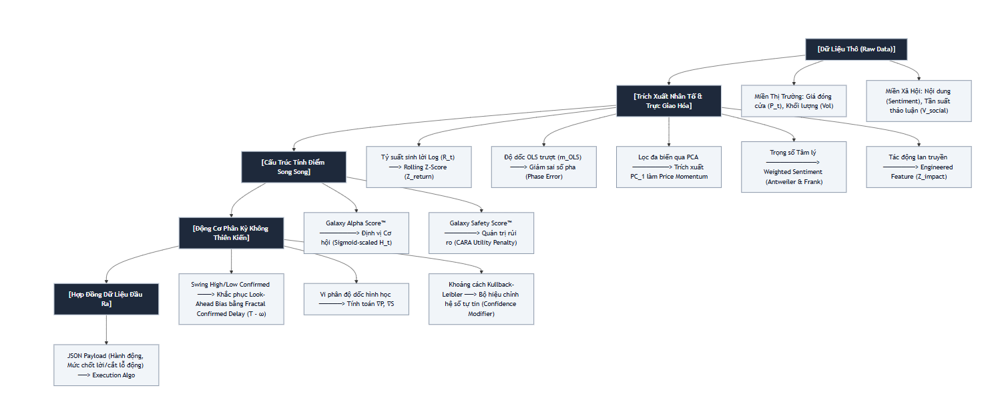

### 

### ***2.6.2. Khung chuẩn hóa không gian nhân tố***

Các chuỗi thời gian tài chính thô trước khi đưa vào bộ lọc trung tâm được biến đổi toán học nhằm đưa về trạng thái ổn định tương đối và triệt tiêu thứ nguyên.

**. Tỷ Suất Sinh Lời Logarit ()**

- **Biểu thức toán học:**\
  

- **Mục đích sử dụng:** Trích xuất động lượng giá của tài sản dưới dạng liên tục. Việc chuyển đổi từ chuỗi giá thô 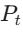 (phi trạm - non-stationary, tích hợp bậc nhất 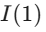) sang tỷ suất sinh lời logarit đưa chuỗi về trạng thái trạm 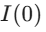, phù hợp cho các mô hình kinh tế lượng chuỗi thời gian. Biến đổi logarit giúp chuỗi lợi suất có tính chất cộng dồn theo thời gian (). Biến đổi này không loại bỏ các đặc trưng phi tuyến của tài sản số như đuôi béo (Fat-tails), độ lệch (Skewness) và hiện tượng tự tương quan biến động (Volatility Clustering).

- **Nguồn gốc lý thuyết:** Quy chuẩn toán học trong kinh tế lượng tài chính, được hệ thống hóa trong nghiên cứu của **Campbell, Lo, MacKinlay (1997)** -- *The Econometrics of Financial Markets* (Princeton University Press).

**. Chuẩn Hóa Rolling Z-Score ()**

- **Biểu thức toán học:**\
  \
  Trong đó,  và  là giá trị trung bình cuốn (rolling mean) và độ lệch chuẩn cuốn (rolling standard deviation) tính trên một cửa sổ thời gian trượt có độ rộng \
  

- **Mục đích sử dụng:** Đưa các nhân tố có thứ nguyên và quy mô phân phối khác nhau (như giá tuyệt đối, khối lượng thảo luận, điểm phân cực ngôn ngữ) về một không gian biểu diễn thống kê đồng nhất không thứ nguyên (Dimensionless Z-Space). Phép toán này hỗ trợ việc so sánh trực tiếp hoặc thực hiện tổ hợp tuyến tính các nhân tố bất đồng nhất mà không gặp lỗi thiên lệch quy mô.

- **Nguồn gốc lý thuyết:** Kỹ thuật biến đổi phân phối chuẩn hóa (Standard Score) trong thống kê học thực nghiệm (**Edward Altman, 1968**). Kỹ thuật Rolling Z-score để chuẩn hóa tín hiệu trượt và phát hiện bất thường thống kê được đặc tả bởi **Avellaneda & Lee (2010)** trong nghiên cứu *\"Statistical Arbitrage in the U.S. Equities Market\"* (*Quantitative Finance*).

**. Hệ Số Góc Hồi Quy Tuyến Tính Trượt ()**

- **Biểu thức toán học:**\
  \
  Trong đó,  đại diện cho chuỗi giá đóng cửa  tại bước thời gian ,  đại diện cho chuỗi chỉ số thời gian rời rạc .\
  Nhân tố này sau đó tiếp tục được đưa về không gian Z-Score:\
  

- **Mục đích sử dụng:** Đo lường gia tốc xu hướng của hành động giá bằng phương pháp bình phương tối thiểu (OLS).\
  Hệ số góc hồi quy tuyến tính trên cửa sổ trượt  có độ trễ pha cố định với tâm trọng số (Center of Gravity) nằm ở mốc thời gian 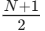. Tuy nhiên, phương pháp này hỗ trợ giảm thiểu sai số pha (Phase Error) so với các đường trung bình động giản đơn (SMA) hoặc hàm mũ (EMA) có cùng chu kỳ.

- **Nguồn gốc lý thuyết:** Phương pháp bình phương tối thiểu có lịch sử từ các công trình của **Carl Friedrich Gauss (1809)** và **Adrien-Marie Legendre (1805)**. Kỹ thuật áp dụng độ dốc OLS như một nhân tố động lượng trượt được chuẩn hóa kế thừa từ nguyên lý thiết lập đặc trưng danh mục của **Grinold & Kahn (1999)** trong cuốn sách *Active Portfolio Management*.

**. Trực Giao Hóa Không Gian Nhân Tố Bằng PCA**

Để hạn chế lỗi đếm kép (Double Counting) khi các nhân tố có sự cộng tuyến thông tin (như chỉ số xu hướng OLS, chỉ số sức mạnh tương đối RSI và vị thế dải Bollinger cùng phản ánh thuộc tính Động lượng giá), hệ thống thực hiện trực giao hóa không gian nhân tố bằng phương pháp phân tích thành phần chính (PCA).

- **Biểu thức toán học:**\
  Giả sử vector động lượng thô tại thời điểm  là . Ma trận hiệp phương sai cuốn  được tính trên cửa sổ trượt kích thước .\
  Thực hiện phân rã trị riêng (Eigenvalue Decomposition):\
  \
  Sắp xếp các trị riêng . Chọn trị riêng lớn nhất  đại diện cho thành phần chính đầu tiên (), đóng vai trò là vector trực giao hóa đại diện cho tối thiểu 85% phương sai của nhóm Động lượng:\
  \
  Đại lượng trực giao hóa  thay thế các biến đơn lẻ trong công thức tính điểm sức khỏe cơ sở , nhằm giảm thiểu ảnh hưởng của hiện tượng cộng tuyến.

### **2.6.3. Xử lý dữ liệu mạng xã hội**

Dữ liệu hành vi mạng xã hội (Social Domain) được xử lý thông qua các bộ lọc trọng số và chuẩn hóa thống kê nhằm hạn chế ảnh hưởng từ các tài khoản rác hoặc các chiến dịch truyền thông phối hợp.

**. Tổng Hợp Tâm Lý Xã Hội Gán Trọng Số Ảnh Hưởng ()**

- **Biểu thức toán học:**\
  

- **Mục đích sử dụng:** Tổng hợp các đóng góp phân cực cảm xúc riêng lẻ ( được trích xuất từ các mô hình ngôn ngữ chuyên biệt FinBERT hoặc CryptoBERT) của các bài viết trực tuyến thành một chỉ số đại diện duy nhất cho tài sản  trong chu kỳ . Phép trung bình gia quyền theo chỉ số ảnh hưởng ( - dựa trên quy mô người theo dõi, tương tác bài đăng và hệ số uy tín của nguồn phát) hỗ trợ phân tách nhiễu từ các mạng lưới tài khoản ảo, đồng thời phản ánh thông tin từ các thực thể có quy mô giao dịch hoặc mức độ ảnh hưởng lớn.

- **Nguồn gốc lý thuyết:** Cơ sở lý thuyết về việc lượng hóa dòng thông tin và vai trò của người dẫn dắt thông tin trên mạng xã hội ảnh hưởng đến cấu trúc vi mô thị trường được xây dựng bởi **Antweiler & Frank (2004)** (*\"Is All That Talk Just Noise? The Effects of Internet Stock Message Boards on Stock Markets\"*, *Journal of Finance*) và **Bollen, Mao, Zeng (2011)** (*\"Twitter mood predicts the stock market\"*, *Journal of Computer Science*).

**. Đo Lường Vận Tốc Lan Truyền Xã Hội ()**

- **Biểu thức toán học:**\
  

- **Mục đích sử dụng:** Tính sai phân bậc nhất của khối lượng thảo luận xã hội () theo thời gian. Đây là thước đo gia tốc dòng thông tin, đóng vai trò là một chỉ báo dẫn dắt (leading indicator) đối với biến động của tài sản.

- **Nguồn gốc lý thuyết:** Ứng dụng phương pháp sai phân thời gian trượt để mô tả động lực học thông tin truyền thông của **Sprenger, Tumasjan, Sandner, Welpe (2014)** (*\"Tweets and Trades: The Information Content of Stock Microblogs\"*, *European Financial Management*).

**. Nhân Tố Tác Động Lan Truyền ()**

- **Biểu thức toán học:**\
  

- **Mục đích sử dụng:** Biến số này tính tích chập giữa khối lượng thảo luận () và vận tốc thảo luận (), sau đó chuẩn hóa Z-Score để đo lường tổng động năng (kinetic energy) của dòng thông tin xã hội bao phủ quanh tài sản mà không phụ thuộc vào chiều hướng phân cực tâm lý.

- **Nguồn gốc lý thuyết:** Đề xuất kỹ thuật đặc trưng (feature engineering) trong tài liệu kiến trúc hệ thống Galaxy Score™ v2.1.

**. Hàm Phạt Biến Động Rủi Rô Hàm Mũ ()**

- **Biểu thức toán học:**\
  \
  Trong đó,  là điểm Z-Score trượt của độ biến động thực tế (Volatility) của tài sản,  là hệ số nhạy cảm rủi ro được tối ưu hóa theo khẩu vị của danh mục ().

- **Mục đích sử dụng:** Áp dụng một hàm phạt phi tuyến tính theo cấp số nhân đối với các tài sản có biến động tăng vọt. Khi độ biến động của tài sản nằm dưới mức trung bình lịch sử (), hệ số phạt . Khi biến động vượt ngưỡng (), hệ số  suy giảm về sát mốc 0, làm giảm điểm số tổng hợp nhằm hạn chế rủi ro giao dịch trong các giai đoạn thị trường biến động cực đoan.

- **Nguồn gốc lý thuyết:** Khung lý thuyết về **Lý thuyết Hữu dụng hệ số ngại rủi ro tuyệt đối không đổi (Constant Absolute Risk Aversion - CARA Utility / Exponential Utility)** do **Kenneth Arrow và John Pratt (1964)** phát triển.

### **2.6.4. Kiến trúc hai chỉ số song song**

Để giải quyết sự xung đột mục tiêu kinh tế học giữa việc tìm kiếm cơ hội gia tốc biến động và quản trị rủi ro bảo vệ danh mục, hệ thống phân tách đầu ra thành hai đại lượng đại số độc lập:

**. Điểm Sức Khỏe Cơ Sở ()**

*Ràng buộc toán học:* Áp dụng ràng buộc chuẩn hóa L1-Norm đối với các trọng số để linh hoạt hóa phân bổ:

Cho phép các hệ số trọng số nhận giá trị âm nếu nhân tố đó đóng vai trò đảo nghịch xu hướng trong chu kỳ tối ưu hóa. Các hệ số 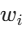 được tối ưu hóa động thông qua việc tối đa hóa hệ số thông tin () cuốn của danh mục.

**. Galaxy Alpha Score™ ()**

Chỉ số phản ánh gia tốc tăng trưởng, năng lượng dòng tiền và sức mạnh động lượng của tài sản số, phục vụ mục tiêu định vị cơ hội tăng trưởng:

*Hàm kích hoạt Sigmoid* 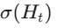 *thực hiện nén không gian điểm Z-Score vô hạn* 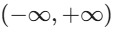 *về thang đo chuẩn hóa giới hạn* 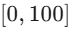*.*

**. Galaxy Safety Score™ ()**

Chỉ số đóng vai trò là bộ lọc kiểm soát rủi ro hệ thống (Systemic Risk Filter), tích hợp hàm phạt rủi ro CARA () trực tiếp vào điểm sức khỏe cơ sở:

*Chỉ số này được sử dụng làm bộ lọc biên điều kiện: Chỉ cho phép mở vị thế giao dịch khi*  *nhằm hạn chế giao dịch tại các đỉnh biến động cực đoan.*

### **2.6.5. Động cơ phát hiện phân kỳ thống kê**

Động cơ này hoạt động độc lập với quá trình tính điểm, sử dụng logic hình học vi phân để xác định tín hiệu giao dịch.

**. Khắc Phục Look-Ahead Bias Bằng Bộ Xác Thực Trễ Hình Học (Fractal Confirmation Delay)**

Công thức xác định Swing High/Low hình học truyền thống yêu cầu dữ liệu tương lai 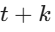. Hệ thống khắc phục sai số này bằng cách áp dụng độ trễ xác thực fractal cố định bằng  chu kỳ.

- **Điểm Xoay Cực Đại Xác Nhận Thực Thời (Confirmed Swing High tại mốc** 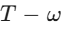**):**\
  

- **Điểm Xoay Cực Tiểu Xác Nhận Thực Thời (Confirmed Swing Low tại mốc** **):**\
  \
  *Giải nghĩa:* Tại thời điểm hiện tại , hệ thống xác nhận một điểm xoay cực trị đã hoàn thành tại mốc thời gian quá khứ 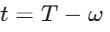 khi đã quan sát đủ  chu kỳ tiếp theo, đảm bảo mô hình không có thiên kiến nhìn trước tương lai (Look-ahead Bias).

**. Tính Toán Vector Xu Hướng Vi Phân ( và )**

Khi hai mốc điểm xoay cực trị gần nhất được xác nhận thành công tại tọa độ thời gian  và  (với 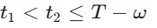), hệ thống tiến hành dựng vector xu hướng vi phân của giá đóng cửa và chuỗi tâm lý xã hội chuẩn hóa :

Trạng thái phân kỳ hình học được xác nhận khi tích số hướng của hai vector mang giá trị âm:

**. Hạn Chế Tín Hiệu Phân Kỳ Giả Bằng Khoảng Cách Kullback-Leibler ()**

Để lọc bỏ các phân kỳ hình học phát sinh do nhiễu dao động ngẫu nhiên, hệ thống coi phân phối giá trị của hành động giá () và phân phối của tâm lý xã hội () trên cửa sổ thời gian quan sát là hai hàm mật độ xác suất.

- **Biểu thức toán học:**\
  

- **Mục đích sử dụng:** Đo lường lượng entropy thất thoát (Relative Entropy) khi xấp xỉ phân phối của giá thông qua phân phối tâm lý xã hội. Giá trị  hoạt động như một Bộ hiệu chỉnh hệ số tự tin (Confidence Modifier).\
  Nếu khoảng cách thống kê  vượt quá ngưỡng phân kỳ tối đa cho phép, tín hiệu phân kỳ hình học sẽ bị hủy bỏ; chỉ khi  nằm trong biên độ hội tụ thống kê ổn định, tín hiệu giao dịch mới được kích hoạt.

### **2.6.6. Luồng dữ liệu và hợp đồng đầu ra**

Hệ thống vận hành song song trên kiến trúc **Hybrid Lambda Architecture**:

- **Speed Layer (WebSocket Stream):** Xử lý luồng biến động tức thời để tính toán  và biến phân kỳ nhanh  phục vụ cảnh báo sớm.

- **Batch Layer (Polars Multi-threading):** Chạy định kỳ trên cửa sổ trượt  để tính toán các phép toán ma trận có tính toán lớn (PCA trực giao hóa, OLS,  và bộ lọc trễ Fractal).

Sau khi phân giải ma trận quyết định, hệ thống NestJS đóng gói kết quả thành một bản tin JSON và phát bản tin lên chủ đề hệ thống nội bộ (topic_signals)

# 

# 

# **3. PHÂN TÍCH VÀ THIẾT KẾ HỆ THỐNG**

Hệ thống **Crypto Social Intelligence Pipeline** là **ứng dụng web full-stack** với luồng người dùng chính: **Dashboard TradingView** (chart nến + giá realtime) → nút **Phân tích** → **giao diện chat kiểu ChatGPT** (planning từng bước → chạy ETL → LLM đọc kết quả → báo cáo + tải PDF). Mỗi phiên phân tích được **lưu dưới dạng chat session**. Backend: Orchestrator (ETL 7 stage), FastAPI + WebSocket, MongoDB, OpenRouter LLM, Binance/CCXT.

## **3.1. Khảo sát yêu cầu**

### **3.1.1. Yêu cầu chức năng**

  --------------------------------------------------------------------------------------------------------------------------------------------------------------------------------------------------
  **ID**   **Yêu cầu**                             **Mô tả**
  -------- --------------------------------------- -------------------------------------------------------------------------------------------------------------------------------------------------
  FR-01    Thu thập dữ liệu social đa nguồn        Ingest tweet (RapidAPI), tin tức (Alpha Vantage, Yahoo Finance), Reddit; chuẩn hóa schema raw_events với event_id, raw_text, metrics, timestamp

  FR-02    Lọc spam và nhiễu                       Cascade L1 heuristic → L2 SimHash → L3 FastText; output clean_events hoặc ghi dropped_events để audit

  FR-03    Nhận diện và map coin                   Gán coin_id từ registry Top 10 (BTC, ETH, SOL, ...); fan-out 1 post → N bản ghi mapped_events; hỗ trợ hybrid/validator/full LLM

  FR-04    Phân tích sentiment                     Gán sentiment_score ∈ \[-1, 1\], sentiment_label, sentiment_confidence cho từng mapped event; model FinBERT (fallback rule-based)

  FR-05    Trọng số ảnh hưởng                      Tính influence_weight và weighted_sentiment = sentiment × influence; aggregate theo (coin_id, timeframe)

  FR-06    Tổng hợp và sinh tín hiệu               Join social aggregate với OHLCV; tính Galaxy Score / dual-score; output BUY/SELL/HOLD vào scoring_signals

  FR-07    Thu thập dữ liệu thị trường             Lấy nến OHLCV (Binance qua CCXT) theo coin và timeframe (15m, 1h)

  FR-08    Phân tích tổng hợp bằng LLM (Stage 7)   Sau scoring, LLM đọc signal + sentiment + influence + giá → báo cáo narrative có cấu trúc (analysis_reports)

  FR-09    REST API truy vấn kết quả               FastAPI: tín hiệu, lịch sử sentiment/score, báo cáo LLM theo coin

  FR-10    Orchestrator pipeline E2E               Một lệnh/API chạy tuần tự Stage 1→7; cấu hình tập trung .env

  FR-11    Dashboard TradingView                   Trang /dashboard: chart nến TradingView, chọn coin/timeframe, giá & volume realtime

  FR-12    Chat phân tích (ChatGPT-like)           Nút **Phân tích** → planning từng bước, stream ETL progress, LLM trả lời trong chat

  FR-13    Lưu session chat                        Mỗi lần phân tích = một analysis_session + chuỗi chat_messages; sidebar lịch sử session

  FR-14    Xuất PDF báo cáo                        Tải PDF từ message cuối session (signal + ETL summary + LLM report)

  FR-15    Web Dashboard --- ETL                   Trang /etl: giám sát job/stage; xem chi tiết pipeline (bổ sung cho progress trong chat)

  FR-16    Xuất báo cáo filter                     Export Excel PASS/DROP (CLI / dev)

  FR-17    Kiểm thử kịch bản scoring               Mock scenarios scoring
  --------------------------------------------------------------------------------------------------------------------------------------------------------------------------------------------------

**Phạm vi coin:** BTC, ETH, SOL, BNB, XRP, ADA, DOGE, AVAX, DOT, LINK

**Phạm vi timeframe:** 15m, 30m, 1h, 4h, 1d (aggregate); scoring mặc định **1h**.

### **3.1.2. Yêu cầu phi chức năng**

  **ID**   **Loại**             **Yêu cầu**                          **Giá trị mục tiêu**
  -------- -------------------- ------------------------------------ -------------------------------------------------------------------------------
  NFR-01   Hiệu năng            Throughput filter (L1+L2+L3)         ≥ 500 events/phút trên CPU (batch)
  NFR-02   Độ trễ               Inference sentiment (FinBERT, CPU)   ≤ 2 giây/event; batch 100 event/buổi chạy
  NFR-03   Idempotent           Chạy lại stage không tạo duplicate   Unique index trên event_id, (mapped_id, coin_id), signal_id
  NFR-04   Khả mở rộng          Thêm nguồn ingest mới                Plugin collector trong src/pipeline/ingest/collectors/
  NFR-05   Bảo mật              Bảo vệ API key                       Secret trong .env (gitignored); không commit credentials
  NFR-06   Khả bảo trì          Monorepo full-stack                  Backend src/ + Frontend web/; một pyproject.toml + web/package.json
  NFR-07   Khả truy vết         Audit pipeline                       Metadata stage; collection pipeline_jobs / pipeline_stage_runs; log job_id
  NFR-08   Triển khai độc lập   Chạy E2E một máy                     docker compose up → Web + API + MongoDB + pipeline
  NFR-09   Tính nhất quán       Data contract giữa stage             JSON document + MongoDB collections; join scoring theo timestamp + coin_id
  NFR-10   Trải nghiệm web      Chat stream mượt                     Token LLM stream ≤ 100ms/batch; ETL progress qua WS ≤ 2s
  NFR-11   LLM Insight          Độ trễ phiên phân tích               Pipeline 1→7 ≤ 5 phút/batch; LLM report ≤ 30s (streaming)
  NFR-12   TradingView          Chart load                           Widget TradingView Lightweight Charts render ≤ 1s; data feed qua Binance/CCXT
  NFR-13   Session chat         Lưu trữ                              Mỗi session ≤ 200 messages; PDF ≤ 5 MB

### **3.1.3. Đối tượng sử dụng**

  **Actor**                       **Mô tả**                                                   **Quyền hạn / tương tác chính**
  ------------------------------- ----------------------------------------------------------- -----------------------------------------------------------------------------------------------------------------------
  **User**                        Người dùng hệ thống (single-tenant)                         TradingView → **Phân tích** → chat session; giám sát pipeline; xem lại session; tải PDF; cấu hình .env khi triển khai
  **External --- Social API**     Twitter154 (RapidAPI), Alpha Vantage, Yahoo, Reddit OAuth   Cung cấp raw post/news
  **External --- Market API**     Binance (CCXT) + **TradingView widget**                     OHLCV realtime cho chart nến và scoring
  **External --- LLM API**        OpenRouter                                                  Stage 3 NER (hybrid) + **Stage 7 Insight** (phân tích tổng hợp)
  **Hệ thống --- Orchestrator**   Process điều phối pipeline                                  Tự động chạy Stage 1→7 khi User bấm Phân tích; emit event realtime
  **Hệ thống lưu trữ**            MongoDB Atlas + Redis                                       Event store, session chat, streams transport

## **3.2. Phân tích hệ thống**

### **3.2.1. Sơ đồ nghiệp vụ và luồng dữ liệu tổng quan**

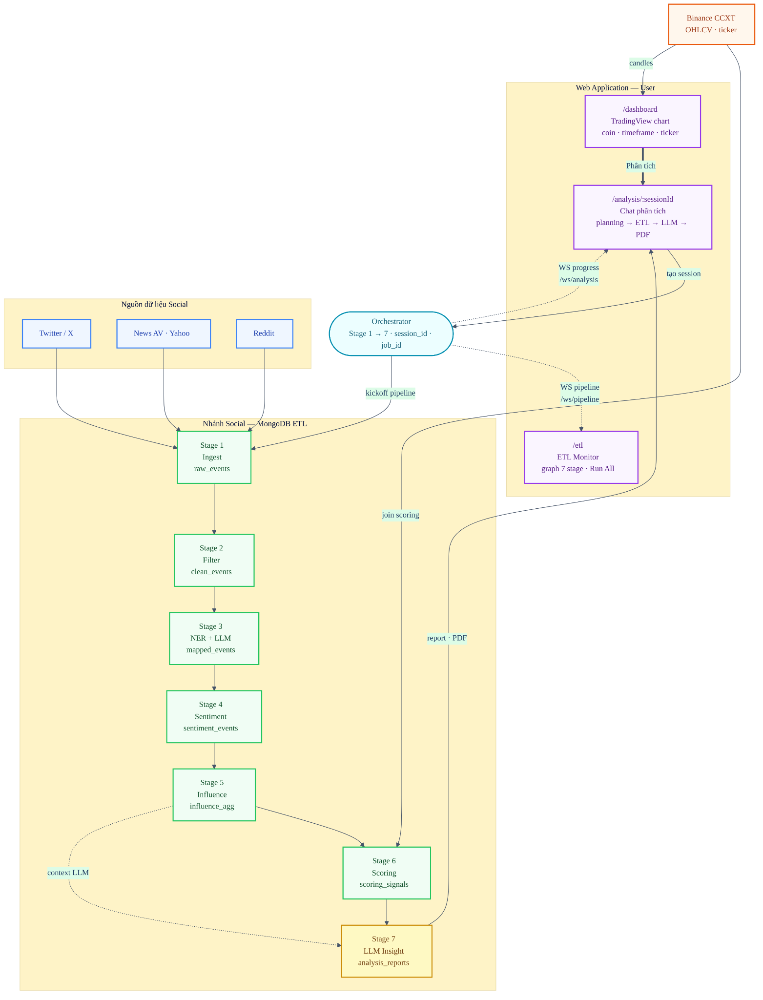

**Mô tả từng bước**

  **Stage**           **Input**                                      **Xử lý**                                                       **Output MongoDB**
  ------------------- ---------------------------------------------- --------------------------------------------------------------- ------------------------------------------
  1 --- Ingest        API response                                   Adapter → raw event contract; dedup (source, external_id)       raw_events
  2 --- Filter        raw_events                                     L1 heuristic → L2 SimHash → L3 FastText                         clean_events, (opt.) dropped_events
  3 --- NER           clean_events                                   Rules + LLM → fan-out theo coin_id                              mapped_events
  4 --- Sentiment     mapped_events                                  FinBERT inference; optional aggregate                           sentiment_events, sentiment_aggregates\*
  5 --- Influence     sentiment_events                               InfluenceWeight × TimeDecay × Engagement; aggregate window      weighted_events, influence_aggregates
  6 --- Scoring       influence_aggregates + OHLCV                   Join Polars; dual-score; rule BUY/HOLD/SELL                     scoring_signals
  7 --- LLM Insight   scoring_signals + aggregates + sample events   OpenRouter tổng hợp: tóm tắt, rủi ro, divergence, khuyến nghị   analysis_reports

Stage 4 có thể aggregate nội bộ (sentiment_aggregates); **thiết kế chuẩn** để Stage 6 đọc output Stage 5 (influence_aggregates). Stage 7 đọc output Stage 6 + context Stage 4--5.

**Mô hình triển khai sản phẩm (standalone web app)**

  **Thành phần**                           **Vai trò**                                                       **Ghi chú**
  ---------------------------------------- ----------------------------------------------------------------- ------------------------------------------------------
  **Web Frontend** (web/)                  React 19 · Mantine v9 · Tailwind v4 · React Query · Jotai · Zod   /dashboard · /analysis/:id · /etl
  **Orchestrator**                         Điều phối Stage 1→7; gắn session_id + job_id                      Trigger từ chat **Phân tích** hoặc /etl
  **Pipeline workers** (src/pipeline/\*)   ETL social, NLP, scoring, **LLM insight**                         Stage 7 worker gọi OpenRouter với context JSON
  **REST API + WebSocket** (src/api/)      FastAPI + Uvicorn                                                 REST cho dashboard; WS /ws/pipeline cho ETL realtime
  **MongoDB**                              Event store, jobs, reports                                        Database crypto_mvp; cấu hình qua .env
  **Market data**                          Binance CCXT                                                      Gọi trực tiếp lúc scoring (Stage 6)
  **Message broker** (tuỳ chọn)            Redpanda/Kafka                                                    Phase scale-out; không bắt buộc cho bản standalone

### **3.2.2. Biểu đồ Use Case**

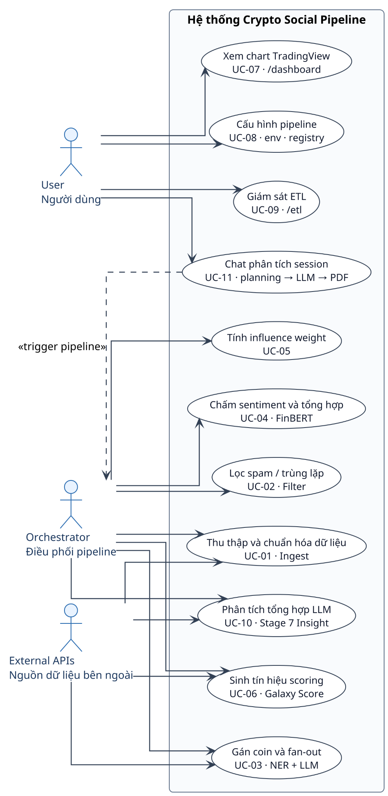

*Hình 3.2. Các ca sử dụng chính của hệ thống*

### **3.2.3. Đặc tả chi tiết Use Case**

UC-01 --- Thu thập dữ liệu social (Raw Collection)

  ------------------------------------------------------------------------------------------------------------------------------------
  Trường thông tin    Nội dung chi tiết
  ------------------- ----------------------------------------------------------------------------------------------------------------
  Use case name       Thu thập dữ liệu social thô (Raw Collection)

  Actor(s)            Orchestrator; External APIs (Twitter/RapidAPI, Alpha Vantage, Yahoo Finance, Reddit)

  Trigger             User bấm **Phân tích** (UC-11) hoặc **Run All** trên /etl → Orchestrator kick-off ingest

  Pre-condition(s)    1\. .env đã cấu hình MONGODB_URI và API key.\
                      2. Hệ thống kết nối được MongoDB Atlas.\
                      3. Nguồn được chọn có credential hợp lệ (Yahoo không cần key).

  Post-condition(s)   1\. Event mới được lưu vào raw_events theo contract Stage 1.\
                      2. Mỗi bản ghi có event_id, source, raw_text, metrics, timestamp, ingested_at.\
                      3. Event trùng (source, external_id) không ghi lại.\
                      4. Progress hiển thị trong chat (UC-11) hoặc /etl.

  Basic Flow          1\. Orchestrator nhận kickoff từ session hoặc /etl.\
                      2. Ingest worker đọc cấu hình nguồn (twitter, news-av, news-yahoo, reddit, hoặc all).\
                      3. Hệ thống load biến môi trường và khởi tạo MongoDB client.\
                      4. Hệ thống gọi collector tương ứng (Twitter154, Alpha Vantage, yfinance, Reddit OAuth).\
                      5. Adapter chuẩn hóa từng item API → document raw event.\
                      6. Hệ thống kiểm tra dedup qua index (source, external_id).\
                      7. Hệ thống ghi event mới vào raw_events và emit etl_progress.\
                      8. User xem thống kê insert/skip trong chat hoặc ETL Monitor.

  Alternative Flow    **4a.** Dry-run (toggle trên /etl hoặc CLI)\
                      4a1. Hệ thống chỉ fetch và log mẫu, không ghi MongoDB\
                      4a2. Use case kết thúc.\
                      \
                      **4b.** Reddit bị chặn, collector trả rỗng\
                      4b1. Orchestrator fallback sang nguồn khác (twitter, news-av)\
                      4b2. Use case tiếp tục bước 2 với nguồn mới.

  Exception Flow      **4c.** API lỗi mạng hoặc rate limit → Hệ thống log cảnh báo, bỏ qua batch hoặc retry; không ghi dữ liệu lỗi.\
                      \
                      **4d.** Thiếu API key bắt buộc → Hệ thống dừng, báo biến môi trường cần điền; không ghi DB.\
                      \
                      **5e.** News Yahoo không có title/summary → Adapter bỏ qua item, tiếp tục item kế tiếp.

  Business Rules      **BR1.** Mỗi event phải có event_id (UUID) duy nhất trong hệ thống.\
                      **BR2.** Dedup theo cặp (source, external_id) --- không ghi trùng nguồn gốc.\
                      **BR3.** Timestamp lưu dạng Unix epoch (giây, UTC).
  ------------------------------------------------------------------------------------------------------------------------------------

UC-02 --- Lọc spam và nhiễu (Spam Filter)

  -----------------------------------------------------------------------------------------------------------------------
  Trường thông tin    Nội dung chi tiết
  ------------------- ---------------------------------------------------------------------------------------------------
  Use case name       Lọc spam và nhiễu (Spam / Noise Filtering)

  Actor(s)            Orchestrator

  Trigger             Orchestrator gọi stage filter sau ingest (Redis stream stage:filter:in)

  Pre-condition(s)    1\. raw_events có event chưa có trong clean_events.\
                      2. MONGODB_URI đã cấu hình.\
                      3. (Tuỳ chọn L3) Model FastText tại models/spam/spam_model.bin.

  Post-condition(s)   1\. Event PASS ghi vào clean_events kèm clean_text và metadata filter.\
                      2. Event DROP có thể ghi dropped_events nếu bật \--save-dropped.\
                      3. Mỗi event_id tối đa một bản ghi trong clean_events.\
                      4. User thấy thống kê PASS/DROP qua chat hoặc /etl.

  Basic Flow          1\. Orchestrator khởi chạy filter worker.\
                      2. Hệ thống truy vấn raw_events chưa xử lý (theo \--limit, \--source).\
                      3. Cascade tuần tự từng event: **L1** heuristic → **L2** SimHash → **L3** FastText.\
                      4. Event PASS được map sang schema clean_events.\
                      5. Hệ thống ghi batch MongoDB và emit etl_progress.\
                      6. User xem tỷ lệ PASS/DROP trong chat hoặc ETL Monitor.

  Alternative Flow    **3a.** Cấu hình \--no-ml (dev/CLI)\
                      3a1. Bỏ qua L3 FastText, chỉ chạy L1 + L2\
                      3a2. Use case tiếp tục bước 4.\
                      \
                      **3b.** source: news mặc định bypass L1/L3 nặng\
                      3b1. Chỉ kiểm tra text rỗng (trừ khi \--filter-news)\
                      3b2. Use case tiếp tục bước 4.\
                      \
                      **6a.** Dry-run\
                      6a1. In stats, không ghi clean_events / dropped_events\
                      6a2. Use case kết thúc.

  Exception Flow      **3c.** L1: text rỗng hoặc regex pump → DROP ngay, ghi drop_reason, không chạy L2/L3.\
                      \
                      **3d.** L2: Hamming distance ≤ 3 → DROP duplicate.\
                      \
                      **3e.** L3: P(spam) ≥ 0.5 → DROP, ghi metadata FastText.\
                      \
                      **3f.** Chưa có model FastText → L3 skipped; cảnh báo CLI, chỉ L1+L2.

  Business Rules      **BR1.** Ngưỡng L3 mặc định: DROP nếu P(spam) ≥ 0.5.\
                      **BR2.** SimHash: coi trùng nếu Hamming distance ≤ 3.\
                      **BR3.** News mặc định tin cậy hơn social --- bypass filter nặng trừ khi cấu hình \--filter-news.
  -----------------------------------------------------------------------------------------------------------------------

UC-03 --- Nhận diện và gán coin (NER / Coin Mapping)

  -------------------------------------------------------------------------------------------------------------------
  Trường thông tin    Nội dung chi tiết
  ------------------- -----------------------------------------------------------------------------------------------
  Use case name       Nhận diện thực thể và gán coin (NER / Coin Mapping)

  Actor(s)            Orchestrator; External APIs (OpenRouter LLM)

  Trigger             Orchestrator gọi stage NER: python -m pipeline run \--stage ner \--mode hybrid

  Pre-condition(s)    1\. clean_events có event chưa có trong mapped_events.\
                      2. File config/coin_registry.json tồn tại (Top 10 coin).\
                      3. Mode cần LLM: OPENROUTER_API_KEY và OPENROUTER_MODEL hợp lệ.

  Post-condition(s)   1\. Mỗi mention hợp lệ → một document mapped_events (fan-out).\
                      2. Unique (parent_event_id, coin_id) được thỏa mãn.\
                      3. Metadata ner (mode, method, evidence, confidence, used_llm) được lưu.\
                      4. Event không có mention hợp lệ → không fan-out.

  Basic Flow          1\. Orchestrator khởi chạy NER worker với mode và input đã chọn.\
                      2. Hệ thống load coin registry và event chưa xử lý từ clean_events.\
                      3. Rules trích xuất mention: cashtag \$BTC, alias registry, Yahoo related_tickers.\
                      4. (Hybrid) Gọi OpenRouter LLM khi 0 mention + text crypto-related hoặc ambiguous.\
                      5. Loại mention ngoài registry Top 10.\
                      6. Fan-out: mỗi (parent_event_id, coin_id) → một mapped_events.\
                      7. Ghi MongoDB; emit etl_progress (events, fan-out rows, LLM calls).\
                      8. User xem kết quả trong chat hoặc /etl.

  Alternative Flow    **1a.** Dev dùng \--input raw (CLI/test)\
                      1a1. Đọc raw_events thay vì clean_events\
                      1a2. Use case tiếp tục bước 2.\
                      \
                      **7a.** Dry-run\
                      7a1. In kết quả NER, không ghi mapped_events\
                      7a2. Use case kết thúc.\
                      \
                      **7b.** \--reprocess (CLI)\
                      7b1. Xóa mapped cũ của event và map lại từ đầu\
                      7b2. Use case tiếp tục bước 6.

  Exception Flow      **3c.** Không mention và LLM không được gọi → Bỏ qua event, không fan-out.\
                      **4d.** OpenRouter lỗi/timeout → Ghi ner.llm_error; fallback rules-only hoặc skip theo mode.\
                      **2e.** Thiếu OPENROUTER_API_KEY khi mode validator/full → Báo lỗi khi gọi API.

  Business Rules      **BR1.** Chỉ map coin thuộc registry Top 10 (BTC, ETH, SOL, ...).\
                      **BR2.** Một post có N mention → N bản ghi mapped_events (fan-out).\
                      **BR3.** Hybrid mode: ưu tiên rules; LLM chỉ khi rules không đủ (tiết kiệm token).
  -------------------------------------------------------------------------------------------------------------------

**UC-04 --- Phân tích sentiment (Sentiment Analysis)**

  -------------------------------------------------------------------------------------------------------------------
  Trường thông tin    Nội dung chi tiết
  ------------------- -----------------------------------------------------------------------------------------------
  Use case name       Phân tích sentiment (Sentiment Analysis)

  Actor(s)            Orchestrator

  Trigger             Orchestrator gọi stage sentiment sau NER (Redis stream stage:sentiment:in)

  Pre-condition(s)    1\. mapped_events có coin_id và clean_text hợp lệ.\
                      2. Event chưa có trong sentiment_events (mapped_id + coin_id).\
                      3. Model FinBERT (ProsusAI/finbert) load được hoặc rule fallback bật.

  Post-condition(s)   1\. Mỗi event score → document sentiment_events với score, label, confidence.\
                      2. (Tuỳ chọn) Upsert sentiment_aggregates theo (coin_id, timeframe, window_start).\
                      3. User thấy thống kê processed / skipped / inserted qua chat hoặc /etl.

  Basic Flow          1\. Orchestrator khởi chạy sentiment worker.\
                      2. Hệ thống đọc mapped_events; fallback clean_events nếu rỗng (cần coin_id).\
                      3. Load FinBERT SentimentScorer.\
                      4. Với từng event: score_text(clean_text) → score ∈ \[-1, 1\] và label.\
                      5. Build sentiment_event và insert MongoDB.\
                      6. (Tuỳ chọn) aggregate theo window 1h.\
                      7. Emit etl_progress tổng kết batch.

  Alternative Flow    **3a.** Tin Alpha Vantage đã có sentiment_score trong metadata\
                      3a1. Dùng score sẵn, không gọi FinBERT\
                      3a2. Use case tiếp tục bước 5.\
                      \
                      **6b.** \--aggregate-only (CLI/dev)\
                      6b1. Bỏ qua batch scoring, chỉ aggregate từ sentiment_events hiện có\
                      6b2. Use case kết thúc.\
                      \
                      **5c.** Dry-run → Inference không ghi DB; Use case kết thúc.

  Exception Flow      **4d.** clean_text rỗng → Skip event.\
                      \
                      **3e.** Model FinBERT load lỗi và SENTIMENT_USE_RULE_FALLBACK=true → Dùng rule-based scorer.\
                      \
                      **5f.** Duplicate (mapped_id, coin_id) → Skip insert, không ghi đè.

  Business Rules      **BR1.** sentiment_score ∈ \[-1, 1\]; label ∈ {positive, neutral, negative}.\
                      **BR2.** Một mapped event + coin_id chỉ được score một lần (unique index).\
                      **BR3.** Sentiment chỉ chạy sau NER --- event phải có coin_id.
  -------------------------------------------------------------------------------------------------------------------

**UC-05 --- Tính trọng số ảnh hưởng (Influence Weighting)**

  ----------------------------------------------------------------------------------------------------------------------------------------------
  Trường thông tin    Nội dung chi tiết
  ------------------- --------------------------------------------------------------------------------------------------------------------------
  Use case name       Tính trọng số ảnh hưởng (Influence Weighting)

  Actor(s)            Orchestrator

  Trigger             Orchestrator gọi stage influence sau sentiment (Redis stream stage:influence:in)

  Pre-condition(s)    1\. sentiment_events có event chưa có trong weighted_events.\
                      2. Mỗi event có tối thiểu: coin_id, sentiment_score, timestamp, metrics.

  Post-condition(s)   1\. Ghi weighted_events: influence_weight, weighted_sentiment, object influence.\
                      2. Upsert influence_aggregates với alias sentiment_score cho Stage 6.\
                      3. Tổng influence và weighted sentiment mỗi window được cập nhật.

  Basic Flow          1\. Orchestrator khởi chạy influence worker kèm aggregate.\
                      2. Fetch sentiment_events chưa weighted.\
                      3. Tính SourceWeight, TimeDecay, QualityScore, AuthorAuthority, EngagementStrength, ViralitySurprise → InfluenceWeight.\
                      4. Tính weighted_sentiment = sentiment_score × influence_weight.\
                      5. Insert weighted_events (unique source_event_key).\
                      6. Aggregate → influence_aggregates theo window 1h.\
                      7. Emit etl_progress với thống kê inserted/skipped.

  Alternative Flow    **6a.** \--aggregate-only (CLI/dev)\
                      6a1. Chỉ rollup từ weighted_events đã có, không tính weight mới\
                      6a2. Use case kết thúc tại bước 6.\
                      \
                      **7b.** Dry-run → Preview, không ghi DB; Use case kết thúc.\
                      \
                      **2c.** \--reprocess → Xử lý lại event đã weighted.

  Exception Flow      Thiếu field ner/filter → QualityScore dùng default an toàn; pipeline vẫn chạy.\
                      \
                      Metrics thiếu replies/impressions → Engagement tính = 0.

  Business Rules      **BR1.** weighted_sentiment = sentiment_score × influence_weight.\
                      **BR2.** Aggregate window: influence_weighted_sentiment = Σ(sentiment × weight) / Σ(weight).\
                      **BR3.** InfluenceWeight clip trong \[0, MaxInfluence\] (mặc định MaxInfluence = 20).\
                      **BR4.** TimeDecay: half-life Twitter 12h, Reddit 24h, News 36h.
  ----------------------------------------------------------------------------------------------------------------------------------------------

**UC-06 --- Sinh tín hiệu giao dịch (Scoring / Galaxy Score)**

  -------------------------------------------------------------------------------------------------------------------------
  Trường thông tin    Nội dung chi tiết
  ------------------- -----------------------------------------------------------------------------------------------------
  Use case name       Sinh tín hiệu giao dịch (Scoring / Galaxy Score)

  Actor(s)            Orchestrator; External APIs (Binance qua CCXT)

  Trigger             Orchestrator gọi stage scoring sau influence (Redis stream stage:scoring:in)

  Pre-condition(s)    1\. influence_aggregates có ≥ 15 window khớp timeframe (mặc định 1h, 48 nến).\
                      2. Cấu hình MONGODB_AGGREGATE_COLLECTION=influence_aggregates trong .env.\
                      3. Binance API reachable; symbol mặc định BTC/USDT.

  Post-condition(s)   1\. Document mới trong scoring_signals: signal_id, coin_id, action, metrics, execution, timestamp.\
                      2. User thấy signal card trong chat hoặc qua REST API.\
                      3. Unique signal_id ngăn ghi trùng.

  Basic Flow          1\. Orchestrator khởi chạy scoring worker.\
                      2. Fetch OHLCV Binance (CCXT) và social aggregate từ MongoDB.\
                      3. Inner join theo timestamp, sort time-series.\
                      4. Tính feature: log return, Z-score, OLS slope, volatility, CARA, social impact.\
                      5. PCA momentum → galaxy_alpha_score, galaxy_safety_score.\
                      6. KL divergence → hệ số confidence (metadata).\
                      7. Áp rule: BUY nếu alpha \> 60 và safety \> 40; ngược lại HOLD.\
                      8. Đóng gói payload (target_price +5%, stop_loss -2%) → ghi scoring_signals.\
                      9. User xem signal card trong chat hoặc GET /api/v1/coins/{coin_id}/signal.

  Alternative Flow    **1a.** Dev chạy test mock: python -m pipeline test scoring \--case bullish_divergence\
                      1a1. Dùng mock data, không cần MongoDB/Binance\
                      1a2. Có thể ra SELL khi alpha \< 40 (logic test)\
                      1a3. Use case kết thúc tại bước in bảng kết quả.

  Exception Flow      **2b.** Thiếu market hoặc social data → Báo lỗi, dừng, không ghi signal.\
                      \
                      **3c.** Sau join \< 15 dòng → Cảnh báo không đủ rolling window, dừng pipeline.\
                      \
                      **2d.** Binance network error → market_list rỗng, dừng.\
                      \
                      **8e.** Duplicate signal_id → Skip insert, báo trùng unique key.

  Business Rules      **BR1.** BUY: galaxy_alpha_score \> 60 **và** galaxy_safety_score \> 40.\
                      **BR2.** HOLD: các trường hợp còn lại (production).\
                      **BR3.** SELL (test mock): galaxy_alpha_score \< 40.\
                      **BR4.** Rolling window scoring mặc định = 12 nến; timeframe mặc định = 1h.\
                      **BR5.** target_price = close × 1.05; stop_loss = close × 0.98.
  -------------------------------------------------------------------------------------------------------------------------

**UC-07 --- Dashboard TradingView (Chart nến + giá realtime)**

  -------------------------------------------------------------------------------------------------------------------------------------------------------
  Trường thông tin    Nội dung chi tiết
  ------------------- -----------------------------------------------------------------------------------------------------------------------------------
  Use case name       Xem chart nến TradingView và dữ liệu coin realtime

  Actor(s)            User

  Trigger             User truy cập http://localhost:3000/dashboard

  Pre-condition(s)    1\. Web app và FastAPI đang chạy.\
                      2. Binance/CCXT hoặc TradingView datafeed reachable.

  Post-condition(s)   1\. Chart nến hiển thị đúng coin và timeframe đã chọn.\
                      2. Panel bên cạnh hiển thị giá last, change 24h, volume.\
                      3. Nút **Phân tích** sẵn sàng (enabled) khi đã chọn coin.

  Basic Flow          1\. User mở /dashboard.\
                      2. Frontend embed **TradingView Lightweight Charts** (hoặc TradingView Widget) với symbol BINANCE:BTCUSDT.\
                      3. Datafeed lấy OHLCV qua GET /api/v1/market/ohlcv?coin=BTC&interval=1h (Binance CCXT); cập nhật nến cuối qua WebSocket/polling.\
                      4. User chọn coin (Top 10 registry) và timeframe (15m, 1h, 4h, 1d) → chart reload.\
                      5. Sidebar hiển thị danh sách **session chat** gần đây (lịch sử phân tích).\
                      6. User bấm **Phân tích** → chuyển sang UC-11 (tạo session mới).

  Alternative Flow    **3a.** User đổi timeframe trên chart\
                      3a1. Chart refetch OHLCV; giữ coin hiện tại\
                      3a2. Use case tiếp tục bước 5.\
                      \
                      **6b.** User click session cũ trên sidebar\
                      6b1. Navigate /analysis/:sessionId --- mở lại chat đã lưu (read-only hoặc tiếp tục hỏi).

  Exception Flow      **3c.** Market API lỗi → Chart hiển thị cached/stale banner; nút Phân tích vẫn hoạt động (ETL dùng nguồn khác).\
                      \
                      **2d.** TradingView script load fail → Fallback chart Recharts OHLCV từ API.

  Business Rules      **BR1.** Symbol map: BTC → BINANCE:BTCUSDT qua config/coin_registry.json.\
                      **BR2.** Chart chỉ hiển thị --- không trigger pipeline tại bước này.\
                      **BR3.** Timezone chart: UTC (đồng bộ pipeline window).
  -------------------------------------------------------------------------------------------------------------------------------------------------------

**UC-08 --- Cấu hình pipeline (triển khai)**

  -------------------------------------------------------------------------------------------------------------------------------
  Trường thông tin    Nội dung chi tiết
  ------------------- -----------------------------------------------------------------------------------------------------------
  Use case name       Cấu hình tham số pipeline và registry coin

  Actor(s)            User

  Trigger             User cần thay đổi cấu hình trước khi chạy hoặc sau khi đổi môi trường (API key, coin list, ngưỡng filter)

  Pre-condition(s)    1\. User có quyền sửa .env và config trong repo (triển khai single-tenant).\
                      2. User biết stage cần cấu hình (ingest, filter, NER, sentiment, influence, scoring).

  Post-condition(s)   1\. Env và config cập nhật; stage tiếp theo dùng tham số mới.\
                      2. Secret không commit Git (.env trong .gitignore).

  Basic Flow          1\. User điền .env: MONGODB_URI, API keys, MONGODB_AGGREGATE_COLLECTION=influence_aggregates.\
                      2. Tuỳ chọn override tham số trong config/settings.yaml (ngưỡng filter, NER mode, timeframe scoring).\
                      3. Chỉnh config/coin_registry.json nếu cần alias coin.\
                      4. Dry-run pipeline: python -m pipeline run \--all \--dry-run hoặc toggle trên /etl.\
                      5. Chạy pipeline đầy đủ từ /etl (**Run All**) hoặc bấm **Phân tích** trên dashboard.\
                      6. User xem job log trên /etl và health: GET /api/v1/health.

  Alternative Flow    **4a.** Dry-run báo lỗi stage\
                      4a1. User sửa .env / config/settings.yaml tương ứng\
                      4a2. Lặp lại bước 4 cho đến khi pass.

  Exception Flow      **1b.** MONGODB_URI sai hoặc thiếu → Pipeline fail fast: ValueError: Thiếu MONGODB_URI.\
                      \
                      **2c.** Thiếu OPENROUTER_API_KEY khi NER mode cần LLM → Lỗi khi gọi API.\
                      \
                      **2d.** FASTTEXT_MODEL_PATH không tồn tại → Filter chạy L1+L2 only.\
                      \
                      **1e.** User commit nhầm .env → Phải rotate key; không đưa secret vào báo cáo nộp.

  Business Rules      **BR1.** Secret chỉ lưu trong .env, không commit repository.\
                      **BR2.** Một file .env duy nhất ở root; tất cả module load qua src/common/config.py.\
                      **BR3.** Scoring đọc aggregate từ Stage 5 (influence_aggregates) --- không trộn công thức Stage 4.\
                      **BR4.** Model LLM Insight cấu hình riêng: OPENROUTER_INSIGHT_MODEL (mặc định khác NER).
  -------------------------------------------------------------------------------------------------------------------------------

**UC-09 --- Giám sát ETL trên Web Dashboard**

  -------------------------------------------------------------------------------------------------------------------------------
  Trường thông tin    Nội dung chi tiết
  ------------------- -----------------------------------------------------------------------------------------------------------
  Use case name       Giám sát ETL chi tiết --- /etl

  Actor(s)            User

  Trigger             User mở /etl để xem chi tiết pipeline; bổ sung cho progress embed trong chat UC-11

  Pre-condition(s)    1\. FastAPI + WebSocket /ws/pipeline hoạt động.\
                      2. Single-tenant --- không yêu cầu đăng nhập hay phân quyền admin.

  Post-condition(s)   1\. Dashboard hiển thị trạng thái realtime từng stage (pending/running/success/failed).\
                      2. Thống kê throughput: events processed, PASS/DROP, LLM calls, thời gian chạy.\
                      3. Job mới được ghi vào pipeline_jobs + pipeline_stage_runs.

  Basic Flow          1\. User mở trang ETL Monitor (/etl).\
                      2. Frontend kết nối WebSocket; backend push event stage_started, stage_progress, stage_completed.\
                      3. UI render pipeline graph 7 stage với màu trạng thái và số liệu từng collection.\
                      4. User bấm **Run All** → POST /api/v1/pipeline/run với stages: \[\"ingest\",...,\"insight\"\].\
                      5. Orchestrator chạy tuần tự; dashboard cập nhật progress bar và log tail.\
                      6. Khi hoàn tất, User xem summary: duration, errors, records inserted.

  Alternative Flow    **4a.** User chạy một stage\
                      4a1. Chọn stage trên UI (ví dụ Filter only)\
                      4a2. POST với stages: \[\"filter\"\]; dashboard chỉ highlight stage đó.\
                      \
                      **4b.** Dry-run\
                      4b1. Toggle "Dry run" trên UI → orchestrator không ghi DB, vẫn push progress.

  Exception Flow      **5c.** Stage fail → UI highlight đỏ, hiển thị stack trace / error message từ pipeline_stage_runs.error.\
                      \
                      **2d.** WebSocket disconnect → Frontend fallback polling GET /api/v1/pipeline/jobs/{job_id}.

  Business Rules      **BR1.** Mỗi lần chạy pipeline tạo một job_id duy nhất.\
                      **BR2.** Stage phải chạy tuần tự 1→7 trừ khi User chọn subset.\
                      **BR3.** /etl và chat UC-11 dùng chung WebSocket events --- User có thể giám sát ở cả hai nơi.
  -------------------------------------------------------------------------------------------------------------------------------

**UC-10 --- Phân tích tổng hợp bằng LLM (Stage 7 --- Insight)**

  --------------------------------------------------------------------------------------------------------------------------------------
  Trường thông tin    Nội dung chi tiết
  ------------------- ------------------------------------------------------------------------------------------------------------------
  Use case name       LLM Insight --- phân tích kết quả pipeline và sinh báo cáo

  Actor(s)            Orchestrator (trigger); User (đọc); External API (OpenRouter LLM)

  Trigger             Orchestrator gọi Stage 7 sau Stage 6: python -m pipeline run \--stage insight \--coin BTC

  Pre-condition(s)    1\. scoring_signals có signal mới cho coin_id + timeframe.\
                      2. influence_aggregates, sample sentiment_events (top N theo influence) sẵn có.\
                      3. OPENROUTER_API_KEY và OPENROUTER_INSIGHT_MODEL hợp lệ.

  Post-condition(s)   1\. Document analysis_reports + message assistant cuối trong chat_messages.\
                      2. Liên kết session_id, signal_id, job_id.\
                      3. Chat UI hiển thị báo cáo streaming; nút **Tải PDF** enabled.

  Basic Flow          1\. Insight worker chạy sau Stage 6 (trong cùng job orchestrator của session).\
                      2. Build context JSON + prompt config/prompts/insight_v1.txt.\
                      3. Gọi OpenRouter; **stream token** → WebSocket /ws/analysis/{session_id} → bubble chat assistant.\
                      4. Parse JSON structured; ghi analysis_reports.\
                      5. Append message type: report vào chat_messages kèm report_id.\
                      6. Frontend render markdown trong chat + nút **Tải PDF**.

  Alternative Flow    **3a.** Streaming --- user thấy text xuất hiện dần như ChatGPT\
                      3a1. Mỗi chunk append vào message đang stream\
                      3a2. Khi done, lưu full content vào DB.

  Exception Flow      **3c.** OpenRouter timeout/lỗi → Ghi report fallback (template + signal metrics only); flag llm_fallback: true.\
                      \
                      **1d.** Thiếu scoring signal → Stage 7 skip coin, log warning.\
                      \
                      **4e.** JSON parse fail → Retry 1 lần; sau đó fallback template.

  Business Rules      **BR1.** LLM **không** override rule BUY/HOLD/SELL Stage 6 --- chỉ diễn giải.\
                      **BR2.** Mọi output LLM lưu vào chat_messages --- session là source of truth cho UI.\
                      **BR3.** Disclaimer bắt buộc ở cuối message report.\
                      **BR4.** Token budget context ≤ 8K; sample ≤ 10 events.
  --------------------------------------------------------------------------------------------------------------------------------------

**UC-11 --- Chat phân tích (Planning → ETL → LLM → PDF)**

  ---------------------------------------------------------------------------------------------------------------------------------------------------------------------------
  Trường thông tin    Nội dung chi tiết
  ------------------- -------------------------------------------------------------------------------------------------------------------------------------------------------
  Use case name       Phiên chat phân tích coin --- planning, ETL, báo cáo LLM, lưu session

  Actor(s)            User; Orchestrator; OpenRouter LLM

  Trigger             User bấm **Phân tích** trên /dashboard (coin + timeframe đã chọn)

  Pre-condition(s)    1\. Coin và timeframe đã chọn trên TradingView dashboard.\
                      2. API + WebSocket hoạt động (single-tenant, không auth).

  Post-condition(s)   1\. analysis_sessions mới với session_id, coin_id, timeframe, job_id.\
                      2. Chuỗi chat_messages: user → planning steps → ETL progress cards → LLM report → PDF link.\
                      3. Pipeline Stage 1→7 hoàn tất (hoặc fail có message lỗi trong chat).\
                      4. User có thể tải PDF và mở lại session từ sidebar.

  Basic Flow          1\. Frontend POST /api/v1/analysis/sessions { coin_id, timeframe } → nhận session_id.\
                      2. Navigate /analysis/:sessionId; kết nối WebSocket /ws/analysis/{session_id}.\
                      3. **Message user (auto):** "Phân tích {coin} khung {timeframe}".\
                      4. **Assistant --- Planning:** LLM/orchestrator in từng bước kế hoạch (giống ChatGPT planning):\
                      • Bước 1: Thu thập social (Ingest)\
                      • Bước 2: Lọc spam (Filter)\
                      • ... Stage 3→6\
                      • Bước 7: Tổng hợp & LLM Insight\
                      5. Orchestrator chạy job stages 1→7 gắn session_id; mỗi stage push message type: etl_progress (embed mini pipeline card: status, records, duration).\
                      6. Sau Stage 6: message type: signal_card (action, alpha, safety, target/stop).\
                      7. Stage 7 stream LLM report vào bubble assistant (UC-10).\
                      8. Message cuối type: report_done + nút **Tải PDF** → GET /api/v1/analysis/sessions/{id}/export/pdf.\
                      9. Session status → completed; hiện trong sidebar lịch sử /dashboard.

  Alternative Flow    **5a.** Stage fail giữa chừng\
                      5a1. Chat hiển thị message lỗi đỏ + stage nào fail\
                      5a2. Nút **Thử lại stage** hoặc **Chạy lại toàn bộ\**
                      5a3. Session status = failed_partial.\
                      \
                      **8b.** User hỏi follow-up trong cùng session\
                      8b1. Message user mới → LLM đọc context session (không chạy lại full ETL)\
                      8b2. Append assistant reply vào chat_messages.

  Exception Flow      **1c.** Session id không tồn tại → 404, redirect /dashboard.\
                      \
                      **7d.** LLM timeout → Message fallback + PDF vẫn generate từ structured data Stage 6.\
                      \
                      **8e.** PDF generation fail → Hiển thị "Tải Markdown" thay thế.

  Business Rules      **BR1.** Một lần bấm **Phân tích** = một session mới (không ghi đè session cũ).\
                      **BR2.** Planning steps luôn hiển thị **trước** khi stage chạy --- minh bạch với user.\
                      **BR3.** ETL progress render **trong chat** (không bắt user sang /etl).\
                      **BR4.** Session lưu đủ messages để tái hiện UI khi mở lại --- giống lịch sử ChatGPT.\
                      **BR5.** PDF gồm: metadata session, ETL summary table, signal, full LLM report.
  ---------------------------------------------------------------------------------------------------------------------------------------------------------------------------

### **3.2.4. Biểu đồ Activity**

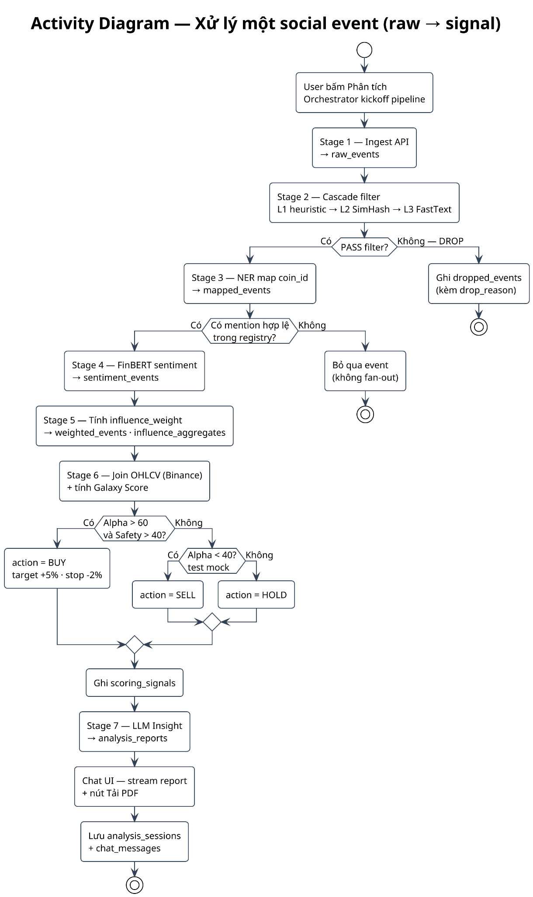

## **3.3. Thiết kế hệ thống**

### **3.3.1. Kiến trúc hệ thống**

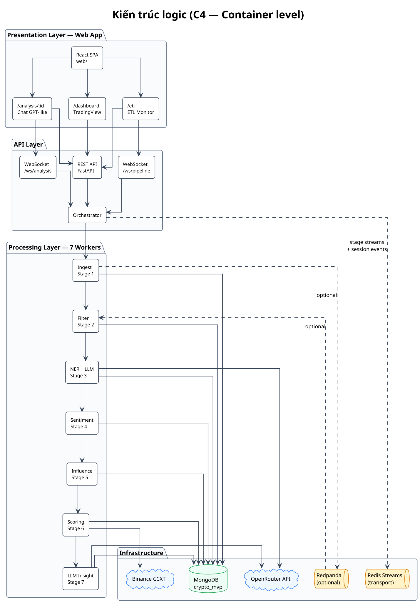

**Mô tả các tầng**

  **Tầng**                 **Thành phần**                                  **Trách nhiệm**
  ------------------------ ----------------------------------------------- ------------------------------------------------------------
  **Presentation**         React 19 SPA + Mantine v9 + Tailwind v4         Chart TradingView; chat; React Query + Jotai + Zod
  **API + Orchestrator**   FastAPI REST + WS /ws/analysis + /ws/pipeline   Chat session API; stream LLM + ETL progress; PDF export
  **Processing**           7 Python workers trong src/pipeline/            ETL social → scoring → **LLM Insight**; ghi job metrics
  **Infrastructure**       MongoDB, CCXT, OpenRouter                       Event store, jobs, reports; market data; LLM NER + Insight

**Nguyên tắc thiết kế module**

1.  **Một stage --- một contract:** Input/output JSON document rõ ràng; không stage nào sửa collection của stage khác (trừ upsert aggregate).

2.  **Idempotent batch:** Mỗi lần chạy chỉ xử lý event chưa có downstream; unique index chống duplicate.

3.  **Fail fast:** Thiếu MONGODB_URI hoặc dữ liệu join → dừng có log, không ghi signal rỗng.

4.  **Separation of concerns:** Spam filter không gán coin; NER không chấm sentiment; scoring không gọi LLM Insight; **Stage 7 chỉ diễn giải**, không đổi action rule.

5.  **Web-first:** User tương tác qua web (/dashboard, /analysis, /etl); CLI/API vẫn hỗ trợ automation và debug.

### **3.3.2. Thiết kế cơ sở dữ liệu**

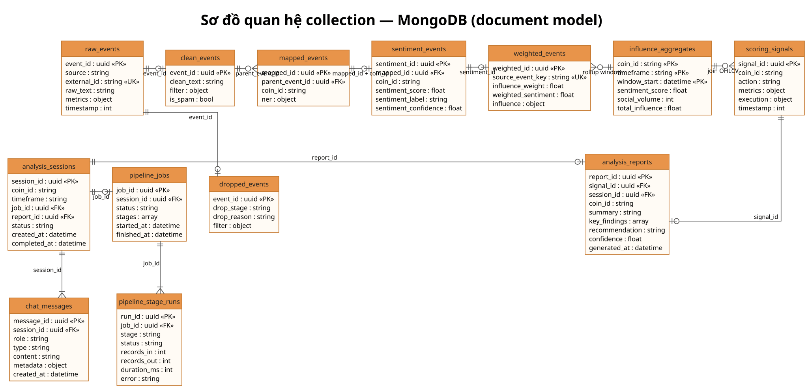

**Mô tả collection chính**

  **Collection**         **Stage**      **Mục đích**                                    **Trường quan trọng**
  ---------------------- -------------- ----------------------------------------------- -----------------------------------------------------------------
  raw_events             1              Lưu bất biến nội dung gốc + metrics tương tác   event_id, source, external_id, raw_text, metrics, timestamp
  clean_events           2              Text đã lọc, metadata cascade                   clean_text, filter.stage, filter.layers, filter.fasttext
  dropped_events         2              Audit event bị loại                             drop_stage, drop_reason, filter
  mapped_events          3              1 row / coin / post                             mapped_id, parent_event_id, coin_id, ner.method, ner.confidence
  sentiment_events       4              Sentiment per coin event                        sentiment_id, sentiment_score, sentiment_label, probabilities
  sentiment_aggregates   4              Rollup nội bộ stage 4 (optional)                weighted_sentiment, event_count, window_start
  weighted_events        5              Event đã nhân influence                         influence_weight, weighted_sentiment, influence.\*
  influence_aggregates   5              **Input chuẩn cho Stage 6**                     sentiment_score, social_volume, total_influence, timeframe
  scoring_signals        6              Tín hiệu đầu ra                                 signal_id, action, metrics.galaxy_alpha_score, execution
  analysis_reports       7              Báo cáo structured LLM                          report_id, session_id, signal_id, summary, key_findings
  analysis_sessions      Chat           Phiên phân tích                                 session_id, coin_id, timeframe, job_id, status, report_id
  chat_messages          Chat           Lịch sử chat từng session                       message_id, session_id, role, type, content, metadata
  pipeline_jobs          Orchestrator   Job ETL (gắn session)                           job_id, session_id, status, stages\[\]
  pipeline_stage_runs    Orchestrator   Chi tiết từng stage                             stage, status, records_in/out, duration_ms, error

**Data contract giữa các stage (trích yếu)**

Stage 1 → 2: event_id, source, raw_text, author_id, metrics, timestamp

Stage 2 → 3: + clean_text, filter metadata

Stage 3 → 4: + coin_id, ner metadata (fan-out)

Stage 4 → 5: + sentiment_score, sentiment_label, sentiment_confidence

Stage 5 → 6: aggregate: coin_id, timeframe, window_start, sentiment_score, social_volume

Stage 6: + market: timestamp, close, volume (Binance CCXT)

Stage 6 → 7: signal + aggregates + top events → LLM Insight

Stage 7 → Chat: analysis_reports + chat_messages (type: report)

Session → Chat: toàn bộ planning + etl_progress + report → chat_messages

Session → PDF: export từ messages + analysis_reports + pipeline_stage_runs

**Chỉ mục (Indexes) và ràng buộc**

  **Collection**         **Index**                                                 **Mục đích**
  ---------------------- --------------------------------------------------------- ----------------------------------
  raw_events             Unique sparse (source, external_id)                       Dedup ingest
  clean_events           Unique event_id                                           Idempotent filter
  mapped_events          Unique (parent_event_id, coin_id)                         Fan-out không trùng
  sentiment_events       Unique (mapped_id, coin_id); index (coin_id, timestamp)   Không score 2 lần; history query
  weighted_events        Unique source_event_key                                   Idempotent influence
  influence_aggregates   Unique (coin_id, timeframe, window_start)                 Upsert window
  scoring_signals        Unique signal_id; index (coin_id, timestamp)              Query signal mới nhất
  analysis_reports       Index (session_id); index (coin_id, generated_at DESC)    Chat + PDF
  analysis_sessions      Index (user_id, created_at DESC); index job_id            Sidebar lịch sử
  chat_messages          Index (session_id, created_at ASC)                        Tái hiện chat UI
  pipeline_jobs          Index (session_id); index (status, started_at DESC)       Gắn job ↔ session
  pipeline_stage_runs    Index (job_id, stage)                                     Stage progress per job

**Database và env chung**

- Database mặc định: crypto_mvp (MONGODB_DB)

- Connection: MONGODB_URI trong .env

### **3.3.3. Thiết kế API**

REST API + WebSocket phục vụ **TradingView dashboard**, **chat phân tích** và **ETL Monitor**. Triển khai bằng **FastAPI** (Uvicorn), mount tại src/api/.

**REST --- Dashboard TradingView (/dashboard)**

  **Method**   **Endpoint**                **Mô tả**                         **Request**             **Response**
  ------------ --------------------------- --------------------------------- ----------------------- -----------------------------------
  GET          /api/v1/market/ohlcv        OHLCV cho TradingView datafeed    coin, interval, limit   { candles: \[{time,o,h,l,c,v}\] }
  GET          /api/v1/market/ticker       Giá realtime (last, change 24h)   coin                    { last, change_pct, volume }
  GET          /api/v1/analysis/sessions   Lịch sử session (sidebar)         limit, offset           { sessions: \[\...\] }

**REST --- Chat phân tích (/analysis/:sessionId)**

  **Method**   **Endpoint**                                **Mô tả**                            **Request**              **Response**
  ------------ ------------------------------------------- ------------------------------------ ------------------------ -----------------------------------
  POST         /api/v1/analysis/sessions                   Tạo session mới + trigger pipeline   { coin_id, timeframe }   { session_id, job_id }
  GET          /api/v1/analysis/sessions/{id}              Metadata session                     ---                      { session, status, coin_id, ... }
  GET          /api/v1/analysis/sessions/{id}/messages     Toàn bộ chat messages                ---                      { messages: \[\...\] }
  POST         /api/v1/analysis/sessions/{id}/messages     Follow-up question (optional)        { content }              { message_id }
  GET          /api/v1/analysis/sessions/{id}/export/pdf   Tải PDF báo cáo                      ---                      application/pdf
  GET          /api/v1/coins/{coin_id}/signal              Signal card embed trong chat         ?timeframe=1h            { action, metrics, execution }

**REST --- ETL Monitor (/etl)**

  **Method**   **Endpoint**                     **Mô tả**                         **Request**                             **Response**
  ------------ -------------------------------- --------------------------------- --------------------------------------- -----------------------------------
  POST         /api/v1/pipeline/run             Trigger batch (retry / Run All)   { session_id?, stages\[\], dry_run? }   { job_id, status }
  GET          /api/v1/pipeline/jobs            Danh sách job gần đây             ?limit=20&status=running                { jobs: \[\...\] }
  GET          /api/v1/pipeline/jobs/{job_id}   Chi tiết job + stage runs         ---                                     { job, stages: \[\...\] }
  GET          /api/v1/pipeline/stats           Thống kê collection counts        ---                                     { raw_events, clean_events, ... }
  GET          /api/v1/health                   Health check                      ---                                     { mongodb, api, workers }

**WebSocket --- Chat phân tích (/ws/analysis/{session_id})**

  **Event**           **Payload**                                                    **Mô tả**
  ------------------- -------------------------------------------------------------- ----------------------------------------
  planning_step       { step, title, description }                                   Hiển thị kế hoạch từng bước trong chat
  etl_progress        { stage, status, pct, records_in, records_out, duration_ms }   Embed pipeline card trong chat
  signal_ready        { action, alpha, safety, target, stop }                        Card tín hiệu Stage 6
  llm_token           { token }                                                      Stream text LLM như ChatGPT
  report_done         { report_id, pdf_url }                                         Báo cáo hoàn tất; enable nút PDF
  session_completed   { session_id, status }                                         Kết thúc phiên

**WebSocket --- ETL Monitor (/ws/pipeline)**

  **Channel**    **Event**           **Payload**                              **Mô tả**
  -------------- ------------------- ---------------------------------------- --------------------------------------
  /ws/pipeline   job_started         { job_id, stages }                       Job mới bắt đầu
  /ws/pipeline   stage_progress      { job_id, stage, pct, records_out }      Progress từng stage
  /ws/pipeline   stage_completed     { job_id, stage, duration_ms, status }   Stage hoàn tất / fail
  /ws/pipeline   insight_completed   { job_id, coin_id, report_id }           Stage 7 xong --- User có thể refresh

**Payload mẫu --- chat_messages document**

{

\"message_id\": \"msg-001\",

\"session_id\": \"sess-abc\",

\"role\": \"assistant\",

\"type\": \"etl_progress\",

\"content\": \"Stage 2 Filter --- đang chạy...\",

\"metadata\": {

\"stage\": \"filter\",

\"status\": \"running\",

\"pct\": 45,

\"records_in\": 1200,

\"records_out\": 890

},

\"created_at\": \"2026-06-13T10:05:00Z\"

}

**Các type message trong chat**

  --------------------------------------------------------------------
  **type**       **role**    **Mô tả UI**
  -------------- ----------- -----------------------------------------
  user           user        Bubble user --- "Phân tích BTC 1h"

  planning       assistant   Danh sách bước kế hoạch (numbered list)

  etl_progress   assistant   Mini card pipeline stage + progress bar

  signal_card    assistant   Card BUY/HOLD + alpha/safety

  report         assistant   Markdown báo cáo LLM (stream)

  report_done    assistant   Nút **Tải PDF** + disclaimer

  error          assistant   Thông báo lỗi stage / LLM
  --------------------------------------------------------------------

**Payload mẫu --- GET signal**

{

\"coin_id\": \"BTC\",

\"timeframe\": \"1h\",

\"action\": \"BUY\",

\"metrics\": {

\"galaxy_alpha_score\": 68.2,

\"galaxy_safety_score\": 55.1,

\"kl_divergence\": 0.42,

\"confidence\": 95.8

},

\"execution\": {

\"target_price\": 70350.0,

\"stop_loss\": 65660.0

},

\"timestamp\": 1714248653

}

**Payload mẫu --- GET analysis/latest (Stage 7 LLM Insight)**

{

\"report_id\": \"a1b2c3d4-...\",

\"coin_id\": \"BTC\",

\"timeframe\": \"1h\",

\"signal_id\": \"sig-...\",

\"summary\": \"BTC cho tín hiệu BUY với alpha 68.2 và safety 55.1. Sentiment social tăng trong 24h qua trong khi giá sideway --- divergence tích cực.\",

\"key_findings\": \[

\"Social volume tăng 23% so với trung bình 7 ngày\",

\"Weighted sentiment chuyển từ neutral sang positive tại window 14:00 UTC\",

\"Galaxy alpha vượt ngưỡng BUY (\>60) lần đầu sau 3 ngày\"

\],

\"risk_factors\": \[

\"Volatility cao (ATR +18%) --- stop_loss nên tuân thủ\",

\"Mẫu sentiment chủ yếu từ Twitter --- thiếu đa dạng nguồn news\"

\],

\"recommendation\": \"Tín hiệu kỹ thuật-social đồng thuận mức vừa phải. Theo dõi xác nhận giá trên \$67,000 trước khi tăng exposure.\",

\"confidence\": 72.5,

\"llm_model\": \"anthropic/claude-3.5-sonnet\",

\"llm_fallback\": false,

\"generated_at\": \"2026-06-13T10:30:00Z\"

}

### **3.3.4. Thiết kế module và package**

**Cấu trúc thư mục sản phẩm (root project --- chạy độc lập)**

hqtcsdl/

├── pyproject.toml \# Backend Python (uv/pip)

├── docker-compose.yml \# MongoDB + API + Web + scheduler

├── .env.example \# MONGODB_URI, API keys, OPENROUTER_INSIGHT_MODEL

├── config/

│ ├── settings.yaml \# Ngưỡng filter, NER mode, timeframe scoring

│ ├── coin_registry.json \# Top 10 coin + alias

│ └── prompts/

│ └── insight_v1.txt \# Prompt template Stage 7 LLM

├── models/

│ └── spam/spam_model.bin \# FastText L3

├── web/ \# Frontend React 19 SPA

│ ├── package.json \# react@\^19, \@mantine/core@\^9, \@tanstack/react-query@\^5,

│ │ \# jotai@\^2, zod@\^3, tailwindcss@\^4

│ ├── src/

│ │ ├── main.tsx \# QueryClientProvider + MantineProvider

│ │ ├── index.css \# \@import \"tailwindcss\" v4

│ │ ├── schemas/ \# Zod validation

│ │ ├── atoms/ \# Jotai client state

│ │ ├── api/ \# React Query fetch + keys

│ │ ├── pages/

│ │ │ ├── Dashboard.tsx

│ │ │ ├── AnalysisChat.tsx

│ │ │ └── EtlMonitor.tsx

│ │ ├── components/ \# Mantine + Tailwind

│ │ ├── hooks/ \# useAnalysisWs, query hooks

│ │ └── theme.ts \# Mantine theme

│ └── vite.config.ts \# \@tailwindcss/vite

├── src/

│ ├── common/

│ ├── orchestrator/ \# job gắn session_id

│ ├── api/

│ │ ├── routes/analysis.py \# sessions, messages, PDF export

│ │ ├── routes/market.py \# OHLCV datafeed TradingView

│ │ └── ws/analysis.py \# stream planning + ETL + LLM

│ └── pipeline/

│ ├── ... \# Stage 1--6

│ └── insight/ \# Stage 7 --- stream vào chat_messages

├── scripts/train_spam.py

├── tests/

└── docs/

**Trách nhiệm và contract từng module**

  -----------------------------------------------------------------------------------------------------------------------------------------------------------------------------
  **Module**   **Entry (qua orchestrator)**         **Input collection**             **Output collection**                   **Ghi chú**
  ------------ ------------------------------------ -------------------------------- --------------------------------------- --------------------------------------------------
  ingest       \--stage ingest \--source twitter    External API                     raw_events                              Collectors: twitter, news_av, news_yahoo, reddit

  filter       \--stage filter                      raw_events                       clean_events                            Cascade L1--L3; model tại models/spam/

  ner          \--stage ner \--mode hybrid          clean_events                     mapped_events                           OpenRouter LLM; registry Top 10

  sentiment    \--stage sentiment                   mapped_events                    sentiment_events                        FinBERT; không aggregate trùng Stage 5

  influence    \--stage influence \--timeframe 1h   sentiment_events                 weighted_events, influence_aggregates   Output chuẩn cho Stage 6

  scoring      \--stage scoring \--coin BTC         influence_aggregates + Binance   scoring_signals                         Polars join; dual-score v2.1

  insight      \--stage insight \--session {id}     scoring_signals + context        analysis_reports, chat_messages         Stream LLM vào chat; PDF export
  -----------------------------------------------------------------------------------------------------------------------------------------------------------------------------

**Chạy pipeline end-to-end (một lệnh hoặc qua Web)**

\# Cài đặt backend + frontend

cp .env.example .env

uv sync

cd web && npm install && cd ..

\# Khởi động toàn bộ stack (MongoDB + API + Web)

docker compose up -d

\# Truy cập

\# Web User: http://localhost:3000/dashboard

\# Web ETL: http://localhost:3000/etl

\# API docs: http://localhost:8000/docs

\# Chạy pipeline Stage 1 → 7 (CLI)

python -m pipeline run \--all

\# Hoặc từ ETL Dashboard --- nút \"Run All\"

curl -X POST http://localhost:8000/api/v1/pipeline/run \\

-H \"Content-Type: application/json\" \\

-d \'{\"stages\": \[\"ingest\",\"filter\",\"ner\",\"sentiment\",\"influence\",\"scoring\",\"insight\"\]}\'

### **3.3.5. Thiết kế Web --- Luồng người dùng chính**

**Tổng quan 3 màn hình**

  **Màn hình**            **Route**              **Mô tả**
  ----------------------- ---------------------- ----------------------------------------------------------------------------------------------------------------------------
  **Trading Dashboard**   /dashboard             TradingView chart nến full-width · ticker giá realtime · chọn coin/timeframe · sidebar lịch sử session · nút **Phân tích**
  **Chat phân tích**      /analysis/:sessionId   Giao diện ChatGPT: messages planning → ETL cards → signal → LLM report stream → **Tải PDF**
  **ETL Monitor**         /etl                   User giám sát job chi tiết --- bổ sung cho progress trong chat

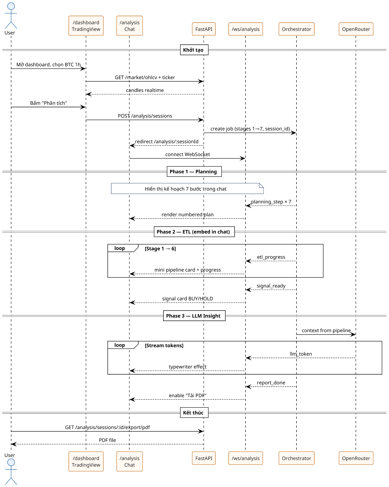

# **4. XÂY DỰNG, TRIỂN KHAI VÀ THỬ NGHIỆM**

## **4.1. Môi trường phát triển**

Phần này mô tả **quá trình hiện thực và kiểm chứng** sản phẩm **Crypto Social Intelligence Pipeline**: backend pipeline 7 stage, web app (dashboard · chat · ETL), orchestrator và MongoDB.\
**Hiện trạng repo:** logic nghiệp vụ đã được chứng minh trong playground/ (ingest, filter, ner, sentiment, influence, scoring); cấu trúc sản phẩm đích (src/, web/, docker compose) được mô tả đầy đủ ở mục 3 và đang được gom vào monorepo theo kiến trúc §3.3.

### **4.1.1. Cấu hình phần cứng**

  **Thành phần**   **Thông số**                     **Ghi chú**
  ---------------- -------------------------------- ----------------------------------------------------
  CPU              AMD/Intel 8+ cores               Chạy FinBERT + FastText + Polars scoring
  RAM              16 GB (khuyến nghị 32 GB)        Load model transformers \~500 MB; batch filter lớn
  GPU              Không bắt buộc (tuỳ chọn CUDA)   FinBERT chạy CPU được; GPU giảm latency sentiment
  Ổ cứng           SSD ≥ 256 GB                     Model cache HuggingFace, MongoDB local, logs
  Hệ điều hành     Arch Linux / Ubuntu 22.04 LTS    Môi trường dev và demo single-node

### **4.1.2. Cấu hình phần mềm**

  **Công cụ**                **Phiên bản**   **Ghi chú**
  -------------------------- --------------- --------------------------------------------------------------
  Python                     3.12+           Workers pipeline; quản lý dependency bằng uv
  FastAPI                    0.110+          REST API + WebSocket (thiết kế src/api/)
  Uvicorn                    0.30+           ASGI server
  React                      19.x            SPA /dashboard, /analysis, /etl
  Mantine                    9.x             AppShell, Card, Progress, Chat bubbles
  Tailwind CSS               4.x             Utility styling; \@tailwindcss/vite
  TanStack React Query       5.x             Cache REST: OHLCV, sessions, signals
  Jotai                      2.x             Client state: coin/timeframe, WS chat buffer
  Zod                        3.x             Validate API response + form
  TypeScript + Vite          5.x             Build frontend
  lightweight-charts         4.x             Chart nến TradingView (open-source)
  WeasyPrint                 62+             Export PDF từ markdown session
  Docker / Docker Compose    24.x            MongoDB + Redis + API + Web (triển khai đích)
  MongoDB                    7.x             Event store crypto_mvp
  Redis                      7.x             Streams transport giữa workers (§3.3, kien-truc-he-thong.md)
  HuggingFace Transformers   4.x             FinBERT sentiment
  FastText                   0.9.x           Spam classifier L3 (models/spam/)
  Polars + SciPy             ---             Scoring join OHLCV + KL divergence
  CCXT                       4.x             Binance OHLCV
  Git                        2.x             Version control

### **4.1.3. Cài đặt và chạy hệ thống**

**A. Môi trường dev --- chạy từng module pipeline (playground/)**

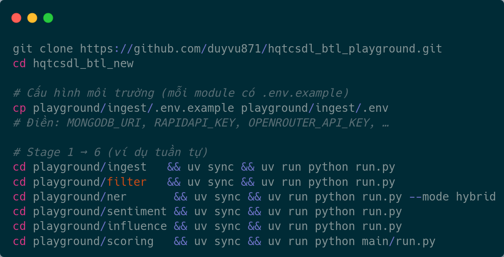

**B. Môi trường sản phẩm --- full-stack (theo thiết kế §3.3)**

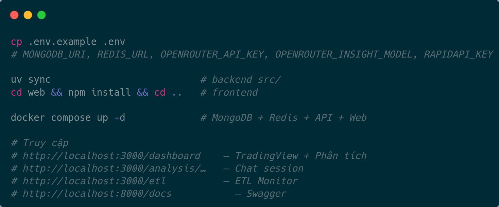

**Biến môi trường bắt buộc**

  **Biến**                   **Module / Stage**    **Mục đích**
  -------------------------- --------------------- ------------------------------------
  MONGODB_URI                Toàn pipeline         Kết nối Atlas/local crypto_mvp
  MONGODB_DB                 Toàn pipeline         Tên database (mặc định crypto_mvp)
  RAPIDAPI_KEY               Ingest Twitter        Twitter154 collector
  OPENROUTER_API_KEY         NER hybrid, Stage 7   LLM API
  OPENROUTER_INSIGHT_MODEL   Stage 7               Model insight (khác NER)
  FASTTEXT_MODEL_PATH        Filter L3             models/spam/spam_model.bin
  REDIS_URL                  Orchestrator          Redis Streams transport

## **4.2. Hiện thực hóa hệ thống**

### **4.2.1. Cấu trúc mã nguồn**

  -------------------------------------------------------------------------------------------------------------------------------------------------------
  **Lớp**            **Thư mục (thiết kế)**            **Hiện trạng triển khai**                                     **Trách nhiệm**
  ------------------ --------------------------------- ------------------------------------------------------------- ------------------------------------
  Pipeline workers   src/pipeline/\*                   playground/{ingest,filter,ner,sentiment,influence,scoring}/   ETL Stage 1→6

  LLM Insight        src/pipeline/insight/             (thiết kế §3)                                                 Stage 7 --- stream report

  Orchestrator       src/orchestrator/                 (thiết kế §3)                                                 Điều phối job, Redis Streams

  API + WS           src/api/                          (thiết kế §3)                                                 REST + /ws/analysis + /ws/pipeline

  Web SPA            web/                              (thiết kế §3)                                                 Dashboard, Chat, ETL Monitor

  Config             config/coin_registry.json, .env   Dùng chung                                                    Registry Top 10, secret
  -------------------------------------------------------------------------------------------------------------------------------------------------------

**Luồng tích hợp sản phẩm:** User bấm **Phân tích** → FastAPI tạo analysis_sessions → Orchestrator kickoff Stage 1→7 → mỗi stage ghi MongoDB + emit event WS → Stage 7 stream LLM vào chat_messages → User tải PDF.

### **4.2.2. Giao diện người dùng (Web)**

  **Màn hình**        **Route**              **Thành phần UI chính**                                                                  **Trạng thái**
  ------------------- ---------------------- ---------------------------------------------------------------------------------------- -----------------
  Trading Dashboard   /dashboard             TradingView chart, coin/timeframe selector, ticker, sidebar session, nút **Phân tích**   Thiết kế §3.3.5
  Chat phân tích      /analysis/:sessionId   Bubbles: planning → ETL cards → signal card → LLM stream → **Tải PDF**                   Thiết kế §3.3.5
  ETL Monitor         /etl                   Graph 7 stage, progress bar, Run All / dry-run                                           Thiết kế §3.3.5

### **4.2.3. Các đoạn mã nguồn cốt lõi**

Các đoạn dưới đây trích từ module đã chạy thử trong playground/ --- sẽ được chuyển sang src/pipeline/ khi gom monorepo.

**Stage 1 --- Chuẩn hóa raw event (playground/ingest/lib/events.py)**

Mỗi collector (Twitter, Alpha Vantage, Yahoo, Reddit) map về contract thống nhất: event_id (UUID), source, external_id, raw_text, metrics, timestamp (Unix UTC). Dedup qua unique index (source, external_id).

**Stage 2 --- Cascade filter L1→L2→L3 (playground/filter/lib/cascade.py)**

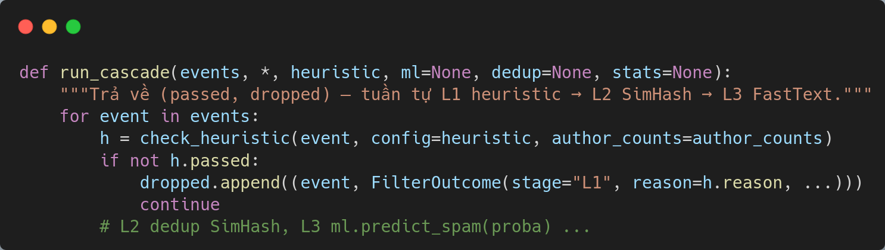

**Stage 3 --- NER rules + cashtag (playground/ner/lib/rules.py)**

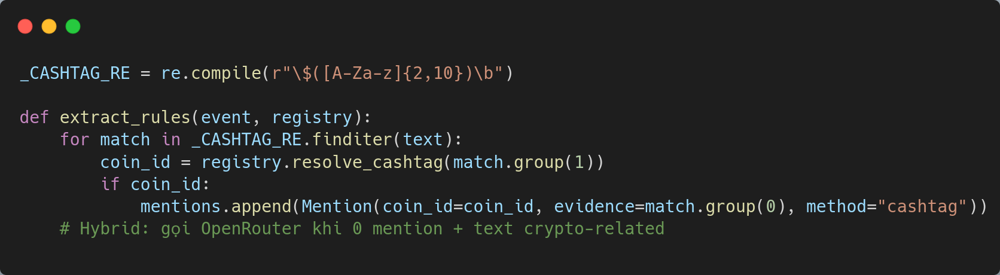

**Stage 4 --- FinBERT sentiment (playground/sentiment/lib/scorer.py)**

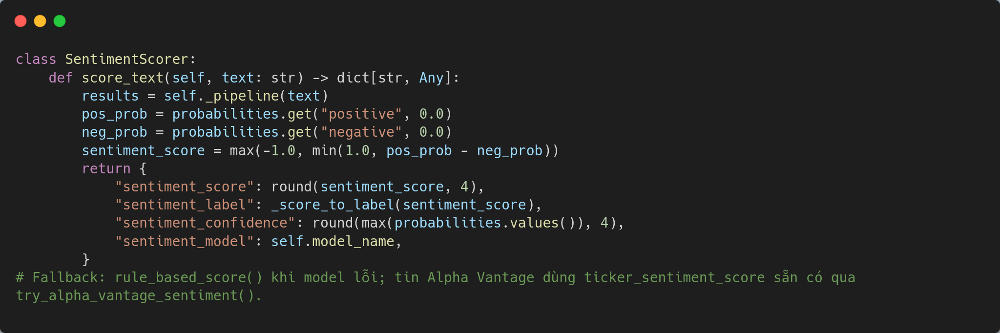

**Stage 5 --- Influence weight (playground/influence/lib/scoring.py)**

Tính SourceWeight × TimeDecay × QualityScore × AuthorAuthority × EngagementStrength × ViralitySurprise → influence_weight; weighted_sentiment = sentiment_score × influence_weight; aggregate window → influence_aggregates.

**Stage 6 --- Galaxy Score + rule BUY/HOLD (playground/scoring/main/run.py)**

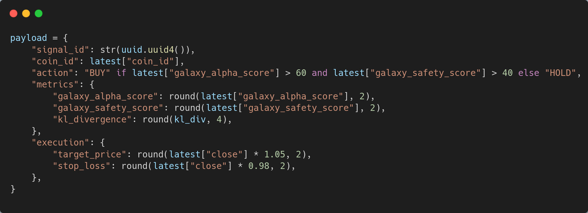Dual-score: galaxy_alpha_score = 100 / (1 + exp(-H_t)); Safety nhân hệ số CARA exp(-λ Z_vol).

**Stage 7 + Web --- Session & LLM stream (thiết kế src/api/, §3.3.3)**

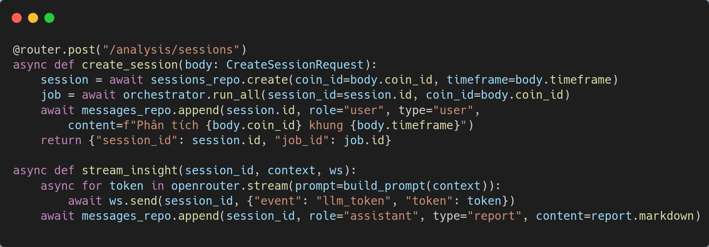

### **4.2.4. Xử lý logic nghiệp vụ theo từng module**

  **Module**     **Entry**                          **Input**                              **Xử lý chính**                                 **Output MongoDB**
  -------------- ---------------------------------- -------------------------------------- ----------------------------------------------- ---------------------------------------
  ingest         playground/ingest/run.py           Twitter154, AV, Yahoo, Reddit API      Adapter → schema; dedup (source, external_id)   raw_events
  filter         playground/filter/run.py           raw_events                             L1 heuristic → L2 SimHash → L3 FastText         clean_events, dropped_events
  ner            playground/ner/run.py              clean_events                           Rules cashtag + registry; hybrid LLM            mapped_events (fan-out)
  sentiment      playground/sentiment/run.py        mapped_events                          FinBERT; AV score sẵn; rule fallback            sentiment_events
  influence      playground/influence/run.py        sentiment_events                       InfluenceWeight; aggregate 1h window            weighted_events, influence_aggregates
  scoring        playground/scoring/main/run.py     influence_aggregates + Binance OHLCV   Polars join; PCA; dual-score; rule BUY/HOLD     scoring_signals
  insight        src/pipeline/insight/ (thiết kế)   scoring_signals + context              OpenRouter stream → chat + PDF                  analysis_reports, chat_messages
  Orchestrator   src/orchestrator/ (thiết kế)       POST session / Run All                 Stage 1→7; Redis Streams; WS events             pipeline_jobs, pipeline_stage_runs
  Web Chat       web/ (thiết kế)                    User **Phân tích**                     Planning UI → ETL cards → LLM → PDF             analysis_sessions persist

## **4.3. Kiểm thử**

### **4.3.1. Chiến lược kiểm thử**

  **Loại test**      **Phạm vi**                                                         **Công cụ / vị trí**
  ------------------ ------------------------------------------------------------------- ----------------------------------------------------------
  Unit test          Hàm pure: rule-based sentiment, influence formula, schema builder   playground/sentiment/tests/, playground/influence/tests/
  Integration test   Stage n → n+1: ingest→filter, mapped→sentiment, aggregate→scoring   Chạy thủ công + MongoDB test DB
  Scenario test      Mock scoring: bullish/bearish divergence, high volatility           playground/scoring/test/run.py
  API test           REST signal, health, session create                                 pytest + httpx (khi có src/api/)
  E2E test           Dashboard → Phân tích → chat → PDF                                  Playwright (khi có web/)
  Hiệu năng          Filter throughput, sentiment batch latency                          Benchmark script; mục tiêu NFR-01, NFR-02

### **4.3.2. Kịch bản kiểm thử**

  ---------------------------------------------------------------------------------------------------------------------------------------------------------------------------------
  **TC ID**   **Module**   **Mô tả**                  **Input**                              **Kết quả mong đợi**                  **Cách chạy**
  ----------- ------------ -------------------------- -------------------------------------- ------------------------------------- ------------------------------------------------
  TC-01       Filter L1    Tweet spam shill bị loại   Text pump regex / author flood         DROP tại L1, ghi drop_reason          playground/filter/run.py \--dry-run

  TC-02       Filter L3    FastText spam              Text train spam model                  P(spam) ≥ 0.5 → DROP                  Cần models/spam/spam_model.bin

  TC-03       NER          Map \$BTC → BTC            \"Buy \$BTC now\"                      coin_id = \"BTC\", method cashtag     Unit / manual NER run

  TC-04       Sentiment    Tweet bullish              \"BTC to the moon bullish breakout\"   score \> 0, label positive            test_rule_based_positive()

  TC-05       Sentiment    Tweet bearish              \"ETH crash dump rekt\"                score \< 0, label negative            test_rule_based_negative()

  TC-06       Influence    Engagement weight          Event Twitter verified, high RT        0 \< influence_weight ≤ 20            test_calculate_influence_has_required_fields()

  TC-07       Scoring      Bullish divergence mock    bullish_divergence case                Alpha \> 60, Safety \> 40 → BUY       playground/scoring/test/run.py

  TC-08       Scoring      High volatility panic      high_volatility_panic case             Safety thấp → HOLD                    Mock scenario

  TC-09       Ingest       Dedup external_id          Chạy ingest 2 lần cùng tweet           Lần 2 skip, không duplicate           Unique index (source, external_id)

  TC-10       E2E Web      Phiên phân tích đầy đủ     User chọn BTC 1h, bấm Phân tích        Session + 7 planning + report + PDF   Manual / Playwright
  ---------------------------------------------------------------------------------------------------------------------------------------------------------------------------------

### 

### **4.3.3. Kết quả kiểm thử tổng hợp**

  **Chỉ số**                         **Giá trị**     **Ghi chú**
  ---------------------------------- --------------- ---------------------------------------------------------------
  Unit test sentiment (rule-based)   5/5 PASS        test_scorer.py --- positive, negative, neutral, empty, mixed
  Unit test influence                3/3 PASS        engagement, influence fields, weighted schema
  Scoring mock scenarios             3/3 PASS        bullish_divergence, bearish_divergence, high_volatility_panic
  Integration pipeline Stage 1→6     PASS (manual)   Chạy tuần tự trên MongoDB local với batch nhỏ
  E2E Web + Stage 7                  Chưa đo         Phụ thuộc tích hợp src/ + web/

### **4.3.4. Các lỗi phát hiện và cách khắc phục**

  **Bug ID**   **Mô tả lỗi**                           **Nguyên nhân**                      **Cách khắc phục**                           **Trạng thái**
  ------------ --------------------------------------- ------------------------------------ -------------------------------------------- -----------------------
  BUG-01       Duplicate raw event khi ingest lại      Thiếu unique (source, external_id)   Thêm sparse unique index MongoDB             Đã sửa
  BUG-02       Reddit collector trả rỗng               OAuth / IP block                     Fallback sang Twitter + Alpha Vantage        Đã xử lý (workaround)
  BUG-03       Scoring fail khi \< 15 window join      Batch aggregate mỏng                 Fail fast + log; yêu cầu ≥ 15 nến sau join   Đã sửa
  BUG-04       Metadata filter/ner chưa sang Stage 4   Schema builder thiếu field           Mở rộng builder sentiment (L-01 §3.3.5)      Đang xử lý
  BUG-05       OHLCV gọi CCXT mỗi lần scoring          Chưa persist market data             Collection market_ohlcv (L-02)               Kế hoạch
  BUG-06       KL divergence chưa đổi action           Chỉ ghi metadata confidence          Tích hợp rule engine (L-03)                  Kế hoạch

## **4.4. Đánh giá hệ thống**

### **4.4.1. Ưu điểm**

- **Pipeline modular 7 stage:** Mỗi stage có contract MongoDB rõ ràng, idempotent, dễ debug từng bước qua /etl hoặc chat embed.

- **Web-first trải nghiệm:** User một luồng duy nhất --- chart TradingView → chat planning → ETL progress → LLM report → PDF; không cần phân quyền admin.

- **NLP phù hợp domain:** FinBERT cho tài chính; FastText spam đã fine-tune; NER hybrid tiết kiệm token LLM.

- **Scoring lượng hóa:** Galaxy Alpha/Safety dual-score, join social + OHLCV, rule BUY/HOLD minh bạch; mock scenario kiểm chứng logic.

- **Quan sát được (observable):** Redis Streams + WS realtime; pipeline_jobs / pipeline_stage_runs audit từng stage.

- **Mở rộng nguồn:** Collector plugin trong ingest/collectors/; registry coin tập trung.

### **4.4.2. Hạn chế**

- **Single-node:** Chưa scale horizontal worker; Redis/Redpanda optional.

- **Phụ thuộc API bên thứ ba:** Rate limit Twitter/RapidAPI, Binance, OpenRouter --- cần retry và cache.

- **Chưa backtest dài hạn:** Signal BUY/HOLD chưa đo PnL trên lịch sử multi-month.

- **Tiếng Việt / đa ngôn ngữ:** Sentiment chủ yếu tiếng Anh (FinBERT); chưa hỗ trợ VN social.

- **KL divergence / fractal:** Đã tính nhưng chưa ảnh hưởng trực tiếp quyết định action (L-03).

### **4.4.3. So sánh với mục tiêu ban đầu**

  **Mục tiêu (FR / §1.2)**                   **Mức độ hoàn thành**   **Ghi chú**
  ------------------------------------------ ----------------------- -----------------------------------------------------------------
  FR-01 --- Thu thập đa nguồn social         **\~90%**               Twitter, AV, Yahoo OK; Reddit không ổn định
  FR-02 --- Lọc spam cascade                 **\~95%**               L1+L2+L3 chạy; export Excel tuỳ chọn
  FR-03 --- NER map coin Top 10              **\~90%**               Rules + hybrid LLM; fan-out đúng schema
  FR-04 --- Sentiment FinBERT                **\~95%**               Có AV bypass + rule fallback
  FR-05 --- Influence + aggregate            **\~90%**               Stage 5 → influence_aggregates cho scoring
  FR-06 --- Scoring Galaxy + signal          **\~85%**               Production rule BUY/HOLD; mock SELL test
  FR-07 --- OHLCV Binance                    **\~80%**               CCXT realtime; chưa persist cache
  FR-08 --- LLM Insight Stage 7              **\~70%**               Thiết kế + API contract; cần tích hợp src/
  FR-11--14 --- Web dashboard + chat + PDF   **\~65%**               Thiết kế/UI wireframe đầy đủ §3.3.5; frontend đang build
  FR-15 --- ETL Monitor /etl                 **\~70%**               WS /ws/pipeline trong thiết kế
  FR-10 --- Orchestrator E2E một lệnh        **\~75%**               CLI tuần tự OK; orchestrator + Redis theo kien-truc-he-thong.md

# **5. KẾT LUẬN VÀ HƯỚNG PHÁT TRIỂN**

## **5.1. Tóm tắt công việc đã thực hiện**

Dự án **Crypto Social Intelligence Pipeline** hướng tới một **ứng dụng web hoàn chỉnh**, nơi người dùng có thể quan sát biểu đồ giá, khởi chạy một phiên phân tích coin, theo dõi tiến trình xử lý dữ liệu theo thời gian thực và nhận báo cáo tổng hợp dưới dạng văn bản có thể tải về. Thay vì tách rời từng công cụ nhỏ, dự án gom toàn bộ luồng nghiệp vụ --- từ thu thập bài đăng mạng xã hội, lọc nhiễu, nhận diện coin liên quan, đánh giá thái độ thị trường, đo mức ảnh hưởng, đến tổng hợp tín hiệu giao dịch --- vào một quy trình thống nhất, có thể lặp lại và kiểm tra từng bước.

Ở tầng nghiệp vụ, hệ thống giải quyết bài toán **biến thông tin social ồ ạt thành gợi ý hành động có cơ sở**: người dùng không cần tự đọc hàng trăm tweet hay tin tức, mà được hệ thống chắt lọc, gán nhãn và đối chiếu với diễn biến giá trước khi đưa ra khuyến nghị mua hoặc giữ. Ở tầng trải nghiệm, mỗi lần phân tích được ghi lại như một phiên làm việc riêng --- có thể mở lại, xem lại lịch sử và xuất báo cáo --- giúp quá trình nghiên cứu coin trở nên có cấu trúc và dễ truy vết hơn so với việc tra cứu thủ công.

Quá trình thực hiện dự án trải qua **bốn giai đoạn** liên tiếp, bám sát cấu trúc báo cáo từ mục 1 đến mục 4.

**Giai đoạn 1 --- Khảo sát và phân tích yêu cầu (mục 3.1).** Nhóm bắt đầu bằng việc làm rõ ai sử dụng hệ thống, họ cần thông tin gì và trong phạm vi nào. Kết quả là bộ yêu cầu chức năng và phi chức năng được liệt kê có hệ thống, cùng với ranh giới rõ ràng: tập trung vào nhóm coin phổ biến, khung thời gian phân tích ngắn hạn, một loại người dùng duy nhất không cần phân quyền phức tạp, và không đi vào giao dịch tự động trên sàn.

**Giai đoạn 2 --- Phân tích và thiết kế hệ thống (mục 3.2--3.3).** Trên cơ sở yêu cầu, nhóm xây dựng mô hình nghiệp vụ: các tình huống sử dụng chính, luồng dữ liệu từ nguồn thô đến tín hiệu, sơ đồ hoạt động xử lý từng bài đăng, kiến trúc tổng thể và mô hình dữ liệu lưu trữ. Các sơ đồ này vừa phục vụ báo cáo, vừa là khung tham chiếu chung khi hiện thực và tích hợp các module.

**Giai đoạn 3 --- Hiện thực và kiểm thử (mục 4).** Phần lõi xử lý dữ liệu --- sáu bước đầu của pipeline --- đã được cài đặt, chạy thử và kiểm tra trên môi trường phát triển. Người dùng kỹ thuật có thể vận hành từng bước độc lập để kiểm chứng kết quả trung gian. Song song đó, lớp giao diện web và bước tổng hợp báo cáo bằng mô hình ngôn ngữ lớn được thiết kế đầy đủ về luồng tương tác và hợp đồng dữ liệu, là nền tảng cho giai đoạn ghép thành sản phẩm hoàn chỉnh.

**Giai đoạn 4 --- Đánh giá và rút kinh nghiệm (mục 4.4).** Cuối cùng, nhóm đối chiếu kết quả đạt được với mục tiêu ban đầu, ghi nhận điểm mạnh (modular, minh bạch quy trình), hạn chế (phụ thuộc nguồn dữ liệu bên ngoài, chưa backtest dài hạn) và các lỗi đã phát hiện cùng hướng xử lý.

**Kết quả chính đạt được** có thể tóm lược như sau:

  **Hạng mục**           **Nội dung**                                              **Trạng thái**
  ---------------------- --------------------------------------------------------- ----------------------------------------------------------------------------------
  Quy trình xử lý        Bảy bước liên tiếp từ thu thập đến báo cáo phân tích      Sáu bước đầu **đã hiện thực và kiểm thử**; bước báo cáo tổng hợp **đã thiết kế**
  Giao diện người dùng   Biểu đồ giá, chat phân tích, màn hình giám sát pipeline   **Thiết kế đầy đủ**; tích hợp end-to-end trên trình duyệt **đang thực hiện**
  Chất lượng phần mềm    Kiểm thử đơn vị và kịch bản mẫu trên từng module          Các module lõi **pass toàn bộ** test đã viết; luồng web đầy đủ **chưa đo**
  Tài liệu               Báo cáo, sơ đồ, lý thuyết từng giai đoạn pipeline         **Hoàn thiện** phục vụ nộp và bảo trì sau này

**Công việc hiện thực cụ thể** tập trung vào chuỗi xử lý dữ liệu social: thu thập từ nhiều nguồn tin và mạng xã hội; loại bỏ spam và nội dung nhiễu qua nhiều tầng lọc; gắn mỗi bài viết với coin tương ứng; chấm điểm thái độ thị trường; tính trọng số ảnh hưởng theo mức độ tương tác; cuối cùng kết hợp với dữ liệu giá để đưa ra tín hiệu mua hoặc giữ. Toàn bộ chuỗi này đã vận hành được ở mức module và được mô tả chi tiết kỹ thuật ở mục 4 --- phần kết luận chỉ nhấn mạnh **mục đích nghiệp vụ** mà không lặp lại chi tiết cài đặt.

## **5.2. Kết luận**

### **5.2.1. Mức độ hoàn thành so với mục tiêu**

**Mục tiêu tổng quát: Đạt một phần.** Dự án đã chứng minh được khả năng biến dữ liệu social thô thành tín hiệu giao dịch có thể giải thích --- đây là mục tiêu cốt lõi và đã hoàn thành ở mức pipeline xử lý. Đồng thời, nhóm đã thiết kế trọn vẹn lớp sản phẩm phía người dùng: xem biểu đồ, trò chuyện để phân tích, theo dõi tiến trình xử lý và nhận báo cáo tổng hợp. Phần còn lại là **ghép các module đã có thành một ứng dụng chạy một lần bấm** trên trình duyệt --- bước tích hợp cuối chưa hoàn tất nhưng đã có thiết kế và lộ trình rõ ràng.

Bảng tổng hợp (chi tiết hơn ở mục 4.4.3):

  -------------------------------------------------------------------------------------------------------------------------
  **Nhóm mục tiêu**                     **Đánh giá**    **Ghi chú**
  ------------------------------------- --------------- -------------------------------------------------------------------
  Thu thập và làm sạch dữ liệu          **\~90--95%**   Đa nguồn hoạt động ổn; một số kênh social còn không ổn định

  Phân tích nội dung và sinh tín hiệu   **\~85--95%**   Quy trình modular, quy tắc mua/giữ minh bạch

  Điều phối và giao tiếp hệ thống       **\~75%**       Chạy tuần tự từng bước OK; điều phối tập trung theo thiết kế

  Giao diện và trải nghiệm người dùng   **\~65--70%**   Luồng tương tác đã thiết kế; ghép trên trình duyệt đang thực hiện

  Báo cáo phân tích tự động             **\~70%**       Luồng và nội dung báo cáo đã mô tả; chưa tích hợp đầy đủ
  -------------------------------------------------------------------------------------------------------------------------

**Kết luận ngắn:** Về mặt **xử lý dữ liệu và phân tích**, dự án đạt mục tiêu cốt lõi --- từ thu thập, lọc nhiễu, đánh giá thái độ thị trường đến sinh tín hiệu. Về mặt **sản phẩm hoàn chỉnh**, cần bước tích hợp cuối để người dùng thực hiện toàn bộ quy trình trên một giao diện duy nhất và nhận báo cáo có thể lưu trữ --- đúng tầm nhìn đã mô tả ở mục 3.

### **5.2.2. Bài học kinh nghiệm**

**Về kỹ thuật và kiến trúc**

Thống nhất **định dạng dữ liệu giữa các bước xử lý** ngay từ đầu là điều kiện tiên quyết: mỗi bước đọc output bước trước và ghi output cho bước sau; thay đổi cấu trúc muộn dẫn đến lỗi khó truy vết khi ghép dữ liệu social với giá thị trường. Pipeline cần **chạy lại an toàn** --- cùng một nguồn dữ liệu ingest nhiều lần không được tạo bản ghi trùng. Chiến lược phát triển **từng module độc lập rồi gom lại** giúp thử nghiệm nhanh nhưng đòi hỏi kế hoạch hợp nhất code để tránh lệch schema. Dữ liệu social và giá coin **phụ thuộc nhiều dịch vụ bên ngoài** --- cần cơ chế thử lại, lưu cache và nguồn dự phòng. Cuối cùng, thiết kế **cho phép theo dõi tiến trình realtime** trên giao diện là lựa chọn đúng với bài toán có luồng xử lý dài và nhiều bước.

**Về quản lý dự án và làm việc nhóm**

Soạn **báo cáo và tài liệu kiến trúc song song với code** giúp cả nhóm dùng chung một bộ thuật ngữ và số thứ tự các bước xử lý, tránh hiểu lệch khi tích hợp. Chuẩn hóa sơ đồ dưới dạng hình ảnh sẵn sàng chèn vào Word tiết kiệm thời gian soạn thảo. Thứ tự ưu tiên hợp lý là **làm cho lõi xử lý dữ liệu chạy được trước**, sau đó mới bọc giao diện web --- tránh tình trạng frontend hoàn thiện trong khi backend chưa ổn định, hoặc ngược lại.

### **5.2.3. Ý nghĩa thực tiễn**

Hệ thống hướng tới **nhà đầu tư cá nhân hoặc người nghiên cứu thị trường** cần góc nhìn tổng hợp trong một phiên làm việc: không chỉ xem giá, mà còn hiểu dư luận mạng xã hội, mức độ tin cậy của thông tin và khuyến nghị được diễn giải bằng ngôn ngữ tự nhiên. Khác với dashboard chỉ hiển thị biểu đồ hoặc công cụ sentiment đơn lẻ, dự án này **lọc nhiễu trước khi phân tích**, **cân bằng giữa cơ hội và rủi ro** thay vì chỉ báo tích cực/tiêu cực, và **minh bạch từng bước xử lý** để người dùng biết vì sao hệ thống đưa ra tín hiệu mua hay giữ.

Ứng dụng **không thay thế** tư vấn tài chính chuyên nghiệp và **không thực hiện giao dịch tự động** --- đúng ranh giới đã đặt ở mục 1. Giá trị thực tiễn nằm ở việc **hỗ trợ ra quyết định có cấu trúc, có thể kiểm chứng và lặp lại**, đồng thời là **mô hình tham khảo** cho các hệ thống phân tích thông tin social trong lĩnh vực tài sản số.

## **5.3. Hướng phát triển**

  --------------------------------------------------------------------------------------------------------------------------------------------------------------------------------------------------------
  **Hướng**                          **Mô tả**                                                                                                                                          **Độ ưu tiên**
  ---------------------------------- -------------------------------------------------------------------------------------------------------------------------------------------------- ------------------
  **Hoàn thiện sản phẩm web**        Ghép các module xử lý dữ liệu đã có vào một ứng dụng duy nhất: người dùng mở trình duyệt, chọn coin, bấm phân tích và nhận báo cáo có thể tải về   Rất cao

  **Báo cáo phân tích tự động**      Bước cuối pipeline sinh văn bản tổng hợp từ kết quả định lượng --- diễn giải tín hiệu, sentiment và bối cảnh giá bằng ngôn ngữ tự nhiên            Rất cao

  **Điều phối pipeline tập trung**   Một thành phần điều khiển chạy tuần tự các bước xử lý và báo tiến trình realtime lên giao diện                                                     Cao

  **Đánh giá chất lượng tín hiệu**   So sánh khuyến nghị mua/giữ với biến động giá thực tế trên dữ liệu lịch sử để đo độ tin cậy                                                        Cao

  **Lưu trữ dữ liệu giá**            Cache dữ liệu thị trường thay vì gọi API mỗi lần phân tích --- giảm độ trễ và phụ thuộc bên thứ ba                                                 Cao

  **Cải thiện độ chính xác NLP**     Huấn luyện bổ sung trên corpus crypto; mở rộng nhận diện coin ngoài nhóm phổ biến                                                                  Cao

  **Quy tắc tín hiệu nâng cao**      Bổ sung tín hiệu bán, mức tin cậy và các chỉ báo kỹ thuật bổ sung vào quyết định cuối                                                              Trung bình

  **Mở rộng nguồn dữ liệu**          Bổ sung kênh Telegram, RSS tin tức, Reddit ổn định hơn                                                                                             Trung bình

  **Thông báo và cảnh báo**          Gửi alert khi có tín hiệu mạnh --- không thực hiện giao dịch tự động                                                                               Trung bình

  **Mở rộng quy mô vận hành**        Chạy nhiều worker song song khi lượng dữ liệu tăng                                                                                                 Thấp--Trung bình

  **Hỗ trợ đa ngôn ngữ**             Phân tích sentiment tiếng Việt và báo cáo song ngữ                                                                                                 Thấp

  **Đăng nhập và đa người dùng**     Chỉ cần khi triển khai công khai cho nhiều người dùng                                                                                              Thấp
  --------------------------------------------------------------------------------------------------------------------------------------------------------------------------------------------------------

# **6. TÀI LIỆU THAM KHẢO VÀ PHỤ LỤC**

## **6.1. Tài liệu tham khảo**

\[1\] D. Araci, \"FinBERT: Financial Sentiment Analysis with Pre-trained Language Models,\" *arXiv preprint arXiv:1908.10063*, 2019. \[Online\]. Available: [[https://arxiv.org/abs/1908.10063]{.underline}](https://arxiv.org/abs/1908.10063)

\[2\] ProsusAI, \"FinBERT --- financial sentiment analysis model,\" Hugging Face Model Hub. \[Online\]. Available: [[https://huggingface.co/ProsusAI/finbert]{.underline}](https://huggingface.co/ProsusAI/finbert). \[Accessed: 14 Jun. 2026\]

\[3\] A. Joulin, E. Grave, P. Bojanowski, and T. Mikolov, \"Bag of Tricks for Efficient Text Classification,\" in *Proc. EACL*, 2017, pp. 427--431. \[Online\]. Available: [[https://arxiv.org/abs/1607.01759]{.underline}](https://arxiv.org/abs/1607.01759)

\[4\] LunarCrush, \"Social Intelligence for Crypto Markets,\" LunarCrush. \[Online\]. Available: [[https://lunarcrush.com]{.underline}](https://lunarcrush.com). \[Accessed: 14 Jun. 2026\]

\[5\] CCXT Contributors, \"CCXT --- CryptoCurrency eXchange Trading Library,\" CCXT Documentation. \[Online\]. Available: [[https://docs.ccxt.com]{.underline}](https://docs.ccxt.com). \[Accessed: 14 Jun. 2026\]

\[6\] MongoDB Inc., \"MongoDB Manual --- Documents and Collections,\" MongoDB Documentation. \[Online\]. Available: [[https://www.mongodb.com/docs/manual/core/document/]{.underline}](https://www.mongodb.com/docs/manual/core/document/). \[Accessed: 14 Jun. 2026\]

\[7\] Redis Ltd., \"Redis Streams Introduction,\" Redis Documentation. \[Online\]. Available: [[https://redis.io/docs/latest/develop/data-types/streams/]{.underline}](https://redis.io/docs/latest/develop/data-types/streams/). \[Accessed: 14 Jun. 2026\]

\[8\] Alpha Vantage Inc., \"Alpha Vantage API Documentation,\" Alpha Vantage. \[Online\]. Available: [[https://www.alphavantage.co/documentation/]{.underline}](https://www.alphavantage.co/documentation/). \[Accessed: 14 Jun. 2026\]

\[9\] Hugging Face, \"Transformers --- State-of-the-art Machine Learning for PyTorch, TensorFlow, and JAX,\" Hugging Face Documentation. \[Online\]. Available: [[https://huggingface.co/docs/transformers]{.underline}](https://huggingface.co/docs/transformers). \[Accessed: 14 Jun. 2026\]

\[10\] TradingView, \"Lightweight Charts™ --- performant financial charts,\" TradingView Open Source. \[Online\]. Available: [[https://github.com/tradingview/lightweight-charts]{.underline}](https://github.com/tradingview/lightweight-charts). \[Accessed: 14 Jun. 2026\]

\[11\] Docker Inc., \"Docker Compose --- Define and run multi-container applications,\" Docker Documentation. \[Online\]. Available: [[https://docs.docker.com/compose/]{.underline}](https://docs.docker.com/compose/). \[Accessed: 14 Jun. 2026\]

\[12\] M. Fowler, \"What do you mean by \'Event-Driven\'?,\" martinfowler.com, 2017. \[Online\]. Available: [[https://martinfowler.com/articles/201701-event-driven.html]{.underline}](https://martinfowler.com/articles/201701-event-driven.html). \[Accessed: 14 Jun. 2026\]

\[13\] OpenRouter, \"OpenRouter API Documentation,\" OpenRouter. \[Online\]. Available: [[https://openrouter.ai/docs]{.underline}](https://openrouter.ai/docs). \[Accessed: 14 Jun. 2026\]

\[14\] Python Software Foundation, \"Python 3.12 Documentation,\" Python.org. \[Online\]. Available: [[https://docs.python.org/3.12/]{.underline}](https://docs.python.org/3.12/). \[Accessed: 14 Jun. 2026\]

**Ghi chú trích dẫn trong báo cáo**

Bảng dưới đây ánh xạ **chủ đề / mục nội dung** trong báo cáo với **số thứ tự** tài liệu tham khảo tương ứng (\[1\]--\[14\]).

  ----------------------------------------------------------------------------------------------------------------------------------------
  **Chủ đề / Mục báo cáo**                                 **Tham chiếu**        **Ghi chú ngắn**
  -------------------------------------------------------- --------------------- ---------------------------------------------------------
  Sentiment tài chính (Stage 4, mục 2.4)                   \[1\], \[2\], \[9\]   FinBERT --- lý thuyết, model Hub, thư viện Transformers

  Lọc spam / phân loại văn bản (Stage 2, mục 2.2)          \[3\]                 FastText --- classifier L3

  Galaxy Score, kết hợp social + thị trường (Stage 5--6)   \[4\], \[5\]          LunarCrush --- tham chiếu kiến trúc; CCXT --- OHLCV sàn

  Lưu trữ event, ERD MongoDB (mục 3.3.2)                   \[6\]                 Document model, collections pipeline

  Transport pipeline, kiến trúc event-driven (mục 3.3)     \[7\], \[12\]         Redis Streams; nguyên lý event-driven

  Thu thập tin tức / ingest đa nguồn (Stage 1)             \[8\]                 Alpha Vantage News API

  NER hybrid, map coin bằng LLM (Stage 3)                  \[9\], \[13\]         Transformers; OpenRouter API

  Dashboard biểu đồ giá (mục 3.3.5, FR-11)                 \[10\]                Lightweight Charts

  Triển khai container, môi trường (mục 4.1)               \[11\], \[14\]        Docker Compose; Python 3.12

  Báo cáo phân tích LLM (Stage 7, FR-08)                   \[13\]                OpenRouter --- insight / narrative report
  ----------------------------------------------------------------------------------------------------------------------------------------

## 

## **6.2. Phụ lục**

### **6.2.1. Phụ lục A - Hướng dẫn sử dụng**

Hướng dẫn dưới đây mô tả hai cách vận hành: **dev từng module** (đã chạy được) và **sản phẩm web** (theo thiết kế mục 3). Chi tiết môi trường xem mục 4.1.

**Bước 1 --- Chuẩn bị môi trường**

- Cài Python 3.12+, Git, uv (hoặc pip), MongoDB local hoặc Atlas.

- Clone repository và vào thư mục gốc dự án.

- Sao chép file mẫu cấu hình: cp playground/ingest/.env.example playground/ingest/.env (lặp lại cho từng module cần chạy).

**Bước 2 --- Cấu hình biến môi trường**

Điền các biến tối thiểu (không dán secret thật vào báo cáo nộp):

MONGODB_URI=mongodb://localhost:27017

MONGODB_DB=crypto_mvp

RAPIDAPI_KEY=your_rapidapi_key

ALPHA_VANTAGE_API_KEY=your_alphavantage_key

OPENROUTER_API_KEY=your_openrouter_key

FASTTEXT_MODEL_PATH=models/spam/spam_model.bin

**Bước 3 --- Chạy pipeline từng bước (dev)**

cd playground/ingest && uv sync && uv run python run.py

cd playground/filter && uv sync && uv run python run.py

cd playground/ner && uv sync && uv run python run.py \--mode hybrid

cd playground/sentiment && uv sync && uv run python run.py

cd playground/influence && uv sync && uv run python run.py

cd playground/scoring && uv sync && uv run python main/run.py

Mỗi lệnh đọc dữ liệu output bước trước từ MongoDB và ghi collection tương ứng. Có thể giới hạn batch bằng tham số \--limit (tuỳ module).

**Bước 4 --- Kiểm thử nhanh (không cần MongoDB)**

cd playground/sentiment && uv run python tests/test_scorer.py

cd playground/influence && uv run pytest tests/ -q

cd playground/scoring && uv run python test/run.py

**Bước 5 --- Sản phẩm web (thiết kế, mục 3)**

Khi monorepo src/ + web/ hoàn thiện:

cp .env.example .env

docker compose up -d

  **Trang**        **URL**                                     **Chức năng**
  ---------------- ------------------------------------------- --------------------------------------------
  Dashboard        http://localhost:3000/dashboard             Biểu đồ giá, chọn coin, bấm **Phân tích**
  Chat phân tích   http://localhost:3000/analysis/:sessionId   Planning, tiến trình ETL, báo cáo, tải PDF
  ETL Monitor      http://localhost:3000/etl                   Giám sát pipeline 7 bước
  API docs         http://localhost:8000/docs                  Swagger REST + WebSocket

**Luồng người dùng điển hình:** Mở Dashboard → chọn coin (ví dụ BTC) và khung 1h → bấm **Phân tích** → chuyển sang chat session → theo dõi từng bước xử lý → đọc tín hiệu và báo cáo → **Tải PDF** nếu cần lưu.
