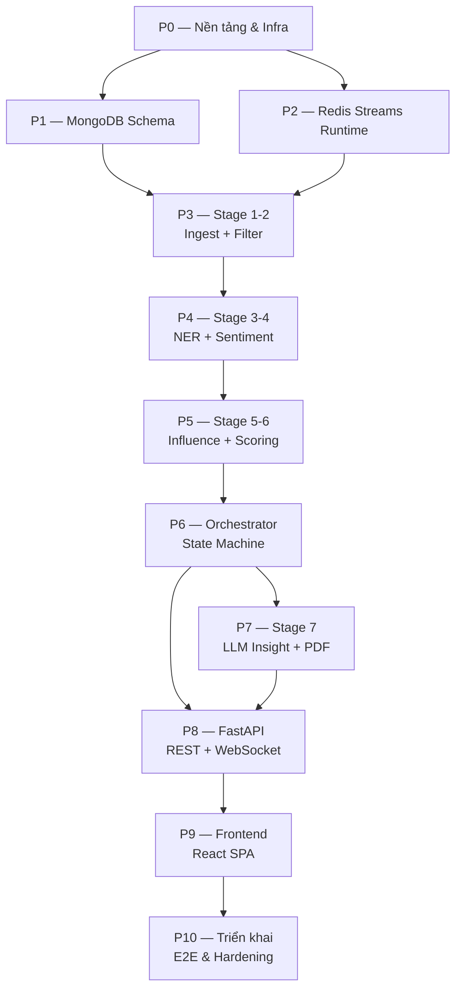

# Kế hoạch phát triển theo phase — Crypto Social Intelligence Pipeline

> Tài liệu phân chia build hệ thống theo **cột mốc năng lực (capability milestones)**, không ràng buộc tuần cứng.  
> Kiến trúc mục tiêu: [`docs/kien-truc-he-thong.md`](../kien-truc-he-thong.md) · Thiết kế DB/API: [`docs/khung-bao-cao.md`](../khung-bao-cao.md) §3.3  
> Code production build vào `src/` + `web/` (tái sử dụng prototype từ `playground/`).

---

## Mục lục

| Phase | File | Tiêu đề | Phụ thuộc vào |
|-------|------|---------|---------------|
| P0 | [phase-00-nen-tang-infra.md](phase-00-nen-tang-infra.md) | Nền tảng monorepo & Infra | — |
| P1 | [phase-01-tang-du-lieu-mongodb.md](phase-01-tang-du-lieu-mongodb.md) | Tầng dữ liệu MongoDB | P0 |
| P2 | [phase-02-runtime-redis-streams.md](phase-02-runtime-redis-streams.md) | Khung runtime Redis Streams | P0 |
| P3 | [phase-03-ingest-filter.md](phase-03-ingest-filter.md) | Stage 1-2: Ingest + Filter | P1, P2 |
| P4 | [phase-04-ner-sentiment.md](phase-04-ner-sentiment.md) | Stage 3-4: NER + Sentiment | P3 |
| P5 | [phase-05-influence-scoring.md](phase-05-influence-scoring.md) | Stage 5-6: Influence + Scoring | P4 |
| P6 | [phase-06-orchestrator.md](phase-06-orchestrator.md) | Orchestrator & session state machine | P5 |
| P7 | [phase-07-insight-pdf.md](phase-07-insight-pdf.md) | Stage 7: LLM Insight + PDF | P6 |
| P8 | [phase-08-api-websocket.md](phase-08-api-websocket.md) | FastAPI REST + WebSocket | P6, P7 |
| P9 | [phase-09-frontend-spa.md](phase-09-frontend-spa.md) | Frontend React SPA | P8 |
| P10 | [phase-10-trien-khai-e2e.md](phase-10-trien-khai-e2e.md) | Triển khai, E2E & hardening | P9 |

---

## Nguyên tắc chung

1. **Capability milestone:** Mỗi phase kết thúc khi có kết quả demo được — test xanh + một lệnh chạy minh chứng; không đánh giá theo số tuần.
2. **4 phần mỗi phase:** Mục tiêu — Công việc & tái sử dụng — Kiểm thử — Kết quả cần đạt (DoD).
3. **Idempotent + fail-fast:** Theo nguyên tắc thiết kế §3.3.1 — `event_id` UUID + unique index; thiếu input → dừng có log.
4. **Tái sử dụng playground:** Logic nghiệp vụ Stage 1–6 đã có prototype tại `playground/`; port vào `src/pipeline/` với harness Redis Streams thay vì gọi MongoDB trực tiếp.
5. **Event-driven:** Mọi stage giao tiếp qua Redis Streams (`stage:{name}:in`); persist MongoDB sau xử lý; không stage nào poll Mongo để lấy input.
6. **Single-tenant:** Không auth user; `session_id` là scope duy nhất.

---

## Sơ đồ phụ thuộc phase



---

## Bảng truy vết yêu cầu chức năng (FR) ↔ Phase

| FR | Tên yêu cầu | Phase chính | Phase liên quan |
|----|-------------|-------------|-----------------|
| FR-01 | Thu thập đa nguồn social (Twitter, AV, Yahoo, Reddit) | P3 | P0 (config API keys) |
| FR-02 | Lọc spam cascade L1/L2/L3 | P3 | P1 (dropped_events index) |
| FR-03 | NER map coin Top 10 + fan-out | P4 | P2 (fan-out stream entries) |
| FR-04 | Sentiment FinBERT per coin-event | P4 | P1 (sentiment_events index) |
| FR-05 | Influence log-log weight + aggregate | P5 | P1 (influence_aggregates index) |
| FR-06 | Scoring Galaxy Alpha/Safety dual-score | P5 | P5 (rule BUY/HOLD) |
| FR-07 | OHLCV Binance CCXT | P5 | P5 (persist market_ohlcv L-02) |
| FR-08 | LLM Insight Stage 7 stream report | P7 | P6 (session state) |
| FR-09 | PDF export báo cáo session | P7 | P8 (REST endpoint) |
| FR-10 | Orchestrator E2E một lệnh Stage 1→7 | P6 | P7, P8 |
| FR-11 | Dashboard TradingView chart + ticker | P9 | P8 (market API) |
| FR-12 | Chat phân tích GPT-like WS-driven | P9 | P8 (WS analysis) |
| FR-13 | Lưu session + mở lại từ sidebar | P9 | P1 (chat_messages), P8 |
| FR-14 | PDF download từ chat | P9 | P7 (PDF service) |
| FR-15 | ETL Monitor `/etl` + pipeline WS | P9 | P8 (WS pipeline), P6 (jobs) |

---

## Cấu trúc thư mục sản phẩm (tham chiếu §3.3.4)

```text
src/
├── common/           # config, redis_client, mongo_client, schema/ bootstrap
├── orchestrator/     # session.py, planning.py, monitor.py
├── api/
│   ├── routes/       # market.py, analysis.py, pipeline.py
│   └── ws/           # analysis.py, pipeline.py
└── pipeline/
    ├── _runtime/     # worker.py, emit.py (harness chung)
    ├── ingest/       # ← playground/ingest/
    ├── filter/       # ← playground/filter/
    ├── ner/          # ← playground/ner/
    ├── sentiment/    # ← playground/sentiment/
    ├── influence/    # ← playground/influence/
    ├── scoring/      # ← playground/scoring/
    └── insight/      # Stage 7 (mới)
web/                  # React 19 SPA (Vite + Mantine + TailwindCSS)
config/               # settings.yaml, coin_registry.json, prompts/
models/spam/          # spam_model.bin FastText
tests/
docker-compose.yml
```

---

*Xem chi tiết từng phase trong các file tương ứng. Mọi quyết định kiến trúc tham chiếu [`docs/kien-truc-he-thong.md`](../kien-truc-he-thong.md).*
