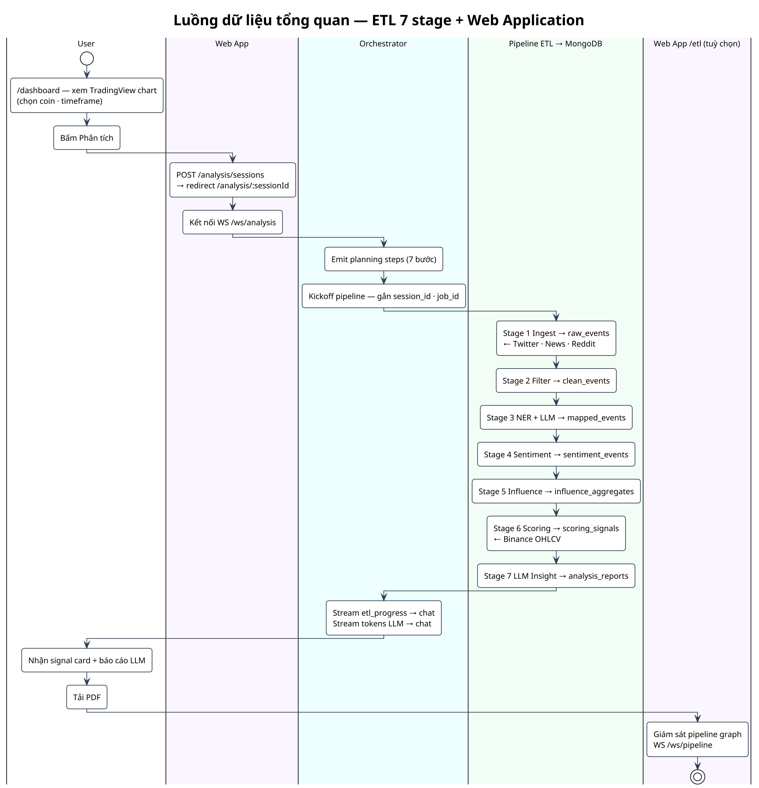
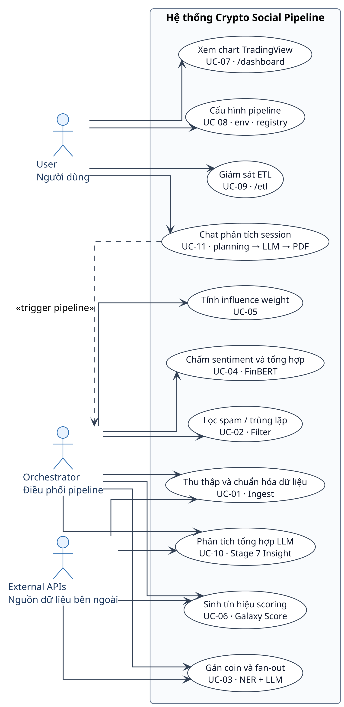
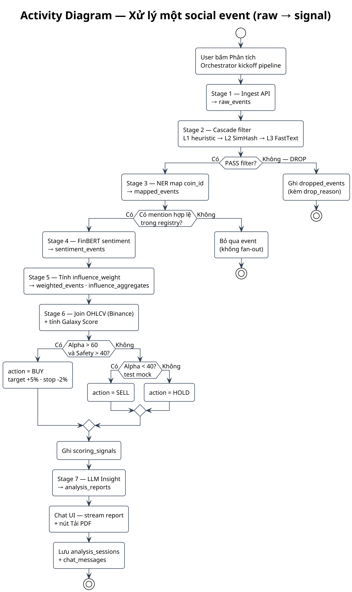
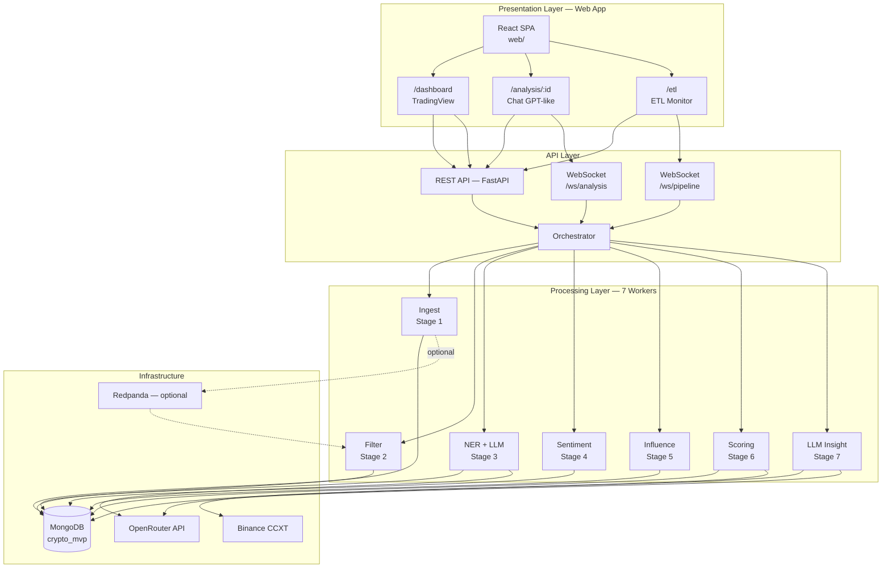
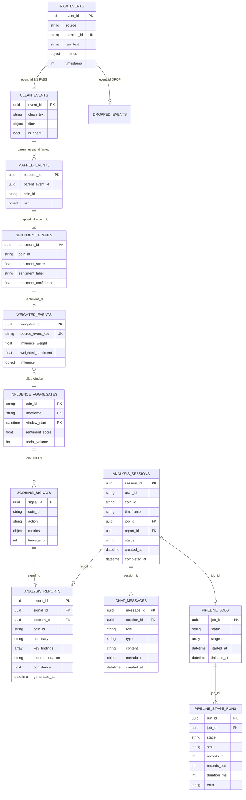
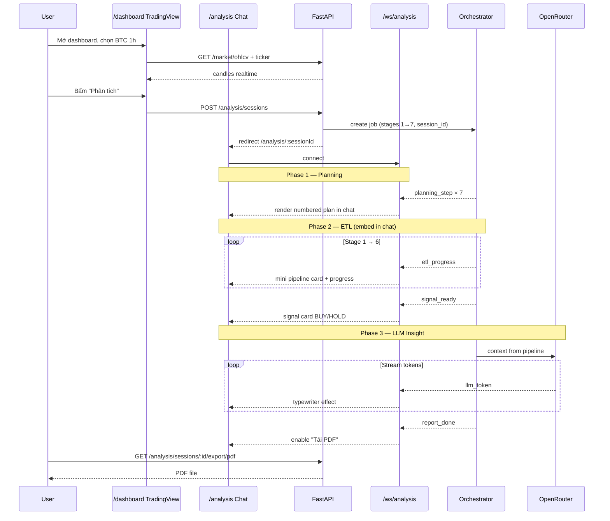
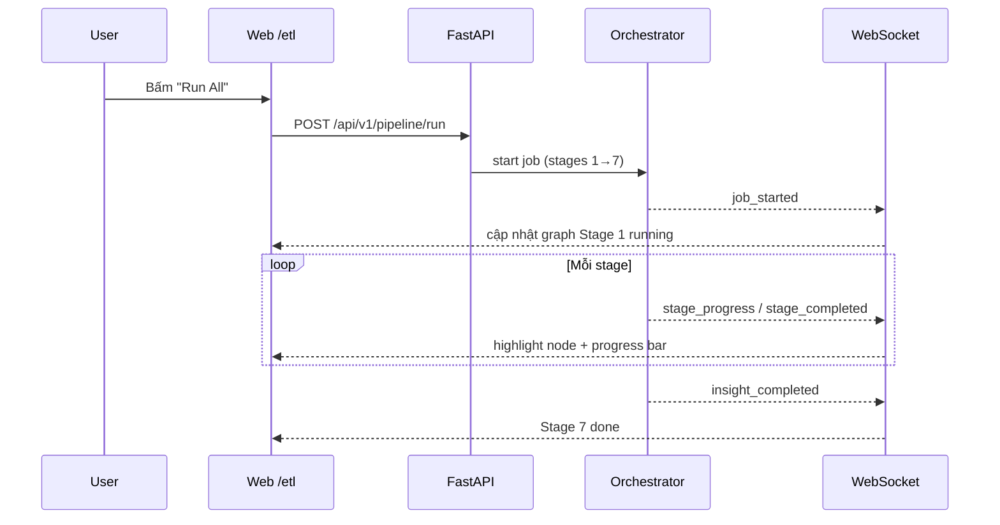

# BÁO CÁO ĐỒ ÁN / BÀI TẬP LỚN

**Tên đề tài:** [Tên đề tài — ví dụ: Hệ thống dự đoán biến động giá Crypto dựa trên phân tích sentiment mạng xã hội]

**Sinh viên thực hiện:** [Họ và tên] — [MSSV]

**Lớp / Nhóm:** [Mã lớp hoặc tên nhóm]

**Giảng viên hướng dẫn:** [Họ và tên GVHD]

**Khoa / Bộ môn:** [Tên khoa]

**Thời gian thực hiện:** [Tháng/Năm bắt đầu] — [Tháng/Năm kết thúc]

---

## Mục lục

1. [Phần Mở Đầu](#1-phần-mở-đầu)
2. [Cơ sở lý thuyết](#2-cơ-sở-lý-thuyết)
3. [Phân tích và Thiết kế hệ thống](#3-phân-tích-và-thiết-kế-hệ-thống)
4. [Xây dựng, Triển khai và Thử nghiệm](#4-xây-dựng-triển-khai-và-thử-nghiệm)
5. [Kết luận và Hướng phát triển](#5-kết-luận-và-hướng-phát-triển)
6. [Tài liệu tham khảo & Phụ lục](#6-tài-liệu-tham-khảo--phụ-lục)

---

## 1. Phần Mở Đầu

> Trình bày tổng quan lý do chọn đề tài và vạch ra hướng đi của đồ án.

### 1.1. Lý do chọn đề tài

[Mô tả vấn đề thực tế hoặc thách thức công nghệ cần giải quyết. Trả lời các câu hỏi:]

- Bối cảnh thực tế là gì? (ví dụ: thị trường crypto biến động mạnh, dữ liệu social tăng theo cấp số nhân, khó lọc nhiễu/bot…)
- Ai đang gặp khó khăn vì vấn đề này?
- Giải pháp hiện có còn thiếu sót gì?
- Vì sao đề tài này phù hợp với chuyên ngành và năng lực của nhóm?

### 1.2. Mục tiêu đề tài

[Mục tiêu cuối cùng — sản phẩm hoặc giải pháp đạt được. Nên tách rõ mục tiêu tổng quát và mục tiêu cụ thể.]

**Mục tiêu tổng quát**

- [Ví dụ: Xây dựng hệ thống thu thập, xử lý và phân tích dữ liệu social để hỗ trợ dự đoán xu hướng giá crypto ngắn hạn.]

**Mục tiêu cụ thể**

| STT | Mục tiêu cụ thể | Tiêu chí đánh giá hoàn thành |
| --- | --- | --- |
| 1 | [Ví dụ: Thu thập dữ liệu từ nguồn X/Twitter] | [Ví dụ: ≥ N events/giờ, schema thống nhất] |
| 2 | [Ví dụ: Lọc spam và map coin bằng NER] | [Ví dụ: Precision ≥ X% trên tập test] |
| 3 | [Ví dụ: Phân tích sentiment và tính điểm tín hiệu] | [Ví dụ: Pipeline chạy end-to-end trên Top 10 coin] |
| 4 | [Ví dụ: Hiển thị kết quả qua API/Dashboard] | [Ví dụ: API phản hồi < 500ms, có biểu đồ lịch sử] |

### 1.3. Phạm vi đề tài

[Giới hạn rõ ràng về chức năng, dữ liệu, đối tượng phục vụ và những gì **không** nằm trong phạm vi.]

**Trong phạm vi**

- [Ví dụ: Top 10 coin (BTC, ETH, SOL, …)]
- [Ví dụ: Khung thời gian 15 phút và 1 giờ]
- [Ví dụ: Nguồn dữ liệu social: Twitter/X]
- [Triển khai standalone trên single-node Ubuntu + Docker Compose]

**Ngoài phạm vi**

- [Ví dụ: Giao dịch tự động (auto-trading) trên sàn]
- [Ví dụ: Hỗ trợ đa ngôn ngữ ngoài tiếng Anh]
- [Ví dụ: Scale production multi-region / Kubernetes]

### 1.4. Phương pháp nghiên cứu

[Các công nghệ, mô hình hoặc phương pháp tiếp cận được sử dụng.]

| Hạng mục | Phương pháp / Công cụ | Mục đích sử dụng |
| --- | --- | --- |
| Thu thập dữ liệu | [Ví dụ: X API, CCXT, Playwright] | [Ingest raw events + OHLCV] |
| Xử lý luồng | [Ví dụ: Event-Driven, Kafka/Redpanda] | [Pipeline bất đồng bộ giữa các worker] |
| NLP / AI | [Ví dụ: FinBERT, CryptoBERT, FastText] | [Sentiment, spam filter, NER] |
| Lưu trữ | [Ví dụ: MongoDB, TimescaleDB, Redis] | [Event store, time-series, cache] |
| Triển khai | Docker, Python, FastAPI, React 19, Mantine, Tailwind | Container hóa; REST + WebSocket; Web Dashboard |
| Kiểm thử | [Ví dụ: Unit test, integration test, benchmark] | [Xác minh chức năng và hiệu năng] |

**Quy trình thực hiện**

1. Khảo sát yêu cầu và nghiên cứu tài liệu tham khảo
2. Phân tích — thiết kế kiến trúc và cơ sở dữ liệu
3. Hiện thực từng module theo pipeline
4. Tích hợp, triển khai và kiểm thử
5. Đánh giá kết quả và rút kinh nghiệm

---

## 2. Cơ sở lý thuyết

> Nền tảng kiến thức và công nghệ dùng để thực hiện đề tài.  
> **Khung trình bày chuẩn:** [`docs/pipeline-theory-form.md`](pipeline-theory-form.md) · **Nội dung chi tiết theo stage:** [`docs/theory/`](theory/)

Mỗi công nghệ / stage pipeline viết theo **cùng một cấu trúc 5 mục**:

| Mục | Nội dung |
| --- | --- |
| **2.x.1** | Tổng quan — *Khái niệm* · *Vai trò* |
| **2.x.2** | Kiến trúc và các thành phần cốt lõi |
| **2.x.3** | Cơ chế hoạt động và vai trò trong Pipeline — nguyên lý · vị trí · tích hợp |
| **2.x.4** | Ưu điểm và Hạn chế |
| **2.x.5** | Lý do lựa chọn |

**Lưu ý:** Chỉ giữ lý thuyết phục vụ trực tiếp câu hỏi nghiên cứu; trích dẫn nguồn theo quy định trường (APA/Harvard).

---

### 2.1. Data Ingestion — Thu thập dữ liệu thô

> Nội dung đầy đủ (thành phần độc lập, không gắn sản phẩm cụ thể): [`docs/theory/ingest.md`](theory/ingest.md)

#### 2.1.1. Tổng quan về Data Ingestion

**Khái niệm:** [Giai đoạn đưa dữ liệu API/scrape vào hệ thống dưới dạng raw event có schema thống nhất, bất biến sau khi ghi.]

**Vai trò:** [Giải quyết bài toán đa nguồn — một schema; bảo toàn nội dung và metadata tương tác cho các bước phân tích phía sau.]

#### 2.1.2. Kiến trúc và các thành phần cốt lõi

[Collector · Adapter · Validator · Dedup layer · Persistence · Orchestrator — xem `theory/ingest.md`.]

#### 2.1.3. Cơ chế hoạt động và vai trò trong Pipeline

**Nguyên lý hoạt động:** [Thu thập → chuẩn hóa → kiểm tra → chống trùng → lưu trữ.]

**Vị trí trong Pipeline:** [Đầu nhánh dữ liệu social/news; dữ liệu thị trường thường thu song song.]

**Khả năng tích hợp:** [Document database (MVP) hoặc message broker (stream); consumer làm sạch/phân tích đọc contract raw event.]

#### 2.1.4. Ưu điểm và Hạn chế

**Ưu điểm:** [Schema thống nhất, replay, ghi idempotent, mở rộng nguồn.]

**Hạn chế:** [Batch vs stream, metrics không đồng đều giữa nguồn, phụ thuộc API bên thứ ba.]

#### 2.1.5. Lý do lựa chọn

[Adapter + raw event bất biến; so sánh với gọi API trực tiếp từng module và ETL một lần.]

---

### 2.2. Spam / Noise Filtering — Lọc spam và nhiễu

> Nội dung đầy đủ: [`docs/theory/spam-filter.md`](theory/spam-filter.md)

#### 2.2.1. Tổng quan về Spam / Noise Filtering

**Khái niệm:** [Giai đoạn phân loại raw event — PASS (clean) hoặc DROP (spam/nhiễu) trước NLP.]

**Vai trò:** [Giải quyết signal-to-noise; giữ organic buzz, loại bot hype — tránh bias sentiment.]

#### 2.2.2. Kiến trúc và các thành phần cốt lõi

[Cascade L1 heuristic → L2 SimHash → L3 FastText; orchestrator; output mapper — xem `theory/spam-filter.md`.]

#### 2.2.3. Cơ chế hoạt động và vai trò trong Pipeline

**Nguyên lý hoạt động:** [L1 → L2 → L3 tuần tự; DROP sớm; ngưỡng ML P(spam).]

**Vị trí trong Pipeline:** [Sau Data Ingestion, trước NER / Sentiment.]

**Khả năng tích hợp:** [Đọc raw event; ghi clean event / dropped log; model FastText artifact.]

#### 2.2.4. Ưu điểm và Hạn chế

**Ưu điểm:** [Cascade tiết kiệm CPU, giảm bias, phát hiện duplicate, audit được.]

**Hạn chế:** [False pos/neg, domain shift, news vs social — xem bảng trong tài liệu.]

#### 2.2.5. Lý do lựa chọn

[Cascade FastText + SimHash; không dùng BERT cho hot path spam; so sánh lọc sau sentiment.]

---

### 2.3. NER và Coin Mapping — Nhận diện thực thể và gán mã coin

> Nội dung đầy đủ: [`docs/theory/ner-mapping.md`](theory/ner-mapping.md)

#### 2.3.1. Tổng quan về NER / Coin Mapping

**Khái niệm:** [Nhận diện mention crypto trong text, gán `coin_id` từ registry; fan-out 1 post → N mapped event.]

**Vai trò:** [Multi-entity attribution — sentiment và scoring tính per-coin.]

#### 2.3.2. Kiến trúc và các thành phần cốt lõi

[Coin registry · Rule extractor · LLM resolver · Fan-out mapper — xem `theory/ner-mapping.md`.]

#### 2.3.3. Cơ chế hoạt động và vai trò trong Pipeline

**Nguyên lý hoạt động:** [Rules → (hybrid/validator/full LLM) → fan-out theo coin_id.]

**Vị trí trong Pipeline:** [Sau Spam Filter, trước Sentiment.]

**Khả năng tích hợp:** [Clean events in; mapped events out; LLM API tuỳ chọn.]

#### 2.3.4. Ưu điểm và Hạn chế

**Ưu điểm:** [Fan-out đúng mô hình, hybrid tiết kiệm cost, registry kiểm soát vocabulary.]

**Hạn chế:** [Ambiguity, phụ thuộc LLM, registry stale — xem bảng trong tài liệu.]

#### 2.3.5. Lý do lựa chọn

[Registry + rules + hybrid LLM; so với keyword-only và NER general-purpose.]

---

### 2.4. – 2.6. [Stage 4 Sentiment · Stage 5 Influence · Stage 6 Scoring]

[Lặp cùng cấu trúc 5 mục cho từng stage. Gợi ý module: `ner`, `sentiment`, `influence`, `scoring`.]

---

### 2.7. Tổng hợp công nghệ stack

| Công nghệ | Phiên bản | Stage | Vai trò trong đề tài |
| --- | --- | --- | --- |
| Python | [x.x] | Toàn pipeline | Data workers, ML inference |
| MongoDB | [7.x] | 1–6 | Event store — persistence xuyên pipeline |
| Redpanda / Kafka | [x.x] | (tuỳ chọn) | Luân chuyển event khi scale-out |
| FastText | [x.x] | 2 | Spam classifier L3 |
| FinBERT / CryptoBERT | — | 4 | Sentiment inference |
| Redis | [x.x] | 5, 6 | Cache authority, feature realtime |
| Docker | [x.x] | Infra | Container hóa dịch vụ |

---

## 3. Phân tích và Thiết kế hệ thống

> Giai đoạn biến yêu cầu (mục 1) và cơ sở lý thuyết (mục 2) thành bản vẽ kỹ thuật cho **một sản phẩm phần mềm hoàn chỉnh, chạy độc lập** — không phải tập script thử nghiệm rời rạc.  
> **Tham chiếu:** [`docs/pipeline-overview.md`](pipeline-overview.md) · [`docs/lunacrush-data-flow.md`](lunacrush-data-flow.md)

Hệ thống **Crypto Social Intelligence Pipeline** là **ứng dụng web full-stack** với luồng người dùng chính: **Dashboard TradingView** (chart nến + giá realtime) → nút **Phân tích** → **giao diện chat kiểu ChatGPT** (planning từng bước → chạy ETL → LLM đọc kết quả → báo cáo + tải PDF). Mỗi phiên phân tích được **lưu dưới dạng chat session**. Backend: Orchestrator (ETL 7 stage), FastAPI + WebSocket, MongoDB, OpenRouter LLM, Binance/CCXT.

---

### 3.1. Khảo sát yêu cầu

#### 3.1.1. Yêu cầu chức năng (Functional Requirements)

| ID | Yêu cầu | Mô tả | Độ ưu tiên |
| --- | --- | --- | --- |
| FR-01 | Thu thập dữ liệu social đa nguồn | Ingest tweet (RapidAPI), tin tức (Alpha Vantage, Yahoo Finance), Reddit; chuẩn hóa schema `raw_events` với `event_id`, `raw_text`, `metrics`, `timestamp` | Cao |
| FR-02 | Lọc spam và nhiễu | Cascade L1 heuristic → L2 SimHash → L3 FastText; output `clean_events` hoặc ghi `dropped_events` để audit | Cao |
| FR-03 | Nhận diện và map coin | Gán `coin_id` từ registry Top 10 (BTC, ETH, SOL, …); fan-out 1 post → N bản ghi `mapped_events`; hỗ trợ hybrid/validator/full LLM | Cao |
| FR-04 | Phân tích sentiment | Gán `sentiment_score` ∈ [-1, 1], `sentiment_label`, `sentiment_confidence` cho từng mapped event; model FinBERT (fallback rule-based) | Cao |
| FR-05 | Trọng số ảnh hưởng | Tính `influence_weight` và `weighted_sentiment = sentiment × influence`; aggregate theo `(coin_id, timeframe)` | Cao |
| FR-06 | Tổng hợp và sinh tín hiệu | Join social aggregate với OHLCV; tính Galaxy Score / dual-score; output BUY/SELL/HOLD vào `scoring_signals` | Cao |
| FR-07 | Thu thập dữ liệu thị trường | Lấy nến OHLCV (Binance qua CCXT) theo coin và timeframe (15m, 1h) | Trung bình |
| FR-08 | Phân tích tổng hợp bằng LLM (Stage 7) | Sau scoring, LLM đọc signal + sentiment + influence + giá → báo cáo narrative có cấu trúc (`analysis_reports`) | Cao |
| FR-09 | REST API truy vấn kết quả | FastAPI: tín hiệu, lịch sử sentiment/score, báo cáo LLM theo coin | Cao |
| FR-10 | Orchestrator pipeline E2E | Một lệnh/API chạy tuần tự Stage 1→7; cấu hình tập trung `.env` | Cao |
| FR-11 | Dashboard TradingView | Trang `/dashboard`: chart nến TradingView, chọn coin/timeframe, giá & volume realtime | Cao |
| FR-12 | Chat phân tích (ChatGPT-like) | Nút **Phân tích** → `/analysis/:sessionId`: planning từng bước, stream ETL progress, LLM trả lời trong chat | Cao |
| FR-13 | Lưu session chat | Mỗi lần phân tích = một `analysis_session` + chuỗi `chat_messages`; sidebar lịch sử session | Cao |
| FR-14 | Xuất PDF báo cáo | Tải PDF từ message cuối session (signal + ETL summary + LLM report) | Cao |
| FR-15 | Web Dashboard — ETL | Trang `/etl`: giám sát job/stage; xem chi tiết pipeline (bổ sung cho progress trong chat) | Trung bình |
| FR-16 | Xuất báo cáo filter | Export Excel PASS/DROP (CLI / dev) | Thấp |
| FR-17 | Kiểm thử kịch bản scoring | Mock scenarios scoring | Thấp |

**Phạm vi coin:** BTC, ETH, SOL, BNB, XRP, ADA, DOGE, AVAX, DOT, LINK (`config/coin_registry.json`).

**Phạm vi timeframe:** 15m, 30m, 1h, 4h, 1d (aggregate); scoring mặc định **1h**.

#### 3.1.2. Yêu cầu phi chức năng (Non-functional Requirements)

| ID | Loại | Yêu cầu | Giá trị mục tiêu |
| --- | --- | --- | --- |
| NFR-01 | Hiệu năng | Throughput filter (L1+L2+L3) | ≥ 500 events/phút trên CPU (batch) |
| NFR-02 | Độ trễ | Inference sentiment (FinBERT, CPU) | ≤ 2 giây/event; batch 100 event/buổi chạy |
| NFR-03 | Idempotent | Chạy lại stage không tạo duplicate | Unique index trên `event_id`, `(mapped_id, coin_id)`, `signal_id` |
| NFR-04 | Khả mở rộng | Thêm nguồn ingest mới | Plugin collector trong `src/pipeline/ingest/collectors/` |
| NFR-05 | Bảo mật | Bảo vệ API key | Secret trong `.env` (gitignored); không commit credentials |
| NFR-06 | Khả bảo trì | Monorepo full-stack | Backend `src/` + Frontend `web/`; một `pyproject.toml` + `web/package.json` |
| NFR-07 | Khả truy vết | Audit pipeline | Metadata stage; collection `pipeline_jobs` / `pipeline_stage_runs`; log job_id |
| NFR-08 | Triển khai độc lập | Chạy E2E một máy | `docker compose up` → Web + API + MongoDB + pipeline |
| NFR-09 | Tính nhất quán | Data contract giữa stage | JSON document + MongoDB collections; join scoring theo `timestamp` + `coin_id` |
| NFR-10 | Trải nghiệm web | Chat stream mượt | Token LLM stream ≤ 100ms/batch; ETL progress qua WS ≤ 2s |
| NFR-11 | LLM Insight | Độ trễ phiên phân tích | Pipeline 1→7 ≤ 5 phút/batch; LLM report ≤ 30s (streaming) |
| NFR-12 | TradingView | Chart load | Widget TradingView Lightweight Charts render ≤ 1s; data feed qua Binance/CCXT |
| NFR-13 | Session chat | Lưu trữ | Mỗi session ≤ 200 messages; PDF ≤ 5 MB |

#### 3.1.3. Đối tượng sử dụng (Actors)

| Actor | Mô tả | Quyền hạn / tương tác chính |
| --- | --- | --- |
| **User** | Người dùng hệ thống (single-tenant) | `/dashboard` TradingView → **Phân tích** → chat session; `/etl` giám sát pipeline; xem lại session; tải PDF; cấu hình `.env` khi triển khai |
| **External — Social API** | Twitter154 (RapidAPI), Alpha Vantage, Yahoo, Reddit OAuth | Cung cấp raw post/news |
| **External — Market API** | Binance (CCXT) + **TradingView widget** | OHLCV realtime cho chart nến và scoring |
| **External — LLM API** | OpenRouter | Stage 3 NER (hybrid) + **Stage 7 Insight** (phân tích tổng hợp) |
| **Hệ thống — Orchestrator** | Process điều phối pipeline | Tự động chạy Stage 1→7 khi User bấm Phân tích; emit event realtime |
| **Hệ thống lưu trữ** | MongoDB Atlas + Redis | Event store, session chat, streams transport |

---

### 3.2. Phân tích hệ thống

#### 3.2.1. Sơ đồ nghiệp vụ / Luồng dữ liệu tổng quan

**Luồng chính (nhánh social — ETL 7 stage + Web):**



*Nguồn PlantUML (Activity Diagram):* [`diagrams/khung-bao-cao/01-luong-du-lieu-tong-quan.puml`](diagrams/khung-bao-cao/01-luong-du-lieu-tong-quan.puml) — tái tạo PNG: `./diagrams/khung-bao-cao/render.sh`

**Mô tả từng bước**

| Stage | Input | Xử lý | Output MongoDB |
| --- | --- | --- | --- |
| 1 — Ingest | API response | Adapter → raw event contract; dedup `(source, external_id)` | `raw_events` |
| 2 — Filter | `raw_events` | L1 heuristic → L2 SimHash → L3 FastText | `clean_events`, (opt.) `dropped_events` |
| 3 — NER | `clean_events` | Rules + LLM → fan-out theo `coin_id` | `mapped_events` |
| 4 — Sentiment | `mapped_events` | FinBERT inference; optional aggregate | `sentiment_events`, `sentiment_aggregates`* |
| 5 — Influence | `sentiment_events` | InfluenceWeight × TimeDecay × Engagement; aggregate window | `weighted_events`, `influence_aggregates` |
| 6 — Scoring | `influence_aggregates` + OHLCV | Join Polars; dual-score; rule BUY/HOLD/SELL | `scoring_signals` |
| 7 — LLM Insight | `scoring_signals` + aggregates + sample events | OpenRouter tổng hợp: tóm tắt, rủi ro, divergence, khuyến nghị | `analysis_reports` |

\*Stage 4 có thể aggregate nội bộ (`sentiment_aggregates`); **thiết kế chuẩn** để Stage 6 đọc output Stage 5 (`influence_aggregates`). Stage 7 đọc output Stage 6 + context Stage 4–5.

**Mô hình triển khai sản phẩm (standalone web app)**

| Thành phần | Vai trò | Ghi chú |
| --- | --- | --- |
| **Web Frontend** (`web/`) | React 19 · Mantine v9 · Tailwind v4 · React Query · Jotai · Zod | `/dashboard` · `/analysis/:id` · `/etl` |
| **Orchestrator** | Điều phối Stage 1→7; gắn `session_id` + `job_id` | Trigger từ chat **Phân tích** hoặc `/etl` |
| **Pipeline workers** (`src/pipeline/*`) | ETL social, NLP, scoring, **LLM insight** | Stage 7 worker gọi OpenRouter với context JSON |
| **REST API + WebSocket** (`src/api/`) | FastAPI + Uvicorn | REST cho dashboard; WS `/ws/pipeline` cho ETL realtime |
| **MongoDB** | Event store, jobs, reports | Database `crypto_mvp`; cấu hình qua `.env` |
| **Market data** | Binance CCXT | Gọi trực tiếp lúc scoring (Stage 6) |
| **Message broker** (tuỳ chọn) | Redpanda/Kafka | Phase scale-out; không bắt buộc cho bản standalone |

#### 3.2.2. Use Case Diagram



*Nguồn PlantUML (Use Case Diagram):* [`diagrams/khung-bao-cao/02-use-case-diagram.puml`](diagrams/khung-bao-cao/02-use-case-diagram.puml) — tái tạo PNG: `./diagrams/khung-bao-cao/render.sh`

---

#### 3.2.2.1. Đặc tả chi tiết Use Case

> Mỗi use case trình bày **một bảng** gồm hai cột: *Trường thông tin* · *Nội dung chi tiết* (theo mẫu đặc tả UC chuẩn).

##### UC-01 — Thu thập dữ liệu social (Raw Collection)

| Trường thông tin | Nội dung chi tiết |
| --- | --- |
| **Use case name** | Thu thập dữ liệu social thô (Raw Collection) |
| **Actor(s)** | Orchestrator; External APIs (Twitter/RapidAPI, Alpha Vantage, Yahoo Finance, Reddit) |
| **Trigger** | User bấm **Phân tích** (UC-11) hoặc **Run All** trên `/etl` → Orchestrator kick-off ingest |
| **Pre-condition(s)** | 1. `.env` đã cấu hình `MONGODB_URI` và API key.<br>2. Hệ thống kết nối được MongoDB Atlas.<br>3. Nguồn được chọn có credential hợp lệ (Yahoo không cần key). |
| **Post-condition(s)** | 1. Event mới được lưu vào `raw_events` theo contract Stage 1.<br>2. Mỗi bản ghi có `event_id`, `source`, `raw_text`, `metrics`, `timestamp`, `ingested_at`.<br>3. Event trùng `(source, external_id)` không ghi lại.<br>4. Progress hiển thị trong chat (UC-11) hoặc `/etl`. |
| **Basic Flow** | 1. Orchestrator nhận kickoff từ session hoặc `/etl`.<br>2. Ingest worker đọc cấu hình nguồn (`twitter`, `news-av`, `news-yahoo`, `reddit`, hoặc `all`).<br>3. Hệ thống load biến môi trường và khởi tạo MongoDB client.<br>4. Hệ thống gọi collector tương ứng (Twitter154, Alpha Vantage, yfinance, Reddit OAuth).<br>5. Adapter chuẩn hóa từng item API → document raw event.<br>6. Hệ thống kiểm tra dedup qua index `(source, external_id)`.<br>7. Hệ thống ghi event mới vào `raw_events` và emit `etl_progress`.<br>8. User xem thống kê insert/skip trong chat hoặc ETL Monitor. |
| **Alternative Flow** | **4a.** Dry-run (toggle trên `/etl` hoặc CLI)<br>4a1. Hệ thống chỉ fetch và log mẫu, không ghi MongoDB<br>4a2. Use case kết thúc.<br><br>**4b.** Reddit bị chặn, collector trả rỗng<br>4b1. Orchestrator fallback sang nguồn khác (`twitter`, `news-av`)<br>4b2. Use case tiếp tục bước 2 với nguồn mới. |
| **Exception Flow** | **4c.** API lỗi mạng hoặc rate limit → Hệ thống log cảnh báo, bỏ qua batch hoặc retry; không ghi dữ liệu lỗi.<br><br>**4d.** Thiếu API key bắt buộc → Hệ thống dừng, báo biến môi trường cần điền; không ghi DB.<br><br>**5e.** News Yahoo không có title/summary → Adapter bỏ qua item, tiếp tục item kế tiếp. |
| **Business Rules** | **BR1.** Mỗi event phải có `event_id` (UUID) duy nhất trong hệ thống.<br>**BR2.** Dedup theo cặp `(source, external_id)` — không ghi trùng nguồn gốc.<br>**BR3.** Timestamp lưu dạng Unix epoch (giây, UTC). |

---

##### UC-02 — Lọc spam và nhiễu (Spam Filter)

| Trường thông tin | Nội dung chi tiết |
| --- | --- |
| **Use case name** | Lọc spam và nhiễu (Spam / Noise Filtering) |
| **Actor(s)** | Orchestrator |
| **Trigger** | Orchestrator gọi stage filter sau ingest (Redis stream `stage:filter:in`) |
| **Pre-condition(s)** | 1. `raw_events` có event chưa có trong `clean_events`.<br>2. `MONGODB_URI` đã cấu hình.<br>3. (Tuỳ chọn L3) Model FastText tại `models/spam/spam_model.bin`. |
| **Post-condition(s)** | 1. Event PASS ghi vào `clean_events` kèm `clean_text` và metadata `filter`.<br>2. Event DROP có thể ghi `dropped_events` nếu bật `--save-dropped`.<br>3. Mỗi `event_id` tối đa một bản ghi trong `clean_events`.<br>4. User thấy thống kê PASS/DROP qua chat hoặc `/etl`. |
| **Basic Flow** | 1. Orchestrator khởi chạy filter worker.<br>2. Hệ thống truy vấn `raw_events` chưa xử lý (theo `--limit`, `--source`).<br>3. Cascade tuần tự từng event: **L1** heuristic → **L2** SimHash → **L3** FastText.<br>4. Event PASS được map sang schema `clean_events`.<br>5. Hệ thống ghi batch MongoDB và emit `etl_progress`.<br>6. User xem tỷ lệ PASS/DROP trong chat hoặc ETL Monitor. |
| **Alternative Flow** | **3a.** Cấu hình `--no-ml` (dev/CLI)<br>3a1. Bỏ qua L3 FastText, chỉ chạy L1 + L2<br>3a2. Use case tiếp tục bước 4.<br><br>**3b.** `source: news` mặc định bypass L1/L3 nặng<br>3b1. Chỉ kiểm tra text rỗng (trừ khi `--filter-news`)<br>3b2. Use case tiếp tục bước 4.<br><br>**6a.** Dry-run<br>6a1. In stats, không ghi `clean_events` / `dropped_events`<br>6a2. Use case kết thúc. |
| **Exception Flow** | **3c.** L1: text rỗng hoặc regex pump → DROP ngay, ghi `drop_reason`, không chạy L2/L3.<br><br>**3d.** L2: Hamming distance ≤ 3 → DROP duplicate.<br><br>**3e.** L3: `P(spam) ≥ 0.5` → DROP, ghi metadata FastText.<br><br>**3f.** Chưa có model FastText → L3 skipped; cảnh báo CLI, chỉ L1+L2. |
| **Business Rules** | **BR1.** Ngưỡng L3 mặc định: DROP nếu `P(spam) ≥ 0.5`.<br>**BR2.** SimHash: coi trùng nếu Hamming distance ≤ 3.<br>**BR3.** News mặc định tin cậy hơn social — bypass filter nặng trừ khi cấu hình `--filter-news`. |

---

##### UC-03 — Nhận diện và gán coin (NER / Coin Mapping)

| Trường thông tin | Nội dung chi tiết |
| --- | --- |
| **Use case name** | Nhận diện thực thể và gán coin (NER / Coin Mapping) |
| **Actor(s)** | Orchestrator; External APIs (OpenRouter LLM) |
| **Trigger** | Orchestrator gọi stage NER: `python -m pipeline run --stage ner --mode hybrid` |
| **Pre-condition(s)** | 1. `clean_events` có event chưa có trong `mapped_events`.<br>2. File `config/coin_registry.json` tồn tại (Top 10 coin).<br>3. Mode cần LLM: `OPENROUTER_API_KEY` và `OPENROUTER_MODEL` hợp lệ. |
| **Post-condition(s)** | 1. Mỗi mention hợp lệ → một document `mapped_events` (fan-out).<br>2. Unique `(parent_event_id, coin_id)` được thỏa mãn.<br>3. Metadata `ner` (mode, method, evidence, confidence, used_llm) được lưu.<br>4. Event không có mention hợp lệ → không fan-out. |
| **Basic Flow** | 1. Orchestrator khởi chạy NER worker với mode và input đã chọn.<br>2. Hệ thống load coin registry và event chưa xử lý từ `clean_events`.<br>3. Rules trích xuất mention: cashtag `$BTC`, alias registry, Yahoo `related_tickers`.<br>4. (Hybrid) Gọi OpenRouter LLM khi 0 mention + text crypto-related hoặc ambiguous.<br>5. Loại mention ngoài registry Top 10.<br>6. Fan-out: mỗi `(parent_event_id, coin_id)` → một `mapped_events`.<br>7. Ghi MongoDB; emit `etl_progress` (events, fan-out rows, LLM calls).<br>8. User xem kết quả trong chat hoặc `/etl`. |
| **Alternative Flow** | **1a.** Dev dùng `--input raw` (CLI/test)<br>1a1. Đọc `raw_events` thay vì `clean_events`<br>1a2. Use case tiếp tục bước 2.<br><br>**7a.** Dry-run<br>7a1. In kết quả NER, không ghi `mapped_events`<br>7a2. Use case kết thúc.<br><br>**7b.** `--reprocess` (CLI)<br>7b1. Xóa mapped cũ của event và map lại từ đầu<br>7b2. Use case tiếp tục bước 6. |
| **Exception Flow** | **3c.** Không mention và LLM không được gọi → Bỏ qua event, không fan-out.<br><br>**4d.** OpenRouter lỗi/timeout → Ghi `ner.llm_error`; fallback rules-only hoặc skip theo mode.<br><br>**2e.** Thiếu `OPENROUTER_API_KEY` khi mode validator/full → Báo lỗi khi gọi API. |
| **Business Rules** | **BR1.** Chỉ map coin thuộc registry Top 10 (BTC, ETH, SOL, …).<br>**BR2.** Một post có N mention → N bản ghi `mapped_events` (fan-out).<br>**BR3.** Hybrid mode: ưu tiên rules; LLM chỉ khi rules không đủ (tiết kiệm token). |

---

##### UC-04 — Phân tích sentiment (Sentiment Analysis)

| Trường thông tin | Nội dung chi tiết |
| --- | --- |
| **Use case name** | Phân tích sentiment (Sentiment Analysis) |
| **Actor(s)** | Orchestrator |
| **Trigger** | Orchestrator gọi stage sentiment sau NER (Redis stream `stage:sentiment:in`) |
| **Pre-condition(s)** | 1. `mapped_events` có `coin_id` và `clean_text` hợp lệ.<br>2. Event chưa có trong `sentiment_events` (`mapped_id + coin_id`).<br>3. Model FinBERT (`ProsusAI/finbert`) load được hoặc rule fallback bật. |
| **Post-condition(s)** | 1. Mỗi event score → document `sentiment_events` với score, label, confidence.<br>2. (Tuỳ chọn) Upsert `sentiment_aggregates` theo `(coin_id, timeframe, window_start)`.<br>3. User thấy thống kê processed / skipped / inserted qua chat hoặc `/etl`. |
| **Basic Flow** | 1. Orchestrator khởi chạy sentiment worker.<br>2. Hệ thống đọc `mapped_events`; fallback `clean_events` nếu rỗng (cần `coin_id`).<br>3. Load FinBERT SentimentScorer.<br>4. Với từng event: `score_text(clean_text)` → score ∈ [-1, 1] và label.<br>5. Build `sentiment_event` và insert MongoDB.<br>6. (Tuỳ chọn) aggregate theo window 1h.<br>7. Emit `etl_progress` tổng kết batch. |
| **Alternative Flow** | **3a.** Tin Alpha Vantage đã có `sentiment_score` trong metadata<br>3a1. Dùng score sẵn, không gọi FinBERT<br>3a2. Use case tiếp tục bước 5.<br><br>**6b.** `--aggregate-only` (CLI/dev)<br>6b1. Bỏ qua batch scoring, chỉ aggregate từ `sentiment_events` hiện có<br>6b2. Use case kết thúc.<br><br>**5c.** Dry-run → Inference không ghi DB; Use case kết thúc. |
| **Exception Flow** | **4d.** `clean_text` rỗng → Skip event.<br><br>**3e.** Model FinBERT load lỗi và `SENTIMENT_USE_RULE_FALLBACK=true` → Dùng rule-based scorer.<br><br>**5f.** Duplicate `(mapped_id, coin_id)` → Skip insert, không ghi đè. |
| **Business Rules** | **BR1.** `sentiment_score` ∈ [-1, 1]; label ∈ {positive, neutral, negative}.<br>**BR2.** Một mapped event + coin_id chỉ được score một lần (unique index).<br>**BR3.** Sentiment chỉ chạy sau NER — event phải có `coin_id`. |

---

##### UC-05 — Tính trọng số ảnh hưởng (Influence Weighting)

| Trường thông tin | Nội dung chi tiết |
| --- | --- |
| **Use case name** | Tính trọng số ảnh hưởng (Influence Weighting) |
| **Actor(s)** | Orchestrator |
| **Trigger** | Orchestrator gọi stage influence sau sentiment (Redis stream `stage:influence:in`) |
| **Pre-condition(s)** | 1. `sentiment_events` có event chưa có trong `weighted_events`.<br>2. Mỗi event có tối thiểu: `coin_id`, `sentiment_score`, `timestamp`, `metrics`. |
| **Post-condition(s)** | 1. Ghi `weighted_events`: `influence_weight`, `weighted_sentiment`, object `influence`.<br>2. Upsert `influence_aggregates` với alias `sentiment_score` cho Stage 6.<br>3. Tổng influence và weighted sentiment mỗi window được cập nhật. |
| **Basic Flow** | 1. Orchestrator khởi chạy influence worker kèm aggregate.<br>2. Fetch `sentiment_events` chưa weighted.<br>3. Tính SourceWeight, TimeDecay, QualityScore, AuthorAuthority, EngagementStrength, ViralitySurprise → InfluenceWeight.<br>4. Tính `weighted_sentiment = sentiment_score × influence_weight`.<br>5. Insert `weighted_events` (unique `source_event_key`).<br>6. Aggregate → `influence_aggregates` theo window 1h.<br>7. Emit `etl_progress` với thống kê inserted/skipped. |
| **Alternative Flow** | **6a.** `--aggregate-only` (CLI/dev)<br>6a1. Chỉ rollup từ `weighted_events` đã có, không tính weight mới<br>6a2. Use case kết thúc tại bước 6.<br><br>**7b.** Dry-run → Preview, không ghi DB; Use case kết thúc.<br><br>**2c.** `--reprocess` → Xử lý lại event đã weighted. |
| **Exception Flow** | Thiếu field `ner`/`filter` → QualityScore dùng default an toàn; pipeline vẫn chạy.<br><br>Metrics thiếu replies/impressions → Engagement tính = 0. |
| **Business Rules** | **BR1.** `weighted_sentiment = sentiment_score × influence_weight`.<br>**BR2.** Aggregate window: `influence_weighted_sentiment = Σ(sentiment × weight) / Σ(weight)`.<br>**BR3.** `InfluenceWeight` clip trong `[0, MaxInfluence]` (mặc định MaxInfluence = 20).<br>**BR4.** TimeDecay: half-life Twitter 12h, Reddit 24h, News 36h. |

---

##### UC-06 — Sinh tín hiệu giao dịch (Scoring / Galaxy Score)

| Trường thông tin | Nội dung chi tiết |
| --- | --- |
| **Use case name** | Sinh tín hiệu giao dịch (Scoring / Galaxy Score) |
| **Actor(s)** | Orchestrator; External APIs (Binance qua CCXT) |
| **Trigger** | Orchestrator gọi stage scoring sau influence (Redis stream `stage:scoring:in`) |
| **Pre-condition(s)** | 1. `influence_aggregates` có ≥ 15 window khớp timeframe (mặc định 1h, 48 nến).<br>2. Cấu hình `MONGODB_AGGREGATE_COLLECTION=influence_aggregates` trong `.env`.<br>3. Binance API reachable; symbol mặc định `BTC/USDT`. |
| **Post-condition(s)** | 1. Document mới trong `scoring_signals`: `signal_id`, `coin_id`, `action`, `metrics`, `execution`, `timestamp`.<br>2. User thấy signal card trong chat hoặc qua REST API.<br>3. Unique `signal_id` ngăn ghi trùng. |
| **Basic Flow** | 1. Orchestrator khởi chạy scoring worker.<br>2. Fetch OHLCV Binance (CCXT) và social aggregate từ MongoDB.<br>3. Inner join theo `timestamp`, sort time-series.<br>4. Tính feature: log return, Z-score, OLS slope, volatility, CARA, social impact.<br>5. PCA momentum → `galaxy_alpha_score`, `galaxy_safety_score`.<br>6. KL divergence → hệ số confidence (metadata).<br>7. Áp rule: BUY nếu alpha > 60 và safety > 40; ngược lại HOLD.<br>8. Đóng gói payload (target_price +5%, stop_loss -2%) → ghi `scoring_signals`.<br>9. User xem signal card trong chat hoặc `GET /api/v1/coins/{coin_id}/signal`. |
| **Alternative Flow** | **1a.** Dev chạy test mock: `python -m pipeline test scoring --case bullish_divergence`<br>1a1. Dùng mock data, không cần MongoDB/Binance<br>1a2. Có thể ra SELL khi alpha < 40 (logic test)<br>1a3. Use case kết thúc tại bước in bảng kết quả. |
| **Exception Flow** | **2b.** Thiếu market hoặc social data → Báo lỗi, dừng, không ghi signal.<br><br>**3c.** Sau join < 15 dòng → Cảnh báo không đủ rolling window, dừng pipeline.<br><br>**2d.** Binance network error → `market_list` rỗng, dừng.<br><br>**8e.** Duplicate `signal_id` → Skip insert, báo trùng unique key. |
| **Business Rules** | **BR1.** BUY: `galaxy_alpha_score > 60` **và** `galaxy_safety_score > 40`.<br>**BR2.** HOLD: các trường hợp còn lại (production).<br>**BR3.** SELL (test mock): `galaxy_alpha_score < 40`.<br>**BR4.** Rolling window scoring mặc định = 12 nến; timeframe mặc định = 1h.<br>**BR5.** `target_price = close × 1.05`; `stop_loss = close × 0.98`. |

---

##### UC-07 — Dashboard TradingView (Chart nến + giá realtime)

| Trường thông tin | Nội dung chi tiết |
| --- | --- |
| **Use case name** | Xem chart nến TradingView và dữ liệu coin realtime |
| **Actor(s)** | User |
| **Trigger** | User truy cập `http://localhost:3000/dashboard` |
| **Pre-condition(s)** | 1. Web app và FastAPI đang chạy.<br>2. Binance/CCXT hoặc TradingView datafeed reachable. |
| **Post-condition(s)** | 1. Chart nến hiển thị đúng coin và timeframe đã chọn.<br>2. Panel bên cạnh hiển thị giá last, change 24h, volume.<br>3. Nút **Phân tích** sẵn sàng (enabled) khi đã chọn coin. |
| **Basic Flow** | 1. User mở `/dashboard`.<br>2. Frontend embed **TradingView Lightweight Charts** (hoặc TradingView Widget) với symbol `BINANCE:BTCUSDT`.<br>3. Datafeed lấy OHLCV qua `GET /api/v1/market/ohlcv?coin=BTC&interval=1h` (Binance CCXT); cập nhật nến cuối qua WebSocket/polling.<br>4. User chọn coin (Top 10 registry) và timeframe (15m, 1h, 4h, 1d) → chart reload.<br>5. Sidebar hiển thị danh sách **session chat** gần đây (lịch sử phân tích).<br>6. User bấm **Phân tích** → chuyển sang UC-11 (tạo session mới). |
| **Alternative Flow** | **3a.** User đổi timeframe trên chart<br>3a1. Chart refetch OHLCV; giữ coin hiện tại<br>3a2. Use case tiếp tục bước 5.<br><br>**6b.** User click session cũ trên sidebar<br>6b1. Navigate `/analysis/:sessionId` — mở lại chat đã lưu (read-only hoặc tiếp tục hỏi). |
| **Exception Flow** | **3c.** Market API lỗi → Chart hiển thị cached/stale banner; nút Phân tích vẫn hoạt động (ETL dùng nguồn khác).<br><br>**2d.** TradingView script load fail → Fallback chart Recharts OHLCV từ API. |
| **Business Rules** | **BR1.** Symbol map: `BTC` → `BINANCE:BTCUSDT` qua `config/coin_registry.json`.<br>**BR2.** Chart chỉ hiển thị — không trigger pipeline tại bước này.<br>**BR3.** Timezone chart: UTC (đồng bộ pipeline window). |

---

##### UC-08 — Cấu hình pipeline (triển khai)

| Trường thông tin | Nội dung chi tiết |
| --- | --- |
| **Use case name** | Cấu hình tham số pipeline và registry coin |
| **Actor(s)** | User |
| **Trigger** | User cần thay đổi cấu hình trước khi chạy hoặc sau khi đổi môi trường (API key, coin list, ngưỡng filter) |
| **Pre-condition(s)** | 1. User có quyền sửa `.env` và config trong repo (triển khai single-tenant).<br>2. User biết stage cần cấu hình (ingest, filter, NER, sentiment, influence, scoring). |
| **Post-condition(s)** | 1. Env và config cập nhật; stage tiếp theo dùng tham số mới.<br>2. Secret không commit Git (`.env` trong `.gitignore`). |
| **Basic Flow** | 1. User điền `.env`: `MONGODB_URI`, API keys, `MONGODB_AGGREGATE_COLLECTION=influence_aggregates`.<br>2. Tuỳ chọn override tham số trong `config/settings.yaml` (ngưỡng filter, NER mode, timeframe scoring).<br>3. Chỉnh `config/coin_registry.json` nếu cần alias coin.<br>4. Dry-run pipeline: `python -m pipeline run --all --dry-run` hoặc toggle trên `/etl`.<br>5. Chạy pipeline đầy đủ từ `/etl` (**Run All**) hoặc bấm **Phân tích** trên dashboard.<br>6. User xem job log trên `/etl` và health: `GET /api/v1/health`. |
| **Alternative Flow** | **4a.** Dry-run báo lỗi stage<br>4a1. User sửa `.env` / `config/settings.yaml` tương ứng<br>4a2. Lặp lại bước 4 cho đến khi pass. |
| **Exception Flow** | **1b.** `MONGODB_URI` sai hoặc thiếu → Pipeline fail fast: `ValueError: Thiếu MONGODB_URI`.<br><br>**2c.** Thiếu `OPENROUTER_API_KEY` khi NER mode cần LLM → Lỗi khi gọi API.<br><br>**2d.** `FASTTEXT_MODEL_PATH` không tồn tại → Filter chạy L1+L2 only.<br><br>**1e.** User commit nhầm `.env` → Phải rotate key; không đưa secret vào báo cáo nộp. |
| **Business Rules** | **BR1.** Secret chỉ lưu trong `.env`, không commit repository.<br>**BR2.** Một file `.env` duy nhất ở root; tất cả module load qua `src/common/config.py`.<br>**BR3.** Scoring đọc aggregate từ Stage 5 (`influence_aggregates`) — không trộn công thức Stage 4.<br>**BR4.** Model LLM Insight cấu hình riêng: `OPENROUTER_INSIGHT_MODEL` (mặc định khác NER). |

---

##### UC-09 — Giám sát ETL trên Web Dashboard

| Trường thông tin | Nội dung chi tiết |
| --- | --- |
| **Use case name** | Giám sát ETL chi tiết — `/etl` |
| **Actor(s)** | User |
| **Trigger** | User mở `/etl` để xem chi tiết pipeline; bổ sung cho progress embed trong chat UC-11 |
| **Pre-condition(s)** | 1. FastAPI + WebSocket `/ws/pipeline` hoạt động.<br>2. Single-tenant — không yêu cầu đăng nhập hay phân quyền admin. |
| **Post-condition(s)** | 1. Dashboard hiển thị trạng thái realtime từng stage (pending/running/success/failed).<br>2. Thống kê throughput: events processed, PASS/DROP, LLM calls, thời gian chạy.<br>3. Job mới được ghi vào `pipeline_jobs` + `pipeline_stage_runs`. |
| **Basic Flow** | 1. User mở trang ETL Monitor (`/etl`).<br>2. Frontend kết nối WebSocket; backend push event `stage_started`, `stage_progress`, `stage_completed`.<br>3. UI render pipeline graph 7 stage với màu trạng thái và số liệu từng collection.<br>4. User bấm **Run All** → `POST /api/v1/pipeline/run` với `stages: ["ingest",…,"insight"]`.<br>5. Orchestrator chạy tuần tự; dashboard cập nhật progress bar và log tail.<br>6. Khi hoàn tất, User xem summary: duration, errors, records inserted. |
| **Alternative Flow** | **4a.** User chạy một stage<br>4a1. Chọn stage trên UI (ví dụ Filter only)<br>4a2. POST với `stages: ["filter"]`; dashboard chỉ highlight stage đó.<br><br>**4b.** Dry-run<br>4b1. Toggle “Dry run” trên UI → orchestrator không ghi DB, vẫn push progress. |
| **Exception Flow** | **5c.** Stage fail → UI highlight đỏ, hiển thị stack trace / error message từ `pipeline_stage_runs.error`.<br><br>**2d.** WebSocket disconnect → Frontend fallback polling `GET /api/v1/pipeline/jobs/{job_id}`. |
| **Business Rules** | **BR1.** Mỗi lần chạy pipeline tạo một `job_id` duy nhất.<br>**BR2.** Stage phải chạy tuần tự 1→7 trừ khi User chọn subset.<br>**BR3.** `/etl` và chat UC-11 dùng chung WebSocket events — User có thể giám sát ở cả hai nơi. |

---

##### UC-10 — Phân tích tổng hợp bằng LLM (Stage 7 — Insight)

| Trường thông tin | Nội dung chi tiết |
| --- | --- |
| **Use case name** | LLM Insight — phân tích kết quả pipeline và sinh báo cáo |
| **Actor(s)** | Orchestrator (trigger); User (đọc); External API (OpenRouter LLM) |
| **Trigger** | Orchestrator gọi Stage 7 sau Stage 6: `python -m pipeline run --stage insight --coin BTC` |
| **Pre-condition(s)** | 1. `scoring_signals` có signal mới cho `coin_id` + `timeframe`.<br>2. `influence_aggregates`, sample `sentiment_events` (top N theo influence) sẵn có.<br>3. `OPENROUTER_API_KEY` và `OPENROUTER_INSIGHT_MODEL` hợp lệ. |
| **Post-condition(s)** | 1. Document `analysis_reports` + message assistant cuối trong `chat_messages`.<br>2. Liên kết `session_id`, `signal_id`, `job_id`.<br>3. Chat UI hiển thị báo cáo streaming; nút **Tải PDF** enabled. |
| **Basic Flow** | 1. Insight worker chạy sau Stage 6 (trong cùng job orchestrator của session).<br>2. Build context JSON + prompt `config/prompts/insight_v1.txt`.<br>3. Gọi OpenRouter; **stream token** → WebSocket `/ws/analysis/{session_id}` → bubble chat assistant.<br>4. Parse JSON structured; ghi `analysis_reports`.<br>5. Append message `type: report` vào `chat_messages` kèm `report_id`.<br>6. Frontend render markdown trong chat + nút **Tải PDF**. |
| **Alternative Flow** | **3a.** Streaming — user thấy text xuất hiện dần như ChatGPT<br>3a1. Mỗi chunk append vào message đang stream<br>3a2. Khi done, lưu full content vào DB. |
| **Exception Flow** | **3c.** OpenRouter timeout/lỗi → Ghi report fallback (template + signal metrics only); flag `llm_fallback: true`.<br><br>**1d.** Thiếu scoring signal → Stage 7 skip coin, log warning.<br><br>**4e.** JSON parse fail → Retry 1 lần; sau đó fallback template. |
| **Business Rules** | **BR1.** LLM **không** override rule BUY/HOLD/SELL Stage 6 — chỉ diễn giải.<br>**BR2.** Mọi output LLM lưu vào `chat_messages` — session là source of truth cho UI.<br>**BR3.** Disclaimer bắt buộc ở cuối message report.<br>**BR4.** Token budget context ≤ 8K; sample ≤ 10 events. |

---

##### UC-11 — Chat phân tích (Planning → ETL → LLM → PDF)

| Trường thông tin | Nội dung chi tiết |
| --- | --- |
| **Use case name** | Phiên chat phân tích coin — planning, ETL, báo cáo LLM, lưu session |
| **Actor(s)** | User; Orchestrator; OpenRouter LLM |
| **Trigger** | User bấm **Phân tích** trên `/dashboard` (coin + timeframe đã chọn) |
| **Pre-condition(s)** | 1. Coin và timeframe đã chọn trên TradingView dashboard.<br>2. API + WebSocket hoạt động (single-tenant, không auth). |
| **Post-condition(s)** | 1. `analysis_sessions` mới với `session_id`, `coin_id`, `timeframe`, `job_id`.<br>2. Chuỗi `chat_messages`: user → planning steps → ETL progress cards → LLM report → PDF link.<br>3. Pipeline Stage 1→7 hoàn tất (hoặc fail có message lỗi trong chat).<br>4. User có thể tải PDF và mở lại session từ sidebar. |
| **Basic Flow** | 1. Frontend `POST /api/v1/analysis/sessions` `{ coin_id, timeframe }` → nhận `session_id`.<br>2. Navigate `/analysis/:sessionId`; kết nối WebSocket `/ws/analysis/{session_id}`.<br>3. **Message user (auto):** “Phân tích {coin} khung {timeframe}”.<br>4. **Assistant — Planning:** LLM/orchestrator in từng bước kế hoạch (giống ChatGPT planning):<br>&nbsp;&nbsp;• Bước 1: Thu thập social (Ingest)<br>&nbsp;&nbsp;• Bước 2: Lọc spam (Filter)<br>&nbsp;&nbsp;• … Stage 3→6<br>&nbsp;&nbsp;• Bước 7: Tổng hợp & LLM Insight<br>5. Orchestrator chạy job `stages 1→7` gắn `session_id`; mỗi stage push message `type: etl_progress` (embed mini pipeline card: status, records, duration).<br>6. Sau Stage 6: message `type: signal_card` (action, alpha, safety, target/stop).<br>7. Stage 7 stream LLM report vào bubble assistant (UC-10).<br>8. Message cuối `type: report_done` + nút **Tải PDF** → `GET /api/v1/analysis/sessions/{id}/export/pdf`.<br>9. Session status → `completed`; hiện trong sidebar lịch sử `/dashboard`. |
| **Alternative Flow** | **5a.** Stage fail giữa chừng<br>5a1. Chat hiển thị message lỗi đỏ + stage nào fail<br>5a2. Nút **Thử lại stage** hoặc **Chạy lại toàn bộ**<br>5a3. Session status = `failed_partial`.<br><br>**8b.** User hỏi follow-up trong cùng session<br>8b1. Message user mới → LLM đọc context session (không chạy lại full ETL)<br>8b2. Append assistant reply vào `chat_messages`. |
| **Exception Flow** | **1c.** Session id không tồn tại → 404, redirect `/dashboard`.<br><br>**7d.** LLM timeout → Message fallback + PDF vẫn generate từ structured data Stage 6.<br><br>**8e.** PDF generation fail → Hiển thị “Tải Markdown” thay thế. |
| **Business Rules** | **BR1.** Một lần bấm **Phân tích** = một session mới (không ghi đè session cũ).<br>**BR2.** Planning steps luôn hiển thị **trước** khi stage chạy — minh bạch với user.<br>**BR3.** ETL progress render **trong chat** (không bắt user sang `/etl`).<br>**BR4.** Session lưu đủ messages để tái hiện UI khi mở lại — giống lịch sử ChatGPT.<br>**BR5.** PDF gồm: metadata session, ETL summary table, signal, full LLM report. |

---

#### 3.2.3. Activity Diagram — Xử lý một social event (raw → signal)



*Nguồn PlantUML (Activity Diagram):* [`diagrams/khung-bao-cao/03-activity-social-event.puml`](diagrams/khung-bao-cao/03-activity-social-event.puml) — tái tạo PNG: `./diagrams/khung-bao-cao/render.sh`

**Quy tắc nghiệp vụ scoring (Scoring Engine):**

- **BUY:** `galaxy_alpha_score > 60` và `galaxy_safety_score > 40`
- **HOLD:** các trường hợp còn lại (production)
- **SELL:** `galaxy_alpha_score < 40` (chỉ trong test mock)

---

### 3.3. Thiết kế hệ thống

#### 3.3.1. Kiến trúc hệ thống (Architecture)

**Kiến trúc logic (C4 — Container level)**



**Mô tả các tầng**

| Tầng | Thành phần | Trách nhiệm |
| --- | --- | --- |
| **Presentation** | React 19 SPA + Mantine v9 + Tailwind v4 | Chart TradingView; chat; React Query + Jotai + Zod |
| **API + Orchestrator** | FastAPI REST + WS `/ws/analysis` + `/ws/pipeline` | Chat session API; stream LLM + ETL progress; PDF export |
| **Processing** | 7 Python workers trong `src/pipeline/` | ETL social → scoring → **LLM Insight**; ghi job metrics |
| **Infrastructure** | MongoDB, CCXT, OpenRouter | Event store, jobs, reports; market data; LLM NER + Insight |

**Nguyên tắc thiết kế module**

1. **Một stage — một contract:** Input/output JSON document rõ ràng; không stage nào sửa collection của stage khác (trừ upsert aggregate).
2. **Idempotent batch:** Mỗi lần chạy chỉ xử lý event chưa có downstream; unique index chống duplicate.
3. **Fail fast:** Thiếu `MONGODB_URI` hoặc dữ liệu join → dừng có log, không ghi signal rỗng.
4. **Separation of concerns:** Spam filter không gán coin; NER không chấm sentiment; scoring không gọi LLM Insight; **Stage 7 chỉ diễn giải**, không đổi action rule.
5. **Web-first:** User tương tác qua web (`/dashboard`, `/analysis`, `/etl`); CLI/API vẫn hỗ trợ automation và debug.

#### 3.3.2. Thiết kế cơ sở dữ liệu

**Sơ đồ quan hệ collection (MongoDB — document model)**



**Mô tả collection chính**

| Collection | Stage | Mục đích | Trường quan trọng |
| --- | --- | --- | --- |
| `raw_events` | 1 | Lưu bất biến nội dung gốc + metrics tương tác | `event_id`, `source`, `external_id`, `raw_text`, `metrics`, `timestamp` |
| `clean_events` | 2 | Text đã lọc, metadata cascade | `clean_text`, `filter.stage`, `filter.layers`, `filter.fasttext` |
| `dropped_events` | 2 | Audit event bị loại | `drop_stage`, `drop_reason`, `filter` |
| `mapped_events` | 3 | 1 row / coin / post | `mapped_id`, `parent_event_id`, `coin_id`, `ner.method`, `ner.confidence` |
| `sentiment_events` | 4 | Sentiment per coin event | `sentiment_id`, `sentiment_score`, `sentiment_label`, `probabilities` |
| `sentiment_aggregates` | 4 | Rollup nội bộ stage 4 (optional) | `weighted_sentiment`, `event_count`, `window_start` |
| `weighted_events` | 5 | Event đã nhân influence | `influence_weight`, `weighted_sentiment`, `influence.*` |
| `influence_aggregates` | 5 | **Input chuẩn cho Stage 6** | `sentiment_score`, `social_volume`, `total_influence`, `timeframe` |
| `scoring_signals` | 6 | Tín hiệu đầu ra | `signal_id`, `action`, `metrics.galaxy_alpha_score`, `execution` |
| `analysis_reports` | 7 | Báo cáo structured LLM | `report_id`, `session_id`, `signal_id`, `summary`, `key_findings` |
| `analysis_sessions` | Chat | Phiên phân tích | `session_id`, `coin_id`, `timeframe`, `job_id`, `status`, `report_id` |
| `chat_messages` | Chat | Lịch sử chat từng session | `message_id`, `session_id`, `role`, `type`, `content`, `metadata` |
| `pipeline_jobs` | Orchestrator | Job ETL (gắn session) | `job_id`, `session_id`, `status`, `stages[]` |
| `pipeline_stage_runs` | Orchestrator | Chi tiết từng stage | `stage`, `status`, `records_in/out`, `duration_ms`, `error` |

**Data contract giữa các stage (trích yếu)**

```text
Stage 1 → 2:  event_id, source, raw_text, author_id, metrics, timestamp
Stage 2 → 3:  + clean_text, filter metadata
Stage 3 → 4:  + coin_id, ner metadata (fan-out)
Stage 4 → 5:  + sentiment_score, sentiment_label, sentiment_confidence
Stage 5 → 6:  aggregate: coin_id, timeframe, window_start, sentiment_score, social_volume
Stage 6:      + market: timestamp, close, volume (Binance CCXT)
Stage 6 → 7:  signal + aggregates + top events → LLM Insight
Stage 7 → Chat: analysis_reports + chat_messages (type: report)
Session → Chat: toàn bộ planning + etl_progress + report → chat_messages
Session → PDF: export từ messages + analysis_reports + pipeline_stage_runs
```

**Chỉ mục (Indexes) và ràng buộc**

| Collection | Index | Mục đích |
| --- | --- | --- |
| `raw_events` | Unique sparse `(source, external_id)` | Dedup ingest |
| `clean_events` | Unique `event_id` | Idempotent filter |
| `mapped_events` | Unique `(parent_event_id, coin_id)` | Fan-out không trùng |
| `sentiment_events` | Unique `(mapped_id, coin_id)`; index `(coin_id, timestamp)` | Không score 2 lần; history query |
| `weighted_events` | Unique `source_event_key` | Idempotent influence |
| `influence_aggregates` | Unique `(coin_id, timeframe, window_start)` | Upsert window |
| `scoring_signals` | Unique `signal_id`; index `(coin_id, timestamp)` | Query signal mới nhất |
| `analysis_reports` | Index `(session_id)`; index `(coin_id, generated_at DESC)` | Chat + PDF |
| `analysis_sessions` | Index `(user_id, created_at DESC)`; index `job_id` | Sidebar lịch sử |
| `chat_messages` | Index `(session_id, created_at ASC)` | Tái hiện chat UI |
| `pipeline_jobs` | Index `(session_id)`; index `(status, started_at DESC)` | Gắn job ↔ session |
| `pipeline_stage_runs` | Index `(job_id, stage)` | Stage progress per job |

**Database và env chung**

- Database mặc định: `crypto_mvp` (`MONGODB_DB`)
- Connection: `MONGODB_URI` trong `.env` (load qua `src/common/config.py`)

#### 3.3.3. Thiết kế API (FastAPI)

REST API + WebSocket phục vụ **TradingView dashboard**, **chat phân tích** và **ETL Monitor**. Triển khai bằng **FastAPI** (Uvicorn), mount tại `src/api/`.

**REST — Dashboard TradingView (`/dashboard`)**

| Method | Endpoint | Mô tả | Request | Response |
| --- | --- | --- | --- | --- |
| GET | `/api/v1/market/ohlcv` | OHLCV cho TradingView datafeed | `coin`, `interval`, `limit` | `{ candles: [{time,o,h,l,c,v}] }` |
| GET | `/api/v1/market/ticker` | Giá realtime (last, change 24h) | `coin` | `{ last, change_pct, volume }` |
| GET | `/api/v1/analysis/sessions` | Lịch sử session (sidebar) | `limit`, `offset` | `{ sessions: [...] }` |

**REST — Chat phân tích (`/analysis/:sessionId`)**

| Method | Endpoint | Mô tả | Request | Response |
| --- | --- | --- | --- | --- |
| POST | `/api/v1/analysis/sessions` | Tạo session mới + trigger pipeline | `{ coin_id, timeframe }` | `{ session_id, job_id }` |
| GET | `/api/v1/analysis/sessions/{id}` | Metadata session | — | `{ session, status, coin_id, … }` |
| GET | `/api/v1/analysis/sessions/{id}/messages` | Toàn bộ chat messages | — | `{ messages: [...] }` |
| POST | `/api/v1/analysis/sessions/{id}/messages` | Follow-up question (optional) | `{ content }` | `{ message_id }` |
| GET | `/api/v1/analysis/sessions/{id}/export/pdf` | Tải PDF báo cáo | — | `application/pdf` |
| GET | `/api/v1/coins/{coin_id}/signal` | Signal card embed trong chat | `?timeframe=1h` | `{ action, metrics, execution }` |

**REST — ETL Monitor (`/etl`)**

| Method | Endpoint | Mô tả | Request | Response |
| --- | --- | --- | --- | --- |
| POST | `/api/v1/pipeline/run` | Trigger batch (retry / Run All) | `{ session_id?, stages[], dry_run? }` | `{ job_id, status }` |
| GET | `/api/v1/pipeline/jobs` | Danh sách job gần đây | `?limit=20&status=running` | `{ jobs: [...] }` |
| GET | `/api/v1/pipeline/jobs/{job_id}` | Chi tiết job + stage runs | — | `{ job, stages: [...] }` |
| GET | `/api/v1/pipeline/stats` | Thống kê collection counts | — | `{ raw_events, clean_events, … }` |
| GET | `/api/v1/health` | Health check | — | `{ mongodb, api, workers }` |

**WebSocket — Chat phân tích (`/ws/analysis/{session_id}`)**

| Event | Payload | Mô tả |
| --- | --- | --- |
| `planning_step` | `{ step, title, description }` | Hiển thị kế hoạch từng bước trong chat |
| `etl_progress` | `{ stage, status, pct, records_in, records_out, duration_ms }` | Embed pipeline card trong chat |
| `signal_ready` | `{ action, alpha, safety, target, stop }` | Card tín hiệu Stage 6 |
| `llm_token` | `{ token }` | Stream text LLM như ChatGPT |
| `report_done` | `{ report_id, pdf_url }` | Báo cáo hoàn tất; enable nút PDF |
| `session_completed` | `{ session_id, status }` | Kết thúc phiên |

**WebSocket — ETL Monitor (`/ws/pipeline`)**

| Channel | Event | Payload | Mô tả |
| --- | --- | --- | --- |
| `/ws/pipeline` | `job_started` | `{ job_id, stages }` | Job mới bắt đầu |
| `/ws/pipeline` | `stage_progress` | `{ job_id, stage, pct, records_out }` | Progress từng stage |
| `/ws/pipeline` | `stage_completed` | `{ job_id, stage, duration_ms, status }` | Stage hoàn tất / fail |
| `/ws/pipeline` | `insight_completed` | `{ job_id, coin_id, report_id }` | Stage 7 xong — User có thể refresh |

**Payload mẫu — `chat_messages` document**

```json
{
  "message_id": "msg-001",
  "session_id": "sess-abc",
  "role": "assistant",
  "type": "etl_progress",
  "content": "Stage 2 Filter — đang chạy…",
  "metadata": {
    "stage": "filter",
    "status": "running",
    "pct": 45,
    "records_in": 1200,
    "records_out": 890
  },
  "created_at": "2026-06-13T10:05:00Z"
}
```

**Các `type` message trong chat**

| type | role | Mô tả UI |
| --- | --- | --- |
| `user` | user | Bubble user — “Phân tích BTC 1h” |
| `planning` | assistant | Danh sách bước kế hoạch (numbered list) |
| `etl_progress` | assistant | Mini card pipeline stage + progress bar |
| `signal_card` | assistant | Card BUY/HOLD + alpha/safety |
| `report` | assistant | Markdown báo cáo LLM (stream) |
| `report_done` | assistant | Nút **Tải PDF** + disclaimer |
| `error` | assistant | Thông báo lỗi stage / LLM |

**Payload mẫu — GET signal**

```json
{
  "coin_id": "BTC",
  "timeframe": "1h",
  "action": "BUY",
  "metrics": {
    "galaxy_alpha_score": 68.2,
    "galaxy_safety_score": 55.1,
    "kl_divergence": 0.42,
    "confidence": 95.8
  },
  "execution": {
    "target_price": 70350.0,
    "stop_loss": 65660.0
  },
  "timestamp": 1714248653
}
```

**Payload mẫu — GET analysis/latest (Stage 7 LLM Insight)**

```json
{
  "report_id": "a1b2c3d4-…",
  "coin_id": "BTC",
  "timeframe": "1h",
  "signal_id": "sig-…",
  "summary": "BTC cho tín hiệu BUY với alpha 68.2 và safety 55.1. Sentiment social tăng trong 24h qua trong khi giá sideway — divergence tích cực.",
  "key_findings": [
    "Social volume tăng 23% so với trung bình 7 ngày",
    "Weighted sentiment chuyển từ neutral sang positive tại window 14:00 UTC",
    "Galaxy alpha vượt ngưỡng BUY (>60) lần đầu sau 3 ngày"
  ],
  "risk_factors": [
    "Volatility cao (ATR +18%) — stop_loss nên tuân thủ",
    "Mẫu sentiment chủ yếu từ Twitter — thiếu đa dạng nguồn news"
  ],
  "recommendation": "Tín hiệu kỹ thuật-social đồng thuận mức vừa phải. Theo dõi xác nhận giá trên $67,000 trước khi tăng exposure.",
  "confidence": 72.5,
  "llm_model": "anthropic/claude-3.5-sonnet",
  "llm_fallback": false,
  "generated_at": "2026-06-13T10:30:00Z"
}
```

#### 3.3.4. Thiết kế module / package

**Cấu trúc thư mục sản phẩm (root project — chạy độc lập)**

```text
hqtcsdl_btl_new/
├── pyproject.toml              # Backend Python (uv/pip)
├── docker-compose.yml          # MongoDB + API + Web + scheduler
├── .env.example                # MONGODB_URI, API keys, OPENROUTER_INSIGHT_MODEL
├── config/
│   ├── settings.yaml           # Ngưỡng filter, NER mode, timeframe scoring
│   ├── coin_registry.json      # Top 10 coin + alias
│   └── prompts/
│       └── insight_v1.txt      # Prompt template Stage 7 LLM
├── models/
│   └── spam/spam_model.bin     # FastText L3
├── web/                        # Frontend React 19 SPA
│   ├── package.json            # react@^19, @mantine/core@^9, @tanstack/react-query@^5,
│   │                           # jotai@^2, zod@^3, tailwindcss@^4
│   ├── src/
│   │   ├── main.tsx            # QueryClientProvider + MantineProvider
│   │   ├── index.css           # @import "tailwindcss" v4
│   │   ├── schemas/            # Zod validation
│   │   ├── atoms/              # Jotai client state
│   │   ├── api/                # React Query fetch + keys
│   │   ├── pages/
│   │   │   ├── Dashboard.tsx
│   │   │   ├── AnalysisChat.tsx
│   │   │   └── EtlMonitor.tsx
│   │   ├── components/         # Mantine + Tailwind
│   │   ├── hooks/              # useAnalysisWs, query hooks
│   │   └── theme.ts            # Mantine theme
│   └── vite.config.ts          # @tailwindcss/vite
├── src/
│   ├── common/
│   ├── orchestrator/           # job gắn session_id
│   ├── api/
│   │   ├── routes/analysis.py  # sessions, messages, PDF export
│   │   ├── routes/market.py    # OHLCV datafeed TradingView
│   │   └── ws/analysis.py      # stream planning + ETL + LLM
│   └── pipeline/
│       ├── …                   # Stage 1–6
│       └── insight/            # Stage 7 — stream vào chat_messages
├── scripts/train_spam.py
├── tests/
└── docs/
```

> **Lưu ý:** Thư mục `playground/` (nếu còn trong repo) chỉ là **môi trường thử nghiệm / prototype** khi phát triển; **sản phẩm báo cáo** là cấu trúc `src/` ở trên — một project Python đóng gói, cài một lần, chạy E2E một lệnh.

**Trách nhiệm và contract từng module**

| Module | Entry (qua orchestrator) | Input collection | Output collection | Ghi chú |
| --- | --- | --- | --- | --- |
| `ingest` | `--stage ingest --source twitter` | External API | `raw_events` | Collectors: twitter, news_av, news_yahoo, reddit |
| `filter` | `--stage filter` | `raw_events` | `clean_events` | Cascade L1–L3; model tại `models/spam/` |
| `ner` | `--stage ner --mode hybrid` | `clean_events` | `mapped_events` | OpenRouter LLM; registry Top 10 |
| `sentiment` | `--stage sentiment` | `mapped_events` | `sentiment_events` | FinBERT; không aggregate trùng Stage 5 |
| `influence` | `--stage influence --timeframe 1h` | `sentiment_events` | `weighted_events`, `influence_aggregates` | Output chuẩn cho Stage 6 |
| `scoring` | `--stage scoring --coin BTC` | `influence_aggregates` + Binance | `scoring_signals` | Polars join; dual-score v2.1 |
| `insight` | `--stage insight --session {id}` | `scoring_signals` + context | `analysis_reports`, `chat_messages` | Stream LLM vào chat; PDF export |

**Chạy pipeline end-to-end (một lệnh hoặc qua Web)**

```bash
# Cài đặt backend + frontend
cp .env.example .env
uv sync
cd web && npm install && cd ..

# Khởi động toàn bộ stack (MongoDB + API + Web)
docker compose up -d

# Truy cập
# Web User:  http://localhost:3000/dashboard
# Web ETL:      http://localhost:3000/etl
# API docs:     http://localhost:8000/docs

# Chạy pipeline Stage 1 → 7 (CLI)
python -m pipeline run --all

# Hoặc từ ETL Dashboard — nút "Run All"
curl -X POST http://localhost:8000/api/v1/pipeline/run \
  -H "Content-Type: application/json" \
  -d '{"stages": ["ingest","filter","ner","sentiment","influence","scoring","insight"]}'
```

#### 3.3.5. Thiết kế Web — Luồng người dùng chính

**Tổng quan 3 màn hình**

| Màn hình | Route | Mô tả |
| --- | --- | --- |
| **Trading Dashboard** | `/dashboard` | TradingView chart nến full-width · ticker giá realtime · chọn coin/timeframe · sidebar lịch sử session · nút **Phân tích** |
| **Chat phân tích** | `/analysis/:sessionId` | Giao diện ChatGPT: messages planning → ETL cards → signal → LLM report stream → **Tải PDF** |
| **ETL Monitor** | `/etl` | User giám sát job chi tiết — bổ sung cho progress trong chat |

**Luồng chính (User) — sequence diagram**



**Wireframe logic — `/dashboard`**

```text
┌─────────────────────────────────────────────────────────────┐
│  [BTC ▼]  [1h ▼]     Last: $67,250  +2.3%    [ Phân tích ] │
├──────────┬──────────────────────────────────────────────────┤
│ Sessions │                                                  │
│ ──────── │     TradingView Lightweight Charts               │
│ BTC 1h   │     (candlestick + volume)                       │
│ 13/06    │                                                  │
│ ETH 4h   │                                                  │
│ 12/06    │                                                  │
└──────────┴──────────────────────────────────────────────────┘
```

**Wireframe logic — `/analysis/:sessionId` (ChatGPT-like)**

```text
┌─────────────────────────────────────────────────────────────┐
│  ← Dashboard    Phân tích BTC · 1h    [ Tải PDF ]           │
├─────────────────────────────────────────────────────────────┤
│  👤 Phân tích BTC khung 1h                                  │
│  🤖 Kế hoạch phân tích:                                     │
│      1. Thu thập dữ liệu social (Ingest)         ✓          │
│      2. Lọc spam (Filter)                        ● 67%      │
│      3. Nhận diện coin (NER)                     ○          │
│      …                                                      │
│  🤖 ┌─ Stage 2 Filter ─────────────────┐                   │
│     │ PASS: 890  DROP: 310  ⏱ 12s     │                   │
│     └───────────────────────────────────┘                   │
│  🤖 [Signal] BUY · Alpha 68 · Safety 55                     │
│  🤖 ## Tóm tắt                                              │
│     BTC cho tín hiệu tích cực… (stream markdown)            │
│  🤖 [ Tải PDF ]  Disclaimer: không phải lời khuyên đầu tư   │
├─────────────────────────────────────────────────────────────┤
│  [ Hỏi thêm về báo cáo này...                    ] [ Gửi ]  │
└─────────────────────────────────────────────────────────────┘
```

**Lưu session dạng chat**

- Mỗi event UI (planning, ETL card, signal, report) = một document `chat_messages`.
- Mở lại session từ sidebar → `GET /messages` → render lại toàn bộ bubbles (read-only cho session `completed`).
- Follow-up question append message mới; LLM trả lời dựa trên context session (không chạy lại full ETL trừ khi user yêu cầu).

**PDF export**

- Backend `src/api/services/pdf_export.py` (WeasyPrint hoặc ReportLab).
- Nội dung: header session · bảng ETL summary (stage, duration, records) · signal card · full LLM report markdown → PDF.
- URL: `GET /api/v1/analysis/sessions/{id}/export/pdf`.

**Luồng ETL Monitor (`/etl`) — sequence diagram**



**Hạn chế đã ghi nhận và hướng xử lý**

| ID | Mô tả | Hướng xử lý trong sản phẩm |
| --- | --- | --- |
| L-01 | Metadata `filter`/`ner` chưa propagate đầy đủ sang Stage 4 | Mở rộng schema builder trong `src/pipeline/sentiment/` |
| L-02 | OHLCV chưa persist — gọi CCXT mỗi lần scoring | Thêm collector `market` + collection `market_ohlcv` |
| L-03 | KL divergence / fractal chưa ảnh hưởng quyết định BUY/HOLD | Tích hợp vào rule engine `src/pipeline/scoring/rules.py` |
| L-04 | Scale-out realtime | Tuỳ chọn Redpanda topics; APScheduler cron gọi orchestrator |
| L-05 | Chat session cần persist messages | Collections `analysis_sessions` + `chat_messages` |
| L-06 | PDF generation | WeasyPrint server-side; cache PDF path trên session |

> **Chi tiết kiến trúc kỹ thuật và Redis Streams:** xem [`docs/kien-truc-he-thong.md`](kien-truc-he-thong.md).

---

## 4. Xây dựng, Triển khai và Thử nghiệm

> Phần thực thi và minh chứng cho **sản phẩm standalone** (`src/`, orchestrator, FastAPI) — không mô tả quy trình chạy rời từng module thử nghiệm.

### 4.1. Môi trường phát triển

#### 4.1.1. Cấu hình phần cứng

| Thành phần | Thông số |
| --- | --- |
| CPU | [Ví dụ: Intel i7 / AMD Ryzen 7, 8 cores] |
| RAM | [Ví dụ: 16 GB — 32 GB] |
| GPU | [Ví dụ: NVIDIA RTX 3060 — dùng cho inference NLP] |
| Ổ cứng | [Ví dụ: SSD 512 GB] |
| Hệ điều hành | [Ví dụ: Ubuntu 22.04 LTS / Arch Linux] |

#### 4.1.2. Cấu hình phần mềm

| Công cụ | Phiên bản | Ghi chú |
| --- | --- | --- |
| Python | [3.11+] | Backend: workers, FastAPI, orchestrator |
| FastAPI | [0.110+] | REST API + WebSocket |
| Uvicorn | [0.30+] | ASGI server |
| React | [19.x] | SPA core |
| Mantine | [9.x] | UI components: AppShell, Card, Progress, Chat |
| Tailwind CSS | [4.x] | Utility styling; `@tailwindcss/vite` |
| TanStack React Query | [5.x] | Server state: REST cache, mutations |
| Jotai | [2.x] | Client state: coin/timeframe, WS chat buffer |
| Zod | [3.x] | Validate API response + form input |
| TypeScript + Vite | [5.x] | Frontend build |
| lightweight-charts | [4.x] | TradingView chart nến (open-source) |
| WeasyPrint | [62+] | Export PDF báo cáo từ markdown |
| Docker / Docker Compose | [24.x] | MongoDB + API + Web container |
| MongoDB | [7.x] | [Event store] |
| Git | [2.x] | [Version control] |

#### 4.1.3. Cài đặt và chạy hệ thống

```bash
# Clone repository
git clone [URL-repo]
cd hqtcsdl_btl_new

# Cấu hình môi trường
cp .env.example .env
# Điền: MONGODB_URI, RAPIDAPI_KEY, OPENROUTER_API_KEY, OPENROUTER_INSIGHT_MODEL

# Backend
uv sync

# Frontend
cd web && npm install && cd ..

# Khởi động toàn bộ stack
docker compose up -d

# Truy cập Web App
# http://localhost:3000/dashboard   — TradingView + nút Phân tích
# http://localhost:3000/analysis/…  — Chat session
# http://localhost:3000/etl         — ETL Monitor
# http://localhost:8000/docs        — API Swagger
```

[Ghi chú biến môi trường cần thiết: API keys, connection strings — **không** dán secret thật vào báo cáo.]

### 4.2. Hiện thực hóa hệ thống

#### 4.2.1. Giao diện người dùng (Web)

| Màn hình | Route | Mô tả |
| --- | --- | --- |
| [Ảnh 1: Trading Dashboard] | `/dashboard` | TradingView chart nến, ticker realtime, sidebar session, nút **Phân tích** |
| [Ảnh 2: Chat — Planning] | `/analysis/:id` | Bubble planning 7 bước trước khi ETL chạy |
| [Ảnh 3: Chat — ETL progress] | `/analysis/:id` | Mini cards stage embed trong chat + progress bar |
| [Ảnh 4: Chat — LLM Report] | `/analysis/:id` | Stream markdown báo cáo + signal card + nút **Tải PDF** |
| [Ảnh 5: Session history] | `/dashboard` sidebar | Danh sách session cũ — click mở lại chat |
| [Ảnh 6: ETL Monitor] | `/etl` | Pipeline graph — giám sát 7 stage |

#### 4.2.2. Đoạn code cốt lõi (Core code)

[Trích dẫn các đoạn code quan trọng nhất — không cần dump toàn bộ repo. Mỗi đoạn kèm giải thích ngắn.]

**Ví dụ: Logic tính sentiment**

```python
# [Đường dẫn file — ví dụ: src/pipeline/sentiment/scorer.py]

def score_text(text: str, model) -> dict:
    """
    [Mô tả: nhận clean_text, trả sentiment_score và label]
    """
    # [Paste đoạn code cốt lõi 10–30 dòng]
    pass
```

**Ví dụ: Stage 7 — LLM Insight prompt builder**

```python
# src/pipeline/insight/builder.py

def build_insight_context(signal: dict, aggregates: list, top_events: list) -> dict:
    """Gom context structured cho LLM — không gửi raw secret."""
    return {
        "coin_id": signal["coin_id"],
        "action": signal["action"],
        "metrics": signal["metrics"],
        "sentiment_trend": aggregates[-5:],
        "notable_events": [
            {"text": e["clean_text"][:500], "score": e["sentiment_score"]}
            for e in top_events[:10]
        ],
    }
```

**Ví dụ: Tạo session + append chat message**

```python
# src/api/routes/analysis.py

@router.post("/analysis/sessions")
async def create_session(body: CreateSessionRequest):
    session = await sessions_repo.create(coin_id=body.coin_id, timeframe=body.timeframe)
    job = await orchestrator.run_all(session_id=session.id, coin_id=body.coin_id)
    await messages_repo.append(session.id, role="user", type="user",
        content=f"Phân tích {body.coin_id} khung {body.timeframe}")
    return {"session_id": session.id, "job_id": job.id}
```

**Ví dụ: Stream LLM token vào chat**

```python
# src/pipeline/insight/stream.py

async def stream_insight(session_id: str, context: dict, ws: AnalysisWsManager):
    async for token in openrouter.stream(prompt=build_prompt(context)):
        await ws.send(session_id, {"event": "llm_token", "token": token})
    report = parse_full_response(...)
    await messages_repo.append(session_id, role="assistant", type="report", content=report.markdown)
```

#### 4.2.3. Xử lý logic nghiệp vụ theo từng module

| Module | Input | Xử lý chính | Output |
| --- | --- | --- | --- |
| Ingest | [Tweet JSON từ API] | [Normalize schema, gán event_id] | `raw_events` |
| Filter | `raw_events` | [Dedup, spam ML, rate limit] | `clean_events` |
| NER | `clean_events` | [Extract $BTC, #ethereum → coin_id] | `mapped_events` |
| Sentiment | `mapped_events` | [FinBERT inference] | `sentiment_events` |
| Scoring | `influence_aggregates` + OHLCV | Join Polars, dual-score, rule BUY/HOLD | `scoring_signals` |
| Insight | scoring + context | LLM stream → chat | `analysis_reports` + `chat_messages` |
| PDF Export | session messages | WeasyPrint render | File PDF tải về |
| Chat Session | user action | Planning → ETL → LLM | `analysis_sessions` persist |

### 4.3. Kiểm thử (Testing)

#### 4.3.1. Chiến lược kiểm thử

| Loại test | Phạm vi | Công cụ |
| --- | --- | --- |
| Unit test | [Hàm filter, scoring rules] | [pytest] |
| Integration test | [Pipeline stage n → n+1] | [pytest + test DB] |
| End-to-end test | Dashboard → Phân tích → chat → PDF | Playwright |
| Hiệu năng | [Throughput, latency] | [locust / custom benchmark] |

#### 4.3.2. Kịch bản kiểm thử (Test cases)

| TC ID | Module | Mô tả | Input | Kết quả mong đợi | Thực tế | Pass/Fail |
| --- | --- | --- | --- | --- | --- | --- |
| TC-01 | Filter | Tweet spam bị loại | [Text shill bot] | `is_spam = true` | [Ghi kết quả] | ✅ / ❌ |
| TC-02 | NER | Map $BTC → BTC | `"Buy $BTC now"` | `coin_id = "BTC"` | [Ghi kết quả] | ✅ / ❌ |
| TC-03 | Sentiment | Tweet bullish | `"BTC to the moon"` | `score > 0`, label positive | [Ghi kết quả] | ✅ / ❌ |
| TC-04 | Scoring | Bullish divergence | [Giá giảm, sentiment tăng] | Signal = BUY | [Ghi kết quả] | ✅ / ❌ |
| TC-05 | API | GET signal hợp lệ | `GET /coins/BTC/signal` | HTTP 200 + JSON | [Ghi kết quả] | ✅ / ❌ |

#### 4.3.3. Kết quả kiểm thử tổng hợp

| Chỉ số | Giá trị |
| --- | --- |
| Tổng số test case | [N] |
| Pass | [N] |
| Fail | [N] |
| Tỷ lệ pass | [X%] |

[Biểu đồ hoặc bảng metric model — nếu có: accuracy sentiment, F1 spam filter…]

#### 4.3.4. Lỗi phát hiện và khắc phục (Bug fixes)

| Bug ID | Mô tả lỗi | Nguyên nhân | Cách khắc phục | Trạng thái |
| --- | --- | --- | --- | --- |
| BUG-01 | [Ví dụ: Duplicate event_id] | [Thiếu UUID khi ingest] | [Thêm uuid4() khi tạo event] | Đã sửa |
| BUG-02 | [Mô tả] | [Nguyên nhân] | [Fix] | [Trạng thái] |

### 4.4. Đánh giá hệ thống

#### 4.4.1. Ưu điểm

- [Ví dụ: Pipeline modular, dễ mở rộng thêm worker]
- [Ví dụ: Sentiment model phù hợp domain tài chính (FinBERT)]
- [Ví dụ: Schema event thống nhất xuyên suốt 6 stage]

#### 4.4.2. Nhược điểm / Hạn chế

- [Ví dụ: Chưa scale horizontal, single-node bottleneck]
- [Ví dụ: Phụ thuộc API bên thứ ba (rate limit)]
- [Ví dụ: Chưa backtest định lượng trên dữ liệu lịch sử dài]

#### 4.4.3. So sánh với mục tiêu ban đầu

| Mục tiêu (mục 1.2) | Mức độ hoàn thành | Ghi chú |
| --- | --- | --- |
| [Mục tiêu 1] | [100% / 80% / …] | [Giải thích] |
| [Mục tiêu 2] | [%] | [Giải thích] |

---

## 5. Kết luận và Hướng phát triển

### 5.1. Tóm tắt công việc đã thực hiện

[Tóm tắt ngắn gọn (1–2 đoạn) những gì nhóm đã làm: khảo sát, thiết kế, hiện thực module nào, kết quả đạt được.]

- Đã xây dựng pipeline [N] stage: [liệt kê]
- Đã tích hợp [công nghệ/model chính]
- Đã kiểm thử [số lượng test case], tỷ lệ pass [X%]
- Sản phẩm demo: [API / Dashboard / CLI]

### 5.2. Kết luận

[Đánh giá mức độ hoàn thành so với mục tiêu ban đầu (mục 1.2).]

- Mục tiêu tổng quát: [Đạt / Đạt một phần / Chưa đạt] — [Lý do]
- Bài học kinh nghiệm: [Kỹ thuật, quản lý dự án, làm việc nhóm]
- Ý nghĩa thực tiễn: [Ứng dụng có thể mang lại giá trị gì]

### 5.3. Hướng phát triển

| Hướng | Mô tả | Độ ưu tiên |
| --- | --- | --- |
| Mở rộng nguồn dữ liệu | [Reddit, Telegram, news RSS] | Cao |
| Auto-trading / alert | [Webhook, Telegram bot khi signal BUY/SELL] | Trung bình |
| Scale hạ tầng | [Kubernetes, horizontal workers] | Trung bình |
| Cải thiện model | [Fine-tune FastText/CryptoBERT trên corpus crypto] | Cao |
| Backtest định lượng | [So sánh signal vs return thực tế] | Cao |
| Đa ngôn ngữ | [Sentiment tiếng Việt, Trung] | Thấp |

---

## 6. Tài liệu tham khảo & Phụ lục

### 6.1. Tài liệu tham khảo

[Liệt kê theo chuẩn **IEEE** hoặc **APA** — chọn một chuẩn và dùng nhất quán.]

**Ví dụ chuẩn IEEE:**

```
[1] A. Author, "Title of paper," Journal Name, vol. X, no. Y, pp. 1–10, Year.
[2] B. Author, Book Title, Edition. City: Publisher, Year.
[3] Organization, "Document title," Website. [Online]. Available: URL. [Accessed: Day Month Year].
```

**Danh sách tham khảo**

[1] [Tác giả], "[Tiêu đề]," [Nguồn], [Năm]. [URL nếu có]

[2] [Tài liệu nội bộ dự án — ví dụ: `docs/pipeline-overview.md`]

[3] [FinBERT — ProsusAI/finbert, Hugging Face Model Hub]

[4] [LunarCrush / whitepaper / blog — nếu tham khảo kiến trúc]

[5] [CCXT Documentation — https://docs.ccxt.com]

### 6.2. Phụ lục

#### Phụ lục A — Mã nguồn mở rộng

[Đặt các file code dài không trích trong mục 4.2, hoặc link tới repository.]

| File | Mô tả |
| --- | --- |
| `src/pipeline/cli.py` | Script thu thập raw events |
| `src/pipeline/sentiment/runner.py` | Pipeline sentiment inference |
| `src/pipeline/scoring/rules.py` | Rule scoring và divergence |

#### Phụ lục B — Hướng dẫn sử dụng (User Manual)

**Bước 1:** Cài đặt môi trường (xem mục 4.1)

**Bước 2:** Cấu hình file `.env`:

```env
MONGODB_URI=mongodb://localhost:27017/crypto_pipeline
X_API_KEY=your_key_here
```

**Bước 3:** Khởi chạy dịch vụ

```bash
docker compose up -d
python -m pipeline run --stage scoring
```

**Bước 4:** Truy cập Dashboard / gọi API

- Dashboard: `http://localhost:3000`
- API docs: `http://localhost:8000/docs`

#### Phụ lục C — [Tùy chọn: Schema JSON mẫu, log chạy thử, biểu đồ bổ sung]

[Dán contract JSON cho `raw_events`, `sentiment_events` hoặc kết quả benchmark.]

---

*Tài liệu khung báo cáo — điền nội dung vào các placeholder `[...]` trước khi nộp.*
