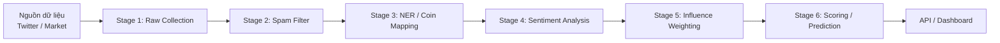
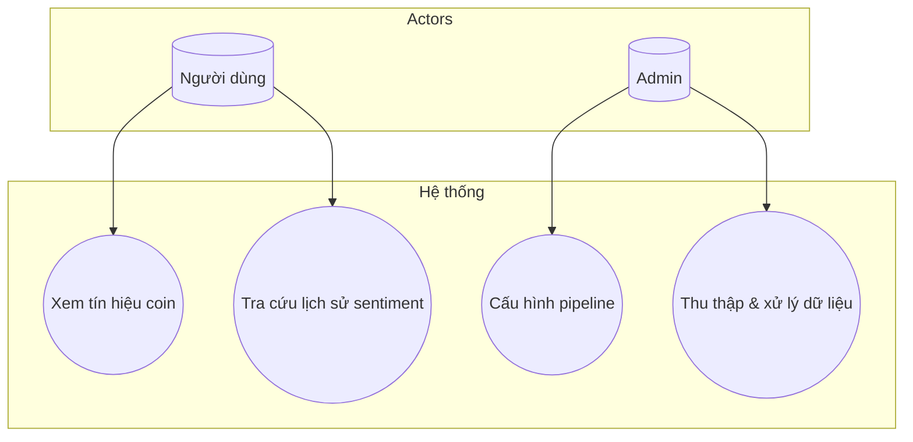
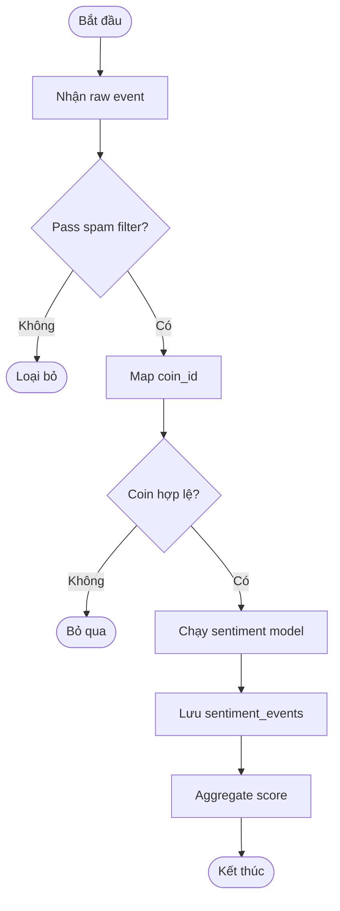
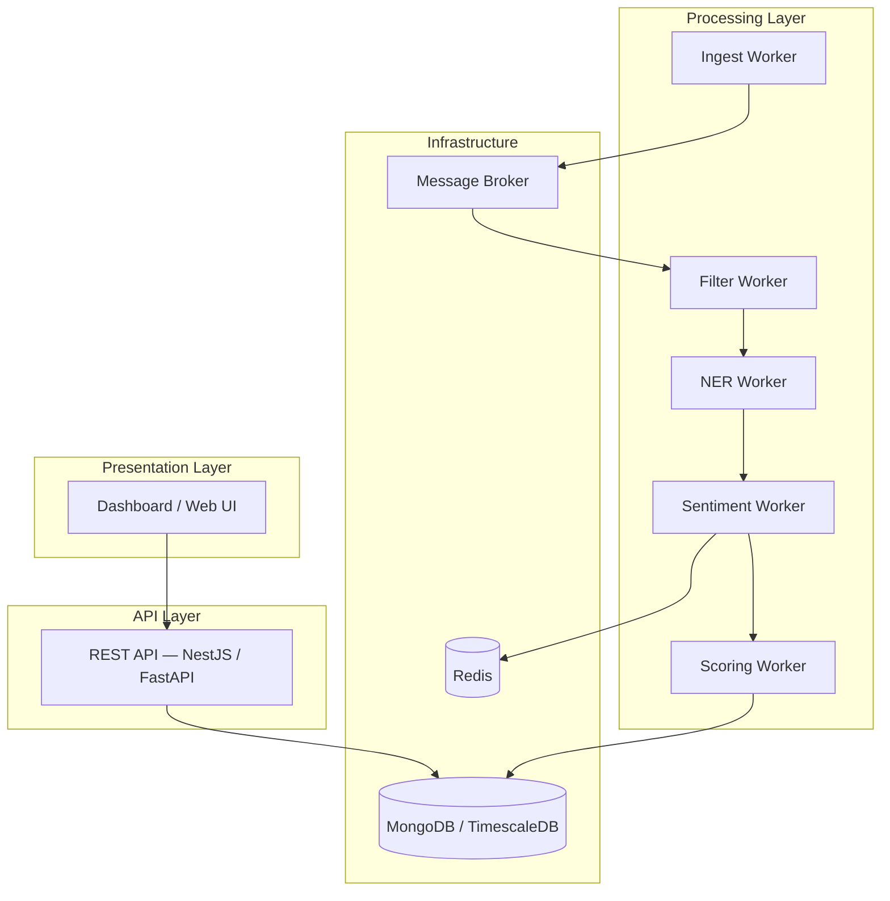
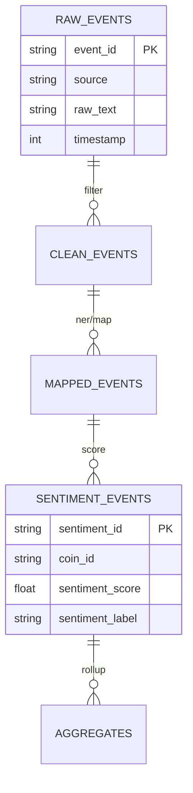

# BÁO CÁO ĐỒ ÁN / BÀI TẬP LỚN

**Tên đề tài:** [Tên đề tài — ví dụ: Hệ thống dự đoán biến động giá Crypto dựa trên phân tích sentiment mạng xã hội]

**Sinh viên thực hiện:** [Họ và tên] — [MSSV]

**Lớp / Nhóm:** [Mã lớp hoặc tên nhóm]

**Giảng viên hướng dẫn:** [Họ và tên GVHD]

**Khoa / Bộ môn:** [Tên khoa]

**Thời gian thực hiện:** [Tháng/Năm bắt đầu] — [Tháng/Năm kết thúc]

---

## Mục lục

1. [Phần Mở Đầu](#1-phần-mở-đầu)
2. [Cơ sở lý thuyết](#2-cơ-sở-lý-thuyết)
3. [Phân tích và Thiết kế hệ thống](#3-phân-tích-và-thiết-kế-hệ-thống)
4. [Xây dựng, Triển khai và Thử nghiệm](#4-xây-dựng-triển-khai-và-thử-nghiệm)
5. [Kết luận và Hướng phát triển](#5-kết-luận-và-hướng-phát-triển)
6. [Tài liệu tham khảo & Phụ lục](#6-tài-liệu-tham-khảo--phụ-lục)

---

## 1. Phần Mở Đầu

> Trình bày tổng quan lý do chọn đề tài và vạch ra hướng đi của đồ án.

### 1.1. Lý do chọn đề tài

[Mô tả vấn đề thực tế hoặc thách thức công nghệ cần giải quyết. Trả lời các câu hỏi:]

- Bối cảnh thực tế là gì? (ví dụ: thị trường crypto biến động mạnh, dữ liệu social tăng theo cấp số nhân, khó lọc nhiễu/bot…)
- Ai đang gặp khó khăn vì vấn đề này?
- Giải pháp hiện có còn thiếu sót gì?
- Vì sao đề tài này phù hợp với chuyên ngành và năng lực của nhóm?

### 1.2. Mục tiêu đề tài

[Mục tiêu cuối cùng — sản phẩm hoặc giải pháp đạt được. Nên tách rõ mục tiêu tổng quát và mục tiêu cụ thể.]

**Mục tiêu tổng quát**

- [Ví dụ: Xây dựng hệ thống thu thập, xử lý và phân tích dữ liệu social để hỗ trợ dự đoán xu hướng giá crypto ngắn hạn.]

**Mục tiêu cụ thể**

| STT | Mục tiêu cụ thể | Tiêu chí đánh giá hoàn thành |
| --- | --- | --- |
| 1 | [Ví dụ: Thu thập dữ liệu từ nguồn X/Twitter] | [Ví dụ: ≥ N events/giờ, schema thống nhất] |
| 2 | [Ví dụ: Lọc spam và map coin bằng NER] | [Ví dụ: Precision ≥ X% trên tập test] |
| 3 | [Ví dụ: Phân tích sentiment và tính điểm tín hiệu] | [Ví dụ: Pipeline chạy end-to-end trên Top 10 coin] |
| 4 | [Ví dụ: Hiển thị kết quả qua API/Dashboard] | [Ví dụ: API phản hồi < 500ms, có biểu đồ lịch sử] |

### 1.3. Phạm vi đề tài

[Giới hạn rõ ràng về chức năng, dữ liệu, đối tượng phục vụ và những gì **không** nằm trong phạm vi.]

**Trong phạm vi**

- [Ví dụ: Top 10 coin (BTC, ETH, SOL, …)]
- [Ví dụ: Khung thời gian 15 phút và 1 giờ]
- [Ví dụ: Nguồn dữ liệu social: Twitter/X]
- [Ví dụ: MVP triển khai trên single-node Ubuntu + Docker]

**Ngoài phạm vi**

- [Ví dụ: Giao dịch tự động (auto-trading) trên sàn]
- [Ví dụ: Hỗ trợ đa ngôn ngữ ngoài tiếng Anh]
- [Ví dụ: Scale production multi-region / Kubernetes]

### 1.4. Phương pháp nghiên cứu

[Các công nghệ, mô hình hoặc phương pháp tiếp cận được sử dụng.]

| Hạng mục | Phương pháp / Công cụ | Mục đích sử dụng |
| --- | --- | --- |
| Thu thập dữ liệu | [Ví dụ: X API, CCXT, Playwright] | [Ingest raw events + OHLCV] |
| Xử lý luồng | [Ví dụ: Event-Driven, Kafka/Redpanda] | [Pipeline bất đồng bộ giữa các worker] |
| NLP / AI | [Ví dụ: FinBERT, CryptoBERT, FastText] | [Sentiment, spam filter, NER] |
| Lưu trữ | [Ví dụ: MongoDB, TimescaleDB, Redis] | [Event store, time-series, cache] |
| Triển khai | [Ví dụ: Docker, Python, NestJS] | [Container hóa, API, orchestration] |
| Kiểm thử | [Ví dụ: Unit test, integration test, benchmark] | [Xác minh chức năng và hiệu năng] |

**Quy trình thực hiện**

1. Khảo sát yêu cầu và nghiên cứu tài liệu tham khảo
2. Phân tích — thiết kế kiến trúc và cơ sở dữ liệu
3. Hiện thực từng module theo pipeline
4. Tích hợp, triển khai và kiểm thử
5. Đánh giá kết quả và rút kinh nghiệm

---

## 2. Cơ sở lý thuyết

> Nền tảng kiến thức và công nghệ dùng để thực hiện đề tài.

### 2.1. Tổng quan về lĩnh vực nghiên cứu

[Kiến thức nền tảng liên quan đến bài toán. Có thể chia thành các mục nhỏ.]

#### 2.1.1. [Chủ đề nền tảng 1 — ví dụ: Phân tích sentiment trong tài chính]

- [Định nghĩa, vai trò của sentiment trong dự báo giá]
- [Leading indicator vs lagging indicator]
- [Thách thức: sarcasm, bot, bias ngôn ngữ]

#### 2.1.2. [Chủ đề nền tảng 2 — ví dụ: Kiến trúc xử lý dữ liệu lớn real-time]

- [Lambda Architecture / Event-Driven Architecture]
- [Speed layer vs batch layer]
- [Information diffusion trên mạng xã hội]

#### 2.1.3. [Chủ đề nền tảng 3 — ví dụ: An toàn và chất lượng dữ liệu]

- [Noise reduction, deduplication]
- [Influence weighting / authority score]
- [Divergence logic (giá vs sentiment)]

### 2.2. Công nghệ sử dụng

[Giới thiệu ngắn gọn từng công nghệ: bản chất, lý do chọn, vai trò trong hệ thống.]

| Công nghệ | Phiên bản | Vai trò trong đề tài |
| --- | --- | --- |
| Python | [x.x] | [Data pipeline, ML inference] |
| [Framework/API] | [x.x] | [Mô tả ngắn] |
| MongoDB | [x.x] | [Lưu events: raw, clean, mapped, sentiment] |
| [Message broker] | [x.x] | [Luân chuyển event giữa workers] |
| Docker | [x.x] | [Đóng gói và triển khai dịch vụ] |
| [Công cụ khác] | [x.x] | [Mô tả ngắn] |

**Lý do lựa chọn công nghệ**

- [So sánh ngắn với phương án thay thế — ví dụ: MongoDB vs PostgreSQL cho event schema linh hoạt]
- [Phù hợp với yêu cầu phi chức năng: throughput, độ trễ, chi phí vận hành]

---

## 3. Phân tích và Thiết kế hệ thống

> Giai đoạn biến yêu cầu thành bản vẽ kỹ thuật.

### 3.1. Khảo sát yêu cầu

#### 3.1.1. Yêu cầu chức năng (Functional Requirements)

| ID | Yêu cầu | Mô tả | Độ ưu tiên |
| --- | --- | --- | --- |
| FR-01 | [Tên chức năng] | [Mô tả chi tiết hành vi hệ thống] | Cao / Trung bình / Thấp |
| FR-02 | Thu thập dữ liệu social | [Ingest tweet/post theo keyword/coin] | Cao |
| FR-03 | Lọc spam / nhiễu | [Loại bot, duplicate, low-quality content] | Cao |
| FR-04 | Nhận diện và map coin | [NER / rule-based → coin_id] | Cao |
| FR-05 | Phân tích sentiment | [Gán score [-1, 1] và label] | Cao |
| FR-06 | Tính điểm / tín hiệu | [Aggregate theo coin + timeframe] | Cao |
| FR-07 | [Chức năng khác] | [Mô tả] | [Ưu tiên] |

#### 3.1.2. Yêu cầu phi chức năng (Non-functional Requirements)

| ID | Loại | Yêu cầu | Giá trị mục tiêu |
| --- | --- | --- | --- |
| NFR-01 | Hiệu năng | Throughput xử lý event | [≥ N events/phút] |
| NFR-02 | Độ trễ | Latency inference sentiment | [≤ X giây/event] |
| NFR-03 | Khả dụng | Uptime MVP | [≥ 99% trong giờ demo] |
| NFR-04 | Mở rộng | Thêm nguồn dữ liệu mới | [Plug-in worker không sửa core] |
| NFR-05 | Bảo mật | Bảo vệ API key, credentials | [Không commit secret; dùng .env] |
| NFR-06 | Khả bảo trì | Cấu trúc module | [Tách rõ ingest / filter / NLP / score] |

#### 3.1.3. Đối tượng sử dụng (Actors)

| Actor | Mô tả | Quyền hạn chính |
| --- | --- | --- |
| [Admin / Operator] | [Quản trị pipeline] | [Cấu hình coin, xem log, restart worker] |
| [Analyst / User] | [Người dùng cuối] | [Xem dashboard, query API tín hiệu] |
| [Hệ thống bên ngoài] | [X API, sàn giao dịch] | [Cung cấp dữ liệu đầu vào] |

### 3.2. Phân tích hệ thống

#### 3.2.1. Sơ đồ nghiệp vụ / Luồng dữ liệu tổng quan



[Mô tả bằng lời từng bước trong pipeline.]

#### 3.2.2. Use Case Diagram



**Bảng mô tả Use Case**

| Use Case | Actor | Mô tả | Luồng chính | Luồng thay thế / ngoại lệ |
| --- | --- | --- | --- | --- |
| UC-01 | [Actor] | [Tóm tắt] | [Bước 1 → 2 → 3] | [Lỗi API, dữ liệu rỗng…] |

#### 3.2.3. Activity Diagram

[Chèn sơ đồ Activity cho một quy trình quan trọng — ví dụ: xử lý một tweet từ raw đến sentiment.]



### 3.3. Thiết kế hệ thống

#### 3.3.1. Kiến trúc hệ thống (Architecture)



**Mô tả các tầng**

| Tầng | Thành phần | Trách nhiệm |
| --- | --- | --- |
| Presentation | [UI/API client] | [Hiển thị, tương tác người dùng] |
| API | [REST/GraphQL] | [Orchestration, auth, query] |
| Processing | [Workers] | [ETL, NLP, scoring] |
| Infrastructure | [DB, MQ, cache] | [Lưu trữ, messaging, cache real-time] |

#### 3.3.2. Thiết kế cơ sở dữ liệu

**Sơ đồ ERD / mô hình dữ liệu**



**Mô tả collection / bảng chính**

| Tên | Mục đích | Trường quan trọng |
| --- | --- | --- |
| `raw_events` | [Lưu dữ liệu thô] | `event_id`, `source`, `raw_text`, `timestamp` |
| `clean_events` | [Sau lọc spam] | `clean_text`, `spam_score` |
| `mapped_events` | [Đã gán coin] | `coin_id`, `clean_text` |
| `sentiment_events` | [Kết quả sentiment] | `sentiment_score`, `sentiment_label`, `probabilities` |
| [Bảng khác] | [Mô tả] | [Trường] |

**Chỉ mục (Indexes) và ràng buộc**

- [Ví dụ: Index `(coin_id, timestamp)` trên `sentiment_events` để query aggregate nhanh]
- [Unique constraint trên `event_id`]

#### 3.3.3. Thiết kế API (nếu có)

| Method | Endpoint | Mô tả | Request | Response |
| --- | --- | --- | --- | --- |
| GET | `/api/v1/coins/{coin_id}/signal` | [Lấy tín hiệu mới nhất] | [Query: timeframe] | [JSON signal] |
| GET | `/api/v1/coins/{coin_id}/sentiment/history` | [Lịch sử sentiment] | [from, to, interval] | [Time-series data] |

#### 3.3.4. Thiết kế module / package

```
[project-root]/
├── playground/
│   ├── ingest/          # Stage 1
│   ├── filter/          # Stage 2
│   ├── ner/             # Stage 3
│   ├── sentiment/       # Stage 4
│   └── scoring/         # Stage 6
└── docs/                # Tài liệu kỹ thuật
```

[Mô tả trách nhiệm từng module và contract dữ liệu giữa các stage.]

---

## 4. Xây dựng, Triển khai và Thử nghiệm

> Phần thực thi và minh chứng cho sản phẩm.

### 4.1. Môi trường phát triển

#### 4.1.1. Cấu hình phần cứng

| Thành phần | Thông số |
| --- | --- |
| CPU | [Ví dụ: Intel i7 / AMD Ryzen 7, 8 cores] |
| RAM | [Ví dụ: 16 GB — 32 GB] |
| GPU | [Ví dụ: NVIDIA RTX 3060 — dùng cho inference NLP] |
| Ổ cứng | [Ví dụ: SSD 512 GB] |
| Hệ điều hành | [Ví dụ: Ubuntu 22.04 LTS / Arch Linux] |

#### 4.1.2. Cấu hình phần mềm

| Công cụ | Phiên bản | Ghi chú |
| --- | --- | --- |
| Python | [3.11+] | [Virtual env: venv / conda] |
| Node.js | [20.x] | [NestJS API — nếu có] |
| Docker / Docker Compose | [24.x] | [Orchestration local] |
| MongoDB | [7.x] | [Event store] |
| Git | [2.x] | [Version control] |

#### 4.1.3. Cài đặt và chạy hệ thống

```bash
# Clone repository
git clone [URL-repo]
cd [ten-thu-muc]

# Cài dependency
pip install -r requirements.txt
# hoặc: docker compose up -d

# Chạy pipeline / service
python playground/ingest/run.py
python playground/sentiment/run.py
```

[Ghi chú biến môi trường cần thiết: API keys, connection strings — **không** dán secret thật vào báo cáo.]

### 4.2. Hiện thực hóa hệ thống

#### 4.2.1. Giao diện người dùng

[Chèn ảnh chụp màn hình Dashboard / API docs / Swagger UI.]

| Màn hình | Mô tả chức năng |
| --- | --- |
| [Ảnh 1: Dashboard tổng quan] | [Hiển thị Galaxy Score / signal theo coin] |
| [Ảnh 2: Chi tiết coin] | [Biểu đồ sentiment vs giá theo thời gian] |

#### 4.2.2. Đoạn code cốt lõi (Core code)

[Trích dẫn các đoạn code quan trọng nhất — không cần dump toàn bộ repo. Mỗi đoạn kèm giải thích ngắn.]

**Ví dụ: Logic tính sentiment**

```python
# [Đường dẫn file — ví dụ: playground/sentiment/score.py]

def score_text(text: str, model) -> dict:
    """
    [Mô tả: nhận clean_text, trả sentiment_score và label]
    """
    # [Paste đoạn code cốt lõi 10–30 dòng]
    pass
```

**Ví dụ: Rule scoring / divergence**

```python
# [Đường dẫn file — ví dụ: playground/scoring/lib/rules.py]

def detect_divergence(price_trend: str, sentiment_trend: str) -> str:
    """
    [Mô tả logic BUY/SELL khi giá và sentiment phân kỳ]
    """
    pass
```

#### 4.2.3. Xử lý logic nghiệp vụ theo từng module

| Module | Input | Xử lý chính | Output |
| --- | --- | --- | --- |
| Ingest | [Tweet JSON từ API] | [Normalize schema, gán event_id] | `raw_events` |
| Filter | `raw_events` | [Dedup, spam ML, rate limit] | `clean_events` |
| NER | `clean_events` | [Extract $BTC, #ethereum → coin_id] | `mapped_events` |
| Sentiment | `mapped_events` | [FinBERT inference] | `sentiment_events` |
| Scoring | `sentiment_events` + OHLCV | [Aggregate, divergence rules] | Signal / score |

### 4.3. Kiểm thử (Testing)

#### 4.3.1. Chiến lược kiểm thử

| Loại test | Phạm vi | Công cụ |
| --- | --- | --- |
| Unit test | [Hàm filter, scoring rules] | [pytest] |
| Integration test | [Pipeline stage n → n+1] | [pytest + test DB] |
| End-to-end test | [Raw → signal output] | [Script/manual] |
| Hiệu năng | [Throughput, latency] | [locust / custom benchmark] |

#### 4.3.2. Kịch bản kiểm thử (Test cases)

| TC ID | Module | Mô tả | Input | Kết quả mong đợi | Thực tế | Pass/Fail |
| --- | --- | --- | --- | --- | --- | --- |
| TC-01 | Filter | Tweet spam bị loại | [Text shill bot] | `is_spam = true` | [Ghi kết quả] | ✅ / ❌ |
| TC-02 | NER | Map $BTC → BTC | `"Buy $BTC now"` | `coin_id = "BTC"` | [Ghi kết quả] | ✅ / ❌ |
| TC-03 | Sentiment | Tweet bullish | `"BTC to the moon"` | `score > 0`, label positive | [Ghi kết quả] | ✅ / ❌ |
| TC-04 | Scoring | Bullish divergence | [Giá giảm, sentiment tăng] | Signal = BUY | [Ghi kết quả] | ✅ / ❌ |
| TC-05 | API | GET signal hợp lệ | `GET /coins/BTC/signal` | HTTP 200 + JSON | [Ghi kết quả] | ✅ / ❌ |

#### 4.3.3. Kết quả kiểm thử tổng hợp

| Chỉ số | Giá trị |
| --- | --- |
| Tổng số test case | [N] |
| Pass | [N] |
| Fail | [N] |
| Tỷ lệ pass | [X%] |

[Biểu đồ hoặc bảng metric model — nếu có: accuracy sentiment, F1 spam filter…]

#### 4.3.4. Lỗi phát hiện và khắc phục (Bug fixes)

| Bug ID | Mô tả lỗi | Nguyên nhân | Cách khắc phục | Trạng thái |
| --- | --- | --- | --- | --- |
| BUG-01 | [Ví dụ: Duplicate event_id] | [Thiếu UUID khi ingest] | [Thêm uuid4() khi tạo event] | Đã sửa |
| BUG-02 | [Mô tả] | [Nguyên nhân] | [Fix] | [Trạng thái] |

### 4.4. Đánh giá hệ thống

#### 4.4.1. Ưu điểm

- [Ví dụ: Pipeline modular, dễ mở rộng thêm worker]
- [Ví dụ: Sentiment model phù hợp domain tài chính (FinBERT)]
- [Ví dụ: Schema event thống nhất xuyên suốt 6 stage]

#### 4.4.2. Nhược điểm / Hạn chế

- [Ví dụ: Chưa scale horizontal, single-node bottleneck]
- [Ví dụ: Phụ thuộc API bên thứ ba (rate limit)]
- [Ví dụ: Chưa backtest định lượng trên dữ liệu lịch sử dài]

#### 4.4.3. So sánh với mục tiêu ban đầu

| Mục tiêu (mục 1.2) | Mức độ hoàn thành | Ghi chú |
| --- | --- | --- |
| [Mục tiêu 1] | [100% / 80% / …] | [Giải thích] |
| [Mục tiêu 2] | [%] | [Giải thích] |

---

## 5. Kết luận và Hướng phát triển

### 5.1. Tóm tắt công việc đã thực hiện

[Tóm tắt ngắn gọn (1–2 đoạn) những gì nhóm đã làm: khảo sát, thiết kế, hiện thực module nào, kết quả đạt được.]

- Đã xây dựng pipeline [N] stage: [liệt kê]
- Đã tích hợp [công nghệ/model chính]
- Đã kiểm thử [số lượng test case], tỷ lệ pass [X%]
- Sản phẩm demo: [API / Dashboard / CLI]

### 5.2. Kết luận

[Đánh giá mức độ hoàn thành so với mục tiêu ban đầu (mục 1.2).]

- Mục tiêu tổng quát: [Đạt / Đạt một phần / Chưa đạt] — [Lý do]
- Bài học kinh nghiệm: [Kỹ thuật, quản lý dự án, làm việc nhóm]
- Ý nghĩa thực tiễn: [Ứng dụng có thể mang lại giá trị gì]

### 5.3. Hướng phát triển

| Hướng | Mô tả | Độ ưu tiên |
| --- | --- | --- |
| Mở rộng nguồn dữ liệu | [Reddit, Telegram, news RSS] | Cao |
| Auto-trading / alert | [Webhook, Telegram bot khi signal BUY/SELL] | Trung bình |
| Scale hạ tầng | [Kubernetes, horizontal workers] | Trung bình |
| Cải thiện model | [Fine-tune FastText/CryptoBERT trên corpus crypto] | Cao |
| Backtest định lượng | [So sánh signal vs return thực tế] | Cao |
| Đa ngôn ngữ | [Sentiment tiếng Việt, Trung] | Thấp |

---

## 6. Tài liệu tham khảo & Phụ lục

### 6.1. Tài liệu tham khảo

[Liệt kê theo chuẩn **IEEE** hoặc **APA** — chọn một chuẩn và dùng nhất quán.]

**Ví dụ chuẩn IEEE:**

```
[1] A. Author, "Title of paper," Journal Name, vol. X, no. Y, pp. 1–10, Year.
[2] B. Author, Book Title, Edition. City: Publisher, Year.
[3] Organization, "Document title," Website. [Online]. Available: URL. [Accessed: Day Month Year].
```

**Danh sách tham khảo**

[1] [Tác giả], "[Tiêu đề]," [Nguồn], [Năm]. [URL nếu có]

[2] [Tài liệu nội bộ dự án — ví dụ: `docs/pipeline-overview.md`]

[3] [FinBERT — ProsusAI/finbert, Hugging Face Model Hub]

[4] [LunarCrush / whitepaper / blog — nếu tham khảo kiến trúc]

[5] [CCXT Documentation — https://docs.ccxt.com]

### 6.2. Phụ lục

#### Phụ lục A — Mã nguồn mở rộng

[Đặt các file code dài không trích trong mục 4.2, hoặc link tới repository.]

| File | Mô tả |
| --- | --- |
| `playground/ingest/run.py` | Script thu thập raw events |
| `playground/sentiment/run.py` | Pipeline sentiment inference |
| `playground/scoring/lib/rules.py` | Rule scoring và divergence |

#### Phụ lục B — Hướng dẫn sử dụng (User Manual)

**Bước 1:** Cài đặt môi trường (xem mục 4.1)

**Bước 2:** Cấu hình file `.env`:

```env
MONGODB_URI=mongodb://localhost:27017/crypto_pipeline
X_API_KEY=your_key_here
```

**Bước 3:** Khởi chạy dịch vụ

```bash
docker compose up -d
python playground/scoring/run.py
```

**Bước 4:** Truy cập Dashboard / gọi API

- Dashboard: `http://localhost:3000`
- API docs: `http://localhost:8000/docs`

#### Phụ lục C — [Tùy chọn: Schema JSON mẫu, log chạy thử, biểu đồ bổ sung]

[Dán contract JSON cho `raw_events`, `sentiment_events` hoặc kết quả benchmark.]

---

*Tài liệu khung báo cáo — điền nội dung vào các placeholder `[...]` trước khi nộp.*
