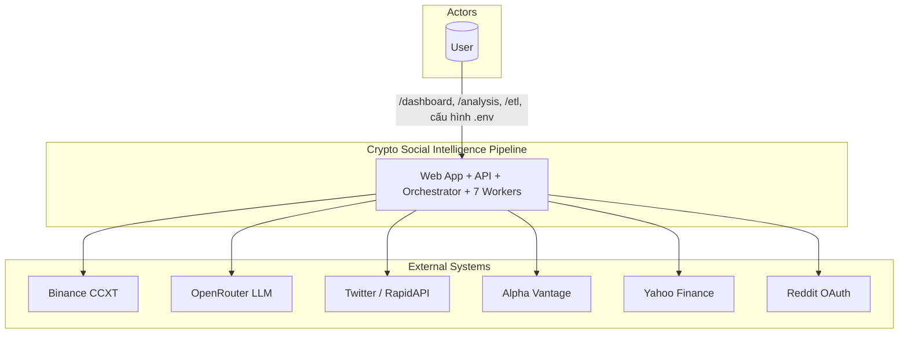
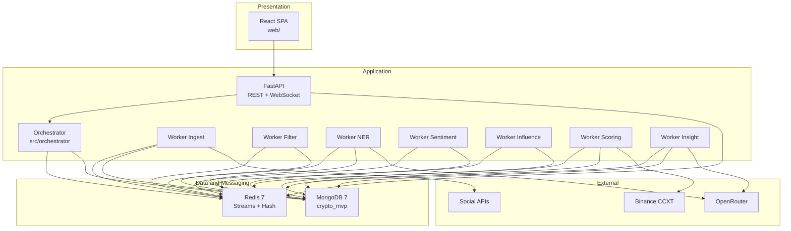
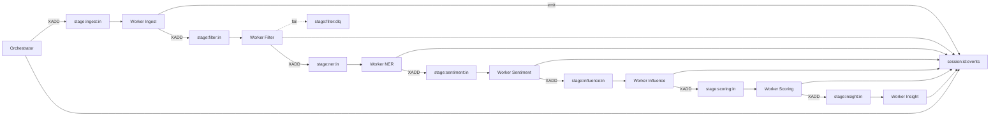
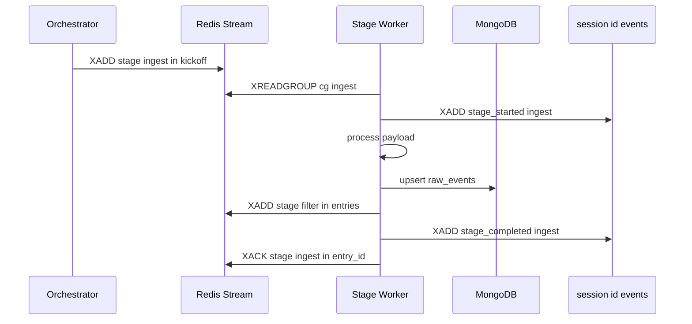
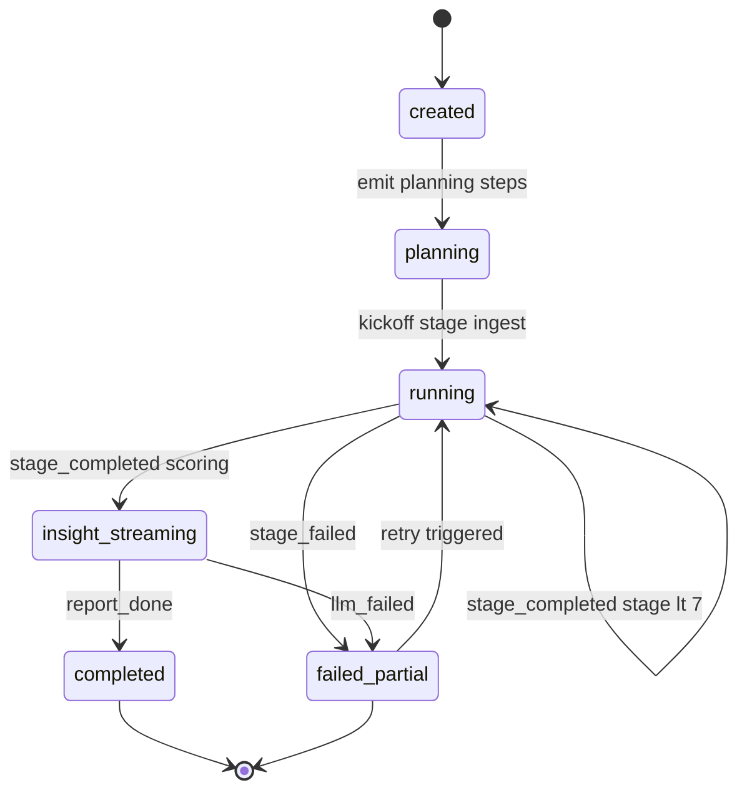
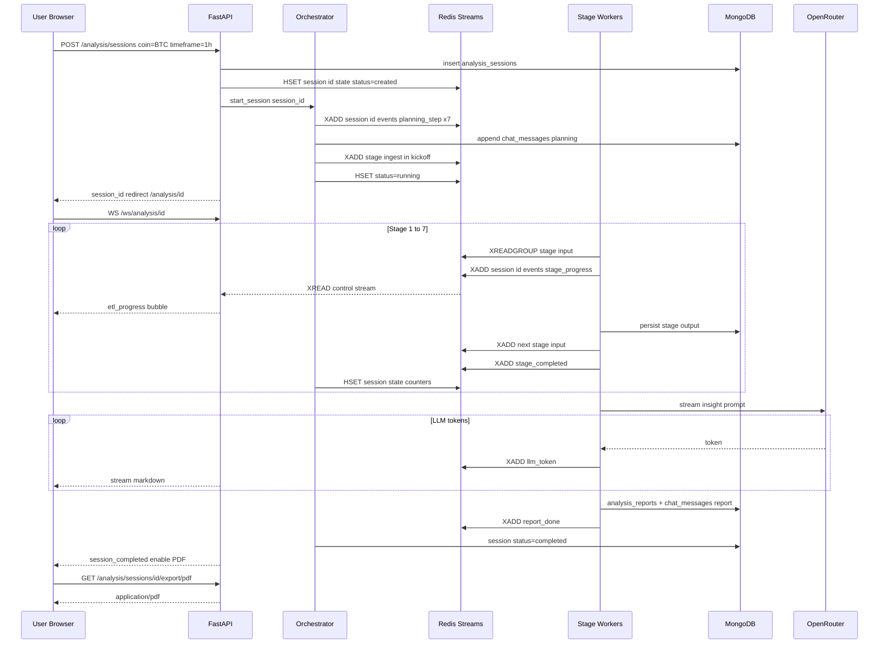
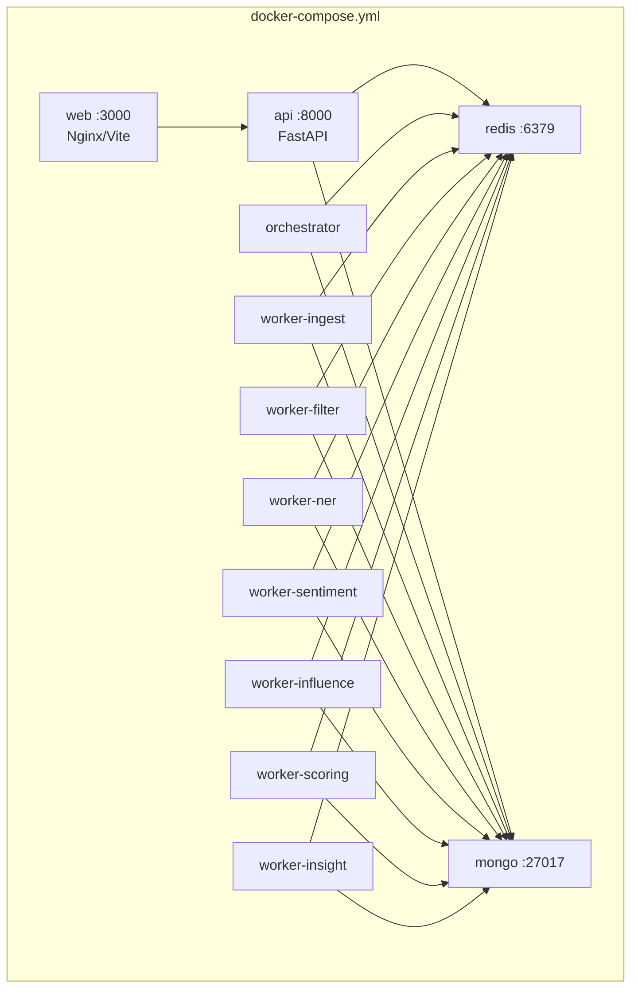

# Kiến trúc hệ thống — Crypto Social Intelligence Pipeline

> Tài liệu kiến trúc kỹ thuật tổng thể cho sản phẩm **Crypto Social Intelligence Pipeline**.  
> **Tham chiếu:** [`khung-bao-cao.md`](khung-bao-cao.md) · [`pipeline-overview.md`](pipeline-overview.md) · [`lunacrush-data-flow.md`](lunacrush-data-flow.md)

---

## 1. Tổng quan & nguyên tắc thiết kế

### 1.1. Mục tiêu hệ thống

Hệ thống là **ứng dụng web full-stack** phân tích coin crypto dựa trên dữ liệu social + thị trường:

1. **Dashboard TradingView** — chart nến, giá realtime.
2. **Chat phân tích** — bấm **Phân tích** → planning → ETL 7 stage → LLM Insight → PDF.
3. **Lưu session chat** — mỗi lần phân tích = một phiên có thể mở lại.

Pipeline gồm **7 stage** xử lý tuần tự logic: Ingest → Filter → NER → Sentiment → Influence → Scoring → LLM Insight.

### 1.2. Quyết định kiến trúc cốt lõi

| Quyết định | Lựa chọn | Lý do |
| --- | --- | --- |
| Transport giữa stage | **Redis Streams** (full payload) | Decouple worker; scale-out consumer group; backpressure MAXLEN |
| Trạng thái runtime session | **Redis Hash** + **control stream** | Orchestrator biết stage realtime không cần poll MongoDB |
| Source-of-truth lịch sử | **MongoDB** | Audit, query lịch sử, PDF export, sidebar session |
| Realtime UI | **WebSocket** đọc control stream | Không cần user/auth (single-tenant); push planning/ETL/LLM |
| Triển khai | **Docker Compose** monorepo | Một máy chạy độc lập: web + api + workers + redis + mongo |

### 1.3. Nguyên tắc thiết kế

1. **Event-driven:** Stage giao tiếp qua stream entry, không gọi trực tiếp nhau.
2. **Idempotent:** `event_id` UUID; unique index MongoDB; XACK chỉ sau persist thành công.
3. **Replayable:** MongoDB giữ snapshot; có thể re-publish từ Mongo nếu mất Redis.
4. **Separation of concerns:** Web / API / Orchestrator / Workers / Infra tách process riêng.
5. **Single-tenant:** Không auth user; `session_id` là scope duy nhất.
6. **Observability:** Mọi stage emit event vào `session:{id}:events` — một bus cho orchestrator + UI.

---

## 2. Sơ đồ Context (C4 — Level 1)



**Mô tả ranh giới**

- **User** tương tác qua browser: `/dashboard` (TradingView), `/analysis/:sessionId` (chat), `/etl` (giám sát pipeline).
- **User** cấu hình `.env` / `config/` khi triển khai (single-tenant, không phân quyền admin).
- **Hệ thống** không thực hiện auto-trading; chỉ phân tích và báo cáo.

---

## 3. Sơ đồ Container (C4 — Level 2)



| Container | Trách nhiệm |
| --- | --- |
| **React SPA** | TradingView chart, chat UI, sidebar session, PDF download |
| **FastAPI** | REST CRUD session/messages/market; WS broadcaster; không chạy ETL |
| **Orchestrator** | Tạo session; emit planning; kick-off Stage 1; theo dõi control stream; finalize |
| **Stage Workers** | XREADGROUP → xử lý → XADD downstream + emit control events |
| **Redis** | Transport streams + session state + control bus |
| **MongoDB** | Persist documents + chat history + job snapshot |

---

## 4. Stack công nghệ

| Thành phần | Công nghệ | Phiên bản mục tiêu | Vai trò |
| --- | --- | --- | --- |
| Backend runtime | Python | 3.12+ | Workers, API, orchestrator |
| API framework | FastAPI | 0.110+ | REST + WebSocket |
| ASGI server | Uvicorn | 0.30+ | Serve API |
| Redis client | redis-py async | 5.x | Streams XADD/XREADGROUP |
| Document DB | MongoDB | 7.x | Event store, sessions, chat |
| Message bus | Redis Streams | 7.x | Inter-stage transport + control bus |
| Frontend | React + TypeScript | 19.x | SPA — hooks `use()`, streaming chat UI |
| Build tool | Vite | 5.x | Frontend bundle |
| UI components | Mantine | 9.x | Layout, Button, Card, Chat bubbles, Progress, Notifications |
| Styling | Tailwind CSS | 4.x | Utility classes; `@tailwindcss/vite` plugin |
| Server state | TanStack React Query | 5.x | REST: sessions, messages, market OHLCV/ticker |
| Client state | Jotai | 2.x | Coin/timeframe selection, WS message buffer, UI flags |
| Validation | Zod | 3.x | Parse API response + form input (coin, timeframe) |
| Chart | lightweight-charts | 4.x | TradingView-compatible candlestick |
| PDF | WeasyPrint | 62+ | Export báo cáo session |
| Market data | CCXT Binance | latest | OHLCV + ticker |
| LLM | OpenRouter API | — | NER Stage 3 + Insight Stage 7 |
| Container | Docker Compose | 24.x | Local / demo deployment |

---

## 5. Kiến trúc luồng dữ liệu — Redis Streams làm transport

### 5.1. Topology stream

Pipeline có **7 input stream** (mỗi stage một consumer group) và **1 control stream per session**.



**Luồng dữ liệu stage → stage**

| Stage | Input stream | Consumer group | Output stream | Payload |
| --- | --- | --- | --- | --- |
| 1 Ingest | `stage:ingest:in` | `cg:ingest` | `stage:filter:in` | `raw_events` document |
| 2 Filter | `stage:filter:in` | `cg:filter` | `stage:ner:in` | `clean_events` document |
| 3 NER | `stage:ner:in` | `cg:ner` | `stage:sentiment:in` | `mapped_events` fan-out N entries |
| 4 Sentiment | `stage:sentiment:in` | `cg:sentiment` | `stage:influence:in` | `sentiment_events` document |
| 5 Influence | `stage:influence:in` | `cg:influence` | `stage:scoring:in` | batch trigger + aggregate snapshot |
| 6 Scoring | `stage:scoring:in` | `cg:scoring` | `stage:insight:in` | `scoring_signals` document |
| 7 Insight | `stage:insight:in` | `cg:insight` | — | `analysis_reports` + chat messages |

**Ghi chú Stage 5→6:** Influence worker ghi `influence_aggregates` vào MongoDB, rồi XADD batch completion entry vào `stage:scoring:in` — downstream không đọc Mongo để lấy input.

**Ghi chú Stage 6:** Scoring worker gọi Binance CCXT; payload output stream chứa full `scoring_signals` document.

### 5.2. Đặt tên stream và Redis key

```
# Transport streams global MAXLEN ~50000
stage:ingest:in
stage:filter:in
stage:ner:in
stage:sentiment:in
stage:influence:in
stage:scoring:in
stage:insight:in

# Dead-letter per stage
stage:ingest:dlq
stage:filter:dlq
stage:ner:dlq
stage:sentiment:dlq
stage:influence:dlq
stage:scoring:dlq
stage:insight:dlq

# Session-scoped TTL 7 ngày
session:{session_id}:events     — control stream
session:{session_id}:state      — Redis Hash runtime counters

# Consumer groups
cg:ingest | cg:filter | cg:ner | cg:sentiment | cg:influence | cg:scoring | cg:insight

# Consumer name pattern
{hostname}-{pid}
```

### 5.3. Schema stream entry transport

Mỗi entry trên `stage:*:in` dùng flat string fields. Field `payload` chứa JSON string.

```json
{
  "session_id": "550e8400-e29b-41d4-a716-446655440000",
  "job_id": "job-20260614-001",
  "trace_id": "trace-uuid",
  "produced_by": "stage:filter",
  "produced_at": "2026-06-14T06:30:00Z",
  "schema_version": "v1",
  "payload": "{\"event_id\":\"...\",\"source\":\"twitter\",\"raw_text\":\"...\"}"
}
```

**Kick-off entry Orchestrator → `stage:ingest:in`**

```json
{
  "session_id": "550e8400-...",
  "job_id": "job-20260614-001",
  "trace_id": "trace-uuid",
  "produced_by": "orchestrator",
  "produced_at": "2026-06-14T06:30:00Z",
  "schema_version": "v1",
  "payload": "{\"type\":\"session_start\",\"coin_id\":\"BTC\",\"timeframe\":\"1h\",\"sources\":[\"twitter\",\"news-av\"]}"
}
```

### 5.4. Schema control event session id events

| event_type | Emitter | Mục đích |
| --- | --- | --- |
| `planning_step` | Orchestrator | Kế hoạch 7 bước trong chat |
| `stage_started` | Worker | Stage bắt đầu |
| `stage_progress` | Worker | Progress bar pct records |
| `stage_completed` | Worker | Stage xong |
| `stage_failed` | Worker | Lỗi |
| `signal_ready` | Worker Scoring | Card BUY/HOLD |
| `llm_token` | Worker Insight | Stream token LLM |
| `report_done` | Worker Insight | Báo cáo xong enable PDF |
| `session_completed` | Orchestrator | Kết thúc phiên |
| `session_failed` | Orchestrator | Phiên fail |

**Ví dụ entry control**

```
event_type=stage_progress
session_id=550e8400-...
job_id=job-20260614-001
data={"stage":"filter","status":"running","pct":45,"records_in":1200,"records_out":890}
ts=2026-06-14T06:30:12Z
```

### 5.5. Vòng đời một entry transport



### 5.6. Consumer group và retry

| Cơ chế | Cấu hình | Hành vi |
| --- | --- | --- |
| Consumer group | `cg:{stage}` per input stream | At-least-once delivery |
| Block read | XREADGROUP BLOCK 5000 COUNT 64 | Worker long-poll |
| Ack | XACK sau persist Mongo + XADD downstream | Tránh mất message |
| Pending reclaim | XCLAIM idle greater than 30s | Worker khác nhận entry treo |
| Max retry | 3 lần reclaim | Sau đó XADD stage name dlq |
| Backpressure | XADD MAXLEN ~ 50000 | Trim approximate |

### 5.7. Fan-out Stage 3 NER

Một entry `clean_events` có thể produce **N entries** `mapped_events` trên `stage:sentiment:in`. Worker NER XACK sau fan-out; emit `stage_progress` với `records_out=N`.

---

## 6. Kiến trúc điều phối — Orchestrator và session state machine

### 6.1. Vai trò Orchestrator

Orchestrator `src/orchestrator/` thực hiện:

1. **Tạo session** — insert `analysis_sessions` Mongo; init `session:{id}:state` Redis Hash.
2. **Planning phase** — XADD 7 message `planning_step`; append `chat_messages` type=planning Mongo.
3. **Kick-off** — XADD entry `session_start` vào `stage:ingest:in`.
4. **Monitor** — loop XREAD BLOCK trên `session:{id}:events`; cập nhật state machine và Redis Hash.
5. **Finalize** — khi nhận `report_done`: set session completed; snapshot `pipeline_jobs` / `pipeline_stage_runs` từ Redis Hash → MongoDB.

Orchestrator **không** xử lý business logic stage — chỉ điều phối và aggregate trạng thái.

### 6.2. Session state machine



**Redis Hash session id state runtime**

| Field | Kiểu | Mô tả |
| --- | --- | --- |
| `status` | string | created / planning / running / insight_streaming / completed / failed_partial |
| `current_stage` | string | Stage đang chạy |
| `coin_id` | string | BTC, ETH, … |
| `timeframe` | string | 1h, 4h, … |
| `job_id` | string | Liên kết pipeline job |
| `started_at` | ISO8601 | Thời điểm bắt đầu |
| `{stage}_in` | int | Số entry nhận |
| `{stage}_out` | int | Số entry produce |
| `{stage}_duration_ms` | int | Tổng thời gian stage |
| `last_event_id` | string | Stream ID control event cuối |

### 6.3. Cách Orchestrator biết trạng thái stage realtime

```
Worker stage X
    → XADD session:{id}:events  event_type=stage_started|progress|completed|failed
Orchestrator XREAD BLOCK session:{id}:events
    → HSET session:{id}:state current_stage, counters, status
WS Broadcaster XREAD BLOCK cùng stream cursor riêng
    → send_json → browser /ws/analysis/{session_id}
```

**Hai consumer độc lập trên cùng control stream**

| Consumer | Cơ chế đọc | Mục đích |
| --- | --- | --- |
| Orchestrator | XREAD cursor orch session_id lưu Redis KV | State machine, finalize |
| WS Broadcaster | XREAD cursor per WebSocket connection | Push UI realtime |

Không dùng consumer group cho control stream vì **cả hai đều cần nhận mọi event** broadcast semantics.

### 6.4. Sequence bấm Phân tích hoàn tất session



### 6.5. Reconnect và mở lại session cũ

1. `GET /api/v1/analysis/sessions/{id}/messages` — render full history từ MongoDB.
2. Lấy `last_event_id` từ message metadata cuối.
3. WS connect với `?last_id={last_event_id}` — catch-up events còn thiếu từ Redis nếu TTL chưa hết.
4. Nếu Redis đã expire → chỉ hiển thị Mongo history read-only.

---

## 7. Kiến trúc realtime UI — WebSocket chat không cần user

### 7.1. Nguyên tắc

- **Single-tenant:** Không JWT/session auth. Biết `session_id` là đủ kết nối WS triển khai nội bộ.
- **Single source of truth cho realtime:** Control stream `session:{id}:events`.
- **Single source of truth cho lịch sử:** MongoDB `chat_messages`.

### 7.2. Luồng WebSocket

```
Browser connect WS /ws/analysis/{session_id}?last_id=0
    → API accept
    → XREAD session:{id}:events from last_id catch-up
    → send_json từng event
    → loop XREAD BLOCK live
```

**Mapping event_type → UI component**

| event_type | Chat UI component |
| --- | --- |
| `planning_step` | PlanningSteps.tsx numbered list |
| `stage_started` / `stage_progress` | EtlProgressCard.tsx |
| `stage_completed` | Card check + stats |
| `stage_failed` | Error bubble đỏ |
| `signal_ready` | SignalCard.tsx |
| `llm_token` | Markdown stream append token |
| `report_done` | Nút Tải PDF + disclaimer |
| `session_completed` | Disable input / show done badge |

### 7.3. WS Broadcaster mã giả

```python
# src/api/ws/analysis.py
async def analysis_ws(ws: WebSocket, session_id: str, last_id: str = "0"):
    await ws.accept()
    stream = f"session:{session_id}:events"
    async for entry_id, fields in redis.xread_stream(stream, last_id, block=None):
        await ws.send_json(envelope(entry_id, fields))
        last_id = entry_id
    while True:
        entries = await redis.xread({stream: last_id}, block=10000, count=50)
        if not entries:
            continue
        for entry_id, fields in entries[0][1]:
            await ws.send_json(envelope(entry_id, fields))
            last_id = entry_id
```

### 7.4. REST endpoints liên quan

| Method | Endpoint | Vai trò |
| --- | --- | --- |
| POST | `/api/v1/analysis/sessions` | Tạo session + trigger orchestrator |
| GET | `/api/v1/analysis/sessions/{id}` | Metadata + Redis state snapshot |
| GET | `/api/v1/analysis/sessions/{id}/messages` | Lịch sử chat Mongo |
| GET | `/api/v1/analysis/sessions/{id}/export/pdf` | PDF báo cáo |
| GET | `/api/v1/market/ohlcv` | TradingView datafeed |
| WS | `/ws/analysis/{session_id}` | Realtime control events |

---

## 8. Kiến trúc lưu trữ — phân chia Redis vs MongoDB

### 8.1. Redis ephemeral + realtime

| Key / Stream | TTL / MAXLEN | Nội dung |
| --- | --- | --- |
| `stage:*:in` | MAXLEN ~50000 | Transport entries giữa stage |
| `stage:*:dlq` | MAXLEN ~1000 | Entry fail sau max retry |
| `session:{id}:events` | TTL 7 ngày | Control bus planning→done |
| `session:{id}:state` | TTL 7 ngày | Hash counters + status runtime |
| `cursor:orch:{id}` | TTL 7 ngày | Orchestrator XREAD cursor |

### 8.2. MongoDB durable source-of-truth

| Collection | Ghi bởi | Mục đích |
| --- | --- | --- |
| `raw_events` … `scoring_signals` | Stage workers | Pipeline data + audit |
| `analysis_sessions` | API / Orchestrator | Session metadata |
| `chat_messages` | Orchestrator / WS mirror | Lịch sử chat UI |
| `analysis_reports` | Worker Insight | Structured LLM output |
| `pipeline_jobs` | Orchestrator finalize | Job snapshot |
| `pipeline_stage_runs` | Orchestrator finalize | Per-stage stats từ Redis Hash |

### 8.3. Quy tắc đồng bộ

1. **Downstream stage đọc Redis stream**, không poll Mongo để lấy input tiếp theo.
2. **Worker vẫn ghi Mongo** sau xử lý — phục vụ query lịch sử, PDF, debug.
3. **Orchestrator đọc Redis control stream** — không poll Mongo để biết progress.
4. **Recovery:** Nếu Redis mất data, re-publish từ Mongo collection stage cuối cùng đã persist vào stream tiếp theo.

---

## 9. Kiến trúc Web Frontend

**Stack frontend**

| Layer | Công nghệ | Vai trò |
| --- | --- | --- |
| UI | **Mantine v9** | `AppShell`, `Button`, `Card`, `ScrollArea`, `Progress`, `Badge`, `Markdown` (chat report) |
| Style | **Tailwind CSS v4** | Layout/spacing; `@import "tailwindcss"` + Vite plugin; Mantine + Tailwind coexist |
| Server state | **TanStack React Query v5** | Cache REST: `/market/*`, `/analysis/sessions`, messages; mutations: tạo session, follow-up |
| Client state | **Jotai v2** | Atom: `selectedCoinAtom`, `timeframeAtom`, `chatMessagesAtom`, `wsConnectedAtom`, `streamingTextAtom` |
| Validation | **Zod v3** | Schema `SessionSchema`, `ChatMessageSchema`, `OhlcvSchema`, `CreateSessionInput`; parse trước render |
| Core | React 19 + TypeScript + Vite 5 | SPA client-side (không RSC) |

**Provider tree (root `main.tsx`)**

```
QueryClientProvider          ← React Query
  └── MantineProvider        ← Mantine v9 theme
        └── JotaiProvider    ← optional explicit; atoms global
              └── App        ← React Router
```

### 9.1. Routing

| Route | Page | Mô tả |
| --- | --- | --- |
| `/dashboard` | `Dashboard.tsx` | TradingView + coin selector + sidebar sessions + nút Phân tích |
| `/analysis/:sessionId` | `AnalysisChat.tsx` | Chat GPT-like WS-driven |
| `/etl` | `EtlMonitor.tsx` | Giám sát pipeline chi tiết |

### 9.2. Component tree rút gọn

```
App (Mantine AppShell)
├── Dashboard
│   ├── TradingViewChart      ← lightweight-charts; ref Mantine Paper wrapper
│   ├── TickerBar             ← Mantine Group + React Query useTicker
│   ├── SessionSidebar        ← Mantine NavLink + useSessions query
│   └── AnalyzeButton         ← Mantine Button + useCreateSession mutation
├── AnalysisChat
│   ├── ChatHeader            ← Mantine Group + PDF ActionIcon
│   ├── MessageList           ← Mantine ScrollArea
│   │   └── ChatMessage       ← Mantine Paper / Badge by type
│   ├── PlanningSteps         ← Mantine List + Stepper
│   ├── EtlProgressCard       ← Mantine Progress + Card
│   ├── SignalCard            ← Mantine Card BUY/HOLD
│   └── ChatInput             ← Mantine Textarea + Button
└── EtlMonitor
```

### 9.3. Phân tách state — React Query vs Jotai

| Dữ liệu | Công nghệ | Ví dụ |
| --- | --- | --- |
| REST cache, refetch, loading/error | **React Query** | `useQuery(['ohlcv', coin, interval])`, `useQuery(['sessions'])`, `useQuery(['messages', sessionId])` |
| Mutation tạo session | **React Query** | `useMutation(createSession)` → `onSuccess` navigate `/analysis/:id` |
| Coin/timeframe đã chọn trên dashboard | **Jotai** | `selectedCoinAtom`, `timeframeAtom` — persist `localStorage` optional |
| Buffer message realtime từ WS | **Jotai** | `chatMessagesAtom` — append từ `useAnalysisWs`; không qua React Query (push stream) |
| Text LLM đang stream | **Jotai** | `streamingTextAtom` — append token; flush vào messages khi `report_done` |
| WS connection status | **Jotai** | `wsConnectedAtom` — Mantine `Loader` / banner reconnect |

### 9.4. Zod — validation contract API

```typescript
// web/src/schemas/session.ts
import { z } from "zod";

export const CreateSessionInput = z.object({
  coin_id: z.enum(["BTC", "ETH", "SOL", /* … registry */]),
  timeframe: z.enum(["15m", "30m", "1h", "4h", "1d"]),
});

export const ChatMessageSchema = z.object({
  message_id: z.string().uuid(),
  session_id: z.string().uuid(),
  role: z.enum(["user", "assistant"]),
  type: z.enum(["user", "planning", "etl_progress", "signal_card", "report", "report_done", "error"]),
  content: z.string(),
  metadata: z.record(z.unknown()).optional(),
  created_at: z.string().datetime(),
});

export const OhlcvCandleSchema = z.object({
  time: z.number(),
  open: z.number(),
  high: z.number(),
  low: z.number(),
  close: z.number(),
  volume: z.number().optional(),
});
```

Mọi `fetch` qua React Query `queryFn` gọi `.parse()` trên response JSON — fail fast khi API lệch contract.

### 9.5. Hooks và query keys

| Hook / module | Công nghệ | Trách nhiệm |
| --- | --- | --- |
| `useMarketOhlcv(coin, interval)` | React Query | `GET /market/ohlcv` → `OhlcvCandleSchema[]` |
| `useMarketTicker(coin)` | React Query | `GET /market/ticker`; `refetchInterval: 5_000` |
| `useSessions()` | React Query | `GET /analysis/sessions` sidebar |
| `useSessionMessages(sessionId)` | React Query | `GET /analysis/sessions/:id/messages` initial load |
| `useCreateSession()` | React Query mutation | `POST /analysis/sessions` + Zod input |
| `useAnalysisWs(sessionId)` | Jotai + native WS | Append control events → `chatMessagesAtom` |
| `useSelectedMarket()` | Jotai | Read/write coin + timeframe atoms |

### 9.6. Tailwind v4 + Mantine v9

- **Tailwind v4:** `web/src/index.css` — `@import "tailwindcss";`; Vite plugin `@tailwindcss/vite`.
- **Mantine v9:** `@mantine/core`, `@mantine/hooks`, `@mantine/notifications`; import `@mantine/core/styles.css`.
- **Kết hợp:** Mantine cho component semantics (Button, Card, Modal); Tailwind cho spacing fine-tune (`className="mt-4 flex gap-2"` trên Mantine wrapper).
- **Theme:** Mantine `createTheme` dark mode mặc định (phù hợp trading dashboard).

### 9.7. TradingView datafeed

Adapter map `GET /api/v1/market/ohlcv` → format `{time, open, high, low, close, volume}` của lightweight-charts. Symbol map: `BTC` → `BINANCE:BTCUSDT` từ `config/coin_registry.json`.

---

## 10. Kiến trúc triển khai Deployment



### 10.1. Services

| Service | Image / build | ENV chính | Ports |
| --- | --- | --- | --- |
| `redis` | redis:7-alpine | — | 6379 |
| `mongo` | mongo:7 | MONGO_INITDB | 27017 |
| `api` | Dockerfile backend | REDIS_URL, MONGODB_URI | 8000 |
| `orchestrator` | same backend | ROLE=orchestrator | — |
| `worker-*` | same backend | STAGE=ingest\|filter\|… | — |
| `web` | Dockerfile frontend | VITE_API_URL | 3000 |

### 10.2. Healthcheck

| Service | Check |
| --- | --- |
| redis | redis-cli PING |
| mongo | mongosh --eval db.adminCommand ping |
| api | GET /api/v1/health → redis, mongodb |
| workers | process alive + XINFO GROUPS stage stage in |

### 10.3. Biến môi trường nhóm

```bash
REDIS_URL=redis://redis:6379/0
MONGODB_URI=mongodb://mongo:27017
MONGODB_DB=crypto_mvp
RAPIDAPI_KEY=...
OPENROUTER_API_KEY=...
OPENROUTER_INSIGHT_MODEL=anthropic/claude-3.5-sonnet
STREAM_MAXLEN=50000
STREAM_CLAIM_IDLE_MS=30000
STREAM_MAX_RETRY=3
SESSION_TTL_DAYS=7
```

---

## 11. Bảo mật và cấu hình

| Khía cạnh | Thiết kế |
| --- | --- |
| Authentication | Không có single-tenant nội bộ |
| Authorization | Không phân quyền user; /etl có thể restrict IP production |
| Secrets | .env gitignored; load qua src/common/config.py |
| CORS | Allow origin http://localhost:3000 |
| WS | Chỉ accept từ cùng origin hoặc trusted proxy |
| LLM prompt | Truncate PII; không gửi API keys trong payload |
| Redis | Không expose port ra public production |

---

## 12. Khả năng mở rộng và vận hành

### 12.1. Scale-out stage

Thêm replica worker cùng STAGE=filter → cùng consumer group cg:filter → Redis phân phối entry pending.

### 12.2. Monitoring commands

```bash
XLEN stage:filter:in
XINFO GROUPS stage:filter:in
XPENDING stage:filter:in cg:filter
HGETALL session:{session_id}:state
XRANGE session:{session_id}:events - + COUNT 20
```

### 12.3. DLQ drain

User đọc stage name dlq qua /etl hoặc CLI → sửa lỗi → re-XADD vào stage name in → XDEL khỏi DLQ.

### 12.4. Replay session

1. Đọc analysis_sessions + collections stage từ MongoDB.
2. Orchestrator re-emit planning optional.
3. XADD batch entries vào stream stage phù hợp với session_id mới hoặc cùng session retry.

### 12.5. Giới hạn đã biết

| ID | Mô tả | Mitigation |
| --- | --- | --- |
| A-01 | Redis memory khi MAXLEN lớn | Monitor memory; trim; TTL session streams |
| A-02 | At-least-once → duplicate downstream | Idempotent event_id + Mongo unique index |
| A-03 | Control stream TTL hết → mất catch-up WS | Mirror critical events vào chat_messages |
| A-04 | Stage 5 batch trigger | Document contract batch entry rõ ràng |

---

## 13. Phụ lục

### 13.1. Bảng hằng số stream/key

| Pattern | Ví dụ | Loại |
| --- | --- | --- |
| `stage:{name}:in` | `stage:ner:in` | Stream transport |
| `stage:{name}:dlq` | `stage:ner:dlq` | Stream DLQ |
| `session:{id}:events` | `session:550e8400-...:events` | Stream control |
| `session:{id}:state` | `session:550e8400-...:state` | Hash runtime |
| `cg:{name}` | `cg:sentiment` | Consumer group |
| `cursor:orch:{id}` | orchestrator read cursor | String KV |

### 13.2. Stage worker runtime mã giả đầy đủ

```python
# src/pipeline/_runtime/worker.py
import os, json, socket
from datetime import datetime, timezone

STAGE = os.environ["STAGE"]
NEXT = {
    "ingest": "stage:filter:in",
    "filter": "stage:ner:in",
    "ner": "stage:sentiment:in",
    "sentiment": "stage:influence:in",
    "influence": "stage:scoring:in",
    "scoring": "stage:insight:in",
    "insight": None,
}
IN_STREAM = f"stage:{STAGE}:in"
GROUP = f"cg:{STAGE}"
CONSUMER = f"{socket.gethostname()}-{os.getpid()}"


async def emit(session_id: str, event_type: str, data: dict):
    stream = f"session:{session_id}:events"
    await redis.xadd(
        stream,
        {
            "event_type": event_type,
            "session_id": session_id,
            "data": json.dumps(data),
            "ts": datetime.now(timezone.utc).isoformat(),
        },
        maxlen=10000,
        approximate=True,
    )


def build_entry(payload: dict, session_id: str, job_id: str, trace_id: str) -> dict:
    return {
        "session_id": session_id,
        "job_id": job_id,
        "trace_id": trace_id,
        "produced_by": f"stage:{STAGE}",
        "produced_at": datetime.now(timezone.utc).isoformat(),
        "schema_version": "v1",
        "payload": json.dumps(payload),
    }


async def handle_retry_or_dlq(entry_id: str, raw: dict, exc: Exception):
    sid = raw["session_id"]
    await emit(sid, "stage_failed", {"stage": STAGE, "error": str(exc)})
    retries = int(raw.get("retry_count", 0)) + 1
    if retries >= int(os.getenv("STREAM_MAX_RETRY", 3)):
        await redis.xadd(f"stage:{STAGE}:dlq", {**raw, "error": str(exc)})
        await redis.xack(IN_STREAM, GROUP, entry_id)


async def run(processor):
    await redis.xgroup_create(IN_STREAM, GROUP, id="$", mkstream=True)
    while True:
        batches = await redis.xreadgroup(GROUP, CONSUMER, {IN_STREAM: ">"}, count=32, block=5000)
        for stream, messages in batches:
            for entry_id, fields in messages:
                sid = fields["session_id"]
                job_id = fields["job_id"]
                trace_id = fields["trace_id"]
                payload = json.loads(fields["payload"])
                await emit(sid, "stage_started", {"stage": STAGE})
                try:
                    outputs = await processor(payload, fields)
                    if not isinstance(outputs, list):
                        outputs = [outputs]
                    for doc in outputs:
                        await mongo.upsert_stage(STAGE, doc)
                    next_stream = NEXT[STAGE]
                    if next_stream:
                        for doc in outputs:
                            await redis.xadd(
                                next_stream,
                                build_entry(doc, sid, job_id, trace_id),
                                maxlen=50000,
                                approximate=True,
                            )
                    await redis.xack(IN_STREAM, GROUP, entry_id)
                    await emit(
                        sid,
                        "stage_completed",
                        {"stage": STAGE, "records_in": 1, "records_out": len(outputs)},
                    )
                    await redis.hincrby(f"session:{sid}:state", f"{STAGE}_out", len(outputs))
                except Exception as exc:
                    await handle_retry_or_dlq(entry_id, fields, exc)
```

### 13.3. Orchestrator monitor loop mã giả

```python
# src/orchestrator/monitor.py
async def monitor_session(session_id: str, job_id: str):
    stream = f"session:{session_id}:events"
    state_key = f"session:{session_id}:state"
    cursor_key = f"cursor:orch:{session_id}"
    last_id = await redis.get(cursor_key) or "0-0"

    await redis.hset(state_key, mapping={"status": "running", "job_id": job_id})

    while True:
        entries = await redis.xread({stream: last_id}, block=30000, count=100)
        if not entries:
            continue
        for entry_id, fields in entries[0][1]:
            last_id = entry_id
            await redis.set(cursor_key, last_id)
            event_type = fields["event_type"]
            data = json.loads(fields["data"])

            if event_type == "stage_completed":
                stage = data["stage"]
                await redis.hset(state_key, "current_stage", stage)
                if stage == "scoring":
                    await redis.hset(state_key, "status", "insight_streaming")
            elif event_type == "stage_failed":
                await redis.hset(state_key, "status", "failed_partial")
            elif event_type == "report_done":
                await finalize_session(session_id, job_id)
                await redis.hset(state_key, "status", "completed")
                await emit(session_id, "session_completed", {})
                return
            elif event_type == "signal_ready":
                await mongo.append_chat_message(session_id, type="signal_card", metadata=data)
```

### 13.4. Payload mẫu theo stage

**Stage 1 — raw_events**

```json
{
  "event_id": "uuid",
  "source": "twitter",
  "external_id": "123456",
  "raw_text": "Bitcoin looking strong $BTC",
  "metrics": {"likes": 42, "retweets": 10},
  "timestamp": 1718366400
}
```

**Stage 6 — scoring_signals**

```json
{
  "signal_id": "uuid",
  "coin_id": "BTC",
  "timeframe": "1h",
  "action": "BUY",
  "metrics": {
    "galaxy_alpha_score": 68.2,
    "galaxy_safety_score": 55.1
  },
  "execution": {"target_price": 70350, "stop_loss": 65660},
  "timestamp": 1718366400
}
```

### 13.6. Cấu trúc thư mục frontend

```text
web/
├── package.json              # react@^19, @mantine/core@^9, @tanstack/react-query@^5,
│                             # jotai@^2, zod@^3, tailwindcss@^4, @tailwindcss/vite
├── vite.config.ts            # @tailwindcss/vite + react plugin
├── src/
│   ├── main.tsx              # QueryClientProvider + MantineProvider
│   ├── index.css             # @import "tailwindcss"
│   ├── schemas/              # Zod: session, message, market, ws-event
│   ├── atoms/                # Jotai: market, chat, ws
│   ├── api/                  # fetch helpers + query keys
│   ├── hooks/                # useAnalysisWs, wrappers React Query
│   ├── pages/
│   ├── components/
│   └── theme.ts              # Mantine createTheme
```

### 13.5. Cấu trúc thư mục backend tham chiếu

```text
src/
├── common/
│   ├── config.py
│   ├── redis_client.py
│   └── mongo_client.py
├── orchestrator/
│   ├── session.py
│   └── planning.py
├── api/
│   ├── main.py
│   ├── routes/
│   │   ├── analysis.py
│   │   └── market.py
│   └── ws/
│       └── analysis.py
└── pipeline/
    ├── _runtime/
    │   ├── worker.py
    │   └── emit.py
    ├── ingest/
    ├── filter/
    ├── ner/
    ├── sentiment/
    ├── influence/
    ├── scoring/
    └── insight/
```

---

*Tài liệu này mô tả kiến trúc mục tiêu của sản phẩm. Implementation chi tiết từng stage tham chiếu [`khung-bao-cao.md`](khung-bao-cao.md) §3 và code tại `src/` khi được scaffold.*
