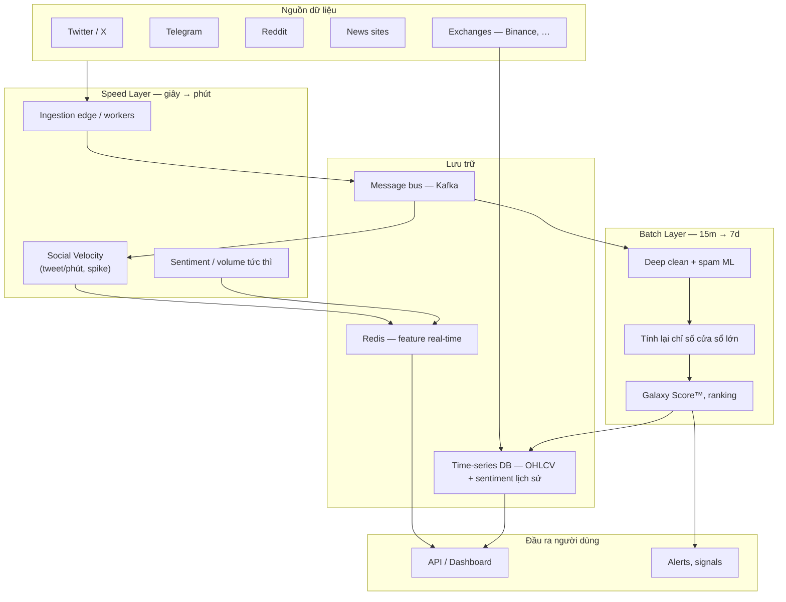
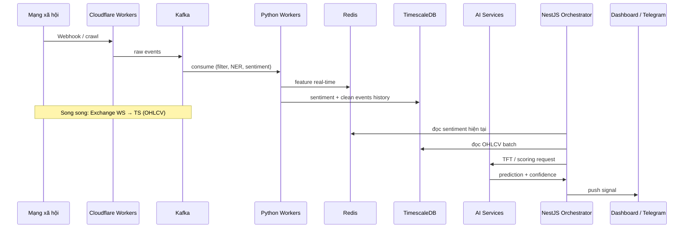
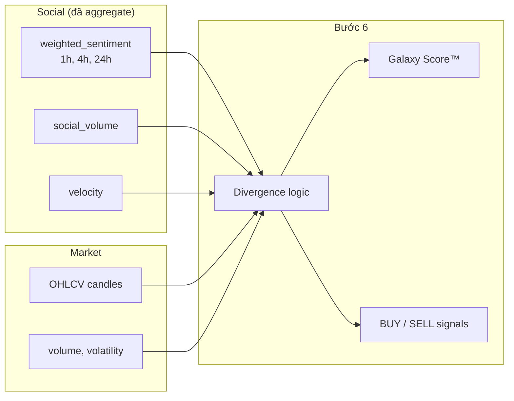

# Luồng dữ liệu LunarCrush (Social Intelligence)

**Version:** 1.0  
**Date:** 19/05/2026  
**Nguồn tham chiếu:** [`docs/luna_crush.md`](luna_crush.md)  
**Liên quan:** [`docs/pipeline-overview.md`](pipeline-overview.md) — phiên bản MVP lấy cảm hứng từ flow này

---

## 1. Mục đích tài liệu

Tài liệu này mô tả **dữ liệu đi đâu, biến đổi thế nào, và lưu ở đâu** trong pipeline LunarCrush — không đi sâu vào stack triển khai của team MVP.

Đọc song song:

| Tài liệu | Nội dung |
| --- | --- |
| `luna_crush.md` | Phân tích reverse-engineering, gợi ý tech stack |
| **Tài liệu này** | Flow dữ liệu end-to-end, contract giữa các bước |
| `pipeline-overview.md` | Ánh xạ flow → MVP (Kafka, FinBERT + CryptoBERT, TimescaleDB, …) |

---

## 2. Kiến trúc hai tầng: Lambda Architecture

LunarCrush xử lý **hàng tỷ điểm dữ liệu** social + market bằng mô hình **Hybrid Lambda**: vừa có kết quả gần real-time, vừa có lớp batch đảm bảo độ chính xác và lịch sử.



| Tầng | Vai trò trong flow | Độ trễ điển hình | Dữ liệu điển hình |
| --- | --- | --- | --- |
| **Speed Layer** | Đo **Social Velocity** — tốc độ lan truyền tin (tweet/phút, engagement spike) ngay khi post xuất hiện | Giây → vài phút | Counter theo coin, sentiment rolling ngắn |
| **Batch Layer** | Làm sạch sâu spam phức tạp, tính lại chỉ số trên cửa sổ **24h / 7d** (Galaxy Score™) | 15 phút → hàng ngày | Bảng ranking, divergence, signal dài hạn |

Hai tầng **cùng đọc** từ luồng raw ban đầu nhưng **không thay thế** nhau: Speed phục vụ dashboard/alerts tức thì; Batch đảm bảo metric “chính thức” và train lại model.

---

## 3. Luồng tổng thể (6 bước)

Dữ liệu social và market **hội tụ** ở Bước 6. Các bước 1–5 chỉ xử lý **nhánh social**; giá OHLCV đi song song từ exchanges và join khi scoring.

```text
┌─────────────────────────────────────────────────────────────────────────────┐
│                         NHÁNH SOCIAL (text + engagement)                     │
└─────────────────────────────────────────────────────────────────────────────┘

 [X, Reddit, Telegram, News, …]
              │
              ▼
        ┌───────────┐
        │  Bước 1   │  Raw Collection — post + likes + shares + followers + link meta
        └─────┬─────┘
              │  raw events (đa ngôn ngữ)
              ▼
        ┌───────────┐
        │  Bước 2   │  Spam / Noise Filter — organic vs bot hype
        └─────┬─────┘
              │  events sạch (hoặc DROP)
              ▼
        ┌───────────┐
        │  Bước 3   │  NER & Mapping — 1 post → N coin_id
        └─────┬─────┘
              │  fan-out theo coin (nếu mention nhiều coin)
              ▼
        ┌───────────┐
        │  Bước 4   │  Sentiment — label + strength
        └─────┬─────┘
              │  sentiment_score per (coin, post, time)
              ▼
        ┌───────────┐
        │  Bước 5   │  Influence Weighting — nhân hệ số authority
        └─────┬─────┘
              │  weighted sentiment contributions
              ▼
        ┌───────────┐
        │  Bước 6   │  Proprietary Scoring — Galaxy Score™, signals
        └─────┬─────┘
              │
              ▼
        [Dashboard / API / Alerts]

┌─────────────────────────────────────────────────────────────────────────────┐
│                         NHÁNH MARKET (song song)                           │
└─────────────────────────────────────────────────────────────────────────────┘

 [Binance / exchanges — WebSocket OHLCV]
              │
              ▼
        [Time-series store — nến 15m, 1h, 24h, …]
              │
              └──────────────────────► join tại Bước 6
```

---

## 4. Chi tiết flow từng bước

### Bước 1 — Raw Collection

**Input:** HTTP/Webhook/scrape từ mạng xã hội và news.

**Thu thập không chỉ text** mà cả context lan truyền:

| Trường | Vai trò trong flow |
| --- | --- |
| Nội dung post | Đầu vào NER + sentiment |
| Likes, shares, comments | Engagement → velocity + influence |
| Followers của author | Chuẩn bị cho Bước 5 |
| Metadata link | Ngữ cảnh bài viết (tin tức vs shill) |
| Timestamp UTC | Căn cứ time-window mọi bước sau |

**Output (conceptual):**

```json
{
  "event_id": "…",
  "source": "twitter | reddit | telegram | news",
  "raw_text": "…",
  "author_id": "…",
  "metrics": {
    "followers": 15000,
    "likes": 200,
    "shares": 40,
    "comments": 12
  },
  "link_meta": { "url": "…", "title": "…" },
  "language": "en",
  "timestamp": 1716110997
}
```

**Điểm vào hạ tầng:** Workers (Python) hoặc **Cloudflare Workers** ở edge → đẩy vào **Kafka** (`topic_raw_events`, …) để Speed Layer consume ngay.

---

### Bước 2 — AI Noise & Spam Filtering

**Input:** Raw events từ Bước 1.

**Biến đổi:** Phân loại **Organic buzz** vs **Bot hype**; loại bỏ duplicate và coordinated shill.

| Feature (engineering) | Dùng để |
| --- | --- |
| Tần suất post / user | Bot post liên tục |
| Engagement ratio `(likes + shares) / followers` | Shill ít follower nhưng engagement bất thường |
| Độ tương đồng nội dung | Copy-paste / campaign spam |

**Output:**

- **PASS** → tiếp Bước 3 (có thể gắn `is_spam: false`)
- **DROP** → không đi tiếp pipeline (giảm ~80% noise theo ước lượng industry)

```text
raw event ──► [heuristic real-time] ──► [ML batch bổ sung] ──► clean event | ∅
```

Speed Layer có thể chỉ heuristic; Batch Layer chạy model nặng hơn trên cùng retention Kafka.

---

### Bước 3 — Entity Recognition & Mapping

**Input:** Clean text + metadata.

**Biến đổi:** Map `$BTC`, "Ethereum", hashtag → **`coin_id`** trong registry nội bộ.

Ví dụ: *"I love $BTC and the new updates on Ethereum"* → **hai** luồng:

```text
1 post ──► fan-out ──► { coin_id: BTC,  clean_text, … }
                  └──► { coin_id: ETH,  clean_text, … }
```

**Output:** Mỗi bản ghi gắn **một** `coin_id` (multi-label → nhiều message).

---

### Bước 4 — Sentiment Analysis

**Input:** `(coin_id, clean_text, timestamp, author_id, source)`.

**Biến đổi:** Không chỉ Pos / Neg / Neu mà cả **Sentiment Strength** (độ mạnh cảm xúc).

| Khái niệm | Ý nghĩa flow |
| --- | --- |
| `sentiment_label` | positive / negative / neutral |
| `sentiment_score` | Scalar (ví dụ −1 … +1) — dùng aggregate |
| Crypto slang | **CryptoBERT** — tweet, Reddit, Telegram |
| Ngôn ngữ tài chính / news | **FinBERT** — bài báo, headline, ngữ cảnh formal |

**Chiến lược dual-model (MVP và production-scale):**

```text
clean event ──► route theo source ──┬── news / link_meta ──► FinBERT
                                    └── twitter | reddit | telegram ──► CryptoBERT
                                              │
                                              ▼
                                    sentiment_score, sentiment_label
```

| Model | Vai trò | Nguồn text điển hình |
| --- | --- | --- |
| **FinBERT** (`ProsusAI/finbert`) | Tone tài chính, headline, macro | `source: news`, metadata link |
| **CryptoBERT** (ví dụ `ElKulako/cryptobert-*`) | Slang crypto ("rekt", "wagmi", "to the moon") | Social post ngắn, emoji-heavy |

Cả hai chạy qua **FastAPI** inference service; consumer đọc từ Kafka topic sau Bước 3 (`topic_clean_events` hoặc tương đương), publish kết quả sang topic sentiment hoặc ghi thẳng Redis + TimescaleDB.

**Output:** Điểm sentiment **theo từng contribution** (mỗi post × coin), kèm `sentiment_model: finbert | cryptobert` — chưa aggregate.

**Lưu trữ:** Time-series DB cho lịch sử; Redis cho aggregate ngắn hạn (Speed Layer).

---

### Bước 5 — Influence Weighting

**Input:** Sentiment từ Bước 4 + metrics author từ Bước 1 (+ đồ thị follow nếu có).

**Nguyên tắc:** Một tweet từ tài khoản có authority cao **đóng góp nhiều hơn** hàng nghìn tweet từ account mới.

**Biến đổi (conceptual):**

```text
weighted_contribution = sentiment_score × influence_score(author)
```

`influence_score` kết hợp follower (log-scale), engagement lịch sử, verified/KOL, (tuỳ chọn) PageRank trên social graph.

**Output:** Stream các contribution đã trọng số — sẵn sàng aggregate theo `(coin_id, time_window)`.

---

### Bước 6 — Proprietary Scoring (Galaxy Score™)

**Input (join hai nhánh):**

| Nhánh | Dữ liệu |
| --- | --- |
| Social (sau Bước 5) | Weighted sentiment, social volume, velocity |
| Market | OHLCV, volume, volatility từ exchanges |

**Biến đổi:** Tính **divergence** giữa giá và sentiment:

| Tình huống | Giá | Social sentiment | Tín hiệu (logic) |
| --- | --- | --- | --- |
| Bullish divergence | Giảm / sideway | Tăng mạnh từ nguồn uy tín | Tiềm năng tích lũy / BUY |
| Bearish divergence | Tăng mạnh | Sentiment yếu / FUD | Phân phối / SELL |
| Confirmation | Cùng chiều | — | Trend follow |

**Output:**

- **Galaxy Score™** — ranking 0–100 “social health” theo coin
- Signals, alerts, API cho dashboard

```text
OHLCV (15m, 1h, 24h, …)  ──┐
                            ├──► Scoring engine ──► Galaxy Score™, signals
Σ weighted_sentiment(coin, Δt) ──┘
Social velocity (5m, 1h) ──┘
```

---

## 5. Reference architecture — flow theo tầng

Ánh xạ từ `luna_crush.md` §3 sang luồng dữ liệu:



| Tầng | Thành phần | Vai trò trong flow |
| --- | --- | --- |
| **Ingestion** | Cloudflare Workers | Nhận webhook / proxy crawl — giảm latency và băng thông về core |
| **Transport** | Kafka | Backbone bất đồng bộ; retention cho replay khi worker chết |
| **Speed cache** | Redis | Tweet count 5 phút, sentiment rolling — NestJS đọc nhanh |
| **History** | TimescaleDB | Nến + sentiment series — train TFT, vẽ chart |
| **AI Inference** | FastAPI + FinBERT + CryptoBERT | Bước 4 — route theo `source`, batch hoặc stream inference |
| **Prediction** | TFT (PyTorch) | Bước 6 — multimodal time-series |
| **Orchestrator** | NestJS | Khi có tick giá mới → hỏi Redis → gọi AI → đẩy Telegram |

---

## 6. Aggregate & time windows

Sau Bước 5, dữ liệu thường được **gom** trước khi vào scoring:

```text
contributions (post-level, weighted)
        │
        ▼
  GROUP BY coin_id, window
        │
        ├── window 5m   → Social Velocity (Speed Layer)
        ├── window 1h   → sentiment trung bình có trọng số
        ├── window 24h  → Galaxy Score™ input (Batch Layer)
        └── window 7d   → ranking dài hạn
```

Công thức aggregate điển hình (theo giờ):

```text
weighted_sentiment(coin, Δt) = Σ (sentiment_i × influence_i) / Σ influence_i
```

Social volume trong cùng `Δt` đi kèm để phát hiện spike độc lập với sentiment.

---

## 7. Điểm hội tụ: multimodal tại Scoring

Đây là **điểm duy nhất** hai domain (social + market) bắt buộc đồng bộ theo thời gian:



**Lưu ý thứ tự triển khai** (từ `luna_crush.md`): Không cần TFT ngay — có thể validate **correlation** Binance + sentiment trung bình/giờ trước khi đưa Transformer vào deep path.

---

## 8. Failure & replay (fault tolerance)

| Sự cố | Hành vi flow |
| --- | --- |
| Worker AI chết | Event vẫn nằm trên Kafka (retention 24h+) → worker sống lại consume tiếp |
| Spam filter sai | Batch Layer tính lại trên cửa sổ dài → điều chỉnh Galaxy Score |
| Exchange disconnect | OHLCV gap → scoring tạm dùng sentiment-only hoặc skip signal |
| Rate limit social | Rotating proxy / backoff — không block toàn pipeline |

---

## 9. So sánh nhanh với MVP của team

| Khía cạnh flow | LunarCrush (tài liệu gốc) | MVP (`pipeline-overview.md`) |
| --- | --- | --- |
| Transport | Kafka | **Kafka** (`topic_raw_events`, `topic_clean_events`, …) — Redpanda-compatible nếu cần drop-in |
| Ingestion edge | Cloudflare Workers | Python workers + `playground/ingest` → MongoDB Atlas (giai đoạn đầu) → producer Kafka |
| Spam | Proprietary ML | Heuristic + FastText cascade |
| Sentiment | Crypto RoBERTa / FinBERT | **FinBERT** (news) + **CryptoBERT** (social) qua FastAPI |
| Scoring | Galaxy Score™ proprietary | TFT + rule-based divergence |
| Orchestrator | (API nội bộ) | NestJS + Telegram |

Flow **logic 6 bước** giữ nguyên; MVP **cùng backbone Kafka** và **dual-model sentiment** thay vì một model general-purpose duy nhất.

---

## 10. Tóm tắt một dòng

**Raw social + market → lọc spam → gán coin → sentiment → trọng số influence → join OHLCV → Galaxy Score / signals** — với **Speed Layer** phục vụ real-time velocity và **Batch Layer** tính lại metric dài hạn trên cùng nguồn dữ liệu lịch sử.
