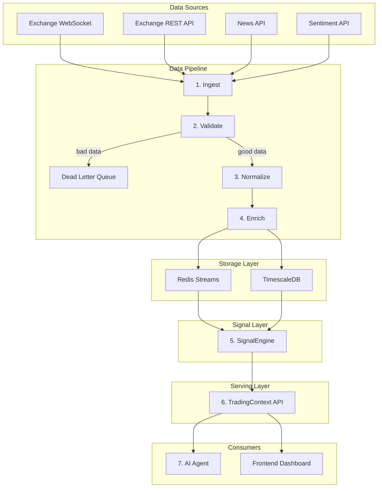
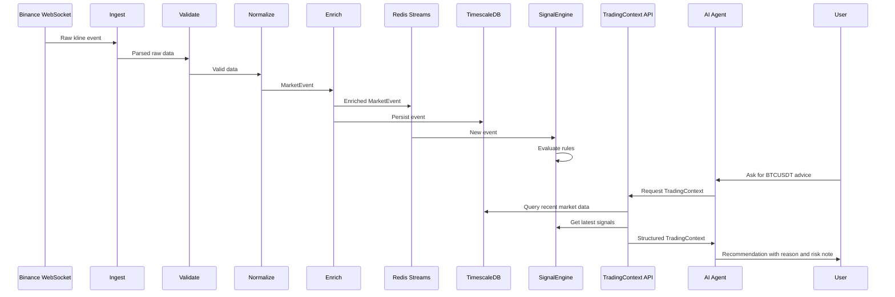

# Tài liệu mô tả Data Pipeline - Hệ thống phân tích Trading Crypto

## 1. Bài toán và mục tiêu

Hệ thống này được thiết kế để phân tích thị trường crypto theo thời gian gần thực, tổng hợp nhiều nguồn dữ liệu như giá, volume, order book, tin tức và sentiment, sau đó tạo ra ngữ cảnh có cấu trúc để AI Agent đưa ra nhận định dễ hiểu cho người dùng.

Mục tiêu không phải là để AI tự đọc dữ liệu thô rồi tự suy luận toàn bộ. Mục tiêu đúng hơn là xây dựng một data pipeline đủ tốt để biến dữ liệu thị trường hỗn loạn thành các tín hiệu rõ ràng, có nguồn gốc, có độ tin cậy và có thể giải thích.

Triết lý chính:

> 80% chất lượng nằm ở data pipeline và feature engineering. AI Agent chỉ là lớp cuối để tổng hợp, diễn giải và giao tiếp với người dùng.

Nếu gọi trực tiếp API của exchange rồi đưa raw data cho AI, hệ thống sẽ gặp nhiều vấn đề:

- Dữ liệu từ exchange thường có format riêng, nhiều trường viết tắt, khó hiểu với người dùng và dễ bị diễn giải sai.
- Raw candles, raw order book hoặc raw news không tự nói lên tín hiệu giao dịch nếu chưa được validate, chuẩn hóa và enrich.
- AI có thể hallucinate khi phải tự tính RSI, MACD, xu hướng hoặc rủi ro từ số liệu thô.
- Không có lớp kiểm soát chất lượng dữ liệu, nên data lỗi hoặc thiếu có thể đi thẳng vào recommendation.
- Không có khả năng trace ngược: không biết lời khuyên của AI đến từ chỉ báo nào, dữ liệu nào, thời điểm nào.

Vì vậy hệ thống cần một data pipeline có các tầng rõ ràng:

- Thu thập dữ liệu.
- Kiểm tra chất lượng.
- Chuẩn hóa format.
- Làm giàu bằng indicator và feature.
- Chuyển feature thành signal có ý nghĩa nghiệp vụ.
- Đóng gói thành context cho AI.
- Để AI diễn giải, không để AI tự tính toán lõi.

## 2. Kiến trúc tổng quan



Flow này có thể hiểu theo ngôn ngữ nghiệp vụ như sau:

1. **Exchange và các API bên ngoài** là nơi phát sinh dữ liệu thị trường.
2. **Ingest Layer** nhận dữ liệu thô từ các nguồn này.
3. **Validate Layer** kiểm tra dữ liệu có hợp lệ không.
4. **Normalize Layer** biến nhiều format khác nhau thành một format chung.
5. **Enrich Layer** bổ sung các chỉ báo kỹ thuật và feature quan trọng.
6. **Storage Layer** lưu dữ liệu phục vụ cả real-time và phân tích lịch sử.
7. **SignalEngine** biến indicator thành tín hiệu giao dịch có ý nghĩa.
8. **TradingContext API** gom các thông tin quan trọng thành một context duy nhất.
9. **AI Agent** dùng context đó để giải thích và đưa recommendation.
10. **Dashboard** hiển thị tín hiệu, giải thích và trạng thái thị trường cho người dùng.

Việc chia hệ thống thành nhiều tầng giúp mỗi tầng có trách nhiệm rõ ràng. Khi dữ liệu sai, ta biết lỗi nằm ở validate. Khi signal thiếu chính xác, ta kiểm tra enrich hoặc SignalEngine. Khi AI trả lời chưa tốt, ta biết vấn đề có thể nằm ở prompt hoặc context, không phải toàn bộ hệ thống.

## 3. Ngôn ngữ chung của hệ thống: MarketEvent

Trong hệ thống này, `MarketEvent` là ngôn ngữ chung giữa các thành phần. Bất kể dữ liệu đến từ Binance, một sàn khác, API tin tức hay nguồn sentiment, sau khi đi qua bước normalize, nó đều được biểu diễn dưới dạng `MarketEvent`.

Điều này quan trọng vì mỗi source thường có format riêng. Ví dụ Binance có thể dùng các field ngắn như `o`, `h`, `l`, `c`, `v`, trong khi một API khác lại dùng `open`, `high`, `low`, `close`, `volume`. Nếu các tầng sau phải hiểu mọi format nguồn, hệ thống sẽ rất khó mở rộng.

`MarketEvent` giúp hệ thống có một contract ổn định:

```python
class EventType(str, Enum):
    OHLCV = "ohlcv"
    ORDERBOOK = "orderbook"
    TRADE = "trade"
    NEWS = "news"
    SENTIMENT = "sentiment"


@dataclass
class MarketEvent:
    event_id: str
    event_type: EventType
    symbol: str
    exchange: str
    timestamp: datetime
    received_at: datetime
    data: dict
    metadata: dict
```

Ý nghĩa các trường:

- `event_id`: ID duy nhất của event, dùng để chống duplicate và trace.
- `event_type`: loại dữ liệu, ví dụ OHLCV, order book, news hoặc sentiment.
- `symbol`: cặp giao dịch, ví dụ `BTCUSDT`.
- `exchange`: nguồn dữ liệu, ví dụ `binance`.
- `timestamp`: thời điểm event xảy ra ở nguồn.
- `received_at`: thời điểm hệ thống nhận được event.
- `data`: payload chính, thay đổi theo từng loại event.
- `metadata`: thông tin phụ trợ như source, latency, version pipeline hoặc trạng thái enrich.

### 3.1 OHLCV Event

OHLCV mô tả biến động giá trong một khung thời gian. Đây là dữ liệu nền tảng để tính indicator kỹ thuật.

```python
{
    "o": 67500.0,          # open price
    "h": 67800.0,          # high price
    "l": 67200.0,          # low price
    "c": 67650.0,          # close price
    "v": 1234.56,          # base asset volume
    "qv": 83400000.0,      # quote asset volume
    "trades": 45230,       # number of trades
    "interval": "1h"
}
```

Sau khi enrich, OHLCV có thêm indicator:

```python
{
    "indicators": {
        "rsi": 65.3,
        "macd": 120.5,
        "macd_signal": 98.2,
        "macd_hist": 22.3,
        "bb_upper": 68100.0,
        "bb_middle": 67500.0,
        "bb_lower": 66900.0,
        "ema_20": 67400.0,
        "sma_50": 66800.0,
        "atr": 450.0,
        "volume_sma_20": 1100.0
    }
}
```

### 3.2 Orderbook Event

Orderbook cho biết lực mua và lực bán ở các mức giá gần hiện tại. Nó giúp đánh giá thanh khoản, spread và mất cân bằng cung cầu ngắn hạn.

```python
{
    "bids": [[67600.0, 1.5], [67590.0, 2.3]],
    "asks": [[67610.0, 0.8], [67620.0, 1.1]],
    "spread": 10.0,
    "spread_pct": 0.015,
    "imbalance": 0.62,
    "depth_5pct": {
        "bid_volume": 45.2,
        "ask_volume": 38.1
    }
}
```

Ý nghĩa nghiệp vụ:

- `spread` càng nhỏ thì thị trường càng dễ giao dịch.
- `imbalance > 0.5` cho thấy volume phía bid lớn hơn ask, có thể biểu hiện lực mua mạnh hơn.
- `depth_5pct` giúp hiểu thị trường dày hay mỏng trong vùng giá gần hiện tại.

### 3.3 News Event

News event mô tả tin tức liên quan đến thị trường hoặc một symbol cụ thể. Tin tức không nên đưa nguyên văn toàn bộ vào AI nếu không cần thiết; hệ thống chỉ cần giữ title, source, sentiment và mức liên quan.

```python
{
    "title": "Bitcoin surges past 67k amid ETF inflows",
    "source": "coindesk",
    "url": "https://example.com/news",
    "published_at": "2026-04-28T09:00:00Z",
    "sentiment": "positive",
    "relevance_score": 0.85,
    "categories": ["etf", "institutional"]
}
```

### 3.4 Sentiment Event

Sentiment event mô tả tâm lý chung của thị trường hoặc cộng đồng.

```python
{
    "score": 0.72,
    "fear_greed": 68,
    "label": "greed",
    "social_volume": 12500,
    "social_dominance": 0.35
}
```

Ý nghĩa nghiệp vụ:

- `score` nằm trong khoảng `-1.0` đến `1.0`, từ tiêu cực đến tích cực.
- `fear_greed` nằm trong khoảng `0` đến `100`.
- Sentiment không nên tự quyết định giao dịch, nhưng là tín hiệu bổ trợ quan trọng khi kết hợp với price action.

## 4. Các tầng xử lý chi tiết

### 4.1 Ingest Layer

Ingest là tầng thu thập dữ liệu từ bên ngoài. Với trading crypto, dữ liệu có thể đến theo hai kiểu chính:

- **Real-time streaming:** WebSocket từ exchange, ví dụ candle mới, order book update, trade update.
- **Polling:** gọi REST API định kỳ, ví dụ tin tức, sentiment, fear and greed index.

Tầng này chưa cố gắng hiểu ý nghĩa trading của dữ liệu. Nó chỉ có trách nhiệm nhận dữ liệu, parse format thô ban đầu và chuyển sang bước validate.

Ví dụ nguồn dữ liệu:

- Binance WebSocket cho OHLCV và order book.
- Binance REST API để backfill dữ liệu lịch sử.
- News API hoặc RSS để lấy tin tức.
- Sentiment API để lấy fear and greed, social volume hoặc social dominance.

Điểm quan trọng: ingest chỉ là cửa vào. Không nên để logic trading nằm ở đây, vì nếu logic nằm lẫn trong ingest, hệ thống sẽ khó thay source hoặc mở rộng sang exchange khác.

### 4.2 Validate Layer

Validate là lớp bảo vệ chất lượng dữ liệu. Trong hệ thống real-time, dữ liệu có thể bị thiếu trường, sai format, duplicate, out-of-order hoặc không hợp lý về mặt thị trường.

Một số rule validate cho OHLCV:

- `open`, `high`, `low`, `close`, `volume` phải tồn tại.
- Giá và volume không được âm.
- `high >= open`, `high >= close`.
- `low <= open`, `low <= close`.
- Timestamp không được nằm quá xa trong tương lai.
- Event không được trùng `event_id`.

Một số rule validate cho orderbook:

- Bid price phải nhỏ hơn ask price tốt nhất.
- Bid list nên được sắp giảm dần theo giá.
- Ask list nên được sắp tăng dần theo giá.
- Price và quantity phải lớn hơn 0.
- Update ID phải đúng thứ tự nếu source cung cấp sequence.

Khi dữ liệu không hợp lệ, hệ thống không nên bỏ qua im lặng. Dữ liệu lỗi được đưa vào **Dead Letter Queue**.

DLQ có vai trò:

- Lưu lại raw data bị reject.
- Ghi lý do bị reject.
- Hỗ trợ debug pipeline.
- Cho phép replay sau khi sửa logic validate hoặc parser.

Về mặt nghiệp vụ, validate giúp đảm bảo mọi tín hiệu về sau được xây trên dữ liệu đáng tin cậy.

### 4.3 Normalize Layer

Normalize biến dữ liệu từ format riêng của từng nguồn thành `MarketEvent`.

Ví dụ Binance kline có thể trả về:

```python
{
    "t": 1714294800000,
    "s": "BTCUSDT",
    "i": "1h",
    "o": "67500.00",
    "h": "67800.00",
    "l": "67200.00",
    "c": "67650.00",
    "v": "1234.56"
}
```

Sau normalize, hệ thống có:

```python
MarketEvent(
    event_type=EventType.OHLCV,
    symbol="BTCUSDT",
    exchange="binance",
    timestamp=datetime(...),
    data={
        "o": 67500.0,
        "h": 67800.0,
        "l": 67200.0,
        "c": 67650.0,
        "v": 1234.56,
        "interval": "1h"
    },
    metadata={
        "source": "binance_ws",
        "raw_event_type": "kline"
    }
)
```

Ý nghĩa của normalize:

- Các tầng sau không cần biết dữ liệu đến từ Binance, OKX hay Bybit.
- Có thể thêm source mới mà không phải sửa SignalEngine hoặc AI Agent.
- Giúp lưu trữ và truy vấn dữ liệu thống nhất.
- Giảm coupling giữa source bên ngoài và logic nội bộ.

### 4.4 Enrich Layer

Enrich là bước biến dữ liệu chuẩn hóa thành dữ liệu có nhiều thông tin hơn. Với OHLCV, enrich chủ yếu là tính technical indicators. Với news, enrich có thể là sentiment scoring hoặc relevance scoring.

Các indicator chính:

#### RSI

RSI đo momentum tăng giảm của giá. Nó thường được dùng để phát hiện vùng quá mua hoặc quá bán.

- `RSI > 70`: thị trường có thể đang overbought.
- `RSI < 30`: thị trường có thể đang oversold.
- `RSI 45-55`: thị trường tương đối trung tính.

RSI không phải tín hiệu mua bán trực tiếp. Nó chỉ nói rằng giá đã tăng hoặc giảm mạnh trong một khoảng thời gian.

#### MACD

MACD đo quan hệ giữa các đường trung bình động ngắn hạn và dài hạn. Nó thường được dùng để phát hiện thay đổi momentum.

- MACD cắt lên signal line: momentum có thể chuyển sang bullish.
- MACD cắt xuống signal line: momentum có thể chuyển sang bearish.
- MACD histogram tăng dần: momentum đang mạnh lên.

#### Bollinger Bands

Bollinger Bands đo vị trí giá so với trung bình động và độ biến động.

- Giá vượt upper band: có thể là overbought hoặc breakout.
- Giá dưới lower band: có thể là oversold hoặc breakdown.
- Band thu hẹp: thị trường đang tích lũy, có thể chuẩn bị biến động mạnh.

#### EMA và SMA

Moving average giúp xác định xu hướng chung.

- Giá trên EMA/SMA dài hạn: xu hướng có thể đang tích cực.
- Giá dưới EMA/SMA dài hạn: xu hướng có thể đang tiêu cực.
- EMA ngắn hạn cắt lên SMA dài hạn: có thể là tín hiệu bullish.

#### ATR

ATR đo độ biến động. Nó không nói hướng giá, nhưng cho biết rủi ro biến động.

- ATR cao: thị trường biến động mạnh, stop loss cần rộng hơn.
- ATR thấp: thị trường ít biến động, có thể đang tích lũy.

#### Volume SMA

So sánh volume hiện tại với volume trung bình giúp đánh giá độ tin cậy của biến động giá.

- Volume cao hơn 2 lần trung bình: signal giá đáng chú ý hơn.
- Volume thấp: breakout hoặc breakdown có thể thiếu xác nhận.

Enrich cần dữ liệu lịch sử. Ví dụ RSI cần ít nhất 14 candles, MACD cần khoảng 26 candles, Bollinger Bands cần khoảng 20 candles. Vì vậy pipeline nên duy trì một sliding window trong memory và có thể load lịch sử từ TimescaleDB khi khởi động.

### 4.5 SignalEngine

SignalEngine là tầng quan trọng nhất giữa data và AI. Nó chuyển indicator thành tín hiệu giao dịch có cấu trúc.

Indicator chỉ là số liệu. Signal là kết luận có ý nghĩa nghiệp vụ.

Ví dụ:

- `RSI = 75` là indicator.
- `overbought, strength = 0.7, reason = RSI 75 nằm trong vùng quá mua` là signal.

Signal có thể được mô tả như sau:

```python
@dataclass
class TradingSignal:
    symbol: str
    signal: str
    strength: float
    timeframe: str
    reason: str
    risk_level: str
    sources: list[str]
    conflicting: bool
    created_at: datetime
```

Ý nghĩa các trường:

- `signal`: loại tín hiệu, ví dụ `bullish`, `bearish`, `overbought`, `oversold`, `neutral`.
- `strength`: độ mạnh từ `0.0` đến `1.0`.
- `timeframe`: khung thời gian mà signal áp dụng, ví dụ `1h`, `4h`, `1d`.
- `reason`: giải thích rule-based, để AI và người dùng hiểu vì sao signal xuất hiện.
- `risk_level`: mức rủi ro tổng quát.
- `sources`: indicator hoặc feature đã tạo ra signal.
- `conflicting`: có mâu thuẫn giữa các nguồn tín hiệu hay không.

Một số rule:

- RSI > 70 tạo signal `overbought`.
- RSI < 30 tạo signal `oversold`.
- MACD cắt lên signal line và MACD > 0 tạo signal `bullish`.
- MACD cắt xuống signal line và MACD < 0 tạo signal `bearish`.
- Giá vượt Bollinger upper band tạo signal `overbought` hoặc `breakout` tùy volume.
- Giá dưới Bollinger lower band tạo signal `oversold` hoặc `breakdown`.
- Volume spike làm tăng độ mạnh của signal hiện tại.
- Orderbook imbalance nghiêng mạnh về bid có thể củng cố bullish signal.
- Orderbook imbalance nghiêng mạnh về ask có thể củng cố bearish signal.

Khi nhiều rule cùng kích hoạt:

- Nếu nhiều rule cùng hướng, SignalEngine tăng confidence.
- Nếu rule mâu thuẫn, SignalEngine giảm confidence và đánh dấu `conflicting = True`.
- Nếu strength thấp hoặc mâu thuẫn cao, hệ thống nên ưu tiên `neutral` hoặc khuyến nghị `wait`.

Ví dụ tổng hợp:

```python
{
    "symbol": "BTCUSDT",
    "signal": "bullish",
    "strength": 0.74,
    "timeframe": "1h",
    "reason": "MACD cắt lên signal line; volume cao hơn trung bình 2.1 lần; orderbook nghiêng về bid",
    "risk_level": "medium",
    "sources": ["macd", "volume", "orderbook"],
    "conflicting": False
}
```

Điểm quan trọng: SignalEngine không dùng AI. Nó phải deterministic, có thể test được và có thể giải thích được.

### 4.6 Serving Layer và TradingContext

Serving Layer chuẩn bị dữ liệu cho consumer, đặc biệt là AI Agent và Dashboard.

AI Agent không nên nhận raw candles hoặc raw orderbook. Thay vào đó, nó nhận một `TradingContext` đã được pipeline xử lý.

```python
@dataclass
class TradingContext:
    symbol: str
    risk_profile: str
    timestamp: datetime
    price: dict
    market_depth: dict
    sentiment: dict
    recent_news: list[dict]
    signals: list[TradingSignal]
```

Ví dụ:

```python
{
    "symbol": "BTCUSDT",
    "risk_profile": "moderate",
    "price": {
        "current": 67650.0,
        "change_1h": 0.8,
        "change_24h": 3.2,
        "signal": {
            "signal": "bullish",
            "strength": 0.74,
            "reason": "MACD cắt lên; volume tăng mạnh"
        }
    },
    "market_depth": {
        "spread_pct": 0.015,
        "imbalance": 0.62,
        "liquidity": "deep"
    },
    "sentiment": {
        "score": 0.72,
        "fear_greed": 68,
        "label": "greed"
    },
    "recent_news": [
        {
            "title": "Bitcoin surges past 67k amid ETF inflows",
            "sentiment": "positive"
        }
    ]
}
```

TradingContext là ranh giới giữa data system và AI system. Nó giúp AI:

- Không phải tự tính indicator.
- Không phải tự parse format của exchange.
- Không phải đọc quá nhiều raw number.
- Có thể tập trung vào tổng hợp và diễn giải.
- Có thể đưa lời khuyên nhất quán hơn vì input đã được kiểm soát.

### 4.7 AI Agent

AI Agent là lớp giao tiếp và reasoning cuối cùng. Nó không phải nơi tính toán kỹ thuật cốt lõi.

Vai trò của AI:

- Tổng hợp các signal đã được pipeline tạo ra.
- Giải thích tình hình thị trường bằng ngôn ngữ tự nhiên.
- Kết hợp signal kỹ thuật, orderbook, sentiment và news.
- Điều chỉnh cách diễn giải theo `risk_profile`.
- Trả recommendation theo format rõ ràng.

Ví dụ output mong muốn:

```python
{
    "action": "wait",
    "confidence": 0.58,
    "reason": "Tín hiệu kỹ thuật đang nghiêng bullish nhưng RSI gần vùng quá mua và sentiment thị trường đã khá tham lam.",
    "risk_note": "Không nên vào lệnh mới nếu giá không có pullback hoặc xác nhận volume tiếp theo."
}
```

Nguyên tắc quan trọng:

- Nếu signal strength thấp, AI nên khuyến nghị `wait`.
- Nếu signal mâu thuẫn, AI nên nói rõ mâu thuẫn.
- Nếu rủi ro cao, AI phải nhấn mạnh risk note.
- AI không được tự bịa indicator không có trong context.
- AI không được tính lại RSI, MACD hoặc volume rule.

## 5. Storage Layer: Redis Streams và TimescaleDB

Hệ thống dùng hai loại storage vì có hai nhu cầu khác nhau: real-time và historical analytics.

### 5.1 Redis Streams

Redis Streams phục vụ dữ liệu real-time.

Vai trò:

- Nhận event mới từ pipeline.
- Cho SignalEngine subscribe và xử lý gần real-time.
- Cho dashboard cập nhật trạng thái mới nhất.
- Là buffer khi consumer chậm hơn producer.

Ví dụ stream:

```text
stream:ohlcv:BTCUSDT
stream:orderbook:BTCUSDT
stream:news:BTCUSDT
stream:sentiment:market
```

Redis phù hợp cho:

- Latest events.
- Pub/sub style processing.
- Consumer group.
- Low latency.

Nhưng Redis không phải nơi chính để lưu lịch sử dài hạn.

### 5.2 TimescaleDB

TimescaleDB phục vụ lưu trữ và truy vấn lịch sử time-series.

Vai trò:

- Lưu toàn bộ `MarketEvent` đã normalize và enrich.
- Hỗ trợ query candles lịch sử để tính indicator.
- Hỗ trợ phân tích lại dữ liệu.
- Hỗ trợ backtesting rule trong SignalEngine.
- Hỗ trợ audit: signal hoặc advice được sinh ra từ dữ liệu nào.

Bảng chính có thể là:

```python
{
    "event_id": "uuid",
    "event_type": "ohlcv",
    "symbol": "BTCUSDT",
    "exchange": "binance",
    "timestamp": "2026-04-28T09:00:00Z",
    "received_at": "2026-04-28T09:00:01Z",
    "data": {...},
    "metadata": {...}
}
```

TimescaleDB phù hợp cho:

- Query theo thời gian.
- Aggregate 1h, 4h, 1d.
- Backfill dữ liệu.
- Backtesting.
- Lưu audit trail.

### 5.3 Vì sao cần cả hai?

Nếu chỉ dùng Redis, hệ thống xử lý real-time tốt nhưng yếu về lịch sử và phân tích dài hạn.

Nếu chỉ dùng TimescaleDB, hệ thống lưu lịch sử tốt nhưng real-time stream và fan-out đến nhiều consumer sẽ không linh hoạt bằng Redis Streams.

Kết hợp cả hai giúp hệ thống vừa nhanh cho real-time, vừa chắc cho historical analytics.

## 6. Error Handling và Resilience

Trong hệ thống trading, dữ liệu đến liên tục và có thể lỗi ở bất kỳ điểm nào. Resilience không phải phần phụ, mà là điều kiện để pipeline đáng tin cậy.

### 6.1 Reconnect

WebSocket có thể bị ngắt do network, exchange restart hoặc rate limit. Pipeline cần tự reconnect với exponential backoff.

Ví dụ logic:

- Lỗi lần 1: đợi 1 giây.
- Lỗi lần 2: đợi 2 giây.
- Lỗi lần 3: đợi 4 giây.
- Tăng dần đến giới hạn tối đa, ví dụ 60 giây.

### 6.2 Dead Letter Queue

DLQ lưu các event không xử lý được.

Mỗi DLQ record nên có:

```python
{
    "raw_data": {...},
    "error_reason": "missing close price",
    "pipeline_name": "BinanceOHLCVPipeline",
    "created_at": "2026-04-28T09:00:01Z"
}
```

DLQ giúp đội phát triển trả lời các câu hỏi:

- Data lỗi vì source thay đổi format hay vì parser sai?
- Rule validate có quá chặt không?
- Có cần replay event sau khi fix không?

### 6.3 Idempotency

Idempotency đảm bảo xử lý cùng một event nhiều lần không tạo dữ liệu trùng hoặc signal sai.

Cách làm:

- Mỗi event có `event_id` deterministic hoặc unique.
- Trước khi insert, kiểm tra event đã tồn tại chưa.
- Với WebSocket update có sequence ID, lưu sequence cuối đã xử lý.

### 6.4 Backpressure

Nếu dữ liệu đến quá nhanh nhưng consumer xử lý không kịp, hệ thống cần backpressure.

Ví dụ:

- Redis stream length vượt ngưỡng.
- SignalEngine lag quá nhiều message.
- TimescaleDB insert latency tăng cao.

Khi đó pipeline có thể giảm tốc độ ingest, batch insert hoặc tạm dừng source ít quan trọng hơn.

### 6.5 Observability

Pipeline cần metrics để biết nó đang khỏe hay không:

- Events per second.
- Validation failure rate.
- DLQ count.
- Ingest latency.
- End-to-end latency.
- Redis consumer lag.
- Timescale insert latency.
- Signal generation rate.

Nếu không có observability, hệ thống vẫn có thể chạy nhưng rất khó biết kết quả có đáng tin hay không.

## 7. Ví dụ end-to-end

Ví dụ người dùng hỏi:

> BTCUSDT hiện tại có nên long không?

Flow xử lý:

1. Binance phát candle mới cho `BTCUSDT` khung `1h`.
2. Ingest Layer nhận raw kline message.
3. Validate Layer kiểm tra giá, volume, timestamp và duplicate.
4. Normalize Layer chuyển raw kline thành `MarketEvent`.
5. Enrich Layer load lịch sử gần nhất và tính RSI, MACD, Bollinger Bands, ATR, volume SMA.
6. Event enriched được ghi vào Redis Streams và TimescaleDB.
7. SignalEngine đọc event mới, chạy rule:
   - MACD cắt lên signal line.
   - RSI đang ở 64, chưa overbought.
   - Volume cao hơn trung bình 2 lần.
   - Orderbook imbalance là 0.62, nghiêng về phía bid.
8. SignalEngine tạo signal `bullish` với strength `0.74`.
9. Người dùng gọi AI Agent.
10. AI Agent gọi TradingContext API.
11. TradingContext API gom latest price, signal, orderbook, sentiment và news.
12. AI Agent nhận context, tổng hợp và trả lời người dùng.



Ví dụ `TradingContext` rút gọn:

```python
{
    "symbol": "BTCUSDT",
    "risk_profile": "moderate",
    "price": {
        "current": 67650.0,
        "change_1h": 0.8,
        "change_24h": 3.2
    },
    "signals": [
        {
            "signal": "bullish",
            "strength": 0.74,
            "reason": "MACD cắt lên; volume cao hơn trung bình; orderbook nghiêng về bid",
            "risk_level": "medium",
            "sources": ["macd", "volume", "orderbook"],
            "conflicting": False
        }
    ],
    "sentiment": {
        "score": 0.72,
        "label": "greed"
    },
    "recent_news": [
        {
            "title": "Bitcoin ETF inflows continue to rise",
            "sentiment": "positive"
        }
    ]
}
```

Ví dụ AI response:

```python
{
    "action": "long",
    "confidence": 0.68,
    "reason": "Tín hiệu kỹ thuật đang nghiêng bullish nhờ MACD cắt lên, volume xác nhận và orderbook có lực mua tốt. Tuy nhiên sentiment đang ở vùng greed nên không nên vào lệnh quá lớn.",
    "risk_note": "Nên chờ retest hoặc đặt stop loss rõ ràng vì thị trường có thể đảo chiều nhanh khi sentiment quá lạc quan."
}
```

## 8. Tóm tắt vai trò các thành phần

| Thành phần | Vai trò chính | Không nên làm |
|---|---|---|
| Ingest | Nhận dữ liệu từ nguồn ngoài | Không chứa logic trading |
| Validate | Chặn dữ liệu lỗi | Không sửa data một cách âm thầm |
| Normalize | Chuẩn hóa về `MarketEvent` | Không tính indicator |
| Enrich | Tính indicator và feature | Không đưa recommendation |
| Redis Streams | Phục vụ real-time processing | Không lưu lịch sử dài hạn |
| TimescaleDB | Lưu và query dữ liệu lịch sử | Không thay thế message stream |
| SignalEngine | Chuyển feature thành signal | Không dùng AI hoặc prompt |
| TradingContext API | Đóng gói context cho consumer | Không trả raw data thừa |
| AI Agent | Tổng hợp và diễn giải | Không tự tính indicator |
| Dashboard | Hiển thị trạng thái và kết quả | Không tự quyết định logic lõi |

## 9. Kết luận thiết kế

Hệ thống được thiết kế theo hướng data-first. AI Agent chỉ đáng tin khi dữ liệu đầu vào đã được xử lý tốt, có cấu trúc và có thể giải thích.

Điểm quan trọng nhất của kiến trúc là `SignalEngine`. Đây là lớp chuyển từ thế giới dữ liệu kỹ thuật sang thế giới quyết định nghiệp vụ. Nó giúp hệ thống tránh phụ thuộc quá nhiều vào AI, giảm hallucination và tăng khả năng kiểm thử.

Flow đúng nên là:

```text
Raw Data -> Validated Data -> Normalized Event -> Enriched Features -> Structured Signals -> TradingContext -> AI Explanation
```

Khi đi theo flow này, hệ thống có thể mở rộng sang nhiều exchange, thêm nhiều loại dữ liệu, thay đổi rule signal, hoặc thay AI Agent mà không phá vỡ toàn bộ kiến trúc.
