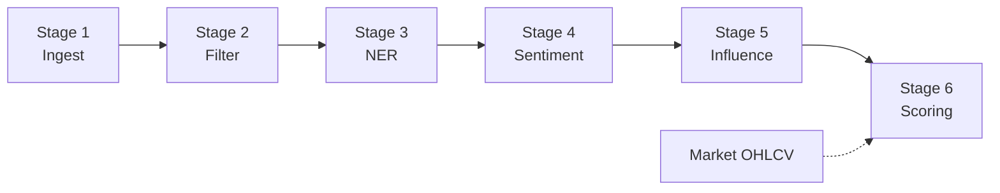

# Khung Cơ sở lý thuyết — Pipeline Social Intelligence

**Version:** 2.0  
**Date:** 13/06/2026  
**Tham chiếu:** [`luna_crush.md`](luna_crush.md) · [`lunacrush-data-flow.md`](lunacrush-data-flow.md) · [`pipeline-overview.md`](pipeline-overview.md) · [`khung-bao-cao.md`](khung-bao-cao.md)

Tài liệu này định nghĩa **cấu trúc chuẩn** cho phần Cơ sở lý thuyết từng stage/công nghệ trong pipeline. Nội dung điền sẵn nằm tại [`docs/theory/`](theory/).

---

## Cấu trúc chuẩn cho phần Cơ sở lý thuyết

Dùng **một block** cho mỗi công nghệ hoặc mỗi stage pipeline. Thay `{Tên công nghệ}` bằng tên cụ thể (ví dụ: *Thu thập dữ liệu thô*, *FastText Spam Filter*, *FinBERT Sentiment*).

---

### 1. Tổng quan về {Tên công nghệ}

**Khái niệm:** Định nghĩa ngắn gọn, chuẩn xác công nghệ này là gì.

**Vai trò:** Bài toán cốt lõi mà nó giải quyết trong lĩnh vực công nghệ phần mềm hoặc xử lý dữ liệu.

---

### 2. Kiến trúc và Các thành phần cốt lõi

Liệt kê và giải thích các module, service hoặc khái niệm cấu thành nên công nghệ này.

Nêu rõ chức năng riêng biệt của từng thành phần để người đọc nắm được bức tranh tổng thể.

*(Có thể kèm sơ đồ thư mục, bảng component, hoặc diagram kiến trúc.)*

---

### 3. Cơ chế hoạt động và Vai trò trong Pipeline

**Nguyên lý hoạt động:** Công nghệ này xử lý đầu vào và trả ra đầu ra như thế nào theo từng bước?

**Vị trí trong Pipeline:** Nó đứng ở giai đoạn nào trong toàn bộ quy trình (ví dụ: thu thập dữ liệu, lọc chất lượng, phân tích NLP, tính điểm tín hiệu)?

**Khả năng tích hợp:** Cách thức công nghệ này giao tiếp với các công cụ, nền tảng hoặc service lân cận trong hệ thống.

*(Có thể kèm flowchart ASCII/mermaid và bảng input/output contract.)*

---

### 4. Ưu điểm và Hạn chế

**Ưu điểm:** Các đặc tính nổi bật (hiệu suất, khả năng mở rộng, kiến trúc tối ưu, phù hợp domain…).

**Hạn chế:** Rào cản kỹ thuật (tài nguyên, độ phức tạp, phụ thuộc bên thứ ba, gap MVP…).

*(Nên trình bày dạng bảng so sánh khi có phương án thay thế.)*

---

### 5. Lý do lựa chọn

Tổng kết ngắn gọn lý do công nghệ này là mảnh ghép phù hợp nhất cho pipeline của hệ thống đang báo cáo.

So sánh ngắn với phương án bị loại (nếu có). Liên kết yêu cầu NFR/FR của đề tài.

---

## Mẫu Markdown copy-paste

```markdown
## Cơ sở lý thuyết — {Tên công nghệ}

### 1. Tổng quan về {Tên công nghệ}

**Khái niệm:** …

**Vai trò:** …

### 2. Kiến trúc và Các thành phần cốt lõi

| Thành phần | Chức năng |
| --- | --- |
| … | … |

### 3. Cơ chế hoạt động và Vai trò trong Pipeline

**Nguyên lý hoạt động:** …

**Vị trí trong Pipeline:** …

**Khả năng tích hợp:** …

### 4. Ưu điểm và Hạn chế

**Ưu điểm:** …

**Hạn chế:** …

### 5. Lý do lựa chọn

…
```

---

## Ánh xạ Stage → Tài liệu lý thuyết

| Stage | Công nghệ / chủ đề | Module | Tài liệu |
| --- | --- | --- | --- |
| 1 | Data Ingestion (Raw Collection) | `playground/ingest` | [`theory/ingest.md`](theory/ingest.md) ✅ |
| 2 | Spam / Noise Filtering (Cascade L1–L3) | — | [`theory/spam-filter.md`](theory/spam-filter.md) ✅ |
| 3 | NER & Coin Mapping | — | [`theory/ner-mapping.md`](theory/ner-mapping.md) ✅ |
| 4 | Sentiment Analysis (FinBERT / CryptoBERT) | `playground/sentiment` | *(chưa viết)* |
| 5 | Influence Weighting | `playground/influence` | *(chưa viết)* |
| 6 | Scoring / Galaxy Score / TFT | `playground/scoring` | *(chưa viết)* |

**Lưu ý khi viết:** Chỉ trình bày lý thuyết **phục vụ trực tiếp** stage đó; trích dẫn nguồn (APA/Harvard theo quy định trường); không liệt kê lan man các công nghệ stage khác.

---

## Pipeline tổng thể (tham chiếu nhanh)


