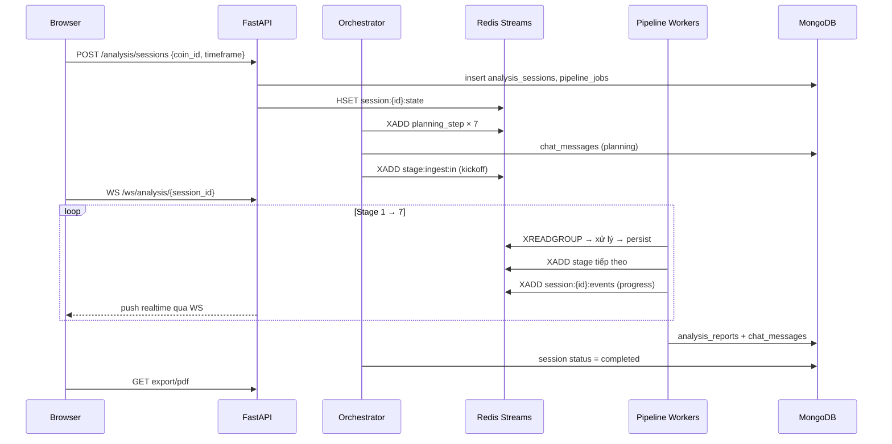

# Tổng hợp quy trình xử lý dữ liệu

> Tài liệu mô tả **toàn bộ luồng xử lý dữ liệu đã triển khai** trong project Crypto Social Intelligence Pipeline.  
> **Tham chiếu:** [`kien-truc-he-thong.md`](kien-truc-he-thong.md) · [`theory/README.md`](theory/README.md) · [`src/pipeline/README.md`](../src/pipeline/README.md)

---

## 1. Tổng quan

Hệ thống phân tích coin crypto bằng cách kết hợp **dữ liệu social** (Twitter, Reddit, tin tức) với **dữ liệu thị trường** (OHLCV Binance). Khi người dùng bấm **Phân tích**, một phiên (session) được tạo và pipeline ETL **7 stage** chạy tuần tự logic:

```text
Ingest → Filter → NER → Sentiment → Influence → Scoring → Insight
```

| Nguyên tắc | Cách triển khai |
| --- | --- |
| Event-driven | Stage giao tiếp qua **Redis Streams**, không gọi trực tiếp nhau |
| At-least-once | `XACK` chỉ sau khi persist MongoDB + fan-out downstream |
| Idempotent | `event_id` UUID; unique index MongoDB; dedup theo `(source, external_id)` ở ingest |
| Source-of-truth lịch sử | **MongoDB** — audit, chat, PDF export |
| Realtime UI | **WebSocket** đọc control stream `session:{id}:events` |
| Single-tenant | Không auth user; `session_id` là scope duy nhất |

---

## 2. Luồng end-to-end

### 2.1. Kích hoạt phân tích



**Kickoff payload** (Orchestrator → `stage:ingest:in`):

```json
{
  "type": "session_start",
  "coin_id": "BTC",
  "timeframe": "1h",
  "sources": ["twitter", "news-av", "news-yahoo"]
}
```

Nguồn thu thập khả dụng: `twitter`, `news-av` (Alpha Vantage), `news-yahoo`, `reddit`. Nguồn thiếu API key được bỏ qua (graceful skip).

### 2.2. Vòng đời một message trong worker

Mỗi stage worker (`src/pipeline/_runtime/worker.py`) lặp vô hạn:

```text
XREADGROUP (block 5s) → processor() → persist MongoDB → XADD next stream → XACK
```

- **Retry:** XCLAIM entry idle > 30s; tối đa 3 lần → chuyển DLQ `stage:{name}:dlq`
- **Backpressure:** `XADD MAXLEN ~ 50000` trên transport streams
- **Consumer group:** `cg:{stage}`; consumer name `{hostname}-{pid}`

### 2.3. Topology Redis Streams

| Stage | Input stream | Output stream | Collection MongoDB |
| --- | --- | --- | --- |
| 1 Ingest | `stage:ingest:in` | `stage:filter:in` | `raw_events` |
| 2 Filter | `stage:filter:in` | `stage:ner:in` | `clean_events`, `dropped_events` |
| 3 NER | `stage:ner:in` | `stage:sentiment:in` | `mapped_events` |
| 4 Sentiment | `stage:sentiment:in` | `stage:influence:in` | `sentiment_events` |
| 5 Influence | `stage:influence:in` | `stage:scoring:in` | `weighted_events`, `influence_aggregates` |
| 6 Scoring | `stage:scoring:in` | `stage:insight:in` | `scoring_signals` |
| 7 Insight | `stage:insight:in` | — (terminal) | `analysis_reports`, `chat_messages` |

**Control bus** (mỗi session): `session:{session_id}:events` — planning, progress, signal, LLM token, report_done.

**Runtime state:** `session:{session_id}:state` (Redis Hash) — counters, status, `current_stage`.

---

## 3. Chi tiết từng stage

### Stage 1 — Ingest (Thu thập dữ liệu thô)

**Mục đích:** Đưa dữ liệu đa nguồn về **raw event** thống nhất.

**Module:** `src/pipeline/ingest/`

| Thành phần | Vai trò |
| --- | --- |
| `service.py` | Dispatch collector theo `sources[]` trong kickoff |
| `collectors/twitter.py` | Twitter qua RapidAPI |
| `collectors/news_av.py` | Tin tức Alpha Vantage (tickers `CRYPTO:BTC`) |
| `collectors/news_yahoo.py` | Yahoo Finance / yfinance (`BTC-USD`) |
| `collectors/reddit.py` | Reddit OAuth API |
| `events.py` | Adapter API response → schema `raw_events` |
| `worker.py` | `ingest_processor()` — gọi collector, persist, fan-out |

**Quy trình xử lý:**

1. Nhận kickoff `{coin_id, timeframe, sources[]}`
2. Với mỗi source trong registry: kiểm tra API key → gọi collector
3. Chuẩn hóa response qua adapter → raw event document
4. Dedup theo `(source, external_id)` trước khi ghi
5. Persist `raw_events` → XADD từng event vào `stage:filter:in`

**Schema raw event (trường chính):**

| Trường | Mô tả |
| --- | --- |
| `event_id` | UUID nội bộ |
| `source` | `twitter`, `reddit`, `news`, … |
| `raw_text` | Nội dung gốc |
| `author_id` | Tác giả / publisher |
| `metrics` | likes, retweets, followers, … |
| `timestamp` | Event time (UTC) |
| `ingested_at` | Processing time |
| `external_id` | ID gốc từ nguồn |

**Lý thuyết chi tiết:** [`theory/ingest.md`](theory/ingest.md)

---

### Stage 2 — Filter (Lọc spam và nhiễu)

**Mục đích:** Phân loại **organic buzz** vs **bot hype**; chỉ event PASS đi tiếp pipeline NLP.

**Module:** `src/pipeline/filter/`

**Cascade 3 tầng** (`cascade.py`):

```text
L1 Heuristic → L2 SimHash → L3 FastText → PASS
     ↓ DROP        ↓ DROP       ↓ DROP
```

| Tầng | Module | Tiêu chí loại bỏ |
| --- | --- | --- |
| **L1** | `heuristic.py` | Text rỗng, regex pump/spam, ngưỡng engagement, cap post/author |
| **L2** | `dedup.py` | Near-duplicate qua SimHash + Hamming distance |
| **L3** | `ml.py` | FastText binary spam/human (skip nếu không có model hoặc `source=news`) |

**Output:**

- **PASS** → `clean_events` (`clean_text`, `is_spam: false`, metadata lớp đã qua)
- **DROP** → `dropped_events` (tuỳ chọn, ghi `drop_reason`, `filter.stage`)

Nguyên tắc **DROP sớm**: không gọi ML nếu đã bị loại ở L1/L2.

**Lý thuyết chi tiết:** [`theory/spam-filter.md`](theory/spam-filter.md)

---

### Stage 3 — NER / Coin Mapping (Nhận diện thực thể)

**Mục đích:** Trả lời *"post này nói về coin nào?"* — gán `coin_id` chuẩn trước sentiment per-coin.

**Module:** `src/pipeline/ner/`

| Thành phần | Vai trò |
| --- | --- |
| `registry.py` | Coin registry — symbol, alias, ticker |
| `rules.py` | Cashtag `$BTC`, regex, metadata news |
| `llm.py` | OpenRouter resolver (tuỳ mode) |
| `pipeline.py` | Orchestrate hybrid / validator / full |
| `documents.py` | Fan-out → N `mapped_events` |

**Ba mode vận hành** (cấu hình `NER_MODE`):

| Mode | Luồng |
| --- | --- |
| **Hybrid** | Rules trước; LLM chỉ khi 0 mention + text crypto-related |
| **Validator** | Rules đề xuất; LLM xác nhận/sửa |
| **Full** | Chỉ LLM quyết định mention |

**Fan-out:** Một clean event mention nhiều coin → N mapped events, mỗi bản ghi **một** `coin_id`:

```text
"I love $BTC and Ethereum" → {coin_id: BTC} + {coin_id: ETH}
```

Event không map được coin: bỏ qua, không đi sentiment per-coin.

**Lý thuyết chi tiết:** [`theory/ner-mapping.md`](theory/ner-mapping.md)

---

### Stage 4 — Sentiment (Phân tích cảm xúc)

**Mục đích:** Gán điểm cảm xúc (-1 → +1) và nhãn `positive` / `negative` / `neutral` cho từng mapped event.

**Module:** `src/pipeline/sentiment/`

**Thứ tự ưu tiên scorer** (`service.py`):

1. **Alpha Vantage bypass** — tin `news` có sẵn sentiment từ AV API
2. **FinBERT** — nếu bật `use_finbert` (model HuggingFace)
3. **Rule-based fallback** — từ điển bullish/bearish (`rule_based.py`)

**Output:** `sentiment_events` — kế thừa `coin_id`, `clean_text`, thêm `sentiment_score`, `sentiment_label`, `sentiment_confidence`, `sentiment_method`.

---

### Stage 5 — Influence (Trọng số ảnh hưởng & aggregate)

**Mục đích:** Không phải mọi opinion đều bằng nhau — tính **influence weight** và gom cửa sổ thời gian.

**Module:** `src/pipeline/influence/`

**Công thức influence** (`scoring.py`):

```text
influence = source_weight × time_decay × quality_score × (1 + CORE_SCALE × core)

core = α·author_authority + β·engagement_strength + γ·virality_surprise + δ·network_influence
```

| Thành phần | Ý nghĩa |
| --- | --- |
| `source_weight` | Twitter 1.0, Reddit 0.9, news 1.15; publisher Reuters/Bloomberg cao hơn |
| `time_decay` | Exponential decay theo half-life (Twitter ngắn hơn news) |
| `quality_score` | sentiment_confidence × ner_confidence × (1 − spam_prob) |
| `author_authority` | Followers, verified, account age (sigmoid) |
| `engagement_strength` | log(engagement) normalized |
| `virality_surprise` | Engagement vs kỳ vọng author |

**Quy trình worker:**

1. Tính `influence_weight` → ghi `weighted_events`
2. Rollup theo `(coin_id, timeframe, window_start)` → `influence_aggregates`
3. Build **scoring trigger** (aggregate + lịch sử social) → XADD `stage:scoring:in`

**Aggregate metrics:** `social_volume`, `avg_sentiment`, `influence_weighted_sentiment`, phân bố label.

---

### Stage 6 — Scoring (Galaxy dual-score & tín hiệu)

**Mục đích:** Join social aggregate với OHLCV thị trường → **Galaxy Alpha/Safety Score** → quyết định `BUY` / `HOLD` / `SELL`.

**Module:** `src/pipeline/scoring/`

**Nguồn dữ liệu:**

- Social: `social_history` từ scoring trigger (influence aggregates)
- Market: OHLCV Binance qua **CCXT** (`market.py`)

**Ma trận tính toán** (Polars, `service.py`):

1. Log return, rolling z-score (window cấu hình `SCORING_WINDOW`)
2. Rolling OLS slope momentum
3. CARA penalty theo volatility
4. Social impact: `social_volume × velocity_social` → z-score
5. Orthogonalize momentum features
6. **Dual scores:** `galaxy_alpha_score`, `galaxy_safety_score`
7. Fractal swing detection
8. **KL divergence** giữa phân phối giá và sentiment gần nhất

**Rule engine** (`rules.py`):

| Điều kiện | Action |
| --- | --- |
| alpha > 60 và safety > 40; KL thấp hoặc fractal confirm | `BUY` |
| alpha > 60 nhưng KL > 0.5 và không có swing low | `HOLD` |
| alpha < 40 | `SELL` |
| Còn lại | `HOLD` |

**Output:** `scoring_signals` — action, metrics, execution (`target_price`, `stop_loss`). Emit control event `signal_ready` cho UI.

---

### Stage 7 — Insight (Báo cáo LLM)

**Mục đích:** Tổng hợp kết quả scoring + context social thành báo cáo phân tích tự nhiên; stream token realtime; xuất PDF.

**Module:** `src/pipeline/insight/`

**Quy trình** (`service.py`):

1. `load_insight_context()` — query `sentiment_events`, `influence_aggregates` từ MongoDB
2. `render_prompt()` — prompt template với coin, signal, metrics, sample events
3. `collect_insight_text()` — stream OpenRouter LLM; emit `llm_token` vào control bus
4. Fallback text nếu LLM lỗi
5. Ghi `analysis_reports` + `chat_messages` (type report)
6. Emit `report_done` → Orchestrator finalize session

**PDF export:** `src/api/services/pdf_export.py` — WeasyPrint render báo cáo session.

---

## 4. Điều phối & giám sát

### 4.1. Orchestrator

**Module:** `src/orchestrator/`

| Chức năng | File |
| --- | --- |
| Tạo session + kickoff | `session.py` → `create_session()` |
| Planning 7 bước | `planning.py` → `emit_planning()` |
| Monitor control stream | `monitor.py` → state machine, finalize |

**Session state machine:**

```text
created → planning → running → insight_streaming → completed
                              ↘ failed_partial
```

### 4.2. Control events (observability)

| event_type | Emitter | Mục đích UI |
| --- | --- | --- |
| `planning_step` | Orchestrator | Danh sách 7 bước kế hoạch |
| `stage_started` / `stage_progress` / `stage_completed` | Worker | Progress bar ETL |
| `stage_failed` | Worker | Thông báo lỗi |
| `signal_ready` | Scoring worker | Card BUY/HOLD/SELL |
| `llm_token` | Insight worker | Stream markdown |
| `report_done` | Insight worker | Bật nút tải PDF |
| `session_completed` | Orchestrator | Kết thúc phiên |

### 4.3. Khởi chạy workers

```bash
# Tất cả 7 workers
uv run --extra pipeline python -m src.pipeline

# Chỉ một số stage
uv run --extra pipeline python -m src.pipeline --stages ingest filter

# Một batch rồi dừng (test)
uv run --extra pipeline python -m src.pipeline --once
```

Workers cần chạy **sau** API server (API/Orchestrator tạo session và kickoff).

---

## 5. Dữ liệu thị trường (ngoài pipeline ETL)

Dashboard TradingView và Stage 6 dùng OHLCV/ticker **độc lập** với luồng social:

| Luồng | Module | Nguồn |
| --- | --- | --- |
| REST `/market/ohlcv`, `/market/ticker` | `src/api/services/market_service.py` | CCXT Binance |
| Scoring join | `src/pipeline/scoring/market.py` | CCXT Binance |

Cache có thể lưu MongoDB; frontend dùng `lightweight-charts` hiển thị nến.

---

## 6. Pattern triển khai stage

Mỗi stage tuân theo **pattern 3 lớp** (`src/pipeline/README.md`):

| Lớp | Trách nhiệm |
| --- | --- |
| `service.py` | Business logic thuần — không biết Redis/Mongo |
| `worker.py` | Wire service + persist + trả output cho runtime harness |
| `documents.py` | Map kết quả → MongoDB schema |

Persist dùng chung `src/pipeline/_persist.py` — `insert_one` + catch `DuplicateKeyError` (idempotent).

---

## 7. Collections MongoDB

| Collection | Stage ghi | Nội dung |
| --- | --- | --- |
| `raw_events` | 1 | Event thô đa nguồn |
| `clean_events` | 2 | Event đã lọc PASS |
| `dropped_events` | 2 | Event bị DROP (audit) |
| `mapped_events` | 3 | Event gắn `coin_id` |
| `sentiment_events` | 4 | Sentiment per coin |
| `weighted_events` | 5 | Event + influence weight |
| `influence_aggregates` | 5 | Gom cửa sổ thời gian |
| `scoring_signals` | 6 | Tín hiệu BUY/HOLD/SELL |
| `analysis_reports` | 7 | Báo cáo LLM |
| `analysis_sessions` | Orchestrator | Metadata phiên |
| `pipeline_jobs` | Orchestrator | Job snapshot |
| `chat_messages` | Orchestrator + Insight | Lịch sử chat UI |

---

## 8. Sơ đồ luồng dữ liệu tổng hợp

```text
[Nguồn: Twitter, Reddit, Alpha Vantage, Yahoo Finance]
                    │
                    ▼
         ┌──────────────────────┐
         │  Stage 1: INGEST     │ → raw_events
         └──────────┬───────────┘
                    ▼
         ┌──────────────────────┐
         │  Stage 2: FILTER     │ → clean_events / dropped_events
         │  L1 → L2 → L3        │
         └──────────┬───────────┘
                    ▼
         ┌──────────────────────┐
         │  Stage 3: NER        │ → mapped_events (fan-out)
         │  Rules + LLM         │
         └──────────┬───────────┘
                    ▼
         ┌──────────────────────┐
         │  Stage 4: SENTIMENT  │ → sentiment_events
         │  AV / FinBERT / Rule │
         └──────────┬───────────┘
                    ▼
         ┌──────────────────────┐
         │  Stage 5: INFLUENCE  │ → weighted_events
         │  Weight + Aggregate  │   influence_aggregates
         └──────────┬───────────┘
                    ▼
         ┌──────────────────────┐     [Binance CCXT OHLCV]
         │  Stage 6: SCORING    │ ←──────────────────────
         │  Galaxy + KL + Rules │ → scoring_signals
         └──────────┬───────────┘
                    ▼
         ┌──────────────────────┐
         │  Stage 7: INSIGHT    │ → analysis_reports
         │  OpenRouter LLM      │   chat_messages + PDF
         └──────────────────────┘
```

**Transport giữa các stage:** Redis Streams (`stage:*:in`).  
**Giám sát & UI realtime:** Control stream `session:{id}:events` qua WebSocket.

---

## 9. Tài liệu liên quan

| Chủ đề | File |
| --- | --- |
| Kiến trúc hệ thống đầy đủ | [`kien-truc-he-thong.md`](kien-truc-he-thong.md) |
| Lý thuyết Stage 1–3 | [`theory/ingest.md`](theory/ingest.md), [`theory/spam-filter.md`](theory/spam-filter.md), [`theory/ner-mapping.md`](theory/ner-mapping.md) |
| Hướng dẫn viết stage mới | [`src/pipeline/README.md`](../src/pipeline/README.md) |
| Kế hoạch phát triển theo phase | [`ke-hoach-phat-trien/README.md`](ke-hoach-phat-trien/README.md) |
| Thiết kế MVP ban đầu (Redpanda/Kafka) | [`pipeline-overview.md`](pipeline-overview.md) — tham khảo lý thuyết; triển khai hiện tại dùng Redis Streams |
