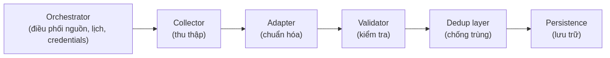
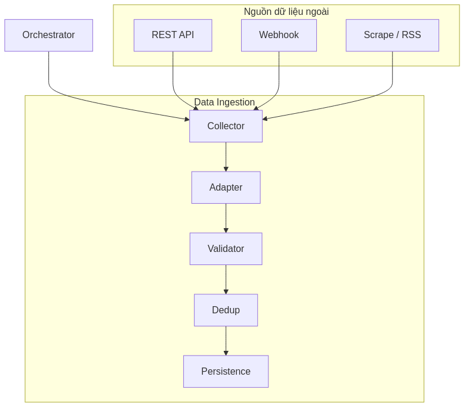
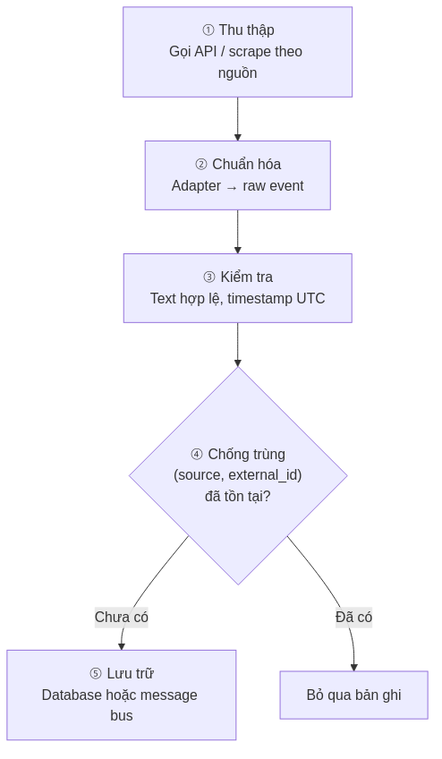
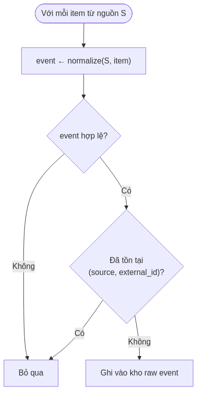
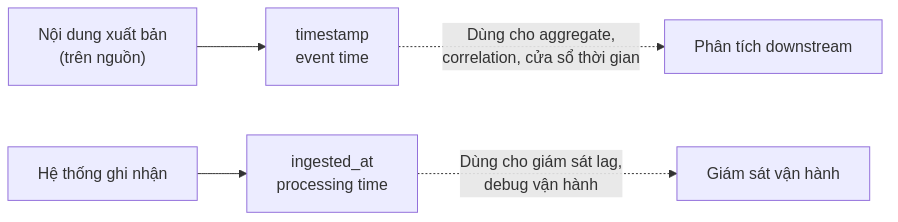
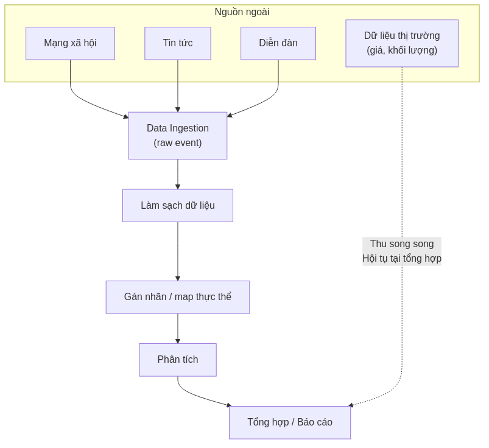
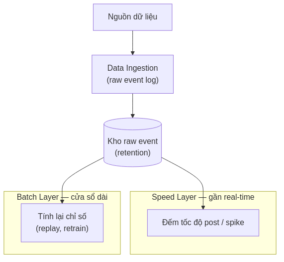
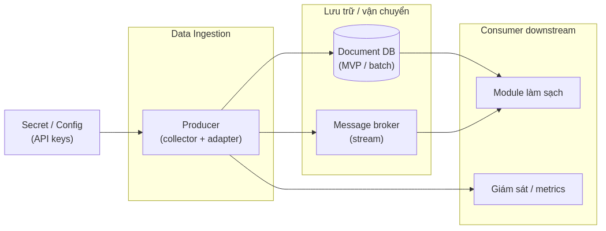

# Cơ sở lý thuyết — Thu thập dữ liệu thô (Data Ingestion)

**Version:** 4.1  
**Date:** 13/06/2026  
**Phạm vi:** Thành phần độc lập — thu thập và chuẩn hóa dữ liệu social cho pipeline phân tích  
**Khung trình bày:** [`../pipeline-theory-form.md`](../pipeline-theory-form.md)  
**Sơ đồ (PNG):** [`diagrams/ingest/`](diagrams/ingest/) — nguồn Mermaid `.mmd`, tái tạo: `./diagrams/ingest/render.sh`

---

## 1. Tổng quan về Thu thập dữ liệu thô (Data Ingestion)

### Khái niệm

**Data Ingestion** (thu thập dữ liệu thô) là giai đoạn đưa dữ liệu từ hệ thống bên ngoài — API mạng xã hội, cổng tin tức, webhook hoặc kết quả scrape — vào hệ thống xử lý nội bộ dưới dạng **raw event**: bản ghi có cấu trúc thống nhất, bất biến sau khi ghi, có thể lưu trữ lâu dài và tái xử lý.

Mỗi raw event đại diện cho **một đơn vị nội dung** (bài đăng, tin tức, thảo luận) kèm metadata tác giả, chỉ số tương tác và mốc thời gian theo chuẩn UTC. Đây là lớp dữ liệu gốc; mọi bước làm sạch, gán nhãn hay phân tích phía sau đều dựa trên raw event, không quay lại gọi trực tiếp API nguồn.

### Vai trò

Data Ingestion giải quyết bài toán cốt lõi trong xử lý dữ liệu đa nguồn: **nhiều định dạng đầu vào — một schema đầu ra**.

| Vấn đề | Cách ingest giải quyết |
| --- | --- |
| Mỗi API trả JSON/schema khác nhau | Chuẩn hóa qua lớp adapter về contract thống nhất |
| Các module phía sau không nên phụ thuộc API gốc | Thu thập một lần; consumer đọc từ kho raw event |
| Cần chạy lại pipeline khi đổi thuật toán | Raw log append-only, không sửa nội dung gốc |
| Thu thập định kỳ gặp bản ghi trùng | Ghi idempotent theo khóa nguồn `(source, external_id)` |

Trong bối cảnh phân tích thị trường tài chính, ingest không chỉ lưu văn bản mà còn bảo toàn **context lan truyền** — lượt thích, chia sẻ, bình luận, quy mô người theo dõi — vì các chỉ số này phản ánh mức độ chú ý và tốc độ lan truyền thông tin trên mạng xã hội (Rogers, 2003; Shiller, 2019).

---

## 2. Kiến trúc và Các thành phần cốt lõi

Kiến trúc logic của một hệ thống Data Ingestion đa nguồn thường gồm các vai trò sau (có thể triển khai trong một hoặc nhiều service):

| Thành phần | Chức năng |
| --- | --- |
| **Collector (bộ thu thập)** | Kết nối từng nguồn dữ liệu (REST API, RSS, webhook, browser automation); lấy batch hoặc stream bản ghi thô. |
| **Adapter (bộ chuyển đổi)** | Ánh xạ response nguồn sang schema nội bộ: mã sự kiện, loại nguồn, nội dung, tác giả, metrics, thời gian, metadata liên kết. |
| **Validator (bộ kiểm tra)** | Loại bản ghi thiếu nội dung usable; chuẩn hóa thời gian về Unix UTC; làm sạch HTML/entity nếu là tin tức. |
| **Dedup layer (lớp chống trùng)** | Trước khi ghi, kiểm tra khóa `(source, external_id)`; bỏ qua bản ghi đã tồn tại. |
| **Persistence (lớp lưu trữ)** | Ghi raw event vào document store hoặc message log; đánh index unique phục vụ dedup. |
| **Orchestrator (bộ điều phối)** | Chọn nguồn cần thu, lập lịch (cron/daemon), quản lý secret, báo cáo tiến độ và lỗi. |

**Schema raw event (contract logic):**

| Trường | Mô tả | Vai trò downstream |
| --- | --- | --- |
| `event_id` | Mã định danh nội bộ (UUID) | Truy vết xuyên suốt pipeline |
| `source` | Loại nguồn (`twitter`, `reddit`, `news`, …) | Phân nhánh xử lý theo đặc thù nguồn |
| `raw_text` | Nội dung gốc | Nhận diện thực thể, phân tích cảm xúc |
| `author_id` | Định danh tác giả hoặc publisher | Giới hạn tần suất, trọng số uy tín |
| `metrics` | Tương tác và quy mô audience | Lọc nhiễu, đo volume, trọng số ảnh hưởng |
| `timestamp` | Thời điểm xuất bản (event time, UTC) | Gom cửa sổ thời gian, tương quan chuỗi thời gian |
| `ingested_at` | Thời điểm hệ thống ghi nhận (processing time) | Đo độ trễ thu thập, giám sát vận hành |
| `external_id` | Mã gốc từ nguồn | Khóa dedup |
| `link_meta` | URL, tiêu đề, tag liên quan (tuỳ nguồn) | Ngữ cảnh tin tức, gợi ý map tài sản |

---

## 3. Cơ chế hoạt động và Vai trò trong Pipeline

### Nguyên lý hoạt động

Quy trình xử lý điển hình (batch hoặc near-real-time):

Logic xử lý từng bản ghi thu được:

**Hai mốc thời gian** (Kleppmann, 2017):

- **Event time** (`timestamp`) — lúc nội dung được đăng tải; dùng cho aggregate và phân tích chuỗi thời gian.
- **Processing time** (`ingested_at`) — lúc hệ thống ingest ghi nhận; dùng giám sát lag, **không** thay thế event time khi tính cửa sổ phân tích.

### Vị trí trong Pipeline

Data Ingestion đứng **đầu nhánh dữ liệu phi cấu trúc / bán cấu trúc** (social, news) trong pipeline phân tích:

Trong kiến trúc **Lambda** (Marz & Warren, 2015), cùng một luồng raw event phục vụ cả xử lý gần real-time và xử lý batch:

### Khả năng tích hợp

| Đối tượng tích hợp | Vai trò | Cách triển khai phổ biến |
| --- | --- | --- |
| **Document database** | Lưu raw event giai đoạn MVP / batch | Insert có unique index trên `(source, external_id)` |
| **Message broker** (Kafka, RabbitMQ, …) | Stream event, decouple producer/consumer | JSON payload; partition key = `{source}:{external_id}` |
| **Module làm sạch dữ liệu** | Consumer đọc raw, xuất bản ghi đã lọc | Query DB hoặc subscribe topic downstream |
| **Secret / config store** | API key, endpoint | Biến môi trường hoặc vault; không nhúng credential trong code |
| **Giám sát** | Theo dõi throughput, lỗi, lag | Metric số bản ghi/phút, tỷ lệ skip duplicate |

Nguyên tắc **tách biệt trách nhiệm**: module ingest chỉ biết API nguồn và contract đầu ra; module phía sau chỉ biết contract, không phụ thuộc SDK từng nền tảng (Gamma et al., 1994 — Adapter pattern).

---

## 4. Ưu điểm và Hạn chế

### Ưu điểm

| Đặc tính | Giải thích |
| --- | --- |
| **Schema thống nhất** | Nhiều nguồn cùng một contract → giảm phụ thuộc chéo giữa các module |
| **Raw log bất biến** | Không sửa bản ghi gốc → audit, replay khi đổi thuật toán (Fowler, 2003) |
| **Ghi idempotent** | Dedup theo khóa nguồn → chạy lại job an toàn, không phình volume |
| **Mở rộng nguồn** | Thêm collector + adapter mới; consumer downstream không đổi |
| **Linh hoạt lưu trữ MVP** | Document store phù hợp schema field thay đổi theo nguồn |
| **Metadata phong phú** | Text + engagement + thời gian → đủ input cho lọc nhiễu và phân tích có trọng số |

### Hạn chế

| Rào cản | Ảnh hưởng | Hướng giảm thiểu |
| --- | --- | --- |
| **Thu thập batch thay vì stream liên tục** | Độ trễ realtime cao hơn | Nâng cấp worker daemon + message broker |
| **Metrics không đồng nhất giữa nguồn** | Tin tức thường thiếu engagement; diễn đàn thiếu follower | Ghi nhận gap trong schema; bổ sung field khi API cho phép |
| **Phụ thuộc API bên thứ ba** | Rate limit, thay đổi schema | Retry/backoff; adapter tách biệt; fallback timestamp |
| **Chi phí lưu trữ** | Raw log tích lũy theo thời gian | Chính sách archive/TTL ở môi trường production |
| **Đa ngôn ngữ** | Cần detect language nếu mở rộng locale | Bổ sung bước detect sau ingest hoặc trong adapter |
| **Độ phức tạp vận hành** | Nhiều credential, nhiều nguồn | Orchestrator tập trung; giám sát và alert |

So với **lưu trực tiếp file JSON thủ công**: mô hình ingest có cấu trúc dedup và contract rõ ràng hơn, nhưng đòi hỏi hạ tầng lưu trữ và quản lý cấu hình phức tạp hơn.

---

## 5. Lý do lựa chọn

Đối với pipeline phân tích dữ liệu social phục vụ dự báo hoặc đánh giá thị trường tài chính, mô hình **Data Ingestion đa nguồn + Adapter + raw event bất biến + dedup** được lựa chọn vì:

1. **Điều kiện cần cho chất lượng phân tích** — Các bước lọc nhiễu, phân tích cảm xúc và tổng hợp chỉ số cần đầu vào ổn định, đủ metadata; ingest tập trung hóa việc thu thập thay vì rải logic API khắp pipeline.

2. **Khả năng mở rộng nguồn** — Thị trường crypto có tín hiệu từ nhiều kênh (MXH, tin tức, cộng đồng); adapter pattern cho phép bổ sung nguồn mới mà không refactor consumer.

3. **Cân bằng MVP và scale** — Giai đoạn đầu có thể dùng document database và job định kỳ; logic chuẩn hóa tách khỏi transport nên có thể chuyển sang message broker khi tải tăng mà không đổi contract.

4. **Bảo toàn thông tin cho nghiên cứu** — Chỉ lưu văn bản bỏ mất feature engagement cần cho phát hiện bot và đo lan truyền (Baker & Wurgler, 2007; Boyd et al., 2010).

5. **So với phương án thay thế:**

| Phương án | Đánh giá |
| --- | --- |
| Gọi API trực tiếp tại từng module phân tích | Trùng request, dễ vượt rate limit, schema rải rác → **không chọn** |
| Cơ sở dữ liệu quan hệ cứng ngay từ đầu | Khó biểu diễn field tuỳ nguồn → document store **phù hợp hơn** giai đoạn đầu |
| Message broker ngay từ ngày đầu | Đúng hướng production nhưng tốn chi phí vận hành → **lộ trình**, không bắt buộc MVP |
| ETL một lần (one-shot export) | Không hỗ trợ cập nhật và replay → **không đủ** cho pipeline liên tục |

**Kết luận:** Data Ingestion với chuẩn hóa đa nguồn, ghi idempotent và raw event bất biến là thành phần nền tảng phù hợp cho hệ thống phân tích dữ liệu social trong lĩnh vực tài chính — độc lập với bất kỳ sản phẩm thương mại cụ thể nào, và có thể triển khai theo nhiều mức độ (batch → stream) tùy quy mô hệ thống.

---

## Tài liệu tham khảo

Baker, M., & Wurgler, J. (2007). Investor sentiment in the stock market. *Journal of Economic Perspectives*, *21*(2), 129–151.

Boyd, D., Golder, S., & Lotan, G. (2010). Tweet, tweet, retweet: Conversational aspects of retweeting on Twitter. *Proceedings of HICSS-43*.

Fowler, M. (2003). *Patterns of enterprise application architecture*. Addison-Wesley.

Gamma, E., Helm, R., Johnson, R., & Vlissides, J. (1994). *Design patterns: Elements of reusable object-oriented software*. Addison-Wesley.

Kleppmann, M. (2017). *Designing data-intensive applications*. O'Reilly Media.

Marz, N., & Warren, J. (2015). *Big data: Principles and best practices of scalable realtime data systems*. Manning Publications.

Rogers, E. M. (2003). *Diffusion of innovations* (5th ed.). Free Press.

Shiller, R. J. (2019). *Narrative economics: How stories go viral and drive major economic events*. Princeton University Press.
