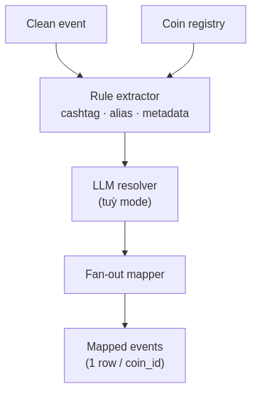
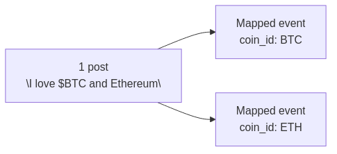
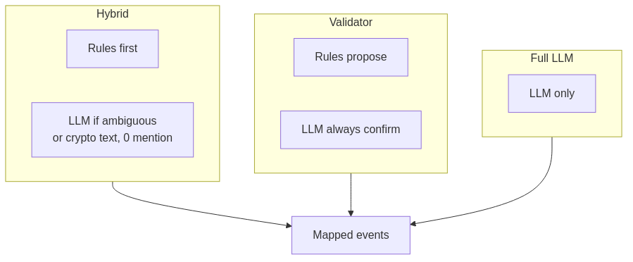
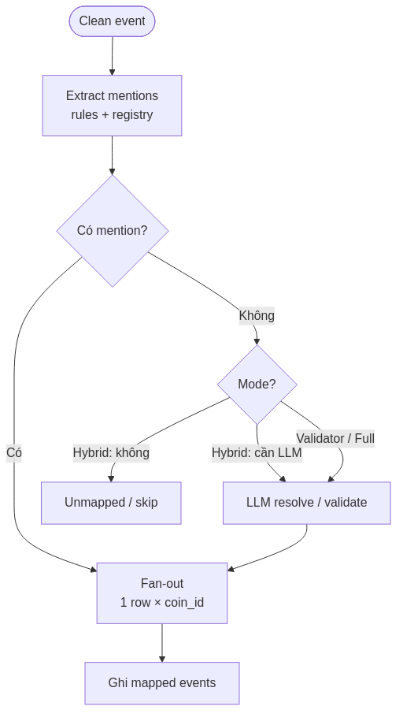
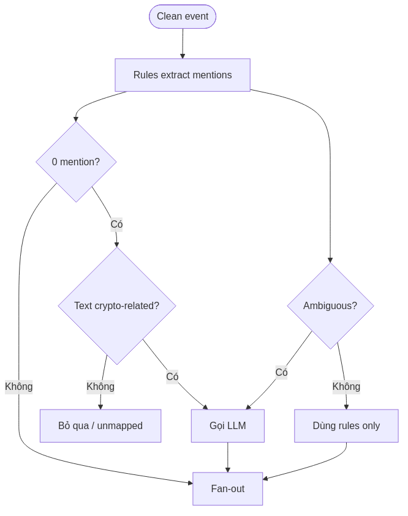
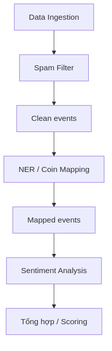
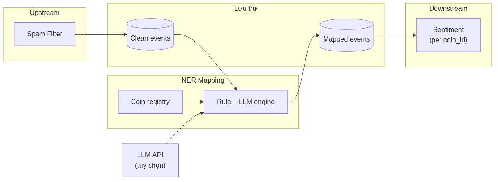

# Cơ sở lý thuyết — NER và gán coin (Entity Recognition & Coin Mapping)

**Version:** 1.0  
**Date:** 14/06/2026  
**Phạm vi:** Thành phần độc lập — nhận diện thực thể tài sản crypto và gán `coin_id` cho clean event  
**Khung trình bày:** [`../pipeline-theory-form.md`](../pipeline-theory-form.md)  
**Sơ đồ (PNG):** [`diagrams/ner-mapping/`](diagrams/ner-mapping/) — nguồn Mermaid `.mmd`, tái tạo: `./diagrams/ner-mapping/render.sh`

---

## 1. Tổng quan về NER và gán coin (Entity Recognition & Coin Mapping)

### Khái niệm

**Entity Recognition & Coin Mapping** (nhận diện thực thể và gán mã coin) là giai đoạn phân tích ngôn ngữ tự nhiên nhằm xác định **post hoặc bài news liên quan đến tài sản crypto nào**, rồi gán mỗi mention về **`coin_id`** chuẩn trong registry nội bộ (ví dụ `BTC`, `ETH`).

Khác spam filter và sentiment, bước này trả lời câu hỏi *“nội dung này nói về coin nào?”* — không đánh giá tích cực/tiêu cực. Một post có thể mention nhiều coin → **fan-out** thành nhiều **mapped event**, mỗi bản ghi gắn đúng một `coin_id`.

### Vai trò

NER mapping giải quyết bài toán **multi-entity attribution** trong domain crypto:

| Vấn đề | Hậu quả nếu bỏ qua | Cách NER mapping giải quyết |
| --- | --- | --- |
| Một post mention nhiều coin | Sentiment gộp sai coin | Fan-out: 1 post → N mapped event |
| Cashtag, alias đa dạng (`$BTC`, Bitcoin, ₿) | Không map được entity | Registry + rule + (tuỳ chọn) LLM |
| Ambiguity (`SOL` vs từ tiếng Anh) | False positive map coin | Context + validator / hybrid mode |
| News gắn ticker metadata | Bỏ sót coin từ headline | Metadata `related_tickers`, symbol |
| Sentiment không có `coin_id` | Không aggregate theo asset | Output bắt buộc có `coin_id` trước Stage 4 |

Trong pipeline phân tích social–market, sentiment và scoring **phải tính theo từng coin** — NER là cầu nối giữa text tổng quát và time-series theo asset (Loughran & McDonald, 2011 — NER trong tài liệu tài chính).

**Mục tiêu:** gán `coin_id` chính xác, có evidence và confidence, sẵn sàng cho sentiment per-coin.

---

## 2. Kiến trúc và Các thành phần cốt lõi

Kiến trúc điển hình kết hợp **knowledge base**, **rule engine** và **LLM validator** (tuỳ mode):



| Thành phần | Chức năng |
| --- | --- |
| **Coin registry (kho danh mục)** | Bảng tra cứu symbol, tên đầy đủ, alias, ticker sàn — nguồn sự thật cho `coin_id` |
| **Rule extractor** | Cashtag `$BTC`, regex symbol, alias từ dictionary, metadata news (ticker, related_symbols) |
| **LLM resolver (tuỳ chọn)** | Xử lý text mơ hồ, ngữ cảnh phức tạp, multi-mention — trả danh sách coin có căn cứ |
| **Mode orchestrator** | Chọn hybrid / validator / full — cân bằng chi phí API vs độ chính xác |
| **Fan-out mapper** | 1 clean event × N mention → N mapped event; unique `(parent_event_id, coin_id)` |
| **Metadata ghi nhận** | `method`, `evidence`, `confidence`, `used_llm` — audit và tune |



**Ba mode vận hành phổ biến:**



| Mode | Luồng | Khi dùng |
| --- | --- | --- |
| **Hybrid** | Rules trước; LLM chỉ khi 0 mention + text crypto-related, hoặc ambiguous | MVP — tiết kiệm token, đủ cho cashtag rõ |
| **Validator** | Rules đề xuất; LLM luôn xác nhận/sửa | Batch review, cần accuracy cao hơn |
| **Full LLM** | Chỉ LLM quyết định mention | Text dài, ít cashtag, ngữ cảnh phức tạp |

**Contract mapped event (logic):**

| Trường | Mô tả |
| --- | --- |
| `mapped_id` | UUID bản ghi mapped |
| `parent_event_id` | Liên kết clean event gốc |
| `coin_id` | Mã coin chuẩn (registry) |
| `clean_text` | Text kế thừa từ upstream |
| `ner.method` | `cashtag`, `alias`, `metadata`, `llm`, … |
| `ner.evidence` | Chuỗi/substring chứng minh map |
| `ner.confidence` | Độ tin cậy 0–1 |
| `ner.used_llm` | Có gọi LLM hay không |

**Thách thức domain crypto (so với NER general):**

| Hiện tượng | Ví dụ | Hướng xử lý |
| --- | --- | --- |
| Cashtag vs từ thường | `$SOL` vs "sol" (mặt trời) | Rule + context window |
| Alias đa dạng | Bitcoin = BTC = ₿ | Registry alias list |
| Competitor context | "ETH killer" có thể không nói ETH | LLM / disambiguation |
| News ticker | `BTC-USD` trong metadata | Normalization symbol → `BTC` |

---

## 3. Cơ chế hoạt động và Vai trò trong Pipeline

### Nguyên lý hoạt động

Mỗi clean event đi qua: **tra registry → extract mention → (tuỳ mode) LLM → fan-out**.





**Nguyên tắc fan-out:**

```text
"I love $BTC and Ethereum updates"
    → { coin_id: BTC,  clean_text, parent_event_id, … }
    → { coin_id: ETH,  clean_text, parent_event_id, … }
```

Mỗi mapped event **một** `coin_id` — sentiment downstream aggregate đúng theo asset.

**Precision over recall:** map nhầm coin (false positive) gây sentiment/signal sai coin — nghiêm trọng hơn bỏ sót mention hiếm. Registry giới hạn Top-N coin MVP là chiến lược kiểm soát precision (Finkel et al., 2005 — NER evaluation).

### Vị trí trong Pipeline



NER mapping đứng **sau Spam Filter**, **trước Sentiment Analysis**:

- **Input:** clean event (`clean_text`, metadata, `source`)
- **Output:** mapped event(s) — 0, 1 hoặc N bản ghi
- Event **không map được** coin nào: có thể bỏ qua hoặc ghi unmapped — không đi sentiment per-coin

### Khả năng tích hợp



| Đối tượng | Vai trò |
| --- | --- |
| **Upstream — Spam Filter** | Cung cấp clean event |
| **Coin registry** | JSON / DB — cập nhật alias khi thêm asset |
| **LLM API (tuỳ chọn)** | OpenRouter / OpenAI-compatible — disambiguation |
| **Downstream — Sentiment** | Đọc mapped event theo `coin_id` |
| **Document store / bus** | `mapped_events`; index unique `(parent_event_id, coin_id)` |

---

## 4. Ưu điểm và Hạn chế

### Ưu điểm

| Đặc tính | Giải thích |
| --- | --- |
| **Fan-out đúng mô hình dữ liệu** | Sentiment/volume tính per-coin — khớp time-series giá |
| **Hybrid tiết kiệm chi phí** | Cashtag/alias xử lý bulk; LLM chỉ edge case |
| **Registry kiểm soát vocabulary** | Không map sang coin ngoài phạm vi MVP |
| **Audit trail** | `evidence`, `method`, `confidence` — debug map sai |
| **Metadata news** | Ticker từ headline bổ sung cho rule-based |
| **Tách biệt NER vs sentiment** | Mỗi stage một bài toán — dễ tune độc lập |

### Hạn chế

| Rào cản | Ảnh hưởng | Hướng giảm thiểu |
| --- | --- | --- |
| **Ambiguity ngôn ngữ** | Map sai hoặc bỏ sót | Validator mode; LLM context |
| **Phụ thuộc LLM API** | Latency, cost, rate limit | Hybrid; cache; batch |
| **Registry stale** | Coin mới / rebrand không có | Cập nhật registry định kỳ |
| **Multi-language** | Alias tiếng Việt/Trung chưa có | Mở rộng registry; multilingual NER |
| **0 mention** | Event không vào sentiment per-coin | Chấp nhận hoặc fallback macro topic |
| **Contract address** | On-chain mention khó rule | Phase 2 — address lookup |

So với **chỉ regex cashtag:** nhanh và rẻ nhưng miss "Bitcoin" không có `$`; hybrid + LLM bù gap mà vẫn kiểm soát cost.

So với **NER general-purpose (spaCy en_core_web_sm):** không hiểu `$BTC`, crypto slang — cần **domain registry + custom rules** (Honnibal & Montani, 2017 — spaCy EntityRuler pattern).

---

## 5. Lý do lựa chọn

Đối với pipeline phân tích social crypto, mô hình **Registry + Rule extraction + Hybrid LLM + Fan-out** được lựa chọn vì:

1. **Điều kiện cầu cho sentiment per-coin** — Không có `coin_id`, không aggregate đúng theo asset (Bollen et al., 2011).

2. **Domain specificity** — Crypto NER khác NLP general; registry + cashtag rule xử lý phần lớn social post với latency thấp.

3. **Cân bằng cost/accuracy** — Full LLM mọi post tốn token; hybrid gọi LLM khi rules không đủ — phù hợp MVP và scale dần.

4. **Fan-out là mô hình dữ liệu đúng** — Multi-mention là norm trên Twitter/Reddit; một row một coin tránh double-count sentiment.

5. **So với phương án thay thế:**

| Phương án | Đánh giá |
| --- | --- |
| Keyword search đơn giản (`BTC` in text) | False positive cao ("BTC" trong URL, viết tắt khác) → **không đủ** |
| Chỉ LLM, không registry | Hallucination coin_id → **cần registry làm ground truth** |
| Gán coin thủ công | Không scale → **tự động hóa bắt buộc** |
| NER sau sentiment | Sentiment không biết coin → **sai thứ tự pipeline** |
| Single-label (1 coin/post) | Mất multi-mention → **fan-out bắt buộc** |

**Kết luận:** NER và coin mapping với registry, rule engine, hybrid LLM và fan-out là thành phần then chốt giữa làm sạch dữ liệu và phân tích cảm xúc theo từng tài sản — triển khai được batch hoặc stream với cùng contract mapped event.

---

## Tài liệu tham khảo

Bollen, J., Mao, H., & Zeng, X. (2011). Twitter mood predicts the stock market. *Journal of Computational Science*, *2*(1), 1–8.

Finkel, J. R., Grenager, T., & Manning, C. (2005). Incorporating non-local information into information extraction systems by Gibbs sampling. *ACL*, 363–370.

Honnibal, M., & Montani, I. (2017). spaCy 2: Natural language understanding with Bloom embeddings, convolutional neural networks and incremental parsing. *To appear*.

Loughran, T., & McDonald, B. (2011). When is a liability not a liability? Textual analysis, dictionaries, and 10-Ks. *Journal of Finance*, *66*(1), 35–65.

Nadeau, D., & Sekine, S. (2007). A survey of named entity recognition and classification. *Lingvisticae Investigationes*, *30*(1), 3–26.

Weischedel, R., & Brunstein, J. (2005). BBN pronoun coreference and entity type taxonomy. *Proceedings of ACE Evaluation*.

---
