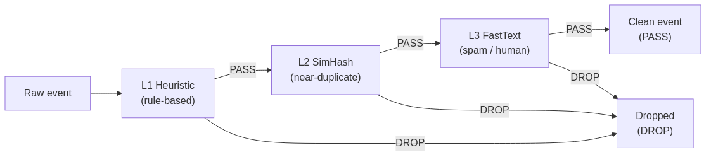
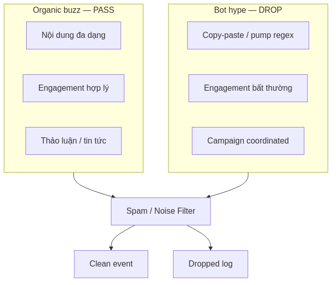
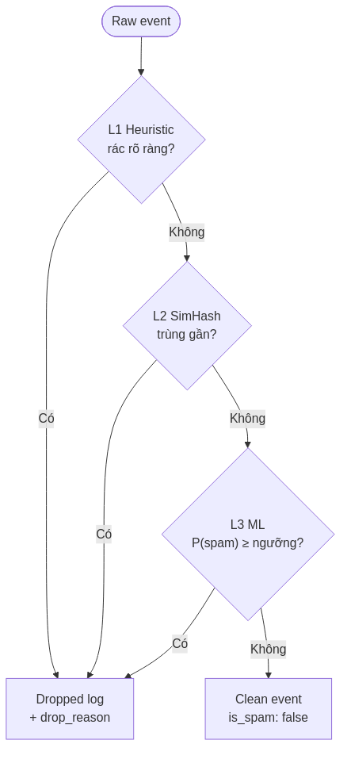
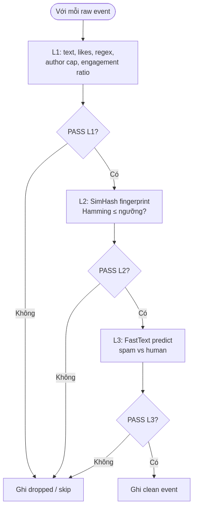
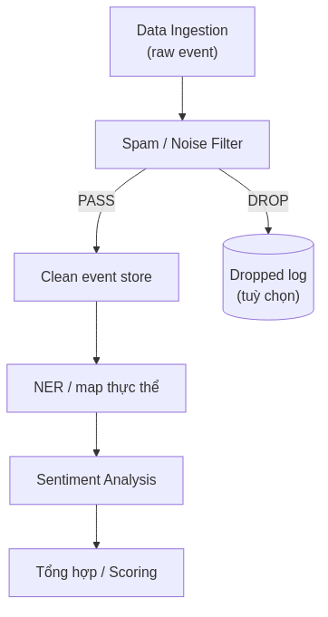
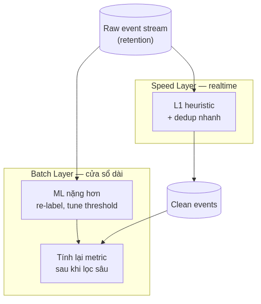
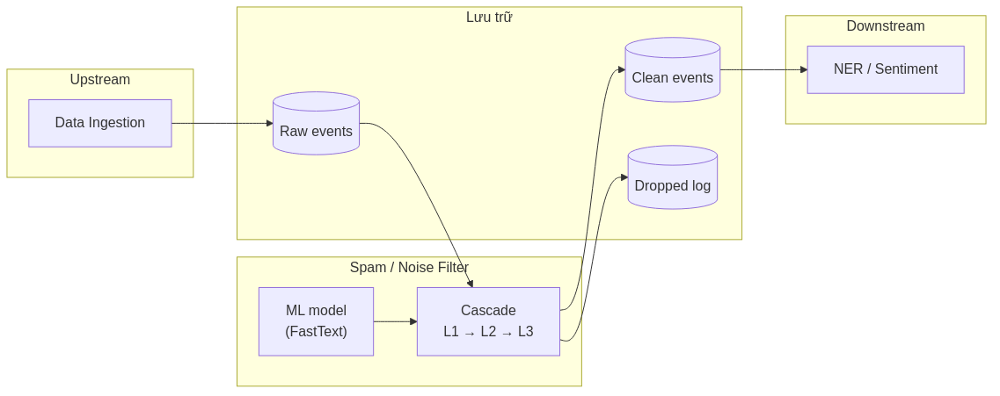

# Cơ sở lý thuyết — Lọc spam và nhiễu (Spam / Noise Filtering)

**Version:** 1.0  
**Date:** 13/06/2026  
**Phạm vi:** Thành phần độc lập — phân loại và loại bỏ nhiễu trước khi phân tích NLP  
**Khung trình bày:** [`../pipeline-theory-form.md`](../pipeline-theory-form.md)  
**Sơ đồ (PNG):** [`diagrams/spam-filter/`](diagrams/spam-filter/) — nguồn Mermaid `.mmd`, tái tạo: `./diagrams/spam-filter/render.sh`

---

## 1. Tổng quan về Lọc spam và nhiễu (Spam / Noise Filtering)

### Khái niệm

**Spam / Noise Filtering** (lọc spam và nhiễu) là giai đoạn **phân loại chất lượng** raw event: quyết định nội dung có phản ánh thảo luận organic hay thuộc bot hype, shill, copy-paste campaign — rồi **PASS** (đưa vào pipeline phân tích) hoặc **DROP** (loại khỏi luồng chính).

Khác với sentiment analysis, bước này không gán cảm xúc hay map thực thể; output là **clean event** — text đã chuẩn hóa kèm metadata lọc (`is_spam: false`, lý do qua từng lớp).

### Vai trò

Spam filtering giải quyết bài toán **signal-to-noise** trong dữ liệu social công khai:

| Vấn đề | Hậu quả nếu bỏ qua | Cách lọc giải quyết |
| --- | --- | --- |
| Bot shill, pump group | Sentiment bias dương giả | Loại pattern spam trước aggregate |
| Copy-paste coordinated | Social volume inflate ảo | Phát hiện near-duplicate (SimHash) |
| Account spam liên tục | Velocity không phản ánh cộng đồng | Rate limit / cap theo author |
| Engagement bất thường | Feature influence/spam sai | Engagement ratio heuristic |

Industry ước lượng phần lớn post công khai trên feed crypto là nhiễu (spam, bot, coordinated hype). Lọc trước NLP là điều kiện cần để chỉ số sentiment và volume downstream có ý nghĩa thống kê (Bollen et al., 2011 — cần dữ liệu sạch để correlation giá–sentiment đáng tin).

**Mục tiêu:** giữ **organic buzz** (người dùng thật thảo luận) và loại **bot hype** (shill tự động, chiến dịch marketing lặp).

---

## 2. Kiến trúc và Các thành phần cốt lõi

Kiến trúc phổ biến là **cascade đa tầng** — lọc rẻ trước, model nặng sau:

| Thành phần | Tầng | Chức năng |
| --- | --- | --- |
| **Heuristic filter (L1)** | Rule-based | Text rỗng, ngưỡng engagement, regex pump/spam, cap post/author — latency ~0.1 ms/event |
| **Near-duplicate detector (L2)** | SimHash / LSH | Fingerprint nội dung; Hamming distance ≤ ngưỡng → coi trùng gần — ~0.5 ms/event |
| **ML classifier (L3)** | FastText / lightweight model | Binary spam/human trên text còn lại — ~0.1–1 ms/event CPU |
| **Cascade orchestrator** | Điều phối | Chạy L1→L2→L3 tuần tự; DROP sớm; thống kê lý do loại |
| **Output mapper** | Schema | PASS → clean event; DROP → dropped log (tuỳ chọn) |

| Đặc điểm | Organic buzz | Bot hype / shill |
| --- | --- | --- |
| Nội dung | Đa dạng, có ngữ cảnh | Copy-paste, công thức pump ("100x", "airdrop") |
| Author | Phân bố nhiều account | Một account post liên tục hoặc hàng loạt account cùng nội dung |
| Engagement | Tương quan hợp lý với follower | Ratio bất thường (quá thấp hoặc quá cao) |
| Mục đích | Thảo luận, tin tức, quan điểm | Kêu gọi mua, referral, Telegram pump |

**Feature engineering thường dùng:**

| Feature | Công thức / cách đo | Lớp sử dụng |
| --- | --- | --- |
| Post frequency / author cap | Đếm event/author trong cửa sổ | L1 |
| Engagement ratio | `(likes + shares + comments) / followers` | L1 |
| Content similarity | SimHash + Hamming distance | L2 |
| Lexical patterns | Regex pump, link Telegram, "IDO" | L1 |
| Text embedding | FastText supervised spam/human | L3 |

**Contract output (logic):**

| Trường | PASS (clean event) | DROP (dropped event) |
| --- | --- | --- |
| `clean_text` | Text chuẩn hóa | — |
| `is_spam` | `false` | — |
| `filter.stage` | `PASS` | `L1` / `L2` / `L3` |
| `filter.layers` | Danh sách lớp đã qua | — |
| `drop_reason` | — | `empty_text`, `pump_regex`, `duplicate`, `ml_spam`, … |

Nguồn **news** (tin tức biên tập) thường **bypass** L1/L3 nặng — chỉ kiểm tra text rỗng; có thể bật lọc đầy đủ khi nghi ngờ syndication spam.

---

## 3. Cơ chế hoạt động và Vai trò trong Pipeline

### Nguyên lý hoạt động

Mỗi raw event đi qua L1 → L2 → L3 tuần tự; **DROP sớm** khi một lớp phát hiện nhiễu — không gọi ML nếu đã bị loại ở heuristic hoặc SimHash.

**Nguyên tắc cascade:** mỗi tầng loại một lớp nhiễu; chỉ ~20% event còn lại sau L1/L2 mới gọi ML — giảm chi phí CPU mà vẫn giữ recall (Nguyen et al., 2019 — cascade classification trong production).

**SimHash (L2):** băm nội dung thành fingerprint cố định (Charikar, 2002); so sánh Hamming distance phát hiện copy-paste và coordinated campaign mà không cần so sánh chuỗi O(n²).

**FastText (L3):** embedding n-gram + linear classifier — nhanh trên CPU, phù hợp hot path spam gate; không thay thế model sentiment lớn (FinBERT) ở bước phân tích cảm xúc (Bojanowski et al., 2017).

### Vị trí trong Pipeline

Spam filter đứng **ngay sau Data Ingestion**, **trước** NER và Sentiment:

- **Input:** raw event (text + metrics + author)
- **Output:** clean event hoặc dropped log
- **Không** sửa raw event gốc — tạo bản ghi mới (event sourcing)

Trong kiến trúc **Lambda**, có thể tách hai mức lọc:

| Tầng | Độ trễ | Vai trò lọc |
| --- | --- | --- |
| **Speed Layer** | Giây → phút | Heuristic realtime: dedup, rate limit, engagement floor |
| **Batch Layer** | 15 phút → ngày | ML nặng hơn trên retention — điều chỉnh metric dài hạn |

### Khả năng tích hợp

| Đối tượng | Vai trò |
| --- | --- |
| **Upstream — Data Ingestion** | Cung cấp raw event stream / collection |
| **Downstream — NER / Sentiment** | Chỉ đọc clean event |
| **Document store / message bus** | Lưu clean_events; tuỳ chọn dropped_events để audit |
| **ML model artifact** | File model FastText (hoặc ONNX) load tại startup |
| **Giám sát** | Metric PASS/DROP rate, phân bố lý do theo L1/L2/L3 |

---

## 4. Ưu điểm và Hạn chế

### Ưu điểm

| Đặc tính | Giải thích |
| --- | --- |
| **Cascade tiết kiệm tài nguyên** | Rule + SimHash loại ~80% trước khi gọi ML |
| **Giảm bias sentiment** | Loại pump/spam trước aggregate — signal sạch hơn |
| **Phát hiện coordinated shill** | SimHash bắt duplicate cross-account |
| **CPU-friendly MVP** | FastText ~1 ms/tweet; không cần GPU ở bước lọc |
| **Giải thích được (L1/L2)** | Lý do DROP rõ (`pump_regex`, `duplicate`) — audit dễ |
| **Tune được** | Ngưỡng likes, author cap, ML threshold điều chỉnh precision/recall |

### Hạn chế

| Rào cản | Ảnh hưởng | Hướng giảm thiểu |
| --- | --- | --- |
| **False negative** | Spam tinh vi lọt → bias vẫn còn | Borderline zone → model lớn hơn (DistilBERT) |
| **False positive** | Organic bị DROP → mất tín hiệu | Hạ ngưỡng ML; whitelist author tin cậy |
| **Domain shift** | Model train Twitter, test Reddit kém | Fine-tune theo nguồn; feature L1 bù |
| **News vs social** | Rule pump áp nhật nhầm headline | Bypass hoặc route riêng theo `source` |
| **SimHash ngưỡng** | Quá chặt → DROP paraphrase hợp lệ | Tune Hamming distance |
| **Không phát hiện sarcasm** | Không phải mục tiêu stage này | Để cho sentiment stage |

So với **dùng FinBERT/DeBERTa cho spam:** model 400M+ params (~50–200 ms/tweet CPU) quá nặng cho hot path lọc — nên dành cho **sentiment** (Stage 4), không phải spam gate.

---

## 5. Lý do lựa chọn

Đối với pipeline phân tích social tài chính, mô hình **Cascade L1 heuristic → L2 SimHash → L3 FastText** được lựa chọn vì:

1. **Giải quyết signal-to-noise trước NLP** — Sentiment và scoring chỉ có giá trị khi input không bị bot inflate (Baker & Wurgler, 2007).

2. **Hiệu năng production** — Hot path cần ms/event trên CPU; cascade đáp ứng throughput feed social (Bojanowski et al., 2017).

3. **Phân tách trách nhiệm** — Spam gate (binary) tách khỏi sentiment (regression/classification 3 lớp) — tránh dùng một model cho hai bài toán.

4. **Khả năng audit** — L1/L2 cho lý do DROP deterministic; dropped log phục vụ đánh giá và tune.

5. **So với phương án thay thế:**

| Phương án | Đánh giá |
| --- | --- |
| Chỉ heuristic, không ML | Nhanh nhưng miss spam tinh vi → **bổ sung L3** |
| Chỉ ML lớn (BERT spam) | Chính xác hơn nhưng chậm, tốn GPU → **không phù hợp hot path** |
| Lọc sau sentiment | Bias đã lọt vào aggregate → **sai thứ tự pipeline** |
| Không lọc duplicate | Volume/sentiment inflate → **cần L2 SimHash** |

**Kết luận:** Spam / Noise Filtering cascade là thành phần bắt buộc giữa thu thập và phân tích — đảm bảo downstream nhận **clean event** phản ánh organic buzz, có thể triển khai batch hoặc stream với cùng logic lớp.

---

## Tài liệu tham khảo

Baker, M., & Wurgler, J. (2007). Investor sentiment in the stock market. *Journal of Economic Perspectives*, *21*(2), 129–151.

Bojanowski, P., Grave, E., Joulin, A., & Mikolov, T. (2017). Enriching word vectors with subword information. *Transactions of the ACL*, *5*, 135–146.

Bollen, J., Mao, H., & Zeng, X. (2011). Twitter mood predicts the stock market. *Journal of Computational Science*, *2*(1), 1–8.

Charikar, M. S. (2002). Similarity estimation techniques from rounding algorithms. *Proceedings of STOC*, 380–388.

Nguyen, T., Moreira, V., & Rougier, N. (2019). Cascade learning for efficient inference. *Neurocomputing*, *352*, 59–68.

Sandiumenge, A. (2021). *Bitcoin tweets spam emotion sentiment* [Dataset]. Hugging Face. (Nguồn train FastText spam/human phổ biến trong domain crypto.)

---
