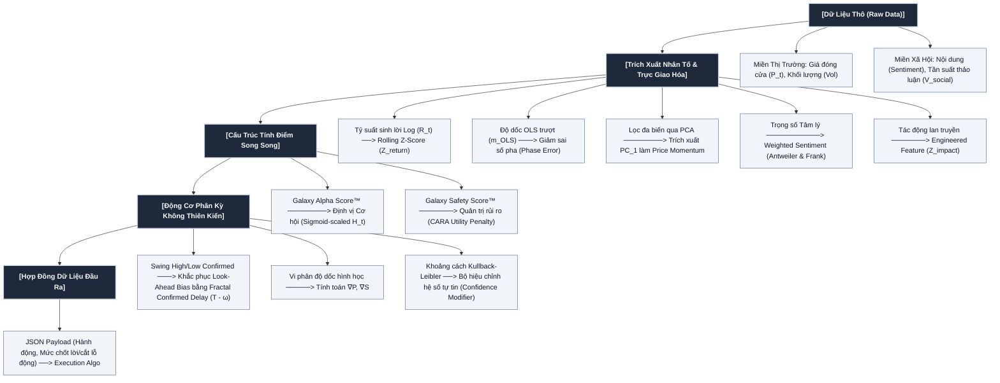

# Hệ Thống Định Lượng Galaxy Score

## Kiến Trúc Tổng Thể Hệ Thống

---

## Bản Đồ Ánh Xạ Toán Học & Cấu Trúc Mã Nguồn (Math-to-Code Mapping)

Dưới đây là bảng đối soát giữa các mô hình toán học trong tài liệu đặc tả và vị trí hiện thực hóa trong mã nguồn.

### 1. Thư viện lõi biến đổi nhân tố: `playground/scoring/lib/transformer.py`

#### Tỷ Suất Sinh Lời Logarit ($R_t$)

- **Công thức**: $$R_t=\ln\left(\frac{P_t}{P_{t-1}}\right)$$
- **Mục đích**: Trích xuất động lượng giá liên tục, chuyển chuỗi giá từ trạng thái phi trạm $I(1)$ về gần trạng thái trạm $I(0)$.
- **Vị trí hàm**: `calc_log_return(df, col)`

#### Chuẩn Hóa Rolling Z-Score ($Z_t$)

- **Công thức**: $$Z_t=\frac{X_t-\mu_t}{\sigma_t}$$
- **Trong đó**: $\mu_t$ và $\sigma_t$ lần lượt là trung bình cuốn và độ lệch chuẩn cuốn trên cửa sổ trượt độ rộng $N$.
- **Mục đích**: Chuẩn hóa các nhân tố về cùng một không gian biểu diễn thống kê không thứ nguyên (Dimensionless Z-Space).
- **Vị trí hàm**: `calc_rolling_zscore(df, col, window)`

#### Hệ Số Góc Hồi Quy Tuyến Tính Trượt ($m_{OLS}$)

- **Công thức**: $$m=\frac{N\sum_{j=1}^{N}(x_jy_j)-\sum_{j=1}^{N}x_j\sum_{j=1}^{N}y_j}{N\sum_{j=1}^{N}x_j^2-(\sum_{j=1}^{N}x_j)^2}$$
- **Mục đích**: Đo lường gia tốc xu hướng giá và giảm thiểu sai số pha (Phase Error).
- **Vị trí hàm**: `calc_rolling_ols_slope(df, col, window)`

#### Hàm Phạt Biến Động Rủi Ro Hàm Mũ CARA ($R_t$)

- **Công thức**: $$R_t=e^{-\lambda Z_{vol,t}}$$
- **Ràng buộc**: $$R_t\in(0,1]$$ thông qua `.clip(upper=1.0)`.
- **Mục đích**: Áp dụng hàm phạt phi tuyến theo cấp số nhân đối với các tài sản có biến động tăng vọt nhằm phòng vệ danh mục.
- **Vị trí hàm**: `calc_cara_penalty(df, vol_col, lambda_risk)`

### 2. Thư viện trực giao hóa nhân tố: `playground/scoring/lib/ortho.py`

#### Trực Giao Hóa Không Gian Nhân Tố Bằng PCA

- **Phân rã trị riêng**: $$\Sigma_t v_i=\lambda_i v_i,\quad \lambda_1\ge\lambda_2\ge\lambda_3$$
- **Thành phần chính thứ nhất**: $$Z_{momentum\_ortho,t}=v_1^TX_t$$
- **Mục đích**: Loại bỏ hiện tượng Double Counting do cộng tuyến thông tin giữa các chỉ báo động lượng.
- **Vị trí hàm**: `orthogonalize_momentum(df, cols)`

### 3. Thư viện tính toán điểm số: `playground/scoring/lib/score.py`

#### Điểm Sức Khỏe Cơ Sở ($H_t$)

- **Công thức**: $$H_t=w_1Z_{momentum\_ortho,t}+w_2Z_{sentiment,t}+w_3Z_{impact,t}$$
- **Ràng buộc**: $$\sum|w_i|=1$$
- **Vị trí hàm**: `calculate_dual_scores(df)`

#### Galaxy Alpha Score™

- **Công thức**: $$\text{GalaxyAlphaScore}_t=\frac{100}{1+e^{-H_t}}$$
- **Mục đích**: Nén không gian điểm Z-Score vô hạn về thang chuẩn hóa $[0,100]$.
- **Vị trí hàm**: `calculate_dual_scores(df)`

#### Galaxy Safety Score™

- **Công thức**: $$\text{GalaxySafetyScore}_t=\frac{100}{1+e^{-H_t}}\times e^{-\lambda Z_{vol,t}}$$
- **Mục đích**: Tích hợp trực tiếp hàm phạt rủi ro CARA vào điểm cơ sở làm bộ lọc phòng vệ hệ thống.
- **Vị trí hàm**: `calculate_dual_scores(df)`

### 4. Thư viện luật phân kỳ hình học: `playground/scoring/lib/rules.py`

#### Bộ Xác Thực Trễ Hình Học Fractal

- **Swing High**: $$\text{SwingHighConfirmed}(P_{T-\omega})=\begin{cases}1,&P_{T-\omega}>P_{T-\omega-k}\land P_{T-\omega}>P_{T-\omega+k},\forall k\in[1,\omega]\\0,&\text{ngược lại}\end{cases}$$

- **Swing Low**: $$\text{SwingLowConfirmed}(P_{T-\omega})=\begin{cases}1,&P_{T-\omega}<P_{T-\omega-k}\land P_{T-\omega}<P_{T-\omega+k},\forall k\in[1,\omega]\\0,&\text{ngược lại}\end{cases}$$

- **Mục đích**: Khắc phục Look-Ahead Bias bằng cơ chế xác nhận trễ theo chu kỳ $\omega$.
- **Vị trí hàm**: `calc_fractal_swings(df, col, omega)`

#### Khoảng Cách Kullback-Leibler ($D_{KL}$)

- **Công thức**: $$D_{KL}(P||S)=\sum_{x\in\mathcal X}P(x)\log\left(\frac{P(x)}{S(x)}\right)$$
- **Mục đích**: Đo lường Relative Entropy giữa phân phối giá và tâm lý xã hội, đóng vai trò Confidence Modifier.
- **Vị trí hàm**: `calc_kl_divergence(df, window)`