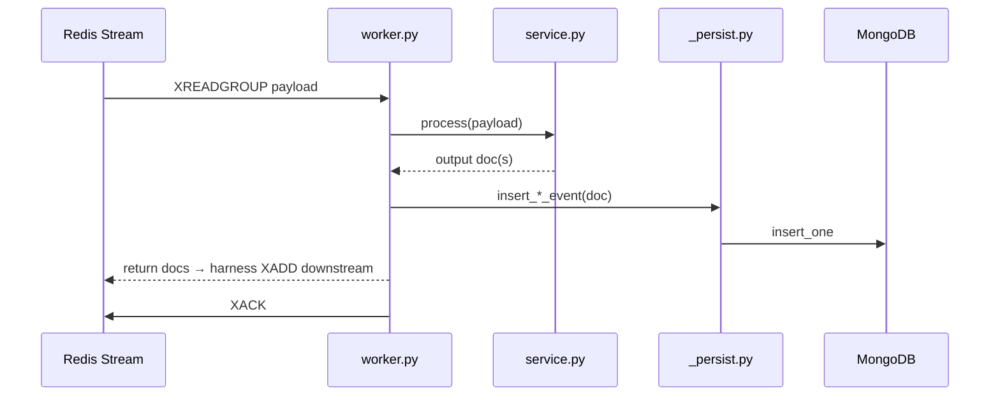

# Pipeline — Hướng dẫn viết một Stage

Tài liệu này mô tả **pattern chuẩn** để thêm stage mới vào ETL pipeline.
Tham chiếu: [`docs/kien-truc-he-thong.md`](../../docs/kien-truc-he-thong.md) §5, §13.2.

---

## 1. Tổng quan kiến trúc

Mỗi stage là một module trong `src/pipeline/{stage}/`, wire vào **runtime harness**
(`_runtime/worker.py`) qua Redis Streams.

```text
Orchestrator
    │ XADD kickoff
    ▼
stage:ingest:in  ──► ingest/   ──► raw_events (MongoDB)
    │ XADD
    ▼
stage:filter:in  ──► filter/   ──► clean_events | dropped_events
    │ XADD
    ▼
stage:ner:in     ──► ner/      ──► mapped_events
    │ ...
    ▼
stage:insight:in ──► insight/  ──► analysis_reports (terminal)
```

Runtime harness lo phần hạ tầng — stage chỉ cần implement **processor function**:

```text
processor(payload, fields) → list[dict]   # docs để fan-out downstream
```

---

## 2. Pattern 3 lớp (bắt buộc)

Mỗi stage tách rõ **3 trách nhiệm** — không trộn logic vào worker:

| Lớp | File | Trách nhiệm |
|-----|------|-------------|
| **service** | `service.py` | Business logic thuần — không biết Redis/Mongo |
| **worker** | `worker.py` | Wire service + persist + trả output cho harness |
| **documents** | `documents.py` | Map kết quả → MongoDB document schema |

Thêm nếu cần:

| File | Khi nào dùng |
|------|--------------|
| `events.py` | Chuẩn hóa API response → document (ingest) |
| `collectors/` | Gọi API bên ngoài (ingest) |
| `cascade.py` + sub-modules | Logic nhiều bước (filter L1/L2/L3) |
| `_persist.py` (shared) | Helper ghi MongoDB dùng chung |

### Luồng dữ liệu trong 1 message



---

## 3. Cấu trúc thư mục mẫu

### Stage đơn giản (1 input → 1 output)

```text
src/pipeline/ner/
├── __init__.py       # export public API
├── service.py        # logic NER + coin mapping
├── documents.py      # build_mapped_doc()
└── worker.py         # ner_processor()
```

### Stage phức tạp (nhiều sub-module)

```text
src/pipeline/filter/
├── __init__.py
├── service.py        # FilterPipeline singleton
├── worker.py         # filter_processor()
├── documents.py      # build_clean_doc / build_dropped_doc
├── cascade.py        # orchestrate L1→L2→L3
├── heuristic.py      # L1 rules
├── dedup.py          # L2 SimHash
└── ml.py             # L3 FastText
```

### Stage thu thập dữ liệu (gọi API)

```text
src/pipeline/ingest/
├── __init__.py
├── service.py        # collect_from_kickoff()
├── events.py         # API → raw_events schema
├── worker.py         # ingest_processor()
└── collectors/
    ├── __init__.py
    ├── twitter.py
    └── ...
```

---

## 4. Viết từng file — checklist

### 4.1. `service.py` — Business logic

- **Không** import Redis, Motor, runtime
- Hàm chính: `process(input) → output` hoặc class `XxxPipeline`
- Stateful (model, index) → singleton per worker process

```python
# Ví dụ filter/service.py
@dataclass
class FilterPipeline:
    dedup: DedupState = field(default_factory=DedupState)

    def process(self, raw: dict) -> tuple[dict | None, dict | None]:
        outcome = run_single(raw, dedup=self.dedup, ...)
        if outcome.passed:
            return build_clean_doc(raw, outcome), None
        return None, build_dropped_doc(raw, outcome)
```

### 4.2. `documents.py` — MongoDB schema

- Hàm `build_*_doc(input, outcome) → dict` khớp Pydantic model trong `src/common/schema/models.py`
- Liệt kê `_PASSTHROUGH_KEYS` nếu cần copy field từ stage trước

```python
def build_mapped_doc(clean: dict, coin_id: str, ner_meta: dict) -> dict:
    return {
        "mapped_id": str(uuid.uuid4()),
        "parent_event_id": clean["event_id"],
        "coin_id": coin_id,
        "ner": ner_meta,
        ...
    }
```

### 4.3. `worker.py` — Processor cho runtime

**Contract bắt buộc:**

```python
async def {stage}_processor(
    payload: dict[str, Any],   # JSON từ stream entry
    _fields: dict[str, str],    # metadata: session_id, job_id, trace_id
) -> list[dict[str, Any]]:
```

**Quy tắc return:**

| Trường hợp | Return | Harness làm gì |
|------------|--------|------------------|
| 1 input → 1 output | `[doc]` | XADD 1 entry downstream |
| 1 input → N outputs (fan-out) | `[doc1, doc2, ...]` | XADD N entries |
| Không có output (DROP/terminal) | `[]` | Không XADD downstream |

```python
# Ví dụ filter/worker.py — PASS vs DROP
async def filter_processor(payload, _fields) -> list[dict]:
    clean, dropped = get_filter_pipeline().process(payload)

    if clean:
        await insert_clean_event(clean)
        return [clean]          # → stage:ner:in

    if dropped:
        await insert_dropped_event(dropped)

    return []                   # DROP: không fan-out
```

### 4.4. Persist — `_persist.py`

Thêm helper mới khi stage ghi collection mới:

```python
async def insert_mapped_event(doc: dict) -> InsertResult:
    db = await get_db()
    try:
        await db.mapped_events.insert_one(doc)
        return "inserted"
    except DuplicateKeyError:
        return "skipped"
```

Pattern: `insert_one` + catch `DuplicateKeyError` — không dùng upsert (trừ aggregate window).

---

## 5. Wire vào runtime

### Đăng ký stage trong `keys.py` (nếu stage mới)

```python
STAGE_ORDER = [..., "my_stage", ...]
NEXT_STREAM = {
    ...
    "influence": "stage:scoring:in",
    "my_stage": "stage:next:in",   # downstream
}
```

### Chạy worker

```python
from src.pipeline._runtime.worker import process_batch, run
from src.pipeline.ner.worker import ner_processor

# Test: xử lý 1 batch
await process_batch(redis, "ner", ner_processor, block_ms=1000)

# Production: vòng lặp vô hạn
await run("ner", ner_processor)
```

### Transport entry schema (mọi stage dùng chung)

```json
{
  "session_id": "uuid",
  "job_id": "job-001",
  "trace_id": "uuid",
  "produced_by": "stage:filter",
  "produced_at": "2026-06-14T10:00:00Z",
  "schema_version": "v1",
  "payload": "{...business JSON string...}",
  "retry_count": "0"
}
```

---

## 6. Ví dụ tham chiếu

### Ingest (Stage 1) — thu thập + persist + fan-out

```text
kickoff {coin_id, sources[]} 
  → service.collect_from_kickoff()     # gọi API
  → _persist.insert_raw_event()        # ghi MongoDB
  → return persisted_docs              # harness → stage:filter:in
```

### Filter (Stage 2) — transform + branch PASS/DROP

```text
raw_event
  → service.FilterPipeline.process()   # cascade L1/L2/L3
  → PASS: insert_clean_event + return [clean]
  → DROP: insert_dropped_event + return []
```

---

## 7. Kiểm thử

### Unit test (không cần Redis/Mongo)

Test `service.py` và sub-modules trực tiếp:

```bash
uv run pytest tests/test_filter.py -v
```

```python
def test_ner_maps_btc():
    pipeline = NerPipeline()
    clean = {"event_id": "e1", "clean_text": "Bitcoin moon $BTC"}
    docs = pipeline.process(clean)
    assert any(d["coin_id"] == "BTC" for d in docs)
```

### Integration test (cần Docker)

Test processor + stream + MongoDB:

```bash
uv run pytest tests/test_ingest_filter_integration.py -v
```

```python
await publish_entry(redis, "filter", raw_doc, session_id=..., ...)
await process_batch(redis, "filter", filter_processor, block_ms=1000)
assert await db.clean_events.find_one({"event_id": raw_doc["event_id"]})
```

### Reset stateful singleton trong test

```python
from src.pipeline.filter.service import reset_filter_pipeline

@pytest.fixture(autouse=True)
def _reset():
    reset_filter_pipeline()
    yield
    reset_filter_pipeline()
```

---

## 8. Template stage mới

Copy skeleton dưới đây, thay `{stage}` bằng tên stage (vd. `ner`):

```python
# src/pipeline/{stage}/service.py
class {Stage}Pipeline:
    def process(self, payload: dict) -> list[dict]:
        """Logic thuần — trả list output docs."""
        ...

# src/pipeline/{stage}/documents.py
def build_{stage}_doc(input: dict, result: ...) -> dict:
    ...

# src/pipeline/{stage}/worker.py
async def {stage}_processor(payload: dict, _fields: dict) -> list[dict]:
    docs = get_{stage}_pipeline().process(payload)
    for doc in docs:
        await insert_{stage}_event(doc)
    return docs
```

---

## 9. Quy tắc cần nhớ

1. **service không biết Redis/Mongo** — dễ unit test
2. **worker mỏng** — chỉ glue service + persist + return
3. **Return `[]` = không fan-out** — dùng cho DROP hoặc terminal stage
4. **Stateful → singleton** — model/index load 1 lần per worker process
5. **Persist qua `_persist.py`** — không gọi Motor trực tiếp trong worker
6. **Schema khớp** `src/common/schema/` — Pydantic app-level + MongoDB `$jsonSchema` DB-level
7. **Comment** giải thích *tại sao*, không lặp lại code đã rõ

---

## 10. Tham chiếu nhanh

| Thành phần | Path |
|-----------|------|
| Runtime harness | [`_runtime/worker.py`](_runtime/worker.py) |
| Stream topology | [`_runtime/keys.py`](_runtime/keys.py) |
| Control events | [`_runtime/emit.py`](_runtime/emit.py) |
| MongoDB persist | [`_persist.py`](_persist.py) |
| Schema models | [`src/common/schema/`](../common/schema/) |
| Ingest (mẫu API) | [`ingest/`](ingest/) |
| Filter (mẫu cascade) | [`filter/`](filter/) |
| Kế hoạch phase | [`docs/ke-hoach-phat-trien/`](../../docs/ke-hoach-phat-trien/) |
